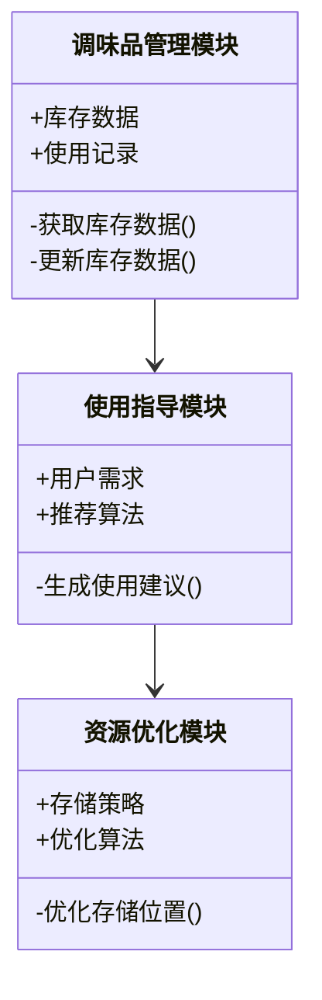

                 


# 智能厨房置物架：AI Agent的调味品使用指导

> 关键词：智能厨房置物架, AI Agent, 物联网, 调味品管理, 人工智能

> 摘要：本文深入探讨了智能厨房置物架与AI Agent在调味品管理中的应用，结合算法原理、系统架构设计和项目实战，详细讲解了如何通过AI技术优化厨房调味品的使用和管理。

---

# 第一部分: 智能厨房置物架与AI Agent的背景介绍

## 第1章: 背景与问题描述

### 1.1 智能厨房置物架的背景

#### 1.1.1 智能家居的发展趋势

智能家居是现代科技发展的趋势之一，随着物联网（IoT）和人工智能（AI）技术的成熟，智能家居设备逐渐普及。厨房作为家庭生活的重要组成部分，智能化改造的需求日益增长。

#### 1.1.2 厨房智能化的需求

厨房智能化不仅提升了烹饪效率，还能通过智能设备优化资源管理。然而，厨房中的调味品管理一直是智能化的难点。传统调味品管理存在以下问题：

- **库存混乱**：调味品种类多，使用频率不一，容易导致库存混乱。
- **使用不当**：用户可能因缺乏指导而错误使用调味品，影响烹饪效果。
- **资源浪费**：过期或不合理存储导致调味品浪费。

#### 1.1.3 调味品管理的痛点

调味品管理的核心痛点在于如何实现智能化管理，包括库存监控、使用指导和资源优化。AI Agent（智能代理）的引入为解决这些问题提供了可能。

---

## 第2章: 核心概念与联系

### 2.1 AI Agent的核心原理

#### 2.1.1 AI Agent的定义与分类

AI Agent是指能够感知环境并采取行动以实现目标的智能实体。根据智能水平，AI Agent可以分为基于规则的代理、基于知识的代理和学习型代理。

#### 2.1.2 AI Agent的基本工作流程

1. **感知环境**：通过传感器或API获取环境数据。
2. **分析数据**：利用算法对数据进行处理和分析。
3. **制定决策**：基于分析结果生成行动计划。
4. **执行行动**：通过物联网设备或其他接口执行决策。

#### 2.1.3 AI Agent与智能设备的交互机制

AI Agent通过API与智能设备通信，设备状态和用户指令通过数据流传递。例如，AI Agent可以向智能置物架发送指令，调整调味品的存储位置。

### 2.2 物联网设备与AI Agent的关系

#### 2.2.1 物联网设备的定义与特点

物联网设备是指通过互联网连接的智能设备，具有感知、通信和计算能力。在厨房场景中，智能置物架属于典型的物联网设备。

#### 2.2.2 AI Agent如何控制物联网设备

AI Agent通过API调用物联网设备的功能，例如查询库存数据或调整设备状态。这种交互使得AI Agent能够实现对调味品的智能管理。

#### 2.2.3 设备间的数据交互与协同

智能置物架与其他厨房设备（如智能灶具、冰箱）协同工作，实现数据共享和联动控制。例如，AI Agent可以根据烹饪需求自动调整调味品的使用量。

---

## 第3章: 算法原理与数学模型

### 3.1 AI Agent的算法基础

#### 3.1.1 基于规则的决策系统

规则系统通过预定义的规则进行决策，适用于简单的场景。例如，当某种调味品库存低于阈值时，系统触发补货提醒。

#### 3.1.2 基于机器学习的决策系统

机器学习模型能够从历史数据中学习，预测调味品的使用趋势。例如，使用回归算法预测某调味品的消耗速度。

#### 3.1.3 基于强化学习的优化策略

强化学习通过试错优化策略。例如，AI Agent可以通过奖励机制学习最优的调味品存储位置。

### 3.2 调味品管理的数学模型

#### 3.2.1 基于概率的库存预测模型

使用概率模型预测调味品的使用概率，从而优化库存管理。例如，使用泊松分布预测某种调味品的需求频率。

#### 3.2.2 基于逻辑推理的使用建议模型

通过逻辑推理生成调味品的使用建议。例如，根据用户当前的烹饪需求和库存情况，推荐最优的调味品组合。

#### 3.2.3 基于用户偏好的推荐算法

基于用户历史数据，使用协同过滤算法推荐调味品。例如，根据用户的烹饪偏好推荐新的调味品组合。

---

## 第4章: 系统分析与架构设计

### 4.1 问题场景分析

#### 4.1.1 调味品管理的主要问题

- **库存混乱**：调味品种类多，管理复杂。
- **使用不当**：用户缺乏指导，导致调味品使用错误。
- **资源浪费**：过期或存储不当导致浪费。

#### 4.1.2 AI Agent需要解决的核心问题

- **库存监控**：实时监控调味品的库存状态。
- **使用指导**：根据用户需求提供调味品使用建议。
- **资源优化**：优化调味品的存储和使用，减少浪费。

#### 4.1.3 系统的边界与假设

- **边界**：仅管理调味品，不涉及其他厨房设备。
- **假设**：用户已安装智能置物架和其他必要的物联网设备。

### 4.2 系统功能设计

#### 4.2.1 用户需求分析

- **用户需求**：用户希望智能置物架能够自动管理调味品库存，并提供使用建议。
- **功能需求**：包括库存监控、使用指导、资源优化等。

#### 4.2.2 系统功能模块划分

- **库存管理模块**：负责调味品的库存监控和数据记录。
- **使用指导模块**：根据用户需求和库存情况提供调味品使用建议。
- **资源优化模块**：优化调味品的存储和使用，减少浪费。

#### 4.2.3 功能模块之间的交互关系

- **库存管理模块**与**使用指导模块**交互，提供库存数据。
- **使用指导模块**与**资源优化模块**交互，优化调味品的使用。

### 4.3 系统架构设计

#### 4.3.1 分层架构设计

- **数据层**：负责数据的存储和管理。
- **业务逻辑层**：负责业务逻辑的实现。
- **用户界面层**：负责与用户的交互。

#### 4.3.2 领域模型（Mermaid类图）



#### 4.3.3 系统架构（Mermaid架构图）


---

# 第二部分: 项目实战与优化

## 第5章: 项目实战

### 5.1 环境安装

#### 5.1.1 安装Python环境

安装Python 3.8及以上版本，并安装必要的库：

```bash
pip install numpy scikit-learn
```

#### 5.1.2 安装智能置物架硬件

确保智能置物架已连接到物联网平台，并安装相应的SDK。

### 5.2 系统核心实现

#### 5.2.1 库存管理模块的实现

```python
import numpy as np
from sklearn import linear_model

# 数据预处理
X = np.array([[1, 2], [3, 4], [5, 6]])
y = np.array([7, 8, 9])

# 训练线性回归模型
model = linear_model.LinearRegression()
model.fit(X, y)

# 预测库存需求
new_X = np.array([[2, 3]])
predicted_y = model.predict(new_X)
```

#### 5.2.2 使用指导模块的实现

```python
def generate_recommendation(user_preference):
    # 简单的推荐算法
    recommendations = []
    for item in user_preference:
        if item['stock'] > 0:
            recommendations.append(item)
    return recommendations
```

#### 5.2.3 资源优化模块的实现

```python
def optimize_storage(current_stock):
    # 假设优化策略为优先使用库存较多的调味品
    sorted_stock = sorted(current_stock.items(), key=lambda x: x[1], reverse=True)
    return [item[0] for item in sorted_stock]
```

### 5.3 代码解读与分析

- **库存管理模块**：使用线性回归模型预测库存需求，帮助用户提前规划库存。
- **使用指导模块**：根据用户的偏好和库存情况，生成调味品使用建议。
- **资源优化模块**：优化调味品的存储位置，优先使用库存较多的调味品。

### 5.4 实际案例分析

假设用户偏好为：盐、酱油、辣椒油。库存数据为：盐充足，酱油不足，辣椒油充足。AI Agent会推荐优先使用盐和辣椒油，酱油则提示用户需要补货。

---

## 第6章: 总结与展望

### 6.1 总结

本文详细介绍了智能厨房置物架与AI Agent在调味品管理中的应用，从背景、核心概念、算法原理到系统设计和项目实战，全面探讨了如何通过AI技术优化厨房调味品的使用和管理。

### 6.2 注意事项

- **数据隐私**：调味品使用数据涉及用户隐私，需确保数据安全。
- **设备兼容性**：确保智能置物架与其他厨房设备兼容。
- **用户体验**：优化用户界面，提升用户体验。

### 6.3 拓展阅读

建议读者进一步学习AI Agent在其他场景中的应用，如智能安防、智能办公等。

---

作者：AI天才研究院/AI Genius Institute & 禅与计算机程序设计艺术 /Zen And The Art of Computer Programming

