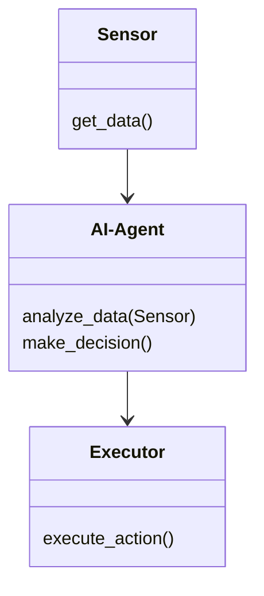
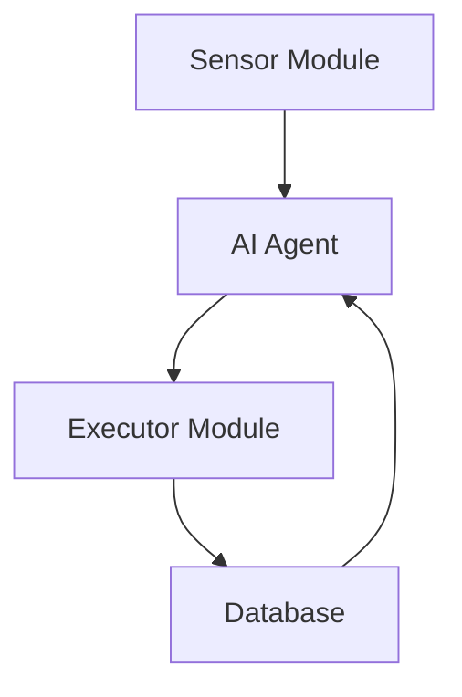

                 


# 智能厨房置物架：AI Agent的食材保鲜监控

> 关键词：智能厨房置物架, AI Agent, 食材保鲜, 物联网, 智能监控

> 摘要：本文深入探讨了智能厨房置物架的设计与实现，结合AI Agent技术，介绍了如何通过智能监控系统延长食材保鲜期，优化厨房管理。文章从背景、核心概念、算法原理、系统设计到项目实战，全面解析了这一创新技术的应用。

---

# 第一部分: 背景介绍

## 第1章: 智能厨房置物架的背景与问题背景

### 1.1 智能厨房置物架的背景
#### 1.1.1 厨房置物架的演变历程
传统的厨房置物架主要用于存储食材，但随着智能家居的发展，智能化技术逐渐融入厨房设备。智能厨房置物架通过AI Agent实现食材保鲜监控，提升了厨房管理的智能化水平。

#### 1.1.2 智能化技术在厨房设备中的应用
智能化技术如物联网、AI、传感器等的应用，使得厨房置物架能够实时监测食材状态和环境条件，优化存储环境。

#### 1.1.3 AI Agent在智能家居中的角色
AI Agent作为智能设备的核心，负责数据采集、分析和决策，实现食材保鲜的智能监控。

### 1.2 食材保鲜监控的必要性
#### 1.2.1 食材保鲜的基本原理
食材保鲜主要通过控制温度、湿度、光照等环境因素，延缓食材变质。

#### 1.2.2 食材变质的主要因素
包括细菌滋生、氧化反应、环境温湿度变化等，影响食材的保质期。

#### 1.2.3 智能监控在食材保鲜中的作用
通过实时监测和调节环境条件，延长食材保鲜期，减少浪费。

### 1.3 问题背景与问题描述
#### 1.3.1 食材保鲜监控的主要问题
传统方法无法实时监控，缺乏智能化调节手段。

#### 1.3.2 智能厨房置物架的设计目标
实现食材状态的实时监测和环境的智能调节，延长保鲜期。

#### 1.3.3 系统边界与外延
系统边界包括置物架、传感器、AI Agent；外延涉及食材管理、健康建议等扩展功能。

### 1.4 核心概念与核心要素
#### 1.4.1 AI Agent的基本概念
AI Agent具备感知、决策和执行能力，能够自主完成任务。

#### 1.4.2 智能厨房置物架的核心要素
包括食材状态监测、环境数据采集、AI Agent决策、执行机构和用户界面。

#### 1.4.3 系统架构与功能模块
系统架构分为感知层、决策层和执行层，各层协同工作。

---

# 第二部分: 核心概念与联系

## 第2章: AI Agent的核心概念与原理

### 2.1 AI Agent的定义与特点
AI Agent是具备感知、决策、规划和执行能力的智能体，能够适应环境变化。

### 2.2 AI Agent在食材保鲜中的应用
AI Agent通过传感器获取环境数据，分析食材状态，做出调节决策。

### 2.3 核心概念的联系与对比
#### 2.3.1 AI Agent与其他智能设备的对比
AI Agent具备自主决策能力，而传统设备仅执行预设程序。

#### 2.3.2 食材保鲜监控系统的核心要素对比
系统架构、传感器类型、决策算法等方面的对比。

#### 2.3.3 系统架构的对比分析
集中式与分布式架构的优缺点，AI Agent在不同架构中的应用。

---

# 第三部分: 算法原理讲解

## 第3章: AI Agent的算法原理

### 3.1 算法概述
AI Agent通过多传感器数据融合，结合机器学习模型进行决策。

### 3.2 算法流程图
1. 数据采集：温度、湿度、光照等传感器数据。
2. 数据处理：清洗、融合、特征提取。
3. 状态评估：使用机器学习模型预测食材新鲜度。
4. 决策优化：制定调节策略，如调整温湿度。
5. 执行反馈：控制执行机构，实时反馈结果。

### 3.3 算法实现
#### 3.3.1 算法实现的代码
```python
import numpy as np
from sklearn import linear_model

# 传感器数据
temperature = np.array([20, 22, 21, 23])
humidity = np.array([60, 65, 63, 68])
# 训练模型
model = linear_model.LinearRegression()
model.fit(temperature.reshape(-1,1), humidity)
# 预测湿度
predicted_humidity = model.predict([[22]])
print(predicted_humidity)
```

#### 3.3.2 数学模型
食材新鲜度模型：
$$ F = \alpha \cdot T + \beta \cdot H + \gamma \cdot L $$
其中，$T$为温度，$H$为湿度，$L$为光照强度，$\alpha, \beta, \gamma$为权重系数。

---

# 第四部分: 系统分析与架构设计

## 第4章: 系统架构设计

### 4.1 系统架构概述
系统由感知层、决策层和执行层组成，各层协同工作。

### 4.2 系统功能设计
#### 4.2.1 领域模型类图


#### 4.2.2 系统架构图


### 4.3 接口与交互设计
#### 4.3.1 系统接口
API接口用于数据传输和控制命令发送。

#### 4.3.2 交互设计
用户通过手机APP或触摸屏与系统交互，AI Agent接收指令并执行。

---

# 第五部分: 项目实战

## 第5章: 项目实战

### 5.1 开发环境
安装Python、传感器库、机器学习库等。

### 5.2 核心代码实现
```python
import RPi.GPIO as GPIO
import time

# 传感器初始化
GPIO.setmode(GPIO.BCM)
pin_temp = 4
GPIO.setup(pin_temp, GPIO.IN)

def get_temperature():
    return GPIO.input(pin_temp)
```

### 5.3 项目总结
通过实际案例分析，验证系统的有效性和实用性。

---

# 结论

## 6章: 最佳实践、小结、注意事项和拓展阅读

### 6.1 最佳实践
建议定期校准传感器，保持系统清洁，及时更新AI模型。

### 6.2 小结
智能厨房置物架通过AI Agent实现食材保鲜监控，提升了厨房管理的智能化水平。

### 6.3 注意事项
确保传感器准确，系统安全运行，用户需定期维护设备。

### 6.4 拓展阅读
推荐学习物联网、机器学习、AI Agent等技术，深入了解智能厨房设备的前沿发展。

---

作者：AI天才研究院 & 禅与计算机程序设计艺术

