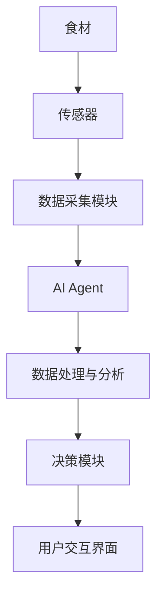
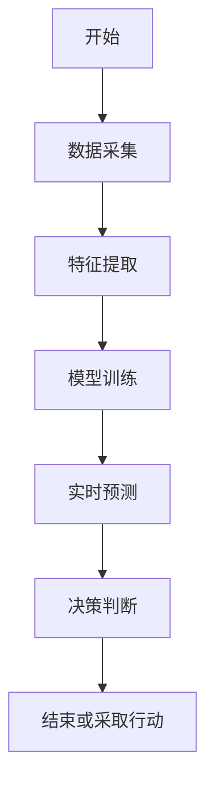
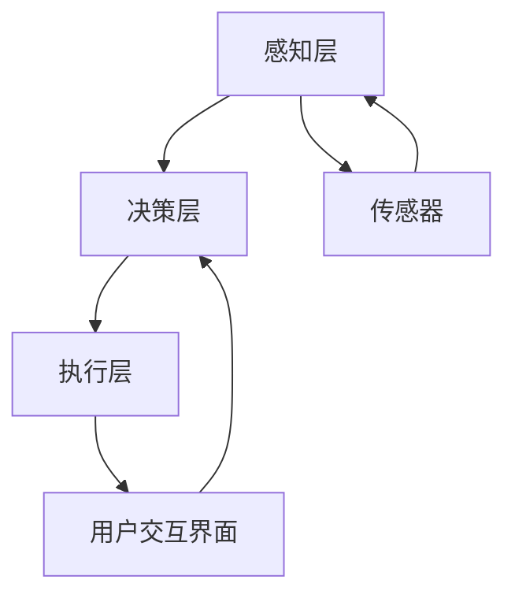

                 


# 智能厨房置物架：AI Agent的食材新鲜度监控

> 关键词：AI Agent，食材新鲜度，智能厨房置物架，物联网，新鲜度监控

> 摘要：本文深入探讨了AI Agent在智能厨房置物架中的应用，特别是如何通过AI技术实现对食材新鲜度的实时监控。文章从背景问题分析、核心概念与技术原理、系统架构设计、算法实现、项目实战等多个维度展开，详细介绍了智能厨房置物架的设计与实现过程，展示了AI技术在智能家居领域的创新应用。

---

## 第一部分: 智能厨房置物架的背景与问题分析

### 第1章: 智能厨房置物架的背景与问题背景

#### 1.1 问题背景

现代家庭中，食材管理一直是厨房管理的核心问题。传统的食材管理方式依赖于人工检查，这种方式不仅效率低下，而且容易因疏忽导致食材过期或变质。随着智能家居的普及，利用AI技术实现智能化管理成为可能。

#### 1.2 问题描述

食材新鲜度监控的核心问题在于如何实时感知食材的状态，并根据感知结果进行智能化决策。传统解决方案主要依赖于定期检查或简单的传感器，存在以下不足：

- 数据采集不全面：传统传感器仅能监测温度、湿度等单一指标，无法全面反映食材新鲜度。
- 数据分析能力有限：简单的监控系统仅能进行阈值判断，无法根据历史数据预测食材新鲜度的变化趋势。
- 系统智能化水平低：缺乏自主决策能力，无法主动采取措施（如提醒用户、调整存储条件等）。

#### 1.3 问题解决

通过引入AI Agent（人工智能代理），可以实现对食材新鲜度的智能化监控。AI Agent能够实时感知环境信息、分析食材状态，并根据分析结果采取相应的行动。智能厨房置物架的创新点在于：

- **实时感知**：通过多种传感器（如温度、湿度、光照等）实时采集食材存储环境的数据。
- **智能分析**：基于AI算法对食材新鲜度进行预测和评估，并根据历史数据优化模型。
- **自主决策**：AI Agent能够根据分析结果主动采取措施（如发出提醒、调节存储条件等）。

#### 1.4 边界与外延

- **系统边界**：智能厨房置物架仅关注食材新鲜度的监控，不涉及食材的具体使用或烹饪过程。
- **外延与相关领域**：食材新鲜度监控与食品科学、传感器技术、数据挖掘等领域密切相关。

#### 1.5 核心要素与概念结构

- **核心要素**：
  - **AI Agent**：负责数据采集、分析和决策。
  - **传感器**：用于采集食材存储环境的数据。
  - **存储模块**：用于存储食材信息和历史数据。
  - **用户交互界面**：提供人机交互的界面，方便用户查看和操作。

- **概念结构图**：



---

## 第2章: 核心概念与技术原理

### 2.1 AI Agent的基本原理

AI Agent是一种能够感知环境、自主决策并采取行动的智能体。在智能厨房置物架中，AI Agent负责：

1. **感知环境**：通过传感器获取食材存储环境的数据（如温度、湿度、光照等）。
2. **分析数据**：基于历史数据和实时数据，预测食材的新鲜度。
3. **决策与执行**：根据分析结果，决定是否需要采取行动（如发出提醒、调整存储条件等）。

#### AI Agent的核心特征

- **自主性**：能够在没有人工干预的情况下自主运行。
- **反应性**：能够实时感知环境变化并做出反应。
- **学习能力**：通过机器学习算法不断优化模型，提高预测准确性。

---

## 第3章: 算法原理

### 3.1 新鲜度评分算法

为了量化食材的新鲜度，我们设计了一种基于时间递减的评分算法。新鲜度评分公式如下：

$$
\text{freshness\_score} = \text{initial\_score} \times e^{-\lambda t}
$$

其中：
- $\text{initial\_score}$：初始新鲜度评分（满分为1）。
- $\lambda$：递减系数，由传感器数据和历史数据训练得到。
- $t$：时间（单位：天）。

当新鲜度评分低于阈值（如0.3）时，AI Agent会触发报警机制。

#### 算法流程

1. **数据采集**：通过传感器获取食材存储环境的数据。
2. **特征提取**：将传感器数据转化为模型可识别的特征向量。
3. **模型训练**：基于历史数据训练新鲜度预测模型。
4. **实时预测**：利用当前传感器数据预测食材新鲜度。
5. **决策判断**：根据预测结果决定是否采取行动。

#### 算法流程图



---

## 第4章: 系统架构与设计

### 4.1 系统架构设计

系统架构采用分层设计，主要包括以下几个模块：

1. **感知层**：负责数据的采集和预处理。
2. **决策层**：负责数据的分析与决策。
3. **执行层**：负责根据决策结果采取行动。

#### 系统架构图



---

## 第5章: 项目实战

### 5.1 环境搭建与安装

- **Python环境**：建议使用Python 3.8及以上版本。
- **依赖库安装**：
  ```bash
  pip install numpy tensorflow scikit-learn matplotlib
  ```

### 5.2 核心代码实现

#### 新鲜度评分模型代码

```python
import numpy as np
import tensorflow as tf
from tensorflow.keras import layers

# 定义模型
model = tf.keras.Sequential([
    layers.Dense(64, activation='relu', input_shape=(num_features,)),
    layers.Dense(1, activation='sigmoid')
])

# 编译模型
model.compile(optimizer='adam', loss='binary_crossentropy', metrics=['accuracy'])

# 训练模型
model.fit(X_train, y_train, epochs=10, batch_size=32)
```

#### 决策模块代码

```python
# 新鲜度评分计算
def calculate_freshness_score(data):
    # 数据预处理
    features = preprocess(data)
    # 预测新鲜度
    prediction = model.predict(features)
    return prediction[0][0]

# 决策判断
def make_decision(score):
    if score < 0.3:
        return '报警'
    elif score < 0.6:
        return '提醒'
    else:
        return '正常'

# 主函数
def main():
    while True:
        data = collect_sensor_data()  # 采集传感器数据
        score = calculate_freshness_score(data)
        decision = make_decision(score)
        print(f'当前新鲜度评分：{score}, 决策：{decision}')
        time.sleep(60)  # 每分钟检查一次

if __name__ == '__main__':
    main()
```

---

## 第6章: 最佳实践与总结

### 6.1 小结

智能厨房置物架通过AI Agent实现了食材新鲜度的智能化监控，显著提高了食材管理的效率和准确性。本文详细介绍了系统的背景、核心概念、算法原理、系统架构设计以及项目实战内容。

### 6.2 注意事项

- **传感器校准**：定期校准传感器以确保数据准确性。
- **数据安全**：注意保护用户隐私，确保数据存储和传输的安全性。
- **算法优化**：根据实际使用情况不断优化模型，提高预测准确率。

### 6.3 拓展阅读

- 《人工智能：一种现代的方法》
- 《机器学习实战》
- 《物联网技术与应用》

---

作者：AI天才研究院 & 禅与计算机程序设计艺术

