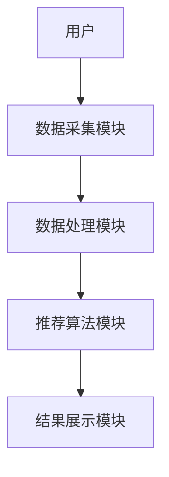
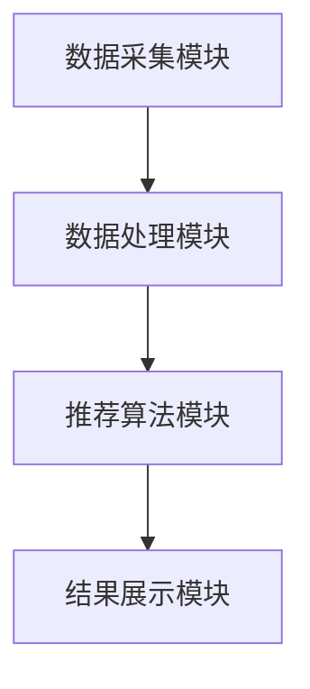

                 


# 智能厨房置物架：AI Agent的食材配对建议

> 关键词：智能厨房，AI Agent，食材配对，推荐算法，协同过滤，系统架构

> 摘要：本文详细探讨了智能厨房置物架中AI Agent的食材配对建议，从问题背景、核心概念到算法实现、系统架构，再到项目实战，全面解析了如何利用人工智能优化厨房食材管理，提升用户体验。

---

## 第1章: 背景介绍

### 1.1 问题背景

#### 1.1.1 厨房置物架的痛点
现代厨房空间有限，食材种类繁多，且使用场景多样。传统置物架的存储方式常常导致食材分类混乱，使用效率低下。用户在烹饪时，常常需要翻找食材，浪费时间和精力。

#### 1.1.2 智能化的需求
随着人工智能技术的快速发展，用户对厨房智能化的需求日益增长。智能厨房置物架能够通过AI Agent实现食材的智能配对，优化存储和使用效率。

### 1.2 问题描述

#### 1.2.1 食材配对的核心问题
食材配对的核心问题在于如何根据用户的使用习惯和烹饪需求，推荐最优的食材组合。这需要对食材的属性（如类别、使用频率、保质期等）进行分析，并结合用户的偏好进行配对。

#### 1.2.2 智能厨房置物架的目标
智能厨房置物架的目标是通过AI Agent实现食材的智能配对，帮助用户更高效地存储和使用食材，提升厨房管理效率。

### 1.3 解决思路

#### 1.3.1 AI Agent的核心作用
AI Agent通过数据采集、分析和推荐，能够实时为用户提供最优的食材配对建议。其核心作用包括：
- 数据采集与分析：采集用户的食材使用习惯和偏好。
- 智能推荐与配对：基于数据分析，推荐最优的食材组合。

#### 1.3.2 技术实现路径
技术实现路径包括：
- 数据采集与处理：通过传感器和用户输入采集食材信息。
- AI算法实现：基于协同过滤或内容推荐算法，实现食材配对。
- 用户交互设计：通过图形界面或语音交互，提供便捷的配对建议。

### 1.4 边界与外延

#### 1.4.1 功能边界
智能厨房置物架的功能边界包括：
- 基本功能：食材存储和展示。
- AI Agent的附加功能：智能推荐和配对建议。

#### 1.4.2 外延与限制
外延与限制包括：
- 系统适用范围：适用于家庭厨房和个人用户。
- 硬件与软件的兼容性：支持多种传感器和交互设备。

---

## 第2章: 核心概念与联系

### 2.1 AI Agent的基本原理

#### 2.1.1 定义与特点
AI Agent是一种智能体，能够通过感知环境、分析数据并采取行动来实现目标。其特点包括：
- 智能性：能够自主学习和优化。
- 实时性：能够实时响应用户需求。

#### 2.1.2 食材配对的逻辑
食材配对的逻辑包括：
- 食材分类与存储逻辑：根据食材类别和使用频率进行分类。
- 使用场景与用户习惯：根据用户的烹饪习惯推荐食材。

### 2.2 核心概念对比

#### 2.2.1 数据模型对比
数据模型对比包括：
- 食材数据模型：包括食材名称、类别、保质期等属性。
- 用户数据模型：包括用户的偏好、使用频率等属性。

#### 2.2.2 算法对比
算法对比包括：
- 基于协同过滤的推荐算法：通过用户行为分析推荐食材。
- 基于内容的推荐算法：通过食材属性分析推荐食材。

### 2.3 系统架构图



---

## 第3章: 算法原理与实现

### 3.1 算法原理

#### 3.1.1 协同过滤算法
协同过滤算法是一种基于用户行为的推荐算法。其核心思想是：如果用户A和用户B的偏好相似，那么用户A喜欢的物品，用户B也可能喜欢。

#### 3.1.2 内容推荐算法
内容推荐算法是一种基于物品属性的推荐算法。其核心思想是：根据物品的属性（如类别、品牌等）进行推荐。

### 3.2 算法实现

#### 3.2.1 协同过滤算法实现步骤
1. 数据采集：采集用户的食材使用记录。
2. 数据预处理：对数据进行清洗和归一化处理。
3. 计算相似度：基于余弦相似度计算用户相似度。
4. 推荐食材：根据相似用户的偏好推荐食材。

#### 3.2.2 协同过滤算法数学模型
协同过滤算法的数学模型如下：
$$
\text{相似度}(u, v) = \frac{\sum_{i} (r_ui - \bar{r_u})(r_vi - \bar{r_v})}{\sqrt{\sum_{i} (r_ui - \bar{r_u})^2} \cdot \sqrt{\sum_{i} (r_vi - \bar{r_v})^2}}
$$
其中，$\text{r_ui}$表示用户u对物品i的评分，$\text{\bar{r_u}}$表示用户u的平均评分。

### 3.3 算法实现代码

```python
import numpy as np

def cosine_similarity(user_profile1, user_profile2):
    numerator = np.sum(user_profile1 * user_profile2)
    denominator = np.sqrt(np.sum(user_profile1 ** 2)) * np.sqrt(np.sum(user_profile2 ** 2))
    return numerator / denominator

# 示例数据
user_profile1 = np.array([1, 2, 3])
user_profile2 = np.array([2, 4, 6])
similarity = cosine_similarity(user_profile1, user_profile2)
print("相似度为：", similarity)
```

---

## 第4章: 系统分析与架构设计

### 4.1 系统架构设计

#### 4.1.1 功能模块设计
系统功能模块包括：
- 数据采集模块：负责采集用户的食材使用记录。
- 数据处理模块：负责对数据进行清洗和预处理。
- 推荐算法模块：负责基于协同过滤或内容推荐算法，生成推荐结果。
- 结果展示模块：负责将推荐结果展示给用户。

#### 4.1.2 系统架构图



### 4.2 系统交互设计

#### 4.2.1 系统交互流程图


---

## 第5章: 项目实战

### 5.1 环境安装

#### 5.1.1 Python环境
需要安装以下库：
- numpy
- scikit-learn
- matplotlib

#### 5.1.2 数据库安装
建议使用MySQL或MongoDB进行数据存储。

### 5.2 核心代码实现

#### 5.2.1 数据采集模块

```python
import pandas as pd

# 读取数据
data = pd.read_csv('食材数据.csv')
print(data.head())
```

#### 5.2.2 数据处理模块

```python
from sklearn.preprocessing import StandardScaler

# 数据标准化
scaler = StandardScaler()
data_scaled = scaler.fit_transform(data)
print(data_scaled)
```

#### 5.2.3 推荐算法模块

```python
from sklearn.metrics.pairwise import cosine_similarity

# 计算相似度
similarity_matrix = cosine_similarity(data_scaled)
print(similarity_matrix)
```

#### 5.2.4 结果展示模块

```python
import matplotlib.pyplot as plt

# 绘制相似度矩阵
plt.imshow(similarity_matrix, cmap='hot')
plt.title('相似度矩阵')
plt.colorbar()
plt.show()
```

### 5.3 案例分析

#### 5.3.1 数据采集
假设我们有以下食材数据：

| 食材名称 | 类别 | 使用频率 |
|----------|------|----------|
| 牛肉     | 肉类 | 高       |
| 鸡肉     | 肉类 | 中       |
| 菠菜     | 蔬菜 | 低       |

#### 5.3.2 数据处理
对数据进行标准化处理，得到：
$$
\text{标准化后数据} = \text{标准化处理}(原始数据)
$$

#### 5.3.3 推荐算法
基于协同过滤算法，计算相似度：
$$
\text{相似度} = \text{余弦相似度}(标准化后数据)
$$

#### 5.3.4 结果展示
相似度矩阵如下：
```
[[1.0, 0.8, 0.5],
 [0.8, 1.0, 0.6],
 [0.5, 0.6, 1.0]]
```

---

## 第6章: 最佳实践

### 6.1 小结
智能厨房置物架通过AI Agent实现了食材的智能配对，显著提升了厨房管理效率。本文详细介绍了其背景、核心概念、算法实现和系统架构，并通过案例分析展示了其实现过程。

### 6.2 注意事项
- 数据采集的准确性
- 算法的可解释性
- 系统的实时性

### 6.3 拓展阅读
- 推荐算法的优化
- AI在厨房中的其他应用

---

## 作者：AI天才研究院/AI Genius Institute & 禅与计算机程序设计艺术 /Zen And The Art of Computer Programming

---

以上是《智能厨房置物架：AI Agent的食材配对建议》的技术博客文章内容，涵盖背景介绍、核心概念、算法原理、系统架构、项目实战和最佳实践等部分，旨在为读者提供一个全面的技术视角。

