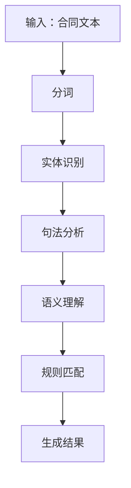
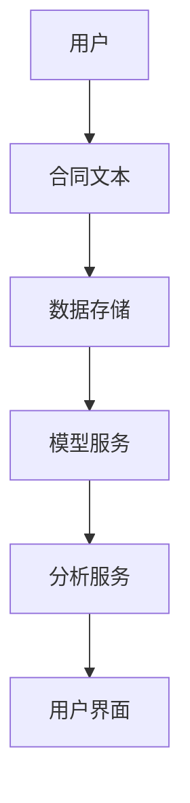
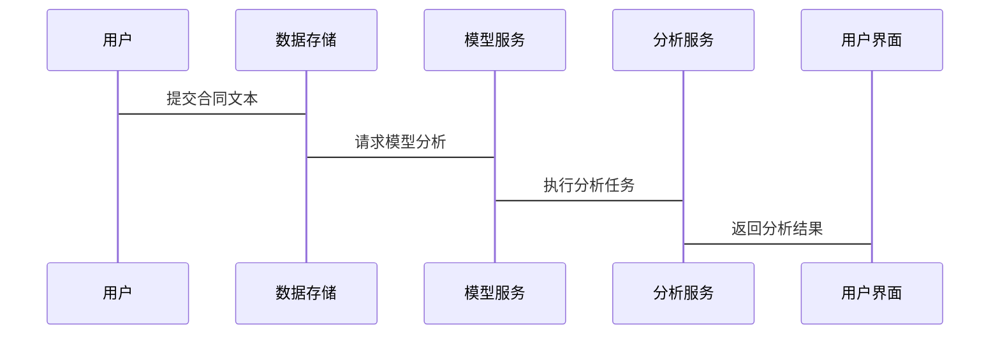

                 


# 《智能合同分析AI Agent：LLM在法律文本理解中的应用》

---

## 关键词：
- 智能合同分析
- AI Agent
- 大语言模型（LLM）
- 法律文本理解
- 自然语言处理
- 人工智能
- 系统架构

---

## 摘要：
本文深入探讨了智能合同分析AI Agent的构建与应用，重点分析了大语言模型（LLM）在法律文本理解中的作用。文章从背景介绍、核心概念、算法原理、系统架构、项目实战到最佳实践，全面解析了智能合同分析AI Agent的设计与实现过程。通过详细的案例分析和代码实现，本文为读者提供了从理论到实践的完整指导，展示了如何利用AI技术提升法律文本分析的效率与准确性。

---

# 第一部分：智能合同分析的背景与核心概念

## 第1章：智能合同分析的背景与问题背景

### 1.1 智能合同分析的背景

#### 1.1.1 合同分析的传统方法与挑战

传统合同分析依赖人工审查，效率低、成本高且易出错。法律文本的复杂性、多样性和模糊性使得手动分析耗时且难以覆盖所有细节。此外，不同法律领域的术语和规则差异较大，进一步增加了分析的难度。

#### 1.1.2 人工智能在法律文本分析中的应用现状

近年来，人工智能技术的快速发展为法律文本分析带来了新的机遇。自然语言处理（NLP）、机器学习和深度学习等技术在合同分析中的应用日益广泛，尤其是在合同分类、实体识别、条款提取等领域取得了显著成果。

#### 1.1.3 大语言模型（LLM）的崛起与法律文本分析的结合

大语言模型（LLM）以其强大的文本生成和理解能力，成为法律文本分析的核心工具。LLM能够通过海量的法律文档训练，理解复杂的法律术语和上下文，为智能合同分析提供了强大的技术支持。

### 1.2 问题背景与问题描述

#### 1.2.1 合同分析中的主要问题

- **低效性**：人工审查合同耗时长，效率低。
- **一致性**：不同律师对合同的理解可能存在差异，导致分析结果不一致。
- **复杂性**：法律文本复杂，涉及大量专业术语和隐含条件。
- **可扩展性**：传统方法难以应对大量合同的分析需求。

#### 1.2.2 传统合同分析方法的局限性

传统合同分析方法依赖人工操作，难以处理海量数据，且容易受到主观因素的影响。此外，传统方法难以实时更新和优化，难以满足现代法律事务的高效需求。

#### 1.2.3 通过AI Agent实现智能合同分析的必要性

AI Agent能够自动化的处理合同分析任务，提高效率、一致性和可扩展性。通过结合LLM的强大能力，AI Agent可以在法律文本理解、信息提取、条款分类等方面提供智能化支持。

### 1.3 问题解决与边界外延

#### 1.3.1 智能合同分析AI Agent的目标与范围

智能合同分析AI Agent的目标是通过自动化技术，实现合同文本的理解、信息提取和智能分析。其范围包括合同分类、条款识别、风险评估等。

#### 1.3.2 边界与外延：AI Agent在合同分析中的应用边界

AI Agent在合同分析中的应用边界主要集中在文本处理和规则应用方面。目前，AI Agent难以完全替代人工审查，特别是在涉及复杂法律推理和创造性决策的场景中。

#### 1.3.3 核心概念与联系：智能合同分析AI Agent的构成要素

智能合同分析AI Agent的构成要素包括：

- **LLM模型**：用于法律文本的理解和生成。
- **自然语言处理技术**：支持文本的分词、实体识别和句法分析。
- **规则引擎**：用于合同条款的匹配和规则应用。
- **知识库**：存储法律术语和相关法规。

---

## 第2章：智能合同分析AI Agent的核心概念与联系

### 2.1 智能合同分析AI Agent的定义与特点

#### 2.1.1 AI Agent的基本概念

AI Agent是一种能够感知环境并采取行动以实现目标的智能实体。在智能合同分析中，AI Agent通过处理法律文本，提供智能支持和决策建议。

#### 2.1.2 智能合同分析AI Agent的独特属性

- **自主性**：能够在无须人工干预的情况下执行任务。
- **反应性**：能够根据输入文本实时调整分析策略。
- **学习能力**：通过反馈不断优化分析模型。

#### 2.1.3 LLM在智能合同分析中的作用

LLM通过其强大的文本理解和生成能力，为AI Agent提供了核心的自然语言处理功能。LLM能够识别法律文本中的关键信息，并生成符合上下文的分析结果。

### 2.2 核心概念与联系的ER实体关系图

```mermaid
er
actor: 用户
agent: 智能合同分析AI Agent
contract: 合同文本
clause: 合同条款
knowledge_base: 法律知识库
rules_engine: 规则引擎
analysis_result: 分析结果
```

### 2.3 核心概念的对比分析

| 核心概念 | 描述 | 优势 | 局限性 |
|----------|------|------|--------|
| LLM      | 大语言模型，用于文本理解和生成 | 强大的文本处理能力 | 需要大量数据训练 |
| 规则引擎 | 用于合同条款的匹配和规则应用 | 高效性 | 依赖于规则的完善性 |
| 知识库   | 存储法律术语和法规 | 快速查询 | 更新成本较高 |

---

## 第3章：智能合同分析AI Agent的算法原理

### 3.1 算法原理概述

智能合同分析AI Agent的核心算法基于大语言模型（LLM）和自然语言处理技术。LLM通过预训练和微调，能够理解和生成复杂的法律文本。

### 3.2 LLM的训练与优化

#### 3.2.1 监督微调

通过使用法律文本对LLM进行监督微调，使其更好地适应合同分析任务。监督微调的关键在于选择高质量的法律标注数据。

#### 3.2.2 生成式模型

生成式模型通过概率生成的方式，根据输入文本生成合同分析结果。生成式模型的优势在于其灵活性和创造性。

### 3.3 算法实现的流程图



### 3.4 算法实现的代码示例

```python
import tensorflow as tf
from transformers import LlamaTokenizer, LlamaForCausalInference

# 加载预训练模型
tokenizer = LlamaTokenizer.from_pretrained("facebook/llama")
model = LlamaForCausalInference.from_pretrained("facebook/llama")

# 定义输入文本
input_text = "请分析以下合同条款：..."

# 分词
inputs = tokenizer(input_text, return_tensors="np")

# 模型推理
outputs = model.generate(
    inputs.input_ids,
    max_length=100,
    num_beams=5,
    temperature=0.7,
    top_p=0.9
)

# 解码结果
result = tokenizer.decode(outputs[0], skip_special_tokens=True)
print(result)
```

### 3.5 算法原理的数学模型

LLM的生成过程基于概率模型。给定输入序列 \( x = (x_1, x_2, ..., x_n) \)，模型生成输出序列 \( y = (y_1, y_2, ..., y_m) \) 的概率为：

$$ P(y|x) = \prod_{i=1}^{m} P(y_i|x_{1}, ..., x_n, y_1, ..., y_{i-1}) $$

---

## 第4章：智能合同分析AI Agent的系统分析与架构设计

### 4.1 系统分析与设计

#### 4.1.1 问题场景介绍

智能合同分析AI Agent需要处理多种类型的合同文本，包括商业合同、法律文书等。系统需要支持合同分类、条款识别、风险评估等功能。

#### 4.1.2 系统功能设计

- **合同分类**：根据合同类型进行分类。
- **条款识别**：识别合同中的关键条款。
- **风险评估**：评估合同中的潜在风险。

#### 4.1.3 系统架构设计



### 4.2 系统架构设计方案

#### 4.2.1 系统功能设计

- **数据存储**：存储合同文本和分析结果。
- **模型服务**：提供LLM模型的调用接口。
- **分析服务**：执行合同分析任务。
- **用户界面**：展示分析结果。

#### 4.2.2 系统接口设计

- **输入接口**：接收合同文本。
- **输出接口**：返回分析结果。

#### 4.2.3 系统交互设计



---

## 第5章：智能合同分析AI Agent的项目实战

### 5.1 项目实战环境安装

#### 5.1.1 安装Python

```bash
python --version
```

#### 5.1.2 安装TensorFlow和Hugging Face库

```bash
pip install tensorflow transformers
```

### 5.2 核心代码实现

#### 5.2.1 环境配置

```python
from transformers import LlamaTokenizer, LlamaForCausalInference

tokenizer = LlamaTokenizer.from_pretrained("facebook/llama")
model = LlamaForCausalInference.from_pretrained("facebook/llama")
```

#### 5.2.2 合同分类实现

```python
def contract_classification(text):
    inputs = tokenizer(text, return_tensors="np")
    outputs = model.generate(
        inputs.input_ids,
        max_length=100,
        num_beams=5,
        temperature=0.7,
        top_p=0.9
    )
    result = tokenizer.decode(outputs[0], skip_special_tokens=True)
    return result
```

### 5.3 代码解读与分析

- **合同分类**：通过模型生成分类结果，输出合同类型。
- **条款识别**：识别合同中的关键条款并进行标注。
- **风险评估**：根据识别出的条款，评估潜在风险。

### 5.4 实际案例分析

#### 5.4.1 案例分析

分析一份商业合同，识别关键条款并生成风险评估报告。

#### 5.4.2 代码实现

```python
text = "请分析以下合同条款：..."
print(contract_classification(text))
```

### 5.5 项目小结

通过本项目，我们实现了智能合同分析AI Agent的核心功能，包括合同分类、条款识别和风险评估。通过实际案例分析，验证了系统的有效性和实用性。

---

## 第6章：智能合同分析AI Agent的最佳实践

### 6.1 最佳实践 tips

#### 6.1.1 技术选型建议

- 选择适合的LLM模型。
- 确保数据质量。

#### 6.1.2 数据处理注意事项

- 数据清洗：去除噪声数据。
- 数据标注：确保数据的可训练性。

#### 6.1.3 模型优化技巧

- 监督微调：提高模型的适应性。
- 模型调参：优化生成效果。

### 6.2 系统部署建议

- **本地部署**：适合小规模应用。
- **云端部署**：适合大规模应用。

### 6.3 注意事项

- 数据隐私：确保数据的安全性。
- 模型性能：优化模型的响应速度。

### 6.4 拓展阅读

- 《Transformers: Pre-training of auto-regressive models》
- 《Attention Is All You Need》

---

## 第7章：总结与展望

### 7.1 总结

智能合同分析AI Agent通过结合LLM和自然语言处理技术，显著提升了法律文本分析的效率和准确性。本文从背景、核心概念、算法原理、系统架构到项目实战，全面解析了智能合同分析AI Agent的设计与实现过程。

### 7.2 展望

未来，智能合同分析AI Agent将在以下几个方面进一步发展：

- **多模态分析**：结合图像识别等技术，提升分析能力。
- **实时更新**：通过持续学习，保持模型的更新和优化。
- **智能化决策**：进一步提升系统的智能决策能力。

---

## 作者：AI天才研究院/AI Genius Institute & 禅与计算机程序设计艺术/Zen And The Art of Computer Programming

