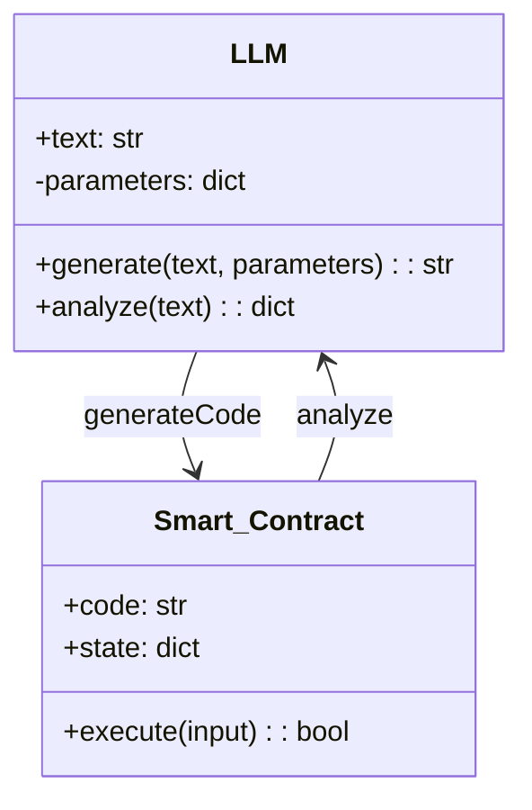
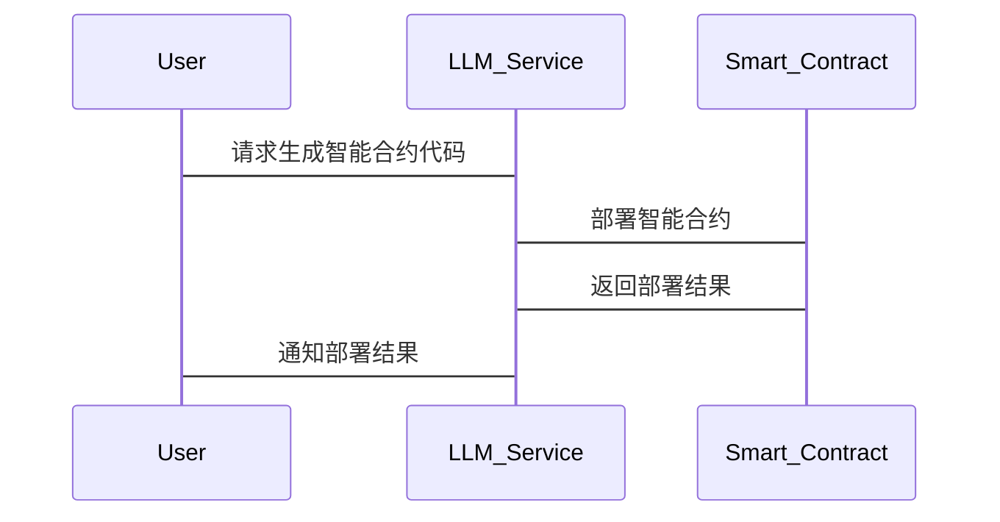

                 


# 智能合约 AI Agent：LLM 在区块链应用中的角色

## 关键词：智能合约，LLM，区块链，AI代理，大语言模型

## 摘要：  
本文探讨了智能合约与大语言模型（LLM）在区块链技术中的结合与应用。通过分析智能合约的执行机制、LLM的原理以及两者的协同工作方式，本文详细阐述了LLM在区块链中的角色，并通过实际案例展示了其在智能合约开发与优化中的潜力。文章最后提出了未来研究的方向和实际应用中的注意事项。

---

## 第一部分: 智能合约与LLM基础

### 第1章: 智能合约与LLM概述

#### 1.1 智能合约的基本概念

##### 1.1.1 智能合约的定义  
智能合约是一种基于区块链技术的自动执行协议，通过代码定义规则和条款，并在满足特定条件时自动执行相应的操作。它通常部署在区块链网络中，作为区块链上的可执行代码运行。

##### 1.1.2 智能合约的核心特点  
- **去中心化**：智能合约运行在区块链网络上，无需依赖中心化机构。
- **自动执行**：一旦触发条件，智能合约自动执行预设的操作。
- **不可篡改**：智能合约代码一旦部署，无法被修改或删除。
- **透明性**：合约代码对所有人公开，且执行过程可追溯。

##### 1.1.3 智能合约与传统合约的区别  
- **传统合约**：依赖于法律体系和中心化机构执行。
- **智能合约**：基于区块链技术，自动执行且不可篡改。

#### 1.2 LLM的基本概念

##### 1.2.1 大语言模型的定义  
大语言模型（LLM）是一种基于深度学习的自然语言处理模型，能够理解和生成人类语言。它通常使用变压器架构，通过大量数据训练，具备强大的文本生成、理解和推理能力。

##### 1.2.2 LLM的核心特点  
- **强大的语言理解能力**：能够处理复杂的上下文和语义。
- **生成能力强**：能够生成自然流畅的文本。
- **可扩展性**：适用于多种NLP任务，如翻译、问答、摘要等。

##### 1.2.3 LLM与传统NLP模型的区别  
- **传统NLP模型**：通常针对特定任务训练，如情感分析、关键词提取。
- **LLM**：通用性强，能够处理多种任务，具备更强的上下文理解和生成能力。

#### 1.3 智能合约与LLM的结合背景

##### 1.3.1 区块链技术的发展  
区块链技术的普及推动了智能合约的应用，特别是在金融、供应链管理和去中心化应用（DApps）领域。

##### 1.3.2 LLM技术的崛起  
大语言模型的出现为自然语言处理带来了革命性的变化，使得AI能够更自然地与人类交互。

##### 1.3.3 两者的结合与应用前景  
智能合约的自动执行特性与LLM的自然语言理解能力相结合，为区块链应用带来了新的可能性，如智能合约的自动化生成、优化和解释。

---

## 第2章: 智能合约与LLM的核心概念与联系

### 2.1 智能合约的原理

#### 2.1.1 智能合约的执行环境  
智能合约运行在区块链虚拟机（如以太坊的EVM）中，通过区块链网络中的节点共同验证和执行。

#### 2.1.2 智能合约的编程模型  
智能合约通常使用特定的编程语言（如Solidity）编写，定义了合约的逻辑、状态和事件。

#### 2.1.3 智能合约的生命周期  
包括部署、初始化、执行、终止等阶段。

### 2.2 LLM的原理

#### 2.2.1 大语言模型的训练过程  
LLM通过监督学习和无监督学习结合的方式，利用大量文本数据进行预训练，优化模型参数。

#### 2.2.2 LLM的推理机制  
通过编码器-解码器结构，LLM能够将输入文本转化为概率分布，生成最可能的输出文本。

#### 2.2.3 LLM的输出特点  
LLM的输出通常是概率性的，可以根据输入生成多种可能的文本结果。

### 2.3 智能合约与LLM的联系

#### 2.3.1 LLM作为智能合约的执行者  
LLM可以辅助智能合约的编写、测试和优化，甚至可以生成智能合约代码。

#### 2.3.2 LLM作为智能合约的辅助工具  
LLM可以为智能合约提供自然语言解释、合同条款分析等支持。

#### 2.3.3 LLM在智能合约中的创新应用  
LLM可以用于智能合约的自动部署、状态监控和异常检测。

---

### 2.4 智能合约与LLM的核心算法原理

#### 2.4.1 LLM的算法原理

##### 2.4.1.1 变压器模型的基本结构  
变压器模型由编码器和解码器组成，编码器负责将输入文本转化为向量表示，解码器负责根据向量生成输出文本。

##### 2.4.1.2 注意力机制的实现  
注意力机制通过计算输入序列中每个词的重要性，生成位置权重矩阵，从而聚焦于关键信息。

##### 2.4.1.3 梯度下降优化方法  
使用Adam优化器等方法，通过反向传播更新模型参数，最小化损失函数。

#### 2.4.2 智能合约的算法原理

##### 2.4.2.1 智能合约的编译过程  
将智能合约代码编译为区块链虚拟机可执行的字节码。

##### 2.4.2.2 智能合约的执行流程  
智能合约在区块链网络中通过共识机制被多个节点验证和执行。

##### 2.4.2.3 智能合约的状态管理  
智能合约的状态由区块链上的账户和存储空间管理，确保数据一致性和不可篡改性。

---

#### 2.4.3 LLM的数学模型与公式

##### 2.4.3.1 LLM的数学模型  
变压器模型的编码器由多个编码层组成，每个编码层包括多头注意力机制和前馈网络。

##### 2.4.3.2 注意力机制的公式  
$$
\text{Attention}(Q, K, V) = \text{softmax}(\frac{QK^T}{\sqrt{d_k}})V
$$  
其中，$Q$ 是查询向量，$K$ 是键向量，$V$ 是值向量，$d_k$ 是键的维度。

##### 2.4.3.3 梯度下降的优化算法  
使用Adam优化器更新参数：
$$
\theta = \theta - \eta \frac{\partial L}{\partial \theta}
$$  
其中，$\eta$ 是学习率，$L$ 是损失函数。

---

## 第3章: 智能合约与LLM的系统分析与架构设计

### 3.1 系统应用场景

#### 3.1.1 智能合约与LLM的结合场景  
LLM可以用于智能合约的自动生成、自动测试和智能合约的语义分析。

#### 3.1.2 区块链中的LLM应用案例  
例如，LLM可以辅助智能合约的编写，生成符合业务逻辑的智能合约代码。

### 3.2 系统功能设计

#### 3.2.1 领域模型  
通过Mermaid类图描述智能合约与LLM的交互关系。



#### 3.2.2 系统架构设计  
通过Mermaid架构图展示系统整体架构。


#### 3.2.3 系统交互设计  
通过Mermaid序列图展示用户与系统的交互流程。



---

## 第4章: 智能合约与LLM的项目实战

### 4.1 环境安装

#### 4.1.1 安装Python环境  
使用Anaconda安装Python 3.8及以上版本。

#### 4.1.2 安装LLM框架  
安装Hugging Face的Transformers库：
```bash
pip install transformers
```

#### 4.1.3 安装区块链开发环境  
安装以太坊开发环境（如Solidity和Web3.py）。

### 4.2 系统核心实现

#### 4.2.1 LLM辅助智能合约生成  
使用Hugging Face的GPT-2模型生成智能合约代码片段。

```python
from transformers import AutoModelWithLMHead, AutoTokenizer

model_name = "gpt2"
tokenizer = AutoTokenizer.from_pretrained(model_name)
model = AutoModelWithLMHead.from_pretrained(model_name)

input_text = "function multiply("
inputs = tokenizer.encode(input_text, return_tensors="np")

outputs = model.generate(inputs, max_length=50, do_sample=True)
print(tokenizer.decode(outputs[0].tolist()[0]))
```

#### 4.2.2 智能合约部署与测试  
编写Solidity智能合约并部署到以太坊网络。

```solidity
// SPDX-License-Identifier: MIT
pragma solidity ^0.8.0;

contract Calculator {
    function multiply(uint a, uint b) public pure returns (uint) {
        return a * b;
    }
}
```

---

## 第5章: 最佳实践与总结

### 5.1 最佳实践

#### 5.1.1 小结  
LLM在智能合约中的应用能够提高开发效率，降低错误率，但需要考虑模型的准确性和性能问题。

#### 5.1.2 注意事项  
- 确保LLM的输出符合智能合约的业务逻辑。
- 注意LLM生成代码的安全性，避免引入漏洞。
- 考虑LLM的计算资源消耗，优化模型性能。

#### 5.1.3 拓展阅读  
进一步研究LLM在智能合约中的具体应用案例，探索更多结合方式。

### 5.2 总结  
本文详细探讨了智能合约与LLM在区块链中的结合与应用，通过理论分析和实际案例展示了其巨大潜力。未来，随着技术的不断发展，LLM将在智能合约中发挥更加重要的作用。

---

## 作者：AI天才研究院/AI Genius Institute & 禅与计算机程序设计艺术 /Zen And The Art of Computer Programming

---

**本文是关于智能合约与LLM结合的深度分析，旨在为区块链开发者和AI研究人员提供新的思路和参考。**

