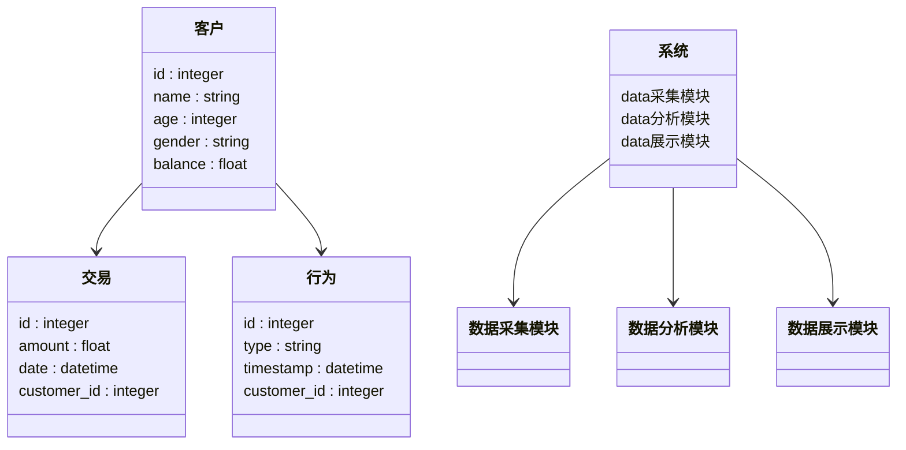
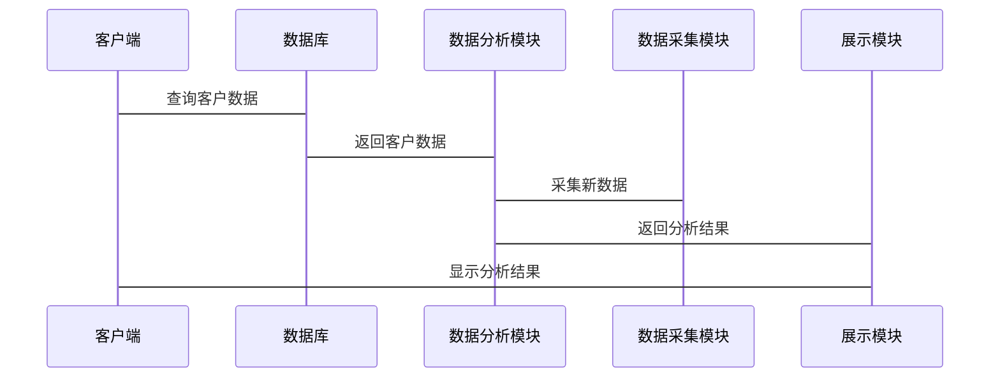

                 


# 智能商业银行客户价值分析系统

> 关键词：智能银行系统、客户价值分析、数据挖掘、人工智能、系统架构、项目实战、金融创新

> 摘要：本文深入探讨智能商业银行客户价值分析系统的设计与实现，从背景、核心概念、算法原理、系统架构到项目实战，全面解析如何利用数据挖掘和人工智能技术提升客户价值分析的效率和精度。通过实际案例分析和系统设计，展示如何构建一个高效、智能的客户价值分析系统。

---

## 第1章: 背景介绍

### 1.1 问题背景
#### 1.1.1 商业银行客户价值分析的重要性
客户是商业银行的核心资产，客户价值分析是优化资源配置、提升客户满意度和忠诚度的关键。通过分析客户的交易行为、资产规模、信用评分等数据，可以帮助银行制定精准的营销策略、风险控制措施，从而实现客户价值的最大化。

#### 1.1.2 当前商业银行客户价值分析的痛点
传统的客户价值分析方法依赖人工经验，效率低、精度差，难以应对海量数据和复杂场景。随着金融行业的数字化转型，商业银行需要更高效、智能的客户价值分析系统。

#### 1.1.3 智能化技术在客户价值分析中的应用前景
人工智能、大数据和机器学习等技术的发展为商业银行客户价值分析提供了新的可能性。通过智能化技术，银行可以快速处理海量数据，发现潜在价值，提升客户体验。

### 1.2 问题描述
#### 1.2.1 客户价值分析的核心问题
客户价值分析的核心问题在于如何从海量数据中提取有价值的信息，识别高价值客户，预测客户行为，优化客户关系管理。

#### 1.2.2 数据驱动的客户价值分析方法
通过数据挖掘、机器学习等技术，利用客户的历史交易数据、行为数据、资产数据等，构建客户画像，评估客户价值。

#### 1.2.3 智能化客户价值分析系统的建设目标
建设一个基于人工智能的客户价值分析系统，实现客户数据的自动采集、分析和评估，提供精准的客户价值评分和个性化服务建议。

### 1.3 问题解决
#### 1.3.1 智能化技术如何解决客户价值分析问题
通过机器学习算法（如聚类分析、回归分析等）对客户数据进行建模，实现客户分群、价值评分、行为预测等功能。

#### 1.3.2 数据挖掘与人工智能在客户价值分析中的应用
数据挖掘技术可以提取客户数据中的隐藏信息，人工智能技术可以实现自动化分析和预测，帮助银行制定精准的营销策略和风险管理措施。

#### 1.3.3 系统化解决方案的设计思路
通过系统化解决方案，整合数据采集、数据分析、结果展示等功能，构建一个高效、智能的客户价值分析平台。

### 1.4 边界与外延
#### 1.4.1 智能商业银行客户价值分析系统的边界
系统主要关注客户价值分析的核心功能，不包括其他银行系统的功能，如交易处理、账户管理等。

#### 1.4.2 系统的外延与扩展性分析
系统可以通过模块化设计，方便扩展新的功能，如客户画像、风险评估等。

#### 1.4.3 系统与其他银行系统的接口关系
系统需要与银行的核心系统（如CRM、交易系统等）进行数据交互，确保数据的实时性和准确性。

### 1.5 核心要素组成
#### 1.5.1 数据采集与处理模块
负责采集客户数据，包括交易数据、行为数据、资产数据等，并进行清洗、转换和存储。

#### 1.5.2 数据分析与建模模块
利用机器学习算法对客户数据进行建模，实现客户分群、价值评分等功能。

#### 1.5.3 结果展示与决策支持模块
通过可视化界面展示分析结果，提供决策支持，帮助银行制定精准的营销策略和风险管理措施。

---

## 第2章: 核心概念与联系

### 2.1 核心概念原理
#### 2.1.1 客户价值分析的基本原理
客户价值分析是通过对客户数据的分析，评估客户对银行的贡献度和潜在价值，从而制定精准的客户管理策略。

#### 2.1.2 数据挖掘在客户价值分析中的应用
数据挖掘技术可以发现客户数据中的隐藏模式，帮助银行识别高价值客户和潜在风险客户。

#### 2.1.3 人工智能技术的核心算法
人工智能技术（如聚类分析、决策树等）可以帮助银行实现客户分群、行为预测等功能。

### 2.2 概念属性特征对比
| 概念 | 属性 | 特征 |
|------|------|------|
| 客户价值分析 | 数据驱动 | 基于客户数据进行分析 |
| 数据挖掘 | 技术手段 | 从数据中提取信息 |
| 人工智能 | 应用场景 | 实现自动化分析和预测 |

### 2.3 ER实体关系图
```mermaid
erDiagram
    customer[客户] {
        id : integer
        name : string
        age : integer
        gender : string
        balance : float
    }
    transaction[交易] {
        id : integer
        amount : float
        date : datetime
        customer_id : integer
    }
    behavior[行为] {
        id : integer
        type : string
        timestamp : datetime
        customer_id : integer
    }
    relationship[关系] {
        customer_id : integer
        transaction_id : integer
        behavior_id : integer
    }
```

---

## 第3章: 算法原理

### 3.1 算法原理讲解
#### 3.1.1 聚类分析
聚类分析是一种无监督学习算法，用于将客户分为不同的群体，帮助银行识别高价值客户和潜在风险客户。

#### 3.1.2 回归分析
回归分析是一种监督学习算法，用于预测客户的价值评分或行为趋势。

#### 3.1.3 决策树
决策树是一种基于树状结构的分类算法，用于客户分群和行为预测。

### 3.2 算法实现代码
```python
from sklearn.cluster import KMeans
from sklearn.tree import DecisionTreeClassifier
from sklearn.linear_model import LinearRegression

# 聚类分析
def customer_segmentation(X):
    kmeans = KMeans(n_clusters=3, random_state=0)
    labels = kmeans.fit_predict(X)
    return labels

# 决策树
def customer_prediction(X_train, y_train, X_test):
    dt = DecisionTreeClassifier(random_state=0)
    dt.fit(X_train, y_train)
    y_pred = dt.predict(X_test)
    return y_pred

# 回归分析
def customer_value_prediction(X_train, y_train, X_test):
    lr = LinearRegression()
    lr.fit(X_train, y_train)
    y_pred = lr.predict(X_test)
    return y_pred
```

### 3.3 数学模型和公式
#### 3.3.1 聚类分析的数学模型
$$ \text{目标函数：} J = \sum_{i=1}^{k} \sum_{j=1}^{n_i} \|x_j - c_i\|^2 $$
其中，\( k \) 是聚类数，\( n_i \) 是第 \( i \) 个聚类中的样本数，\( c_i \) 是第 \( i \) 个聚类的中心。

#### 3.3.2 决策树的分裂准则
$$ \text{信息增益：} \text{Gain}(D, A) = H(D) - \sum_{v} \frac{|D_v|}{|D|} H(D_v) $$
其中，\( H(D) \) 是数据集 \( D \) 的熵，\( A \) 是特征，\( D_v \) 是特征 \( A \) 取值 \( v \) 的数据子集。

---

## 第4章: 系统分析与架构设计

### 4.1 问题场景介绍
#### 4.1.1 项目背景
本项目旨在通过智能化技术提升商业银行客户价值分析的效率和精度，帮助银行制定精准的营销策略和风险管理措施。

#### 4.1.2 项目目标
构建一个基于人工智能的客户价值分析系统，实现客户数据的自动采集、分析和评估。

### 4.2 系统功能设计
#### 4.2.1 领域模型


#### 4.2.2 系统架构


#### 4.2.3 系统接口设计
接口设计需要考虑数据采集、分析和展示的交互流程，确保系统的高效性和稳定性。

#### 4.2.4 系统交互


---

## 第5章: 项目实战

### 5.1 环境安装
#### 5.1.1 安装Python
```bash
python --version
pip install --upgrade pip
```

#### 5.1.2 安装依赖库
```bash
pip install numpy pandas scikit-learn matplotlib
```

### 5.2 核心代码实现
#### 5.2.1 数据采集与处理
```python
import pandas as pd

# 数据采集
data = pd.read_csv('customer_data.csv')

# 数据处理
data = data.dropna()
data['balance'] = data['balance'].astype(float)
```

#### 5.2.2 数据分析与建模
```python
from sklearn.cluster import KMeans

# 聚类分析
model = KMeans(n_clusters=3, random_state=0)
model.fit(data[['age', 'balance']])

# 可视化
import matplotlib.pyplot as plt

plt.scatter(data['age'], data['balance'], c=model.labels_)
plt.xlabel('Age')
plt.ylabel('Balance')
plt.show()
```

#### 5.2.3 结果展示
```python
from sklearn.metrics import silhouette_score

# 评估模型
score = silhouette_score(data[['age', 'balance']], model.labels_)
print(f'Silhouette Score: {score}')
```

### 5.3 项目小结
通过实际案例分析，我们展示了如何利用Python和机器学习算法实现客户价值分析。通过数据采集、分析和展示的全流程，帮助读者理解如何构建一个高效的客户价值分析系统。

---

## 第6章: 最佳实践与小结

### 6.1 最佳实践 tips
#### 6.1.1 数据质量的重要性
确保数据的完整性和准确性是客户价值分析系统成功的关键。

#### 6.1.2 模型调优的技巧
通过交叉验证和网格搜索优化模型参数，提高模型的预测精度。

#### 6.1.3 系统维护与优化
定期更新模型和数据，确保系统的高效性和准确性。

### 6.2 小结
通过本文的分析和实践，我们了解了如何利用数据挖掘和人工智能技术提升商业银行客户价值分析的效率和精度。系统化的解决方案和实际案例分析为读者提供了宝贵的经验和启示。

### 6.3 注意事项
在实际项目中，需要注意数据隐私和安全问题，确保系统的合规性和安全性。

### 6.4 拓展阅读
推荐读者进一步学习机器学习和数据挖掘的相关知识，了解更先进的算法和技术。

---

## 作者

作者：AI天才研究院/AI Genius Institute & 禅与计算机程序设计艺术/Zen And The Art of Computer Programming

