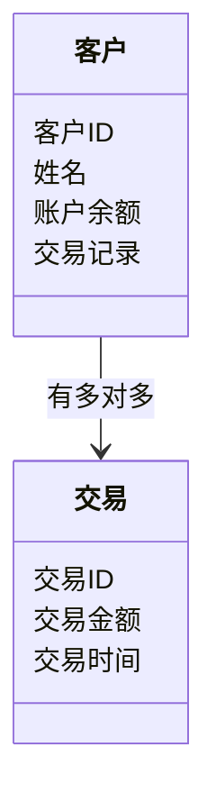
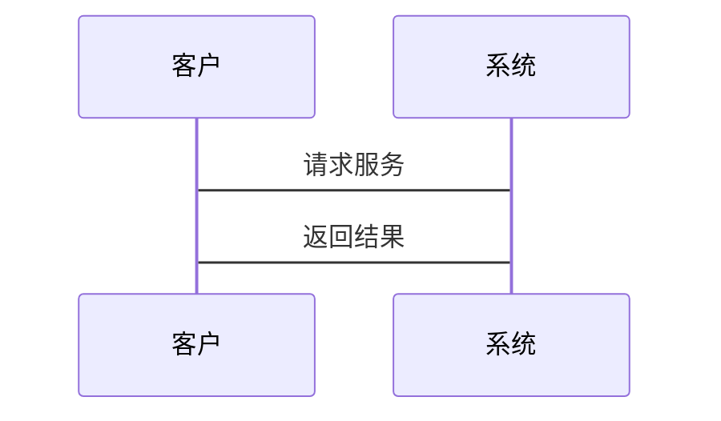

                 


# 智能商业银行客户价值评估与关系管理

> 关键词：智能商业银行，客户价值评估，关系管理，机器学习，数据分析

> 摘要：本文深入探讨了智能商业银行客户价值评估与关系管理的核心概念、算法原理、系统架构及项目实战。通过结合背景介绍、核心概念、算法实现和系统设计，全面解析了如何利用人工智能和大数据技术提升银行客户的价值评估和关系管理能力。文章内容涵盖从理论到实践的各个环节，帮助读者全面理解并掌握智能商业银行客户价值评估与关系管理的精髓。

---

# 第一部分: 智能商业银行客户价值评估与关系管理概述

# 第1章: 智能商业银行客户价值评估与关系管理概述

## 1.1 智能商业银行的背景与发展趋势

### 1.1.1 传统商业银行的局限性
传统商业银行在客户管理方面存在以下问题：
- **信息孤岛**：客户数据分散在不同部门，难以形成统一的客户视图。
- **人工依赖**：客户价值评估和关系管理高度依赖人工经验，效率低下。
- **个性化不足**：难以针对不同客户群体提供个性化的服务和产品。

### 1.1.2 智能化转型的必要性
随着人工智能和大数据技术的快速发展，商业银行需要通过智能化转型来提升客户体验和运营效率。智能商业银行的核心目标是通过数据驱动的决策和自动化服务，实现客户价值的最大化。

### 1.1.3 智能商业银行的核心特征
智能商业银行具有以下核心特征：
- **数据驱动**：利用大数据技术整合和分析客户信息。
- **人工智能赋能**：通过机器学习、自然语言处理等技术实现智能决策。
- **客户-centric**：以客户为中心，提供个性化、智能化的服务。

## 1.2 客户价值评估与关系管理的背景

### 1.2.1 客户价值评估的定义与意义
客户价值评估是指通过对客户行为、交易数据和反馈的分析，量化客户对银行的贡献和潜力。其意义在于帮助企业识别高价值客户，优化资源配置，提升客户满意度和忠诚度。

### 1.2.2 客户关系管理在银行业的应用
客户关系管理（CRM）是银行业提升客户满意度和忠诚度的重要手段。通过CRM系统，银行可以实现客户信息的集中管理、服务流程的优化以及客户体验的提升。

### 1.2.3 智能化时代客户管理的挑战与机遇
在智能化时代，客户管理的挑战主要体现在数据的复杂性、算法的选型以及系统的集成。然而，这也带来了机遇，通过智能化技术可以实现客户管理的自动化、精准化和个性化。

## 1.3 本章小结
本章通过分析智能商业银行的背景、客户价值评估与关系管理的定义和意义，为后续内容奠定了基础。

---

# 第二部分: 客户价值评估的核心概念与原理

# 第2章: 客户价值评估的核心概念与原理

## 2.1 客户价值评估的定义与核心要素

### 2.1.1 客户价值的定义
客户价值是指客户对企业的贡献和潜力，包括直接的收入贡献、间接的品牌价值以及未来的增长潜力。

### 2.1.2 客户价值评估的核心要素
客户价值评估的核心要素包括：
- **客户生命周期**：客户从初次接触、购买到流失的全生命周期。
- **客户行为**：客户的交易频率、金额、产品偏好等。
- **客户反馈**：客户满意度、投诉记录等。

### 2.1.3 客户价值评估的边界与外延
客户价值评估的边界在于数据的准确性和完整性，而外延则涉及客户分群、精准营销和客户保留策略。

## 2.2 客户价值评估的关键指标与模型

### 2.2.1 客户生命周期价值（CLV）
客户生命周期价值（Customer Lifetime Value, CLV）是衡量客户一生中为银行带来的总价值的重要指标。其公式为：
$$ CLV = \text{客户贡献} \times \text{客户生命周期长度} $$

### 2.2.2 客户满意度与忠诚度
客户满意度是客户对银行服务的满意程度，而客户忠诚度则是客户持续使用银行服务的程度。

### 2.2.3 客户价值评分模型
客户价值评分模型通过综合考虑客户的交易数据、行为数据和反馈数据，对客户进行评分，从而实现客户分群和精准营销。

## 2.3 客户价值评估的核心算法与原理

### 2.3.1 基于机器学习的客户价值预测
通过机器学习算法（如随机森林、神经网络）对客户价值进行预测，实现客户分群和精准营销。

### 2.3.2 基于聚类分析的客户分群
聚类分析（如K-means算法）用于将客户分为不同的群体，每个群体具有相似的特征和行为。

### 2.3.3 基于决策树的客户价值评估
决策树算法（如ID3、C4.5）用于客户价值评估，通过特征选择和决策规则生成客户分群。

## 2.4 本章小结
本章详细介绍了客户价值评估的核心概念、关键指标和算法原理，为后续的系统设计和项目实战奠定了基础。

---

# 第三部分: 客户关系管理的核心概念与原理

# 第3章: 客户关系管理的核心概念与原理

## 3.1 客户关系管理的定义与核心要素

### 3.1.1 客户关系管理的定义
客户关系管理（CRM）是指通过技术手段和管理方法，优化客户与银行之间的关系，提升客户满意度和忠诚度。

### 3.1.2 客户关系管理的核心要素
客户关系管理的核心要素包括：
- **客户信息管理**：整合和管理客户信息。
- **客户互动管理**：优化客户与银行的互动体验。
- **客户反馈管理**：收集和分析客户反馈，改进服务。

### 3.1.3 客户关系管理的边界与外延
客户关系管理的边界在于客户信息的隐私保护和数据安全，而外延则涉及客户忠诚计划和个性化服务。

## 3.2 客户关系管理的关键指标与模型

### 3.2.1 客户满意度与忠诚度
客户满意度是客户对银行服务的满意程度，而客户忠诚度则是客户持续使用银行服务的程度。

### 3.2.2 客户生命周期管理
客户生命周期管理包括客户获取、客户培养、客户保留和客户流失管理。

### 3.2.3 客户关系评分模型
客户关系评分模型通过综合考虑客户的交易数据、行为数据和反馈数据，对客户关系进行评分，从而实现客户分群和精准营销。

## 3.3 客户关系管理的核心算法与原理

### 3.3.1 基于自然语言处理的客户情感分析
通过自然语言处理技术（如词袋模型、词嵌入）对客户反馈进行情感分析，识别客户满意度和情感倾向。

### 3.3.2 基于图论的客户关系网络分析
通过图论算法（如邻接矩阵、社区检测）分析客户之间的关系网络，识别关键客户和潜在风险。

### 3.3.3 基于机器学习的客户关系预测
通过机器学习算法（如逻辑回归、支持向量机）预测客户关系的稳定性，实现客户保留和流失预警。

## 3.4 本章小结
本章详细介绍了客户关系管理的核心概念、关键指标和算法原理，为后续的系统设计和项目实战奠定了基础。

---

# 第四部分: 客户价值评估与关系管理的算法原理

# 第4章: 客户价值评估与关系管理的算法原理

## 4.1 客户价值评估的算法原理

### 4.1.1 基于RFM模型的客户价值评估
RFM模型通过分析客户的最近一次交易（Recency）、交易频率（Frequency）和交易金额（Monetary）来评估客户价值。

### 4.1.2 基于聚类分析的客户分群
通过聚类分析（如K-means算法）将客户分为不同的群体，每个群体具有相似的特征和行为。

### 4.1.3 基于决策树的客户价值预测
通过决策树算法（如ID3、C4.5）对客户价值进行预测，实现客户分群和精准营销。

## 4.2 客户关系管理的算法原理

### 4.2.1 基于情感分析的客户反馈处理
通过自然语言处理技术（如词袋模型、词嵌入）对客户反馈进行情感分析，识别客户满意度和情感倾向。

### 4.2.2 基于图论的客户关系网络分析
通过图论算法（如邻接矩阵、社区检测）分析客户之间的关系网络，识别关键客户和潜在风险。

### 4.2.3 基于机器学习的客户关系预测
通过机器学习算法（如逻辑回归、支持向量机）预测客户关系的稳定性，实现客户保留和流失预警。

## 4.3 算法原理的数学模型与公式

### 4.3.1 RFM模型的数学公式
$$ RFM = R \times F \times M $$
其中，R是客户最近一次交易的时间，F是客户的交易频率，M是客户的平均交易金额。

### 4.3.2 聚类分析的数学公式
$$ d(x, y) = \sqrt{\sum_{i=1}^{n}(x_i - y_i)^2} $$
其中，x和y是两个客户的数据向量，n是特征的维度。

### 4.3.3 决策树的数学公式
决策树通过信息熵公式选择特征：
$$ \text{信息熵} = -\sum_{i=1}^{n} p_i \log p_i $$
其中，p_i是第i个特征的概率。

## 4.4 本章小结
本章详细介绍了客户价值评估与关系管理的核心算法及其数学模型，为后续的系统设计和项目实战奠定了基础。

---

# 第五部分: 系统分析与架构设计

# 第5章: 系统分析与架构设计

## 5.1 问题场景介绍
智能商业银行客户价值评估与关系管理系统的建设目标是通过整合客户数据，利用人工智能技术实现客户价值评估和关系管理的智能化。

## 5.2 系统功能设计

### 5.2.1 领域模型设计


### 5.2.2 系统架构设计
```mermaid
client
  /  \ 
 front-end  data-base
  \  /
    back-end
```

### 5.2.3 接口设计
- **API接口**：提供RESTful API接口，供前端和后端进行数据交互。
- **数据接口**：与银行核心系统对接，获取客户交易数据和账户信息。

### 5.2.4 交互设计


## 5.3 本章小结
本章通过系统分析与架构设计，明确了智能商业银行客户价值评估与关系管理系统的功能和结构。

---

# 第六部分: 项目实战

# 第6章: 项目实战

## 6.1 环境安装

### 6.1.1 安装Python和相关库
```bash
pip install numpy pandas scikit-learn
```

## 6.2 系统核心实现源代码

### 6.2.1 客户价值评估代码
```python
from sklearn.tree import DecisionTreeClassifier
import pandas as pd

# 加载数据
data = pd.read_csv('customer_data.csv')

# 特征选择
features = ['recency', 'frequency', 'monetary']
target = 'value'

# 训练模型
model = DecisionTreeClassifier()
model.fit(data[features], data[target])

# 预测客户价值
new_customer = [[1, 2, 3]]
predicted_value = model.predict(new_customer)
print(predicted_value)
```

### 6.2.2 客户关系管理代码
```python
from sklearn.cluster import KMeans
import pandas as pd

# 加载数据
data = pd.read_csv('customer_relations.csv')

# 特征选择
features = ['interaction', 'feedback', 'loyalty']

# 训练模型
model = KMeans(n_clusters=3)
model.fit(data[features])

# 预测客户关系
new_customer = [[2, 3, 1]]
predicted_relation = model.predict(new_customer)
print(predicted_relation)
```

## 6.3 代码应用解读与分析
通过上述代码，我们可以实现客户价值评估和关系管理的自动化。客户价值评估代码基于决策树算法，实现客户价值的预测和分群。客户关系管理代码基于聚类分析，实现客户关系的分类和优化。

## 6.4 实际案例分析和详细讲解剖析
通过实际案例分析，我们可以看到智能商业银行客户价值评估与关系管理系统的实际应用效果。例如，通过客户价值评估，银行可以识别高价值客户，制定精准营销策略；通过客户关系管理，银行可以优化客户互动体验，提升客户忠诚度。

## 6.5 本章小结
本章通过项目实战，详细讲解了智能商业银行客户价值评估与关系管理系统的实现过程，帮助读者掌握系统的实际应用。

---

# 第七部分: 最佳实践

# 第7章: 最佳实践

## 7.1 小结
智能商业银行客户价值评估与关系管理系统的建设是一个复杂而重要的任务。通过本文的深入分析和项目实战，我们可以看到人工智能和大数据技术在银行客户管理中的巨大潜力。

## 7.2 注意事项
在实际应用中，需要注意以下几点：
- 数据隐私保护：确保客户数据的安全和隐私。
- 算法选型：根据实际需求选择合适的算法。
- 系统集成：确保系统的稳定性和可扩展性。

## 7.3 拓展阅读
建议读者进一步阅读以下内容：
- 《机器学习实战》
- 《大数据技术与应用》
- 《客户关系管理》

---

# 作者

作者：AI天才研究院/AI Genius Institute & 禅与计算机程序设计艺术/Zen And The Art of Computer Programming

---

感谢您的阅读！希望本文能为您提供有价值的内容和启发。

