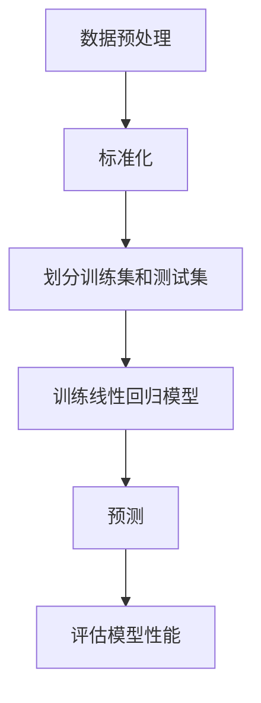
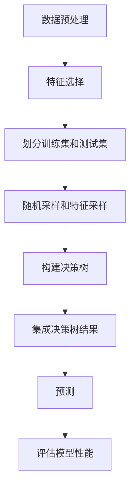
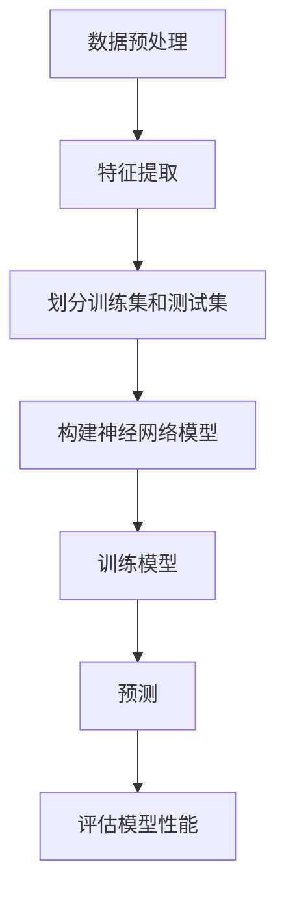
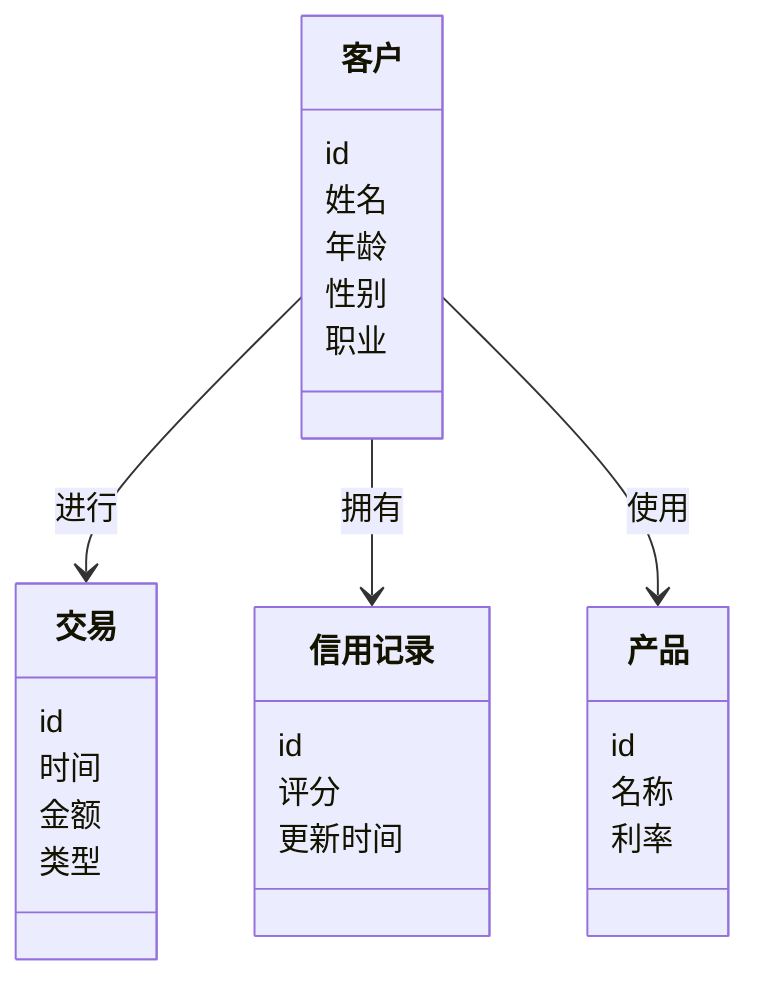
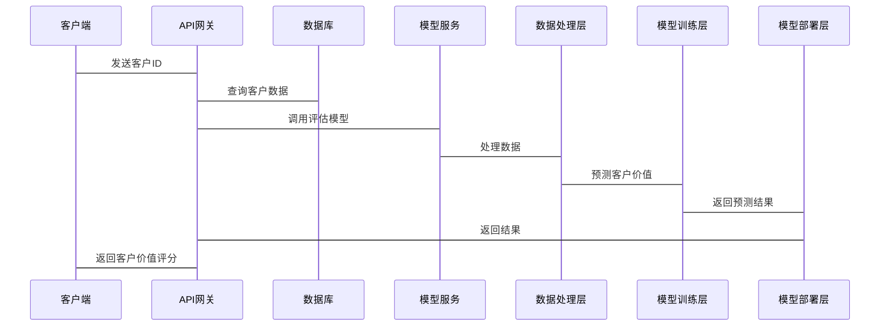

                 


# 智能商业银行客户价值评估模型

> 关键词：智能商业银行，客户价值评估，人工智能，大数据分析，金融建模，机器学习

> 摘要：本文详细介绍智能商业银行客户价值评估模型的构建与应用，涵盖模型背景、核心概念、算法原理、系统设计与实现、项目实战以及高级主题与优化。通过逐步分析和实际案例，帮助读者深入理解并掌握智能客户价值评估模型的设计与应用方法。

---

# 第一部分: 智能商业银行客户价值评估模型的背景与基础

## 第1章: 智能商业银行客户价值评估模型概述

### 1.1 智能商业银行的背景与发展趋势
#### 1.1.1 传统商业银行的业务模式
传统商业银行通过分支机构和柜台服务提供存贷款、理财、信用卡等金融服务，主要依赖人工审核和简单自动化系统。

#### 1.1.2 智能化转型的必要性
随着互联网、大数据和人工智能技术的发展，商业银行需要通过智能化手段提升服务效率、降低运营成本并提高客户满意度。

#### 1.1.3 客户价值评估的重要性
客户价值评估是商业银行优化资源配置、制定精准营销策略和风险控制的重要基础。

### 1.2 客户价值评估的定义与意义
#### 1.2.1 客户价值的定义
客户价值是指客户在未来为银行带来的收益和利润，通常通过客户生命周期价值（CLV）来衡量。

#### 1.2.2 客户价值评估在商业银行中的作用
- 识别高价值客户，优化资源配置。
- 制定精准营销策略，提升客户满意度。
- 降低风险，提高贷款审批的准确性。

#### 1.2.3 智能化客户价值评估的优势
- 高效性：通过人工智能算法快速处理海量数据。
- 精准性：基于大数据分析实现客户画像的精准刻画。
- 动态性：实时更新客户数据，提供动态评估结果。

### 1.3 智能客户价值评估模型的核心要素
#### 1.3.1 数据来源与特征
- 数据来源：交易数据、客户画像、行为数据、信用记录。
- 数据特征：包括客户的基本信息、交易频率、金额、风险评分等。

#### 1.3.2 模型构建与评估指标
- 模型构建：基于机器学习算法，如线性回归、随机森林、神经网络。
- 评估指标：准确率、召回率、F1分数、ROC-AUC。

#### 1.3.3 模型应用场景与边界
- 应用场景：客户分层、精准营销、风险控制。
- 边界条件：数据隐私保护、模型可解释性、实时性要求。

---

## 第2章: 核心概念与联系

### 2.1 客户价值评估的核心概念
#### 2.1.1 客户生命周期
客户生命周期包括获取、激活、留存、转化和衰退五个阶段，每个阶段的客户行为和价值不同。

#### 2.1.2 客户行为分析
客户行为分析包括交易频率、金额、时间、渠道等维度，帮助识别高价值客户和潜在流失客户。

#### 2.1.3 客户价值的度量方法
- 终身价值（Customer Lifetime Value, CLV）：预测客户未来为银行带来的总收入减去成本。
- 客户贡献度（Customer Contribution）：客户在特定时间段内的净收益。

### 2.2 数据特征与模型算法的关系
#### 2.2.1 数据特征的分类
- 数值型特征：交易金额、账户余额。
- 类别型特征：性别、年龄、职业。
- 文本型特征：客户反馈、评论。

#### 2.2.2 不同算法对数据特征的依赖
- 线性回归：适合线性关系的数据。
- 随机森林：适合高维数据和非线性关系。
- 神经网络：适合复杂非线性关系。

#### 2.2.3 数据特征与模型性能的关联
- 特征冗余：过多相似特征可能导致过拟合。
- 特征缺失：关键特征的缺失会影响模型性能。
- 特征工程：通过数据清洗、特征提取和降维提升模型性能。

### 2.3 模型算法的对比分析
#### 2.3.1 常见模型算法的对比表格
| 算法类型 | 优点 | 缺点 | 适用场景 |
|----------|------|------|----------|
| 线性回归 | 简单、可解释性高 | 无法处理非线性关系 | 低维数据、线性关系 |
| 随机森林 | 高准确率、鲁棒性好 | 解释性较差 | 高维数据、非线性关系 |
| 神经网络 | 处理复杂模式能力强 | 训练时间长、需要大量数据 | 图像识别、自然语言处理 |

#### 2.3.2 模型选择的依据与原则
- 数据规模：小数据适合线性回归，大数据适合神经网络。
- 数据类型：类别型数据适合随机森林，数值型数据适合线性回归。
- 模型解释性：需要解释性时选择线性回归或随机森林。

### 2.4 实体关系图（ER图）展示
```mermaid
erDiagram
    customer[客户] {
        string id
        string name
        string age
        string gender
        string occupation
    }
    transaction[交易] {
        string id
        date timestamp
        float amount
        string type
    }
    credit[信用记录] {
        string id
        float score
        date update_time
    }
    product[产品] {
        string id
        string name
        float interest_rate
    }
    customer --> transaction: 进行
    customer --> credit: 拥有
    customer --> product: 使用
```

---

## 第3章: 算法原理与数学模型

### 3.1 算法原理概述
#### 3.1.1 线性回归模型
线性回归是一种简单而强大的回归算法，通过最小化预测值与实际值之间的平方差之和来拟合数据。

#### 3.1.2 随机森林模型
随机森林是一种基于决策树的集成算法，通过构建多棵决策树并取其预测结果的平均值来提高模型的准确性和鲁棒性。

#### 3.1.3 神经网络模型
神经网络是一种模拟人脑神经网络结构的算法，通过多层神经元之间的连接和激活函数来学习复杂的非线性关系。

### 3.2 算法流程图
#### 3.2.1 线性回归算法流程图


#### 3.2.2 随机森林算法流程图


#### 3.2.3 神经网络算法流程图


### 3.3 数学模型与公式
#### 3.3.1 线性回归模型公式
$$ y = \beta_0 + \beta_1x_1 + \beta_2x_2 + \dots + \beta_nx_n + \epsilon $$

#### 3.3.2 随机森林模型公式
随机森林通过集成学习，将多棵决策树的预测结果取平均值：
$$ y = \frac{1}{N}\sum_{i=1}^{N} y_i $$

#### 3.3.3 神经网络模型公式
神经网络的前向传播公式：
$$ a^{(l+1)} = \sigma(w^{(l)}a^{(l)} + b^{(l)}) $$

---

## 第4章: 系统分析与架构设计

### 4.1 系统分析
#### 4.1.1 问题场景介绍
商业银行需要通过客户价值评估模型实现客户分层、精准营销和风险控制。

#### 4.1.2 项目介绍
项目目标：构建智能客户价值评估模型，实现客户价值的精准评估和预测。

### 4.2 系统功能设计
#### 4.2.1 领域模型图


#### 4.2.2 系统架构图


### 4.3 系统接口设计
#### 4.3.1 API接口
- 输入：客户ID
- 输出：客户价值评分

#### 4.3.2 数据接口
- 数据库：MySQL或MongoDB
- 数据接口：RESTful API

### 4.4 系统交互流程图


---

## 第5章: 项目实战

### 5.1 环境安装
- Python 3.8+
- Jupyter Notebook
- 数据处理库：pandas、numpy
- 机器学习库：scikit-learn、xgboost
- 可视化库：matplotlib、seaborn

### 5.2 核心实现
#### 5.2.1 数据预处理
```python
import pandas as pd
import numpy as np

# 数据加载
df = pd.read_csv('customer_data.csv')

# 数据清洗
df.dropna(inplace=True)
df = pd.get_dummies(df, columns=['性别', '职业'])
```

#### 5.2.2 模型训练
```python
from sklearn.model_selection import train_test_split
from sklearn.linear_model import LinearRegression
from sklearn.ensemble import RandomForestRegressor

# 划分训练集和测试集
X_train, X_test, y_train, y_test = train_test_split(df.drop('客户价值', axis=1), df['客户价值'], test_size=0.2)

# 线性回归模型
lr_model = LinearRegression()
lr_model.fit(X_train, y_train)
lr_score = lr_model.score(X_test, y_test)

# 随机森林模型
rf_model = RandomForestRegressor(n_estimators=100)
rf_model.fit(X_train, y_train)
rf_score = rf_model.score(X_test, y_test)
```

#### 5.2.3 模型评估
```python
from sklearn.metrics import mean_squared_error, r2_score

# 线性回归评估
lr_y_pred = lr_model.predict(X_test)
lr_mse = mean_squared_error(y_test, lr_y_pred)
lr_r2 = r2_score(y_test, lr_y_pred)

# 随机森林评估
rf_y_pred = rf_model.predict(X_test)
rf_mse = mean_squared_error(y_test, rf_y_pred)
rf_r2 = r2_score(y_test, rf_y_pred)

print(f"线性回归 MSE: {lr_mse}, R²: {lr_r2}")
print(f"随机森林 MSE: {rf_mse}, R²: {rf_r2}")
```

### 5.3 代码解读与分析
- 数据预处理：包括数据加载、清洗和特征工程。
- 模型训练：分别训练线性回归和随机森林模型。
- 模型评估：比较两种模型的性能，选择表现更好的模型。

### 5.4 实际案例分析
假设我们有一个客户数据集，包括客户的基本信息、交易记录和信用评分。通过模型预测客户的终身价值，帮助银行制定精准的营销策略。

### 5.5 项目小结
通过项目实战，读者可以掌握智能客户价值评估模型的构建与应用，包括数据处理、模型训练和评估。

---

## 第6章: 高级主题与优化

### 6.1 模型优化
- 调参：使用网格搜索或随机搜索优化模型参数。
- 特征工程：通过主成分分析（PCA）降维，减少特征数量。

### 6.2 模型融合
- 深度学习模型：使用LSTM或Transformer模型处理时间序列数据。
- 模型融合：将多个模型的预测结果进行加权平均，提升整体性能。

### 6.3 模型的可解释性与鲁棒性
- 可解释性：使用SHAP值分析模型的决策过程。
- 鲁棒性：通过交叉验证和数据增强提升模型的泛化能力。

### 6.4 模型的实时性与可扩展性
- 实时性：通过流数据处理技术实现实时客户价值评估。
- 可扩展性：使用分布式计算框架（如Spark）处理海量数据。

### 6.5 拓展阅读
- 《Hands-On Machine Learning with Scikit-Learn, Keras, and TensorFlow》
- 《Data Science for Business: What You Need to Know About Data Mining and Data Analytics》

---

## 附录: 参考文献与工具包

- 数据集：公开可用的银行客户数据集。
- 工具包：Python机器学习库（scikit-learn、xgboost）、数据处理库（pandas、numpy）、可视化库（matplotlib、seaborn）。

---

## 作者：AI天才研究院/AI Genius Institute & 禅与计算机程序设计艺术 /Zen And The Art of Computer Programming

---

本文通过逐步分析和实际案例，深入探讨了智能商业银行客户价值评估模型的设计与应用，希望为读者提供有价值的参考和启发。

