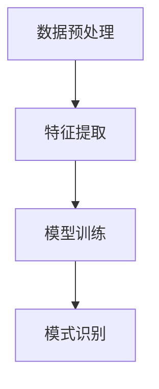
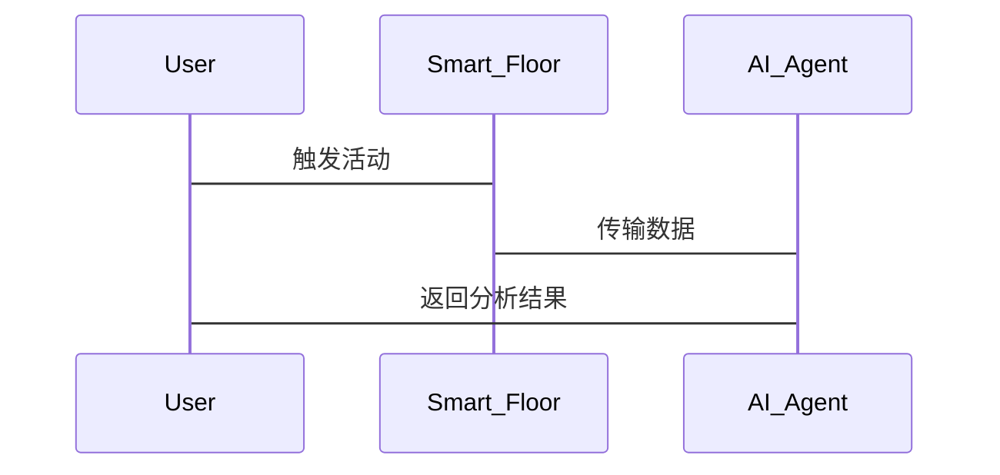

                 


# 智能地板：AI Agent的室内活动模式分析

## 关键词
智能地板，AI Agent，室内活动模式，模式识别，时间序列分析，机器学习

## 摘要
智能地板通过感知室内环境中的活动模式，结合AI Agent的智能分析，为智能家居、健康监测等领域提供了强大的技术支持。本文详细探讨了智能地板的数据采集技术、AI Agent的算法原理以及室内活动模式分析的实现方案，并通过实际案例展示了系统的设计与应用。

---

## 第一部分：智能地板与AI Agent概述

### 第1章：智能地板与AI Agent的背景介绍

#### 1.1 问题背景
- **室内活动模式分析的重要性**：通过分析室内人员的活动模式，可以实现智能家居的自动化控制、健康监测、安全防护等功能。
- **智能地板技术的发展历程**：从简单的压力感应到集成多种传感器的智能地板，技术不断进步。
- **AI Agent在室内活动分析中的作用**：AI Agent通过处理智能地板采集的数据，识别和分析室内活动模式。

#### 1.2 问题描述
- **室内活动模式的多样性**：包括走路、跑步、坐卧、站立等多种行为。
- **智能地板数据的采集挑战**：需要高精度、低功耗的传感器。
- **AI Agent在数据分析中的应用需求**：需要高效的算法来处理海量数据。

#### 1.3 问题解决
- **智能地板的数据采集与处理**：通过传感器采集压力、温度、湿度等数据。
- **AI Agent的算法选择**：采用时间序列分析、机器学习等方法。
- **系统整体解决方案**：结合智能地板和AI Agent，实现室内活动模式的实时分析。

#### 1.4 边界与外延
- **智能地板的应用场景限制**：适用于家庭、办公室等室内环境。
- **AI Agent的性能边界**：受限于传感器精度和算法复杂度。
- **室内活动模式分析的扩展领域**：包括行为识别、异常检测等。

#### 1.5 概念结构与核心要素
- **智能地板的核心组成**：传感器网络、数据采集模块。
- **AI Agent的功能模块**：数据处理、模式识别、结果输出。
- **室内活动模式分析的流程**：数据采集 → 数据预处理 → 模型训练 → 模式识别。

---

### 第2章：智能地板与AI Agent的核心概念与联系

#### 2.1 核心概念原理
- **智能地板的数据采集原理**：通过压力传感器感知人员活动。
- **AI Agent的算法原理**：采用深度学习模型识别活动模式。
- **室内活动模式分析的流程**：数据采集 → 特征提取 → 模型训练 → 结果输出。

#### 2.2 概念属性特征对比
| 概念 | 核心属性 | 描述 |
|------|----------|------|
| 智能地板 | 数据采集 | 通过传感器采集室内活动数据 |
| AI Agent | 算法处理 | 使用机器学习算法分析数据 |
| 室内活动模式 | 分析结果 | 输出识别的活动类型 |

#### 2.3 ER实体关系图
```mermaid
er
    actor: 用户
    smart_floor: 智能地板
    activity_mode: 室内活动模式
    ai_agent: AI代理
    relation1: 用户操作智能地板
    relation2: 智能地板采集数据
    relation3: AI代理分析数据
    relation4: AI代理生成活动模式
```

---

## 第二部分：AI Agent算法原理与数学模型

### 第3章：AI Agent算法原理与数学模型

#### 3.1 算法原理
- **时间序列分析**：通过分析连续的传感器数据，识别活动模式。
- **机器学习模型**：使用LSTM网络进行序列预测。

#### 3.2 算法实现


#### 3.3 核心代码实现
```python
import numpy as np
from sklearn.preprocessing import MinMaxScaler
from tensorflow.keras.models import Sequential
from tensorflow.keras.layers import LSTM, Dense

# 数据预处理
def preprocess(data):
    scaler = MinMaxScaler()
    scaled_data = scaler.fit_transform(data)
    return scaled_data

# LSTM模型
def build_model(input_shape):
    model = Sequential()
    model.add(LSTM(50, input_shape=input_shape))
    model.add(Dense(1, activation='sigmoid'))
    model.compile(optimizer='adam', loss='binary_crossentropy', metrics=['accuracy'])
    return model

# 训练模型
def train_model(X_train, y_train, X_val, y_val):
    model = build_model((X_train.shape[1], X_train.shape[2]))
    model.fit(X_train, y_train, epochs=50, batch_size=32, validation_data=(X_val, y_val))
    return model
```

#### 3.4 数学模型
- **时间序列模型**：$$ y_t = \alpha y_{t-1} + \beta x_t $$
- **LSTM网络**：$$ f(t) = \text{LSTM}(t-1, t) $$

---

## 第三部分：系统分析与架构设计方案

### 第4章：系统分析与架构设计方案

#### 4.1 问题场景介绍
- **家庭环境**：监测家庭成员的活动。
- **办公室环境**：优化办公环境。

#### 4.2 项目介绍
- **项目目标**：实现智能地板与AI Agent的集成，提供室内活动模式分析功能。

#### 4.3 系统功能设计
- **数据采集模块**：采集室内活动数据。
- **活动识别模块**：识别活动类型。
- **模式分析模块**：分析活动模式。

#### 4.4 系统架构设计


#### 4.5 系统接口设计
- **API接口**：RESTful API，提供数据采集和分析功能。

#### 4.6 系统交互


---

## 第四部分：项目实战

### 第5章：项目实战

#### 5.1 环境安装
- **传感器安装**：安装压力传感器、温度传感器等。
- **网络环境搭建**：配置局域网环境。

#### 5.2 系统核心实现
- **数据采集**：编写采集程序，读取传感器数据。
- **模型训练**：使用训练好的模型进行预测。

#### 5.3 代码实现
```python
# 数据采集
def collect_data(sensors):
    data = []
    for sensor in sensors:
        data.append(sensor.read())
    return data

# 模型预测
def predict_activity(model, data):
    scaled_data = preprocess(data)
    prediction = model.predict(scaled_data)
    return prediction
```

#### 5.4 实际案例分析
- **家庭场景**：识别家庭成员的活动模式。
- **办公室场景**：优化办公环境。

#### 5.5 系统优化
- **数据隐私保护**：确保数据安全。
- **传感器校准**：定期校准传感器。

---

## 第五部分：总结与展望

### 第6章：总结与展望

#### 6.1 最佳实践
- **数据隐私保护**：采用加密技术。
- **传感器维护**：定期校准和维护。

#### 6.2 小结
智能地板与AI Agent的结合，为室内活动模式分析提供了强大的技术支持，未来将更加智能化和个性化。

#### 6.3 注意事项
- **数据隐私**：注意保护用户隐私。
- **系统稳定性**：确保系统稳定运行。

#### 6.4 拓展阅读
- 《时间序列分析》
- 《机器学习实战》

---

## 作者：AI天才研究院/AI Genius Institute & 禅与计算机程序设计艺术 /Zen And The Art of Computer Programming

