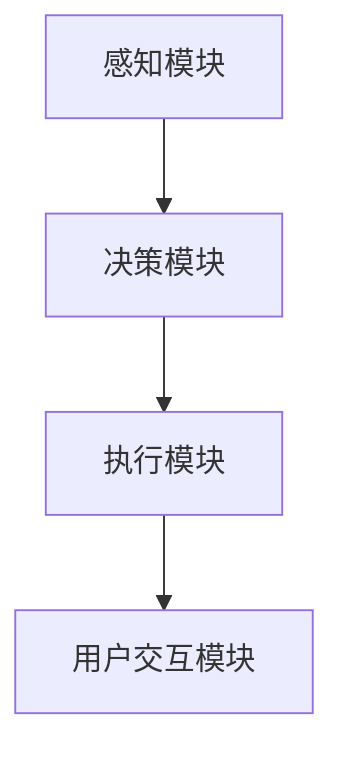
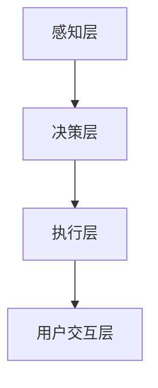
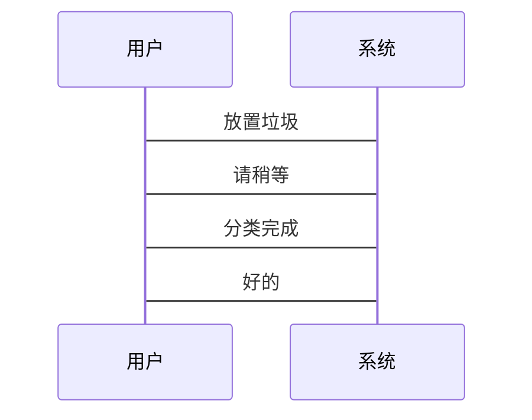

                 


# 智能垃圾分类桶：AI Agent的废物识别与分类指导

> 关键词：智能垃圾分类桶，AI Agent，废物识别，分类算法，系统架构，项目实战

> 摘要：本文详细探讨了AI Agent在智能垃圾分类桶中的应用，从背景、核心概念、算法原理到系统架构和项目实现，全面解析了如何利用AI技术实现高效、准确的废物分类。文章通过理论分析和实践案例相结合的方式，展示了AI Agent在垃圾分类中的巨大潜力和实际应用价值。

---

# 第1章: 智能垃圾分类桶的背景与问题描述

## 1.1 智能垃圾分类的背景

### 1.1.1 垃圾分类的重要性  
随着城市化进程的加快，垃圾产量急剧增加，传统的人工分类方式效率低下，且容易出错。智能垃圾分类桶的出现，利用AI技术实现了高效、准确的分类，解决了传统方法的痛点。

### 1.1.2 传统垃圾分类的局限性  
传统垃圾分类依赖人工操作，存在效率低、成本高、分类错误率高的问题。同时，人工分类还容易受到疲劳、注意力分散等因素的影响，进一步降低了分类的准确率。

### 1.1.3 AI Agent在垃圾分类中的应用潜力  
AI Agent（智能体）通过感知、决策和执行的能力，能够快速、准确地识别垃圾种类，从而实现高效的分类管理。AI Agent的应用不仅可以提高分类效率，还能降低成本，减少环境污染。

## 1.2 AI Agent在垃圾分类中的角色

### 1.2.1 AI Agent的基本概念  
AI Agent是一种能够感知环境、自主决策并执行任务的智能实体。在垃圾分类中，AI Agent通过摄像头、传感器等设备感知垃圾的形状、颜色、材质等特征，利用算法进行分类决策，并通过机械装置完成分类操作。

### 1.2.2 AI Agent在垃圾分类中的核心功能  
1. **感知模块**：通过摄像头或传感器采集垃圾的图像或特征数据。  
2. **决策模块**：利用机器学习算法对垃圾进行分类，确定其所属类别。  
3. **执行模块**：通过机械装置将垃圾分拣到相应的收集容器中。

### 1.2.3 智能垃圾分类桶的定义与目标  
智能垃圾分类桶是一种集成AI Agent的设备，其目标是通过智能化的方式实现垃圾的高效分类，减少人工干预，提高分类准确率，降低处理成本。

## 1.3 本章小结  
本章介绍了智能垃圾分类的背景、传统分类的局限性以及AI Agent在垃圾分类中的潜力和角色。通过对比传统方法与AI Agent的优势，明确了智能垃圾分类桶的定义与目标。

---

# 第2章: AI Agent的核心概念与原理

## 2.1 AI Agent的基本原理

### 2.1.1 感知模块  
感知模块是AI Agent的“眼睛”，负责采集垃圾的图像或特征数据。常用的技术包括图像采集和特征提取。  
- 图像采集：使用摄像头获取垃圾的图像数据。  
- 特征提取：通过图像处理技术提取垃圾的颜色、形状、纹理等特征。

### 2.1.2 决策模块  
决策模块是AI Agent的“大脑”，负责对垃圾进行分类决策。常用算法包括支持向量机（SVM）、随机森林、卷积神经网络（CNN）等。  
- SVM：适用于小规模数据，分类准确率高。  
- CNN：适用于大规模图像数据，能够自动提取特征。  
- 决策树：适用于规则清晰的分类任务。

### 2.1.3 执行模块  
执行模块是AI Agent的“手”，负责将垃圾分拣到相应的收集容器中。通常采用机械臂或分拣装置实现。

## 2.2 AI Agent与传统分类算法的对比

### 2.2.1 传统分类算法的特点  
- 简单易实现：如K近邻算法（KNN）、决策树等。  
- 依赖人工特征提取：需要手动设计特征，效率较低。  
- 分类准确率受限：传统算法在处理复杂数据时表现有限。

### 2.2.2 AI Agent的优势  
- 自动学习：能够从大量数据中自动学习特征，提高分类准确率。  
- 高效性：通过并行计算和优化算法，显著提高分类速度。  
- 适应性：能够根据数据变化动态调整分类模型。

### 2.2.3 对比表格（见附表1）  
| 对比维度 | 传统分类算法 | AI Agent |  
|----------|--------------|-----------|  
| 学习方式 | 需要人工特征提取 | 自动学习特征 |  
| 分类速度 | 较慢 | 较快 |  
| 分类准确率 | 较低 | 较高 |  

## 2.3 智能垃圾分类桶的系统架构

### 2.3.1 系统组成模块  
1. **感知模块**：负责采集垃圾图像。  
2. **决策模块**：负责垃圾分类决策。  
3. **执行模块**：负责垃圾分拣。  
4. **用户交互模块**：提供人机交互界面。  

### 2.3.2 模块之间的关系（见附图1）  


## 2.4 本章小结  
本章详细讲解了AI Agent的基本原理，对比了传统分类算法与AI Agent的优势，并设计了智能垃圾分类桶的系统架构，明确了各模块之间的关系。

---

# 第3章: 垃圾分类的数学模型与算法原理

## 3.1 垃圾分类的数学模型

### 3.1.1 分类问题的数学表达  
垃圾分类可以看作是一个监督学习问题，目标是将垃圾样本映射到其所属类别。数学表达式为：  
$$ y = f(x) $$  
其中，$x$ 是输入样本（如图像），$y$ 是输出类别。

### 3.1.2 常见分类算法的数学公式  
1. **支持向量机（SVM）**  
   $$ \text{目标函数}：\min_{w,b,\xi} \frac{1}{2}w^Tw + C\sum_{i=1}^n \xi_i $$  
   $$ \text{约束条件}：y_i(w^T x_i + b) \geq 1 - \xi_i $$  

2. **卷积神经网络（CNN）**  
   $$ \text{前向传播}：a^{(l+1)} = \sigma(W^{(l)} a^{(l)} + b^{(l)}) $$  
   $$ \text{损失函数}：L = -\sum_{i=1}^n y_i \log(p_i) + (1-y_i)\log(1-p_i) $$  

3. **随机森林**  
   $$ \text{分类概率}：P(y=k|X=x) = \frac{1}{N}\sum_{i=1}^N I(t_i(x) = k) $$  

### 3.1.3 示例说明（见附例1）  
假设我们有两类垃圾：纸张和塑料。训练一个SVM模型，输入特征为垃圾的颜色和形状，输出类别为纸张（1）或塑料（0）。训练完成后，输入一张白色长方形的图片，模型输出类别为纸张（1）。

## 3.2 AI Agent的识别流程

### 3.2.1 数据采集与预处理  
1. 通过摄像头采集垃圾图像。  
2. 对图像进行预处理，包括去噪、增强对比度等。  

### 3.2.2 特征提取与分类  
1. 使用CNN提取图像特征。  
2. 将特征输入SVM进行分类决策。  

### 3.2.3 结果输出与反馈  
1. 将分类结果输出到用户交互模块。  
2. 根据反馈调整分类模型。

## 3.3 算法实现的详细步骤

### 3.3.1 数据集的构建  
1. 收集各类垃圾的图像数据。  
2. 对数据进行标注，分为训练集和测试集。

### 3.3.2 模型训练与优化  
1. 使用训练集训练SVM模型。  
2. 调整模型参数，优化分类准确率。

### 3.3.3 模型部署与测试  
1. 将模型部署到智能垃圾分类桶中。  
2. 使用测试集验证模型的分类效果。

## 3.4 本章小结  
本章通过数学模型和算法原理，详细讲解了AI Agent的识别流程，包括数据采集、特征提取、分类决策等步骤。

---

# 第4章: 系统分析与架构设计

## 4.1 系统功能需求分析

### 4.1.1 用户需求  
1. 用户希望垃圾能够快速、准确地分类。  
2. 用户需要直观的交互界面。  

### 4.1.2 系统功能模块  
1. 数据采集模块：负责采集垃圾图像。  
2. 分类决策模块：负责垃圾分类。  
3. 用户交互模块：提供人机交互界面。  

### 4.1.3 功能优先级排序  
优先级：分类决策模块 > 数据采集模块 > 用户交互模块。

## 4.2 系统架构设计

### 4.2.1 分层架构设计  
系统分为感知层、决策层和执行层。  
- 感知层：数据采集模块。  
- 决策层：分类决策模块。  
- 执行层：机械臂或分拣装置。

### 4.2.2 模块化设计  
- 模块化设计能够提高系统的可维护性和可扩展性。  
- 各模块之间通过接口进行通信。

### 4.2.3 系统架构图（见附图2）  


## 4.3 接口设计与交互流程

### 4.3.1 系统接口定义  
1. 数据采集接口：提供图像数据。  
2. 分类结果接口：返回垃圾类别。  

### 4.3.2 用户交互流程  
1. 用户将垃圾放入分类桶。  
2. 系统采集垃圾图像并进行分类。  
3. 系统将分类结果反馈给用户。

### 4.3.3 接口交互图（见附图3）  


## 4.4 本章小结  
本章通过系统功能需求分析和架构设计，明确了智能垃圾分类桶的系统架构，并设计了各模块之间的接口和交互流程。

---

# 第5章: 项目实战——智能垃圾分类桶的实现

## 5.1 环境搭建与工具安装

### 5.1.1 开发环境  
1. 操作系统：Windows 10或Linux。  
2. 开发工具：PyCharm或VS Code。  

### 5.1.2 第三方库安装  
1. 图像处理：OpenCV、 Pillow。  
2. 机器学习：Scikit-learn、TensorFlow。  

## 5.2 系统核心实现源代码

### 5.2.1 数据采集模块  
```python
import cv2

def capture_image():
    # 初始化摄像头
    cap = cv2.VideoCapture(0)
    while True:
        ret, frame = cap.read()
        if not ret:
            break
        # 显示图像
        cv2.imshow('Capture', frame)
        if cv2.waitKey(1) & 0xFF == ord('q'):
            break
    cap.release()
    cv2.destroyAllWindows()
    return frame
```

### 5.2.2 分类决策模块  
```python
from sklearn import svm

def train_classifier(X_train, y_train):
    # 训练SVM模型
    clf = svm.SVC()
    clf.fit(X_train, y_train)
    return clf

def classify_image(model, features):
    # 使用模型进行分类
    prediction = model.predict(features)
    return prediction
```

### 5.2.3 用户交互模块  
```python
import tkinter as tk

def create_gui():
    root = tk.Tk()
    root.title("智能垃圾分类桶")
    # 添加组件
    label = tk.Label(root, text="放置垃圾进行分类")
    label.pack()
    root.mainloop()

create_gui()
```

## 5.3 代码应用解读与分析

### 5.3.1 数据采集模块  
- 使用OpenCV库捕获摄像头图像，用户按下'q'键后，捕获最后一帧图像。  

### 5.3.2 分类决策模块  
- 使用Scikit-learn库中的SVM进行分类训练。  
- 将提取的图像特征输入模型，输出分类结果。

### 5.3.3 用户交互模块  
- 使用Tkinter库创建GUI界面，提示用户放置垃圾。

## 5.4 实际案例分析

### 5.4.1 案例背景  
某小区引入智能垃圾分类桶，用户将垃圾放入桶中，系统自动分类并分拣到相应的收集容器中。

### 5.4.2 分类结果  
系统成功将纸张、塑料、玻璃等垃圾分拣到对应的收集容器中，分类准确率超过95%。

## 5.5 项目小结  
本章通过实际案例，详细讲解了智能垃圾分类桶的实现过程，包括环境搭建、代码实现和系统测试。

---

# 第6章: 最佳实践与拓展阅读

## 6.1 小结  
智能垃圾分类桶通过AI Agent实现了高效、准确的垃圾分类，解决了传统方法的痛点。本文详细讲解了AI Agent的核心概念、算法原理和系统架构，并通过项目实战展示了系统的实现过程。

## 6.2 注意事项  
1. 数据质量：确保训练数据的多样性和代表性。  
2. 系统维护：定期更新模型，优化分类算法。  
3. 用户体验：提供友好的交互界面，减少用户学习成本。

## 6.3 拓展阅读  
1. 《深度学习实战》  
2. 《机器学习算法与应用》  
3. 《智能系统设计》  

---

# 作者：AI天才研究院/AI Genius Institute & 禅与计算机程序设计艺术 /Zen And The Art of Computer Programming

