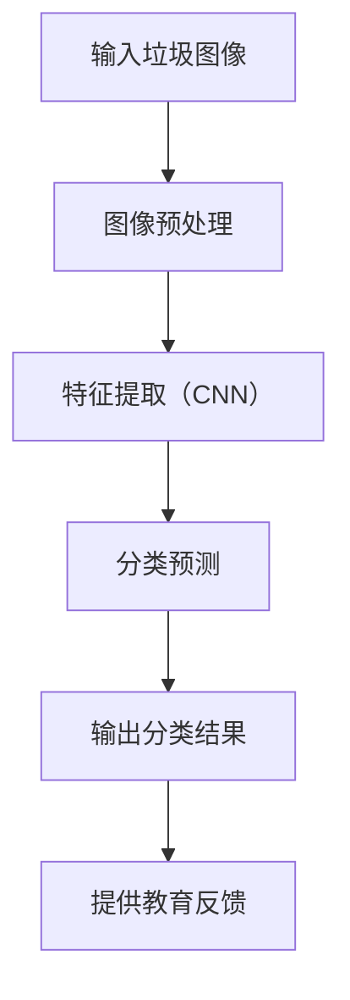
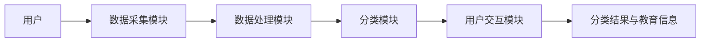

                 


# 智能垃圾分类系统：AI Agent的环保教育助手

---

## 关键词  
智能垃圾分类系统, AI Agent, 环保教育, 机器学习, 图像识别, 系统架构设计

---

## 摘要  
随着城市化进程的加快，垃圾分类问题日益凸显。传统的人工分类方式效率低下、成本高昂，且容易出错。为了解决这一问题，我们提出了一种基于AI Agent的智能垃圾分类系统，结合机器学习和图像识别技术，实现对垃圾的自动分类与教育功能。本文详细阐述了系统的背景、核心概念、算法原理、系统架构设计、项目实战及优化建议，为环保教育和垃圾分类的智能化提供了新的思路。

---

## 目录大纲

### 第一部分：智能垃圾分类系统背景与概念

#### 第1章：问题背景与目标

##### 1.1 问题背景
- 1.1.1 垃圾分类的重要性  
  垃圾分类是环境保护的重要环节，能够减少资源浪费、降低环境污染、促进可持续发展。然而，随着城市化进程的加快，垃圾种类和数量急剧增加，传统的分类方式效率低下，难以应对日益增长的垃圾处理需求。  
- 1.1.2 当前垃圾分类的痛点  
  - 人工分类效率低、成本高。  
  - 用户对垃圾分类知识的缺乏导致分类错误率高。  
  - 缺乏智能化手段，难以实现精准分类。  
- 1.1.3 智能化垃圾分类的必要性  
  AI技术的快速发展为垃圾分类提供了新的解决方案，通过图像识别和机器学习，可以实现快速、准确的分类。

##### 1.2 问题描述
- 1.2.1 垃圾分类的复杂性  
  不同类型的垃圾（如可回收物、厨余垃圾、有害垃圾等）需要分别处理，分类规则复杂多样。  
- 1.2.2 用户教育的缺失  
  很多用户缺乏垃圾分类的知识，导致分类错误率高。  
- 1.2.3 现有技术的局限性  
  传统的人工分类方式效率低，而现有的智能化设备在准确性和用户体验上仍有不足。

##### 1.3 系统目标
- 1.3.1 提供智能化的垃圾分类助手  
  通过AI技术实现垃圾的自动分类，提高分类效率和准确率。  
- 1.3.2 实现AI Agent的教育功能  
  在分类过程中，向用户普及垃圾分类知识，提升用户的环保意识。  
- 1.3.3 推动环保教育普及  
  通过系统的推广，推动垃圾分类教育的普及，助力环保事业。

##### 1.4 系统边界与外延
- 1.4.1 系统功能边界  
  本系统仅关注垃圾的分类和教育功能，不涉及垃圾的后续处理。  
- 1.4.2 与外部系统的交互  
  系统可以通过接口与其他垃圾处理系统（如智能垃圾桶、垃圾运输系统等）进行数据交互。  
- 1.4.3 系统的可扩展性  
  系统设计充分考虑了扩展性，未来可以接入更多垃圾类型和分类规则。

##### 1.5 概念结构与核心要素
- 1.5.1 核心概念：AI Agent、垃圾分类、环保教育  
  - AI Agent：基于机器学习的智能分类器，负责对垃圾图像进行识别和分类。  
  - 垃圾分类：通过图像识别技术实现垃圾的自动分类。  
  - 环保教育：在分类过程中，向用户传递垃圾分类知识，提升环保意识。  
- 1.5.2 关键要素：数据采集、模型训练、用户交互  
  - 数据采集：通过摄像头采集垃圾图像，提取特征数据。  
  - 模型训练：基于深度学习算法训练垃圾分类模型，优化分类准确率。  
  - 用户交互：通过图形界面与用户互动，提供实时反馈和教育信息。  
- 1.5.3 系统架构：模块化设计、数据流分析  
  系统采用模块化设计，数据流从用户输入（垃圾图像）到分类结果输出，贯穿整个系统。

---

### 第二部分：核心概念与联系

#### 第2章：AI Agent与智能垃圾分类系统

##### 2.1 AI Agent的基本原理
- 2.1.1 AI Agent的定义  
  AI Agent是一种智能代理，能够感知环境、执行任务并做出决策。在智能垃圾分类系统中，AI Agent负责接收垃圾图像输入，通过图像识别技术进行分类，并向用户反馈结果。  
- 2.1.2 AI Agent的核心功能  
  - 数据采集：通过摄像头或传感器获取垃圾图像。  
  - 数据处理：对图像进行预处理（如去噪、边缘检测）和特征提取。  
  - 分类决策：基于训练好的模型，对垃圾进行分类，并输出结果。  
  - 用户反馈：通过界面或语音提示向用户反馈分类结果和相关知识。  
- 2.1.3 AI Agent与智能垃圾分类系统的联系  
  AI Agent是智能垃圾分类系统的核心模块，负责实现系统的智能化功能。

##### 2.2 核心概念对比与ER图

###### 2.2.1 核心概念对比  
| 特征                | AI Agent             | 垃圾分类系统         | 环保教育功能       |
|---------------------|----------------------|----------------------|-------------------|
| 核心功能            | 图像识别与分类        | 实现垃圾分类          | 传递环保知识       |
| 输入                | 垃圾图像              | 用户输入与系统反馈    | 用户交互与教育内容 |
| 输出                | 分类结果与反馈        | 分类结果与教育信息     | 用户环保意识提升   |
| 依赖                | 图像识别算法          | 系统架构与接口       | 用户界面与反馈机制 |

###### 2.2.2 ER实体关系图  
```mermaid
er
actor: 用户
system: 智能垃圾分类系统
artifact: 垃圾分类模型

actor --> system: 提交垃圾图像
system --> artifact: 调用分类模型
artifact --> system: 返回分类结果
system --> actor: 提供反馈与教育信息
```

---

### 第三部分：算法原理

#### 第3章：基于深度学习的垃圾分类算法

##### 3.1 算法原理概述
- 3.1.1 使用卷积神经网络（CNN）进行图像分类  
  CNN通过卷积层、池化层和全连接层提取图像特征，实现垃圾类型的分类。  
- 3.1.2 使用循环神经网络（RNN）进行序列分类（可选）  
  RNN可以用于处理序列数据，如垃圾名称的识别。

##### 3.2 算法流程图


##### 3.3 损失函数与优化器
- 损失函数：交叉熵损失  
  $$ \text{Loss} = -\sum_{i} y_i \log(p_i) + (1 - y_i) \log(1 - p_i) $$
- 优化器：Adam优化器  
  $$ \theta_{t+1} = \theta_t - \eta \frac{\rho_1}{1 - \beta_1^t} \frac{\rho_2}{1 - \beta_2^t} \nabla J $$

##### 3.4 代码实现
```python
import tensorflow as tf
from tensorflow.keras import layers

# 定义模型
model = tf.keras.Sequential([
    layers.Conv2D(32, (3, 3), activation='relu', input_shape=(64, 64, 3)),
    layers.MaxPooling2D((2, 2)),
    layers.Conv2D(64, (3, 3), activation='relu'),
    layers.MaxPooling2D((2, 2)),
    layers.Flatten(),
    layers.Dense(128, activation='relu'),
    layers.Dense(num_classes, activation='softmax')
])

# 编译模型
model.compile(optimizer='adam', loss='categorical_crossentropy', metrics=['accuracy'])
```

---

### 第四部分：系统分析与架构设计

#### 第4章：系统分析

##### 4.1 问题场景介绍
- 用户通过智能垃圾桶或手机应用提交垃圾图像，系统返回分类结果和相关知识。

##### 4.2 系统功能设计
- 数据采集模块：通过摄像头或传感器采集垃圾图像。  
- 数据处理模块：对图像进行预处理和特征提取。  
- 分类模块：基于CNN模型实现垃圾分类。  
- 用户交互模块：通过图形界面或语音反馈分类结果和教育信息。

##### 4.3 系统架构设计


##### 4.4 系统接口设计
- 输入接口：垃圾图像输入  
- 输出接口：分类结果和教育信息  
- 数据接口：与数据库交互，存储用户数据和分类记录。

##### 4.5 系统交互流程
```mermaid
sequenceDiagram
    actor 用户
    system 智能垃圾分类系统

    用户 ->> 智能垃圾分类系统: 提交垃圾图像
    智能垃圾分类系统 ->> 数据采集模块: 获取垃圾图像
    数据采集模块 ->> 数据处理模块: 提交预处理请求
    数据处理模块 ->> 分类模块: 提交特征提取请求
    分类模块 ->> 数据处理模块: 返回分类结果
    数据处理模块 ->> 用户交互模块: 提交反馈请求
    用户交互模块 ->> 用户: 提供分类结果和教育信息
```

---

### 第五部分：项目实战

#### 第5章：项目实战

##### 5.1 环境搭建
- 安装Python、TensorFlow、Keras等依赖库。

##### 5.2 系统核心实现
- 数据采集：使用OpenCV库读取图像数据。  
- 数据处理：对图像进行归一化处理。  
- 模型训练：基于CNN实现垃圾分类模型。  
- 用户交互：开发图形界面或移动应用。

##### 5.3 代码实现与分析
```python
import cv2
import numpy as np
from tensorflow.keras.models import load_model

# 加载预训练模型
model = load_model('garbage_classifier.h5')

# 读取图像
image = cv2.imread('garbage.jpg')
image = cv2.resize(image, (64, 64))
image = image / 255.0  # 归一化

# 预测分类
prediction = model.predict(np.array([image]))
predicted_class = np.argmax(prediction[0])

# 提供教育反馈
print(f'分类结果：{predicted_class}，请将垃圾放入对应的收集箱。')
```

##### 5.4 实际案例分析
- 案例1：可回收物分类  
  用户提交一张废纸图片，系统识别为“可回收物”，并提示用户放入蓝色垃圾桶。  
- 案例2：厨余垃圾分类  
  用户提交一张苹果核图片，系统识别为“厨余垃圾”，并提供相关环保知识。

---

### 第六部分：总结与优化

#### 第6章：总结与优化建议

##### 6.1 系统总结
- 本系统通过AI Agent实现了垃圾的智能化分类，结合环保教育功能，提升了用户的环保意识。  
- 系统架构设计合理，具有良好的扩展性和可维护性。

##### 6.2 优化建议
- 提高模型的分类准确率：增加训练数据量，优化模型结构。  
- 提升用户体验：开发移动应用，增加语音反馈功能。  
- 扩展功能：接入更多垃圾类型和分类规则。

##### 6.3 最佳实践 tips
- 数据质量是分类准确率的关键，确保数据的多样性和代表性。  
- 在实际应用中，建议结合硬件设备（如智能垃圾桶）提升系统的实用性。  
- 定期更新模型，适应新的垃圾类型和分类规则。

##### 6.4 小结
智能垃圾分类系统的实现不仅解决了垃圾分类的效率问题，还推动了环保教育的普及。未来，随着AI技术的不断发展，垃圾分类系统将更加智能化和便捷化。

---

## 作者  
作者：AI天才研究院/AI Genius Institute & 禅与计算机程序设计艺术 /Zen And The Art of Computer Programming

