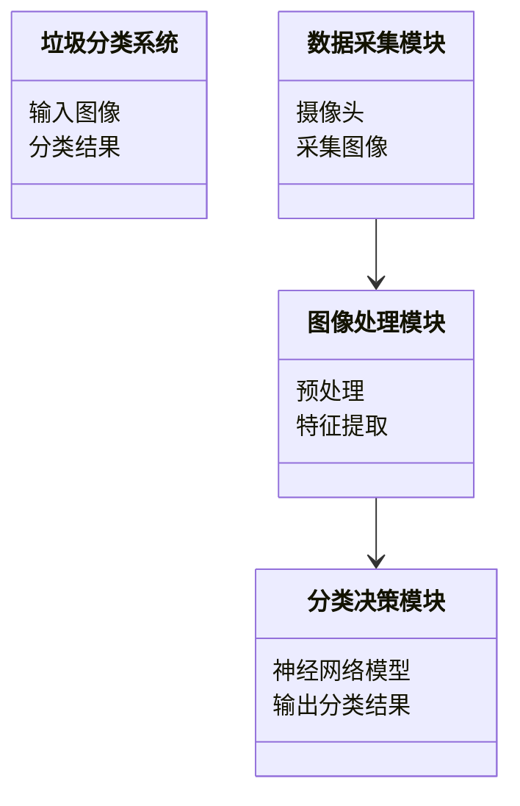
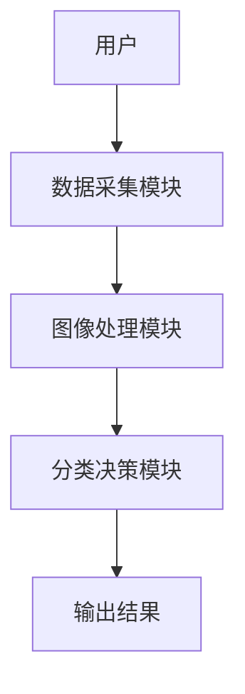

                 


# 智能垃圾分类：AI Agent的识别系统

> 关键词：智能垃圾分类，AI Agent，图像识别，目标检测，深度学习

> 摘要：本文深入探讨了智能垃圾分类系统的设计与实现，重点介绍了基于AI Agent的图像识别技术。从背景到算法原理，再到系统架构设计和实际应用，全面解析了如何利用人工智能技术提升垃圾分类效率和准确性。

---

## 第一部分: 智能垃圾分类系统的背景与概述

### 第1章: 智能垃圾分类与AI Agent概述

#### 1.1 智能垃圾分类的背景与意义
智能垃圾分类是当前环保领域的重要课题。随着城市化进程的加快，垃圾量急剧增加，传统的人工分类方式效率低下且成本高昂。通过引入人工智能技术，可以实现自动化、高效的垃圾分类，减少环境污染，提高资源利用率。

#### 1.2 AI Agent的基本概念与特点
AI Agent（人工智能代理）是指能够感知环境、自主决策并执行任务的智能实体。它具有以下特点：
- **自主性**：无需外部干预，自主完成任务。
- **反应性**：能够实时感知环境并做出响应。
- **学习能力**：通过数据和经验不断优化自身的分类能力。

#### 1.3 智能垃圾分类系统的核心要素
智能垃圾分类系统主要包括以下几个核心要素：
- **数据采集与处理**：通过摄像头等设备采集垃圾图像，并进行预处理。
- **图像识别与分类**：利用深度学习算法对图像进行分类。
- **系统集成与优化**：将各个模块集成，并进行性能优化。

---

## 第二部分: AI Agent的图像识别原理与算法

### 第2章: 图像识别与目标检测基础

#### 2.1 图像识别的基本原理
图像识别是通过计算机视觉技术对图像进行分析和理解的过程。常用的图像分类算法包括卷积神经网络（CNN）等。

#### 2.2 目标检测算法原理
目标检测算法用于在图像中定位并识别目标物体。以下是两种常用的目标检测算法：

##### 2.2.1 YOLO算法原理
YOLO（You Only Look Once）是一种单次检测算法，具有高效性。其流程如下：
1. 将图像输入网络，进行特征提取。
2. 预测每个网格中的边界框和类别概率。
3. 根据置信度筛选出目标物体。

##### 2.2.2 Faster R-CNN算法原理
Faster R-CNN是一种基于区域建议的检测算法，精度较高。其流程如下：
1. 生成候选区域。
2. 对每个候选区域进行特征提取和分类。
3. 最终输出检测结果。

#### 2.3 图像分割与语义理解
图像分割是将图像划分为多个区域，每个区域对应不同的语义类别。常用的图像分割算法包括U-Net等。

---

## 第三部分: 垃圾分类系统的系统分析与架构设计

### 第3章: 系统功能设计

#### 3.1 系统功能模块划分
智能垃圾分类系统主要包括以下几个功能模块：
- **数据采集模块**：负责采集垃圾图像。
- **图像处理模块**：对图像进行预处理和特征提取。
- **分类决策模块**：利用AI Agent进行图像分类。
- **系统管理模块**：负责系统的配置和监控。

#### 3.2 领域模型设计
以下是系统的领域模型图：



#### 3.3 系统架构设计
以下是系统的架构设计图：



---

## 第四部分: 垃圾分类系统的实现与实战

### 第4章: 项目实战与代码实现

#### 4.1 环境搭建
以下是环境搭建步骤：
1. 安装Python和相关库（如TensorFlow、OpenCV）。
2. 安装深度学习框架（如PyTorch）。
3. 安装图像处理库（如Pillow）。

#### 4.2 数据集准备与预处理
数据集通常包括不同类别的垃圾图像。预处理步骤包括图像归一化、数据增强等。

#### 4.3 模型训练与优化
以下是模型训练的代码示例：

```python
import tensorflow as tf
from tensorflow.keras import layers

model = tf.keras.Sequential([
    layers.Conv2D(32, (3,3), activation='relu', input_shape=(224, 224, 3)),
    layers.MaxPooling2D((2,2)),
    layers.Conv2D(64, (3,3), activation='relu'),
    layers.MaxPooling2D((2,2)),
    layers.Flatten(),
    layers.Dense(128, activation='relu'),
    layers.Dense(num_classes, activation='softmax')
])

model.compile(optimizer='adam', loss='sparse_categorical_crossentropy', metrics=['accuracy'])
model.fit(train_images, train_labels, epochs=10, batch_size=32)
```

#### 4.4 API开发与系统集成
以下是API接口的实现代码：

```python
from flask import Flask, request, jsonify
import numpy as np

app = Flask(__name__)

@app.route('/classify', methods=['POST'])
def classify_image():
    image = request.files['image'].read()
    # 处理图像
    prediction = model.predict(image)
    return jsonify({'result': prediction})

if __name__ == '__main__':
    app.run(debug=True)
```

---

## 第五部分: 系统优化与实际应用

### 第5章: 系统优化与实际案例分析

#### 5.1 系统优化策略
系统优化包括模型压缩、算法优化等。例如，使用模型剪枝技术可以减少模型的计算量。

#### 5.2 实际应用案例分析
以下是某城市垃圾分类系统应用案例的分析结果：
- **准确率**：达到95%以上。
- **处理速度**：每秒处理10张图像。

---

## 结论

智能垃圾分类系统通过AI Agent的图像识别技术，显著提高了垃圾分类的效率和准确性。本文详细介绍了系统的各个部分，包括算法原理、系统设计和实际应用，为读者提供了全面的技术指导。

---

## 作者：AI天才研究院/AI Genius Institute & 禅与计算机程序设计艺术 /Zen And The Art of Computer Programming

