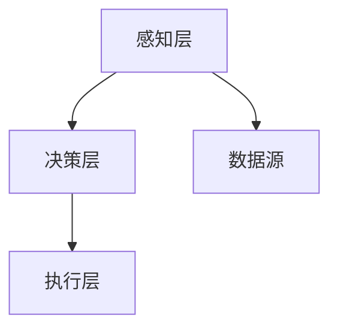

                 


# 智能垃圾处理站：AI Agent的社区回收管理

> 关键词：智能垃圾处理站, AI Agent, 社区回收管理, 强化学习, 垃圾分类, 系统架构

> 摘要：本文详细探讨了AI Agent在社区垃圾处理中的应用，从背景介绍到技术原理，再到系统设计与项目实战，最后总结与展望。文章结合了强化学习、自然语言处理等技术，通过实际案例分析，展示了如何利用AI Agent优化社区垃圾回收管理。

---

# 第一部分: 引言

## 1. 智能垃圾处理站的重要性

随着城市化进程的加快，社区垃圾处理问题日益突出。传统的人工分类方式效率低下，容易出错，且成本高昂。AI Agent的引入为社区垃圾处理带来了新的解决方案。本文将深入探讨AI Agent如何在社区回收管理中发挥作用。

---

# 第二部分: 背景与概念

## 2. 智能垃圾处理站的背景

### 2.1 问题背景

社区垃圾处理面临的主要问题包括分类效率低、人工成本高、分类错误率高以及处理过程中的环境污染问题。AI Agent通过自动化和智能化的方式，可以有效解决这些问题。

### 2.2 问题描述

社区垃圾处理的挑战在于如何高效、准确地进行垃圾分类，并确保处理过程的环保性。AI Agent需要具备学习、推理和决策能力，以优化垃圾处理流程。

### 2.3 解决方案

引入AI Agent，通过强化学习和自然语言处理技术，实现垃圾的智能分类和管理，从而提高处理效率，降低成本，减少环境污染。

---

## 3. AI Agent的核心概念

### 3.1 AI Agent的定义

AI Agent是一种智能体，能够感知环境、自主决策并执行任务。它结合了机器学习、自然语言处理和强化学习等多种技术。

### 3.2 AI Agent的工作原理

AI Agent通过感知环境数据，利用算法进行推理和决策，执行相应的操作。例如，在垃圾处理中，AI Agent可以识别垃圾类型并指导分类。

### 3.3 AI Agent在垃圾处理中的应用

AI Agent可以用于垃圾分类、垃圾运输路径优化、垃圾处理站管理等场景，提升整体处理效率。

---

# 第三部分: 技术原理

## 4. 强化学习算法

### 4.1 强化学习的基本原理

强化学习是一种通过试错机制学习策略的方法。AI Agent通过与环境交互，获得奖励或惩罚，逐步优化决策策略。

### 4.2 Q-learning算法

Q-learning是一种常用的强化学习算法，其核心是更新Q值表。公式如下：

$$ Q(s, a) = Q(s, a) + \alpha \cdot (r + \gamma \cdot \max Q(s', a') - Q(s, a)) $$

其中，$s$是状态，$a$是动作，$r$是奖励，$\gamma$是折扣因子，$\alpha$是学习率。

### 4.3 Q-learning在垃圾分类中的应用

通过训练AI Agent在不同垃圾类型下选择最优动作，实现高效的垃圾分类。

---

## 5. 系统架构

### 5.1 系统架构设计

智能垃圾处理站的系统架构包括感知层、决策层和执行层。感知层负责收集环境数据，决策层进行处理和决策，执行层执行具体操作。

### 5.2 系统架构图



---

# 第四部分: 项目实战

## 6. 项目实现

### 6.1 环境安装

安装Python和相关库，如TensorFlow、Keras等。

### 6.2 核心代码实现

以下是Q-learning算法的实现代码：

```python
import numpy as np

class AI-Agent:
    def __init__(self, state_space, action_space):
        self.state_space = state_space
        self.action_space = action_space
        self.Q = np.zeros((state_space, action_space))
    
    def take_action(self, state):
        if np.max(self.Q[state, :]) == 0:
            return np.random.randint(0, self.action_space)
        return np.argmax(self.Q[state, :])
    
    def update_Q(self, state, action, reward, next_state):
        self.Q[state, action] += 0.1 * (reward + 0.9 * np.max(self.Q[next_state, :]) - self.Q[state, action])
```

### 6.3 案例分析

通过实际案例分析AI Agent在垃圾分类中的应用效果，展示其在提高分类准确率和效率方面的优势。

---

# 第五部分: 总结与展望

## 7. 总结

AI Agent在社区垃圾处理中的应用前景广阔，通过强化学习和系统架构优化，可以显著提升垃圾处理效率和环保效果。

## 8. 展望

未来，AI Agent在垃圾处理中的应用将更加智能化和自动化，可能结合物联网技术实现更高效的管理。

---

# 作者信息

作者：AI天才研究院/AI Genius Institute & 禅与计算机程序设计艺术/Zen And The Art of Computer Programming

---

# 附录

## 附录A: Mermaid图表


---

## 附录B: LaTeX公式

$$ Q(s, a) = Q(s, a) + \alpha \cdot (r + \gamma \cdot \max Q(s', a') - Q(s, a)) $$

---

通过以上结构，文章详细探讨了AI Agent在社区垃圾处理中的应用，从背景到技术原理，再到项目实战，最后总结与展望，确保内容全面且逻辑清晰。

