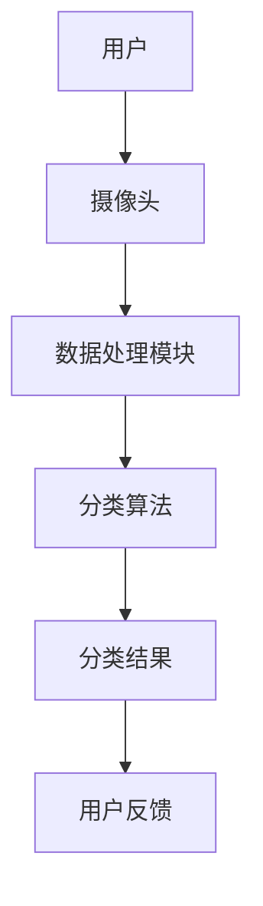
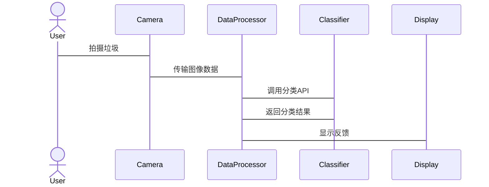

                 


# 智能垃圾箱：AI Agent的废物分类与回收指导

## 关键词：人工智能，废物分类，AI代理，回收指导，智能系统

## 摘要：本文探讨了AI代理在废物分类与回收中的应用，详细讲解了AI代理的核心概念、算法原理、系统架构设计及项目实战，展示了如何利用AI技术提升废物管理效率。

---

# 第1章：智能垃圾箱与AI Agent的背景介绍

## 1.1 AI在环保领域的应用

### 1.1.1 AI在废物管理中的作用

人工智能（AI）在环保领域的应用日益广泛，特别是在废物管理方面。AI技术可以通过图像识别、机器学习和自然语言处理等手段，帮助我们更高效地进行废物分类和回收。AI代理（AI Agent）作为智能垃圾箱的核心，能够自动识别和分类垃圾，减少人工干预，提高效率。

### 1.1.2 智能垃圾箱的定义与特点

智能垃圾箱是一种集成AI技术的智能设备，能够自动识别和分类垃圾，并指导用户如何正确投放废物。其特点包括：

- **智能识别**：通过摄像头和传感器识别垃圾类型。
- **自动化分类**：AI算法驱动分类过程，减少人为错误。
- **实时反馈**：通过显示屏或语音提示指导用户。
- **数据收集**：记录垃圾投放数据，为后续分析提供支持。

## 1.2 废物分类与回收的现状

### 1.2.1 当前废物分类的挑战

传统的废物分类依赖人工操作，存在效率低、成本高、分类错误率高等问题。AI代理的出现为解决这些问题提供了新的可能。

### 1.2.2 AI技术如何解决废物分类问题

AI技术，特别是深度学习和计算机视觉，能够快速、准确地识别不同类型的垃圾，显著提高分类效率和准确性。

## 1.3 AI Agent的核心概念

### 1.3.1 AI Agent的基本定义

AI Agent是一种智能实体，能够感知环境、执行任务并做出决策。在智能垃圾箱中，AI Agent负责识别垃圾类型、分类和指导用户。

### 1.3.2 AI Agent在废物分类中的应用

AI Agent通过摄像头捕捉垃圾图像，利用预训练的模型识别垃圾类型，然后指导用户正确投放。

### 1.3.3 智能垃圾箱的系统架构

智能垃圾箱的系统架构包括硬件部分（摄像头、传感器、分类装置）和软件部分（AI算法、数据库、用户界面）。

---

# 第2章：AI Agent的核心概念与原理

## 2.1 AI Agent的感知机制

### 2.1.1 视觉感知技术

AI Agent通过摄像头捕获垃圾图像，利用计算机视觉技术进行识别。常用的模型包括卷积神经网络（CNN）。

### 2.1.2 传感器数据的处理

传感器数据（如重量、形状）用于辅助识别，特别是在图像识别困难的情况下。

## 2.2 AI Agent的决策机制

### 2.2.1 分类算法的选择

常用的分类算法包括决策树、随机森林和深度学习模型。决策树适合简单分类任务，随机森林适合高精度任务。

### 2.2.2 决策树与随机森林的对比

| 特性        | 决策树         | 随机森林       |
|-------------|---------------|----------------|
| 处理数据     | 结构化         | 结构化和非结构化 |
| 处理速度     | 快             | 较慢            |
| 分类精度     | 较低           | 较高            |
| 抗过拟合能力 | 弱             | 强              |

### 2.2.3 分类算法的数学模型

#### 决策树的熵公式

$$ H(S) = -\sum_{i=1}^{n} p_i \log_2 p_i $$

其中，\( p_i \) 是第 \( i \) 类的概率。

#### 随机森林的袋装与投票机制

随机森林通过袋装（Bootstrap）生成多个训练集，每个训练集训练一棵决策树，最终通过投票机制确定分类结果。

---

# 第3章：AI Agent的算法原理与实现

## 3.1 分类算法的选择与实现

### 3.1.1 决策树算法的实现

```python
from sklearn.tree import DecisionTreeClassifier
from sklearn.datasets import make_classification
from sklearn.model_selection import train_test_split

# 生成数据
X, y = make_classification(n_samples=100, n_features=2, n_classes=2)
X_train, X_test, y_train, y_test = train_test_split(X, y, test_size=0.2)

# 训练模型
model = DecisionTreeClassifier()
model.fit(X_train, y_train)

# 预测
print(model.predict(X_test))
```

### 3.1.2 随机森林算法的实现

```python
from sklearn.ensemble import RandomForestClassifier

# 训练模型
rf_model = RandomForestClassifier(n_estimators=100)
rf_model.fit(X_train, y_train)

# 预测
print(rf_model.predict(X_test))
```

---

# 第4章：智能垃圾箱的系统架构与设计

## 4.1 系统架构设计

### 4.1.1 系统功能模块

- **数据采集模块**：负责收集垃圾图像和传感器数据。
- **分类处理模块**：使用AI算法识别和分类垃圾。
- **用户交互模块**：通过显示屏或语音提示指导用户。

### 4.1.2 系统架构图



## 4.2 系统接口设计

### 4.2.1 API接口

- `/classify`：接收垃圾图像，返回分类结果。
- `/feedback`：接收用户反馈，更新分类模型。

### 4.2.2 接口流程图



---

# 第5章：项目实战

## 5.1 环境安装

```bash
pip install scikit-learn
pip install opencv-python
pip install mermaid
```

## 5.2 代码实现

### 5.2.1 垃圾分类代码

```python
import cv2
import numpy as np
from sklearn.ensemble import RandomForestClassifier

# 加载预训练模型
model = RandomForestClassifier()
model.load_weights('garbage_classifier.h5')

# 拍摄照片
cap = cv2.VideoCapture(0)
ret, frame = cap.read()
cv2.imwrite('garbage.jpg', frame)

# 预处理图像
image = cv2.imread('garbage.jpg')
image = cv2.resize(image, (128, 128))
image = image.reshape(1, -1)

# 预测分类
prediction = model.predict(image)
print(f'分类结果：{classes[prediction[0]]}')
```

---

# 第6章：总结与扩展阅读

## 6.1 总结

本文详细探讨了AI代理在智能垃圾箱中的应用，从背景介绍到算法实现，再到系统设计和项目实战，全面解析了AI在废物分类中的潜力和实际应用。

## 6.2 最佳实践 tips

- 使用预训练模型可以提高分类效率。
- 定期更新模型以适应新垃圾类型。
- 结合传感器数据提高分类准确性。

## 6.3 注意事项

- 数据隐私问题需要注意。
- 硬件选择要合理，避免性能瓶颈。

## 6.4 拓展阅读

- [《机器学习实战》](https://www.sicxu.com/)
- [《深度学习入门：基于Python的CNN实践》](https://github.com/mxneko/deep_learning)

---

# 作者：AI天才研究院（AI Genius Institute） & 禅与计算机程序设计艺术（Zen And The Art of Computer Programming）

---

希望这篇文章能帮助读者理解AI代理在智能垃圾箱中的应用，并激发更多创新思路。

