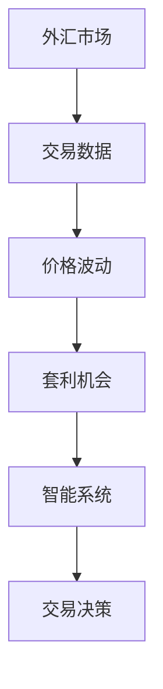
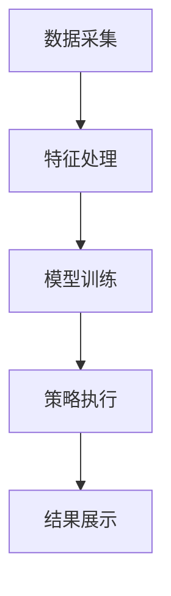

                 


# 智能外汇套利机会识别系统

**关键词**：智能外汇套利、机器学习、算法交易、金融大数据、风险管理

**摘要**：本文详细介绍了智能外汇套利机会识别系统的构建与实现，结合金融市场的实际情况，从理论到实践，系统性地阐述了如何利用人工智能和大数据技术来识别和捕捉外汇市场中的套利机会。文章首先分析了外汇市场的基本概念和套利机会的类型，然后深入探讨了智能套利系统的原理、算法实现和系统架构，最后通过实际案例展示了系统的开发过程和应用效果。本文旨在为金融从业者和研究人员提供一种高效、可靠的套利机会识别方法，帮助他们在复杂多变的外汇市场中捕捉潜在的获利机会。

---

## 目录

1. **背景介绍**  
   1.1 外汇市场的基本概念  
   1.2 套利机会的定义与类型  
   1.3 智能套利系统的核心概念  
   1.4 系统的核心要素组成  

2. **智能套利系统的背景与应用**  
   2.1 外汇市场中的套利机会分析  
   2.2 智能套利系统的技术背景  
   2.3 智能套利系统的应用场景  

3. **智能套利系统的核心概念与联系**  
   3.1 核心概念原理  
   3.2 核心概念属性特征对比  
   3.3 ER实体关系图架构  

4. **智能套利系统的算法原理**  
   4.1 时间序列分析的原理与实现  
   4.2 机器学习算法在套利识别中的应用  
   4.3 统计套利策略的数学模型  

5. **智能套利系统的系统架构设计**  
   5.1 系统功能设计  
   5.2 系统架构设计  
   5.3 系统接口设计  

6. **智能套利系统的项目实战**  
   6.1 开发环境安装与配置  
   6.2 系统核心实现源代码  
   6.3 实际案例分析与解读  

7. **总结与展望**  
   7.1 全文总结  
   7.2 未来研究方向  
   7.3 注意事项与最佳实践  

---

## 正文

### 第一部分：背景介绍

#### 1.1 外汇市场的基本概念

- **1.1.1 外汇市场的定义与特点**  
  外汇市场是全球最大的金融市场，参与者包括银行、企业和个人。其特点包括24小时交易、高流动性、价格波动频繁等。

- **1.1.2 外汇交易的主要参与者**  
  包括中央银行、商业银行、企业和个人投资者。每个参与者在市场中扮演不同的角色，影响市场波动。

- **1.1.3 外汇市场的运作机制**  
  包括汇率形成、订单驱动、价格发现等机制，确保市场的高效运行。

#### 1.2 套利机会的定义与类型

- **1.2.1 套利的定义**  
  套利是指利用不同市场或资产之间的价格差异，通过同时买入低价资产和卖出高价资产，从中获利的行为。

- **1.2.2 常见的套利类型**  
  - 跨市套利：利用不同市场间的价差进行交易。  
  - 跨期套利：利用同一资产在不同时间点的价格差异进行交易。  
  - 股权套利：利用股票和相关衍生品的价格差异进行交易。  

- **1.2.3 套利机会的来源**  
  市场不完全、信息不对称、价格波动等，都是套利机会的来源。

#### 1.3 智能套利系统的核心概念

- **1.3.1 智能套利的定义**  
  智能套利是指利用人工智能和大数据技术，自动识别和捕捉套利机会的系统。

- **1.3.2 智能套利与传统套利的区别**  
  - 数据来源：传统套利依赖人工分析，智能套利利用大数据技术。  
  - 分析方法：传统套利依赖经验，智能套利依赖算法模型。  
  - 执行效率：传统套利效率低，智能套利高效自动化。  

- **1.3.3 系统的核心要素组成**  
  - 数据采集与处理：获取实时市场数据，清洗和预处理。  
  - 特征工程：提取有用的特征，为模型提供输入。  
  - 模型训练：训练机器学习模型，识别套利机会。  
  - 策略执行：根据模型预测结果，执行套利交易。  

### 第二部分：智能套利系统的背景与应用

#### 2.1 外汇市场中的套利机会分析

- **2.1.1 套利机会的形成条件**  
  市场价差的存在，通常是由于市场不完全或信息不对称导致的价格差异。

- **2.1.2 套利机会的特征分析**  
  高流动性、低交易成本、套利空间等是套利机会的重要特征。

- **2.1.3 套利机会的量化模型**  
  使用数学模型量化套利机会的大小和风险，帮助交易者做出决策。

#### 2.2 智能套利系统的技术背景

- **2.2.1 人工智能在金融领域的应用**  
  AI技术在金融领域的应用包括预测、风险评估、交易策略优化等。

- **2.2.2 大数据技术在外汇市场的应用**  
  大数据技术帮助交易者获取更多的市场信息，提高交易决策的准确性。

- **2.2.3 机器学习在套利机会识别中的作用**  
  机器学习算法能够识别市场中的模式和趋势，帮助发现套利机会。

#### 2.3 智能套利系统的应用场景

- **2.3.1 系统在外汇交易中的应用**  
  自动识别市场中的套利机会，优化交易策略。

- **2.3.2 系统在风险管理中的应用**  
  监控市场风险，及时发现并规避潜在的套利风险。

- **2.3.3 系统在投资决策中的应用**  
  基于智能套利系统的分析结果，优化投资组合，提高收益。

### 第三部分：智能套利系统的核心概念与联系

#### 3.1 核心概念原理

- **3.1.1 数据驱动的套利机会识别**  
  基于大数据分析，发现市场中的套利机会。

- **3.1.2 算法驱动的套利机会预测**  
  使用机器学习算法预测市场中的套利机会。

- **3.1.3 系统驱动的套利机会执行**  
  通过系统自动执行交易，抓住套利机会。

#### 3.2 核心概念属性特征对比

| 概念 | 数据特征 | 算法特征 | 系统特征 |
|------|----------|----------|----------|
| 数据驱动 | 实时性、多样性 | 数据预处理、特征提取 | 数据采集、清洗 |
| 算法驱动 | 高准确性、低延迟 | 模型训练、优化 | 模型部署、监控 |
| 系统驱动 | 高效性、稳定性 | 系统架构、接口设计 | 系统集成、测试 |

#### 3.3 ER实体关系图架构



### 第四部分：智能套利系统的算法原理

#### 4.1 时间序列分析的原理与实现

- **时间序列分析的原理**  
  时间序列分析是一种统计方法，用于分析随时间变化的数据，发现数据中的模式和趋势。

- **实现步骤**  
  1. 数据预处理：清洗和标准化数据。  
  2. 模型选择：选择合适的时间序列模型（如ARIMA）。  
  3. 模型训练：基于历史数据训练模型。  
  4. 预测与评估：使用模型预测未来的价格波动，并评估模型的准确性。  

#### 4.2 机器学习算法在套利识别中的应用

- **机器学习算法的选择**  
  常见的算法包括随机森林、支持向量机、神经网络等。

- **实现步骤**  
  1. 数据特征提取：从交易数据中提取有用的特征。  
  2. 数据分割：将数据分为训练集和测试集。  
  3. 模型训练：使用训练数据训练机器学习模型。  
  4. 模型评估：使用测试数据评估模型的性能。  

#### 4.3 统计套利策略的数学模型

- **统计套利策略的数学模型**  
  常见的模型包括均值回归模型、波动率模型等。

- **均值回归模型**  
  假设价格会回归其均值，套利者可以在价格偏离均值时进行交易。

- **波动率模型**  
  基于价格波动的预测，识别套利机会。

### 第五部分：智能套利系统的系统架构设计

#### 5.1 系统功能设计

- **功能模块划分**  
  包括数据采集、特征处理、模型训练、策略执行和结果展示。

- **功能模块描述**  
  - 数据采集模块：实时采集外汇市场数据。  
  - 特征处理模块：对数据进行清洗和特征提取。  
  - 模型训练模块：训练机器学习模型，识别套利机会。  
  - 策略执行模块：根据模型预测结果，执行交易策略。  
  - 结果展示模块：展示交易结果和模型性能。  

#### 5.2 系统架构设计



#### 5.3 系统接口设计

- **接口设计**  
  包括数据接口、模型接口和交易接口。

- **接口描述**  
  - 数据接口：与数据源对接，获取实时数据。  
  - 模型接口：与机器学习模型对接，获取预测结果。  
  - 交易接口：与交易系统对接，执行交易策略。  

### 第六部分：智能套利系统的项目实战

#### 6.1 开发环境安装与配置

- **开发环境**  
  建议使用Python编程语言，安装必要的库（如Pandas、Scikit-learn、TensorFlow）。

- **配置步骤**  
  1. 安装Python和必要的库。  
  2. 配置开发环境（如Jupyter Notebook）。  
  3. 获取外汇市场数据（如通过API接口）。  

#### 6.2 系统核心实现源代码

- **代码示例**  

```python
import pandas as pd
from sklearn.ensemble import RandomForestClassifier
from sklearn.metrics import accuracy_score

# 数据预处理
data = pd.read_csv('market_data.csv')
X = data.drop('target', axis=1)
y = data['target']

# 模型训练
model = RandomForestClassifier()
model.fit(X, y)

# 模型预测
y_pred = model.predict(X)

# 模型评估
print("Accuracy:", accuracy_score(y, y_pred))
```

- **代码解读**  
  该代码展示了如何使用随机森林算法进行套利机会预测。首先读取数据，进行特征选择，然后训练模型，最后评估模型的准确性。

#### 6.3 实际案例分析与解读

- **案例分析**  
  以某次外汇市场中的套利机会为例，展示系统如何识别并执行交易。

- **案例解读**  
  系统通过分析市场数据，识别出某货币对的套利机会，执行交易并获利。

### 第七部分：总结与展望

#### 7.1 全文总结

- 本文详细介绍了智能外汇套利机会识别系统的构建与实现，从理论到实践，系统性地阐述了如何利用人工智能和大数据技术来识别和捕捉外汇市场中的套利机会。

#### 7.2 未来研究方向

- **模型优化**：进一步优化机器学习模型，提高预测准确性。  
- **实时交易**：开发实时交易系统，提高交易效率。  
- **风险管理**：建立完善的风险管理系统，降低交易风险。  

#### 7.3 注意事项与最佳实践

- **数据质量**：确保数据的准确性和完整性。  
- **模型选择**：根据实际情况选择合适的算法模型。  
- **风险管理**：合理控制交易风险，避免重大损失。  

---

**作者**：AI天才研究院/AI Genius Institute & 禅与计算机程序设计艺术/Zen And The Art of Computer Programming

