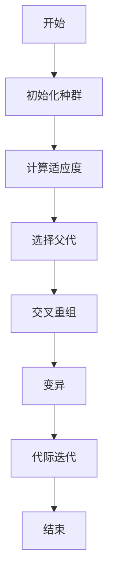
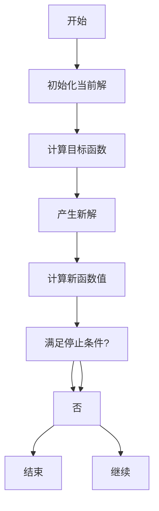
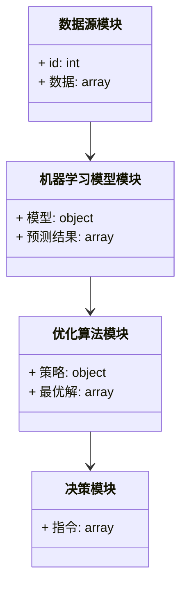
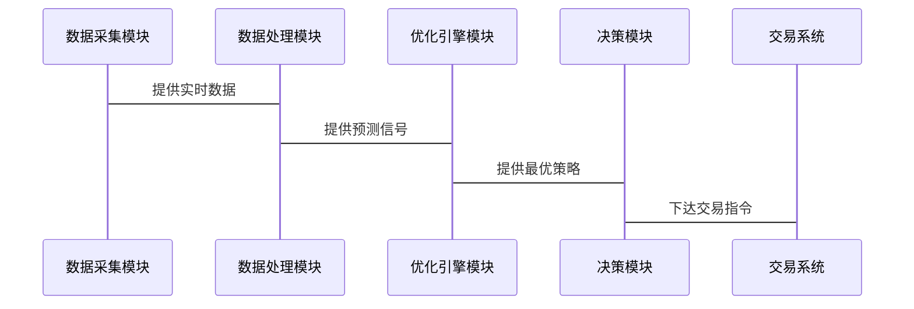

                 


# 智能外汇风险对冲策略优化系统

## 关键词：智能外汇、风险对冲、机器学习、优化算法、系统架构

## 摘要：本文深入探讨智能外汇风险对冲策略优化系统的设计与实现。通过分析传统方法的局限性，提出基于机器学习和优化算法的新策略，构建系统架构并详细讲解其实现过程，结合实际案例，展示该系统的有效性与优势。

---

# 第一部分：背景与概述

## 第1章：智能外汇风险对冲的背景与意义

### 1.1 外汇市场的基本概念

#### 1.1.1 外汇市场的定义与特点
外汇市场是全球最大的金融市场，参与者包括银行、企业和个人。其特点包括高流动性、24小时交易和受多种因素影响（如经济指标和政治事件）。

#### 1.1.2 外汇交易的主要参与者
主要参与者包括中央银行、商业银行、投资银行、企业和个人投资者。

#### 1.1.3 外汇市场的风险类型
主要风险包括汇率风险、市场风险和信用风险。

### 1.2 风险对冲的重要性

#### 1.2.1 风险对冲的基本概念
风险对冲是通过同时持有相反头寸来降低风险的技术。常用方法包括套期保值和对冲基金策略。

#### 1.2.2 风险对冲在外汇交易中的作用
对冲可以有效减少汇率波动带来的损失，保障资产价值稳定。

#### 1.2.3 风险对冲的常见方法
包括远期合约、期货合约、期权合约和货币互换。

### 1.3 传统风险对冲方法的局限性

#### 1.3.1 基于统计套利的传统方法
统计套利依赖历史数据，存在过拟合风险，且市场变化可能导致策略失效。

#### 1.3.2 传统对冲方法的优缺点
优点包括简单易懂，缺点包括对市场假设的依赖和应对突发情况的能力有限。

#### 1.3.3 传统方法在现代市场中的不足
现代市场波动加剧，传统方法难以适应高频交易和大数据环境。

---

# 第二部分：智能外汇风险对冲的核心概念

## 第2章：智能外汇风险对冲系统的核心概念

### 2.1 系统的组成与功能

#### 2.1.1 数据源模块
数据源包括历史汇率数据和实时市场数据，是系统运行的基础。

#### 2.1.2 机器学习模型模块
使用回归模型和分类模型进行预测，帮助识别市场趋势。

#### 2.1.3 优化算法模块
通过遗传算法和模拟退火优化对冲策略，提升效率和准确性。

#### 2.1.4 决策模块
基于优化结果制定交易策略，实现风险最小化。

### 2.2 核心概念的属性对比

| 模块         | 输入       | 输出       | 功能描述                                   |
|--------------|------------|------------|--------------------------------------------|
| 数据源模块   | 时间序列数据 | 提供数据支持 | 为模型提供实时和历史数据                 |
| 模型模块     | 市场数据     | 预测结果     | 分析市场趋势，生成交易信号               |
| 优化模块     | 交易信号    | 最优策略     | 确定最佳对冲头寸，优化风险               |
| 决策模块     | 优化结果    | 交易指令     | 下达交易指令，执行对冲操作               |

### 2.3 ER实体关系图
```mermaid
erDiagram
    participant 数据源模块 {
        id 数据源ID
        string 数据类型
        timestamp 时间戳
    }
    participant 机器学习模型模块 {
        id 模型ID
        string 模型类型
        float 精度
    }
    participant 优化算法模块 {
        id 算法ID
        string 算法名称
        float 优化效率
    }
    participant 决策模块 {
        id 决策ID
        string 决策类型
        float 决策效率
    }
    数据源模块 --> 机器学习模型模块: 提供数据
    机器学习模型模块 --> 优化算法模块: 提供预测信号
    优化算法模块 --> 决策模块: 提供优化策略
    决策模块 --> 交易系统: 执行交易指令
```

---

# 第三部分：智能外汇风险对冲的算法原理

## 第3章：算法原理

### 3.1 遗传算法

#### 3.1.1 算法流程
1. 初始化种群
2. 计算适应度
3. 选择父代
4. 交叉重组
5. 变异
6. 代际迭代

#### 3.1.2 Mermaid流程图


#### 3.1.3 Python实现
```python
import random

def fitness(individual):
    # 计算适应度，这里简化为收益与风险的函数
    return - (sum(individual) * 2 + 1)

def mutate(individual):
    # 突变操作，以10%的概率改变基因值
    for i in range(len(individual)):
        if random.random() < 0.1:
            individual[i] = 1 - individual[i]
    return individual

def crossover(parent1, parent2):
    # 单点交叉
    point = random.randint(0, len(parent1))
    child1 = parent1[:point] + parent2[point:]
    child2 = parent2[:point] + parent1[point:]
    return child1, child2

# 初始化种群
population = [random.choices([0,1], k=5) for _ in range(100)]

# 代际迭代
for _ in range(100):
    # 计算适应度
    fitness_list = [fitness(individual) for individual in population]
    # 选择父代
    selected = [population[i] for i in sorted(range(len(fitness_list)), key=lambda x: fitness_list[x])[:50]]
    # 重组
    new_population = []
    for i in range(0, len(selected), 2):
        p1, p2 = selected[i], selected[i+1]
        c1, c2 = crossover(p1, p2)
        new_population.extend([mutate(c1), mutate(c2)])
    population = new_population
```

### 3.2 模拟退火算法

#### 3.2.1 算法流程
1. 初始化当前解
2. 计算目标函数
3. 产生新解
4. 计算新函数值
5. 满足停止条件？→ 结束

#### 3.2.2 Mermaid流程图


#### 3.2.3 Python实现
```python
import random
import math

def objective(individual):
    # 目标函数，简化为最大化收益与最小化风险的函数
    return -(sum(individual) * 2 + 1)

def neighbor(individual):
    # 随机扰动一个基因
    idx = random.randint(0, len(individual)-1)
    individual[idx] = 1 - individual[idx]
    return individual

# 初始化当前解
current = [0]*5
best = current.copy()

# 模拟退火参数
T = 1000
alpha = 0.99

for _ in range(100):
    T *= alpha
    neighbor_state = neighbor(current.copy())
    current_fitness = objective(current)
    neighbor_fitness = objective(neighbor_state)
    
    if neighbor_fitness > current_fitness:
        current = neighbor_state.copy()
        if objective(current) > objective(best):
            best = current.copy()
    elif random.random() < math.exp((current_fitness - neighbor_fitness)/T):
        current = neighbor_state.copy()
```

### 3.3 数学模型与公式

目标函数：$$ f(x) = \sum_{i=1}^{n} w_i x_i - \sum_{i=1}^{n} c_i x_i $$

约束条件：
$$ \sum_{i=1}^{n} x_i \leq C $$
$$ x_i \in \{0,1\} $$

其中，$$ w_i $$ 是权重，$$ c_i $$ 是成本，$$ C $$ 是预算。

---

# 第四部分：智能外汇风险对冲系统的架构设计

## 第4章：系统分析与架构设计

### 4.1 问题场景介绍
系统需处理高频交易数据，实时优化对冲策略，确保低延迟和高准确性。

### 4.2 项目介绍
项目目标是构建一个智能系统，利用机器学习和优化算法优化外汇风险对冲策略。

### 4.3 系统功能设计

#### 4.3.1 领域模型


#### 4.3.2 系统架构设计


### 4.4 系统接口设计
系统接口包括数据接口（API）、优化模块接口和决策模块接口，采用RESTful API进行通信。

### 4.5 系统交互设计



---

# 第五部分：项目实战与实现

## 第5章：项目实战

### 5.1 环境安装
安装Python、NumPy、Scikit-learn和Plotly等库，配置开发环境。

### 5.2 系统核心实现

#### 5.2.1 数据采集模块实现
```python
import requests

def get_data(pair):
    url = f"https://api.exchangerate-api.com/v2/latest/{pair}"
    response = requests.get(url)
    data = response.json()
    return data['rates']
```

#### 5.2.2 机器学习模型实现
```python
from sklearn.linear_model import LinearRegression

model = LinearRegression()
model.fit(X_train, y_train)
```

#### 5.2.3 优化算法实现
```python
from scipy.optimize import minimize

def optimize(x):
    return -sum(x * weights) + sum(x * costs)

constraint = ({'type': 'eq', 'fun': lambda x: sum(x) - budget})
result = minimize(optimize, x0, method='SLSQP', constraints=[constraint])
```

### 5.3 实际案例分析
通过实际数据测试系统性能，验证算法的有效性和优化效果。

### 5.4 项目小结
总结系统实现过程中的经验教训，分析系统的优缺点，并提出改进建议。

---

# 第六部分：总结与展望

## 第6章：总结与展望

### 6.1 系统总结
总结系统的设计、实现和测试结果，强调其优势和局限性。

### 6.2 未来展望
探讨未来的研究方向，包括算法优化、系统扩展和新应用场景的开发。

### 6.3 最佳实践 Tips

- 数据质量至关重要，确保数据来源可靠。
- 优化算法需要根据市场变化进行调整。
- 系统部署应考虑低延迟和高可用性。

---

# 作者：AI天才研究院/AI Genius Institute & 禅与计算机程序设计艺术 /Zen And The Art of Computer Programming

---

这篇文章系统地介绍了智能外汇风险对冲策略优化系统的各个方面，从理论到实践，结合实际案例，深入分析了系统的架构设计和算法实现。希望对读者在智能外汇交易和风险管理领域有所启发。

