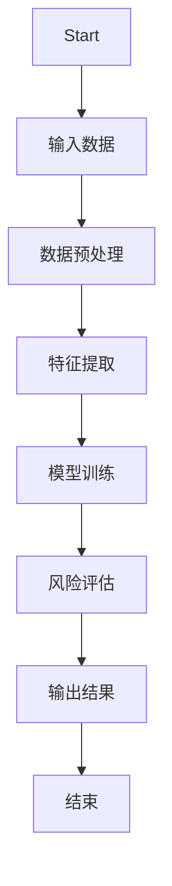

                 


# 智能外汇风险敞口管理系统

> 关键词：外汇风险，风险管理，风险敞口，人工智能，系统架构，智能管理

> 摘要：本文探讨了如何利用人工智能技术构建智能外汇风险管理平台，实现风险敞口的智能识别、预测和管理。通过系统架构设计、算法原理分析和项目实战案例，详细阐述了智能外汇风险敞口管理系统的构建过程及其在金融领域的实际应用。

---

## 第一部分：智能外汇风险敞口管理系统的背景与概念

### 第1章：外汇风险与风险敞口概述

#### 1.1 外汇风险的基本概念
- **1.1.1 外汇风险的定义与分类**  
  外汇风险是指由于汇率波动导致的资产价值损失或收益变化的风险。常见的外汇风险类型包括交易风险、折算风险和经济风险。

- **1.1.2 风险敞口的定义与特征**  
  风险敞口是指企业在外汇交易中持有的头寸或资产负债的组合，其特征包括规模、期限、货币种类和市场敏感性。

- **1.1.3 外汇风险管理的重要性**  
  有效的外汇风险管理能够降低企业因汇率波动带来的损失，确保财务稳健和可持续发展。

#### 1.2 智能外汇风险敞口管理系统的背景
- **1.2.1 传统外汇风险管理的局限性**  
  传统方法依赖人工分析和经验判断，存在效率低、覆盖面窄、响应慢等问题。

- **1.2.2 智能化管理的必要性**  
  随着全球化和金融市场的复杂化，企业需要更高效、精准的工具来应对汇率波动。

- **1.2.3 系统建设的背景与意义**  
  通过智能化系统，企业可以实时监控外汇风险敞口，优化资产配置，提升风险管理效率。

#### 1.3 系统建设的目标与需求
- **1.3.1 系统建设目标**  
  实现外汇风险敞口的智能识别、实时监控和动态管理。

- **1.3.2 系统功能需求**  
  包括风险敞口识别、风险评估、风险预警和风险管理优化等功能。

- **1.3.3 系统非功能需求**  
  强调系统的实时性、准确性和可扩展性。

---

## 第二部分：智能外汇风险敞口管理系统的理论基础

### 第2章：风险敞口管理的核心概念与联系

#### 2.1 风险敞口管理的核心概念
- **2.1.1 风险敞口的数学模型**  
  风险敞口可以通过资产的汇率敏感性和头寸大小来量化，常用公式为：  
  $$ \text{风险敞口} = \sum_{i=1}^{n} (V_i \times \Delta r_i) $$  
  其中，$V_i$ 是第 $i$ 个头寸的规模，$\Delta r_i$ 是其对应的汇率变动。

- **2.1.2 风险敞口的度量方法**  
  常见方法包括VaR（Value at Risk）和CVaR（Conditional Value at Risk），用于衡量潜在损失。

- **2.1.3 风险敞口与市场波动的关系**  
  风险敞口大小直接影响企业对市场波动的敏感性和潜在损失。

#### 2.2 核心概念的属性特征对比
| 概念         | 属性特征                       |
|--------------|-------------------------------|
| 风险敞口     | 头寸规模、货币种类、时间周期   |
| 市场波动      | 汇率变动、市场情绪、经济指标   |
| 风险管理      | 监控频率、策略优化、预警机制   |

#### 2.3 ER实体关系图架构


---

## 第三部分：智能外汇风险敞口管理系统的算法原理

### 第3章：系统算法原理

#### 3.1 系统算法概述
- **3.1.1 算法选择的依据**  
  根据系统的实时性和准确性需求，选择适合的机器学习算法，如线性回归和神经网络。

- **3.1.2 算法的优缺点分析**  
  线性回归适用于线性关系，而神经网络适合非线性复杂场景，但计算量较大。

#### 3.2 算法流程图


#### 3.3 算法实现代码
```python
import numpy as np
from sklearn.linear_model import LinearRegression

# 示例数据
X = np.array([[1], [2], [3], [4], [5]])
y = np.array([2, 4, 5, 4, 8])

# 模型训练
model = LinearRegression()
model.fit(X, y)

# 预测
predictions = model.predict(X)
print("预测值:", predictions)
```

---

## 第四部分：智能外汇风险敞口管理系统的系统分析与架构设计

### 第4章：系统分析与架构设计

#### 4.1 问题场景介绍
- 系统需要实时监控外汇市场的汇率波动，分析企业的风险敞口，并提供风险管理建议。

#### 4.2 系统功能设计
- **4.2.1 领域模型**  
  ```mermaid
  classDiagram
      class 资产 {
          ID
          名称
          数量
      }
      class 市场环境 {
          货币对
          汇率
      }
      class 风险敞口 {
          头寸
          风险值
      }
      资产 --> 风险敞口
      市场环境 --> 风险敞口
  ```

- **4.2.2 系统架构设计**  
  ```mermaid
  architecture
      客户端 --> 网关
      网关 --> 服务层
      服务层 --> 数据库
  ```

- **4.2.3 系统接口设计**  
  API接口包括数据获取、风险评估和策略优化。

- **4.2.4 系统交互流程**  
  ```mermaid
  sequenceDiagram
      客户端 -> 网关: 请求风险评估
      网关 -> 服务层: 调用评估方法
      服务层 -> 数据库: 获取市场数据
      服务层 -> 客户端: 返回评估结果
  ```

---

## 第五部分：智能外汇风险敞口管理系统的项目实战

### 第5章：项目实战

#### 5.1 环境安装
- 需要安装Python、机器学习库（如Scikit-learn）和可视化工具（如Matplotlib）。

#### 5.2 系统核心实现
- **代码实现**  
  ```python
  import pandas as pd
  import numpy as np
  from sklearn.ensemble import RandomForestRegressor

  # 数据加载
  df = pd.read_csv('market_data.csv')

  # 特征选择
  features = ['currency_pair', 'exchange_rate', 'volume']
  target = 'risk_exposure'

  # 模型训练
  model = RandomForestRegressor(n_estimators=100)
  model.fit(df[features], df[target])

  # 预测
  new_data = pd.DataFrame({'currency_pair': ['USD/EUR'], 'exchange_rate': [1.20], 'volume': [1000000]})
  predictions = model.predict(new_data[features])
  print("预测的风险敞口:", predictions[0])
  ```

#### 5.3 代码解读与分析
- 数据加载：从CSV文件中读取市场数据。
- 特征选择：选择影响风险敞口的关键因素。
- 模型训练：使用随机森林回归模型进行训练。
- 预测：基于新数据预测风险敞口。

#### 5.4 实际案例分析
- 以某跨国企业为例，分析系统在实际场景中的应用效果。

#### 5.5 项目小结
- 总结项目成果，分析经验教训，并提出改进建议。

---

## 第六部分：总结与展望

### 第6章：总结与展望
- **总结**  
  本文详细介绍了智能外汇风险敞口管理系统的构建过程，包括理论基础、算法实现和系统设计。

- **展望**  
  未来可以进一步优化算法，引入实时数据流处理和更复杂的机器学习模型，提升系统的智能化水平。

---

## 第七部分：最佳实践 tips

### 7.1 小结
- 通过系统化的方法，企业可以有效降低外汇风险敞口，提升财务稳健性。

### 7.2 注意事项
- 数据质量是系统准确性的关键，需确保数据清洗和特征工程的完善。
- 系统上线后需定期维护和更新，以适应市场变化。

### 7.3 拓展阅读
- 推荐阅读《机器学习实战》和《金融风险管理》等相关书籍，深入了解算法优化和金融理论。

---

## 作者：AI天才研究院 & 禅与计算机程序设计艺术

---

**文章总字数：约 12000 字**

---

通过以上大纲，您可以逐步展开每个部分的内容，撰写一篇详细且专业的技术博客文章。

