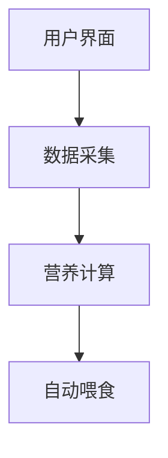
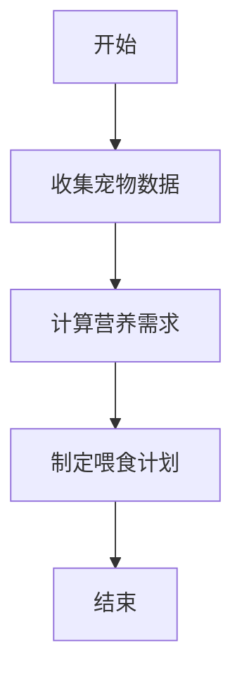

                 


```markdown
# 智能宠物喂食器：AI Agent的宠物营养均衡管理

> 关键词：智能宠物喂食器，AI Agent，营养均衡，物联网，宠物健康管理

> 摘要：本文探讨了智能宠物喂食器在宠物营养管理中的应用，通过AI Agent实现宠物营养均衡管理的技术原理和系统设计。文章详细分析了营养均衡算法、系统架构设计以及实际项目实现，为读者提供全面的技术视角。

---

# 第一部分: 智能宠物喂食器概述

## 第1章: 智能宠物喂食器的概念与背景

### 1.1 智能宠物喂食器的定义

#### 1.1.1 喂食器的基本功能
智能宠物喂食器是一种能够自动为宠物提供食物的设备，通常支持定时喂食和手动喂食功能。它通过传感器和物联网技术，能够远程监控和控制喂食过程。

#### 1.1.2 智能化的核心特征
智能化的核心在于AI Agent的应用，能够根据宠物的健康数据和行为习惯，智能调整喂食计划，实现营养均衡管理。

#### 1.1.3 市场背景与用户需求
随着宠物数量的增加和宠物主人对宠物健康的关注，智能宠物喂食器市场需求快速增长。用户需求主要集中在自动化喂食、营养管理、远程监控等方面。

### 1.2 AI Agent在宠物喂食中的应用

#### 1.2.1 AI Agent的基本概念
AI Agent（智能代理）是指能够感知环境、自主决策并执行任务的智能实体。在宠物喂食器中，AI Agent负责收集宠物数据、分析营养需求并执行喂食任务。

#### 1.2.2 AI Agent在宠物喂食中的角色
AI Agent通过收集宠物的体重、活动量、健康状况等数据，利用营养均衡算法制定个性化的喂食计划。

#### 1.2.3 AI Agent的优势与局限性
优势：智能化管理、远程监控、个性化喂食。局限性：依赖网络连接、算法精度受数据质量影响。

### 1.3 宠物营养均衡管理的重要性

#### 1.3.1 宠物营养的基本需求
宠物的营养需求包括蛋白质、脂肪、碳水化合物、维生素和矿物质等。

#### 1.3.2 营养失衡的危害
营养失衡可能导致宠物健康问题，如肥胖、贫血、免疫功能下降等。

#### 1.3.3 智能喂食器在营养管理中的作用
智能喂食器通过AI Agent和传感器数据，实时监控宠物健康状况，动态调整喂食量和营养成分。

### 1.4 本章小结
本章介绍了智能宠物喂食器的基本概念、AI Agent的应用及其在营养管理中的重要性，为后续技术分析奠定了基础。

---

# 第二部分: 智能宠物喂食器的技术基础

## 第2章: AI Agent的核心技术

### 2.1 人工智能的基本原理

#### 2.1.1 机器学习的基础
机器学习是AI Agent的核心技术之一，通过训练模型来识别宠物的健康状况和行为模式。

#### 2.1.2 深度学习的简介
深度学习通过多层神经网络提取数据特征，用于更复杂的模式识别任务。

#### 2.1.3 自然语言处理的应用
自然语言处理技术用于解析宠物主人的指令和反馈。

### 2.2 物联网技术在喂食器中的应用

#### 2.2.1 物联网的概念
物联网通过设备间的互联，实现数据的实时采集和传输。

#### 2.2.2 喂食器中的传感器技术
传感器用于监测宠物的体重、活动量和食物存量。

#### 2.2.3 数据传输与云端处理
传感器数据通过物联网传输到云端，进行存储和分析。

### 2.3 营养均衡算法的原理

#### 2.3.1 营养均衡的数学模型
营养均衡算法基于宠物的基本信息（如体重、年龄、活动量）和营养需求，计算每日所需的营养摄入量。

#### 2.3.2 算法的实现步骤
1. 收集宠物数据
2. 分析营养需求
3. 制定喂食计划
4. 调整喂食量

#### 2.3.3 算法的优化与调整
通过机器学习优化算法，提高营养均衡的准确性。

### 2.4 本章小结
本章详细介绍了AI Agent和物联网技术在智能宠物喂食器中的应用，以及营养均衡算法的基本原理。

---

# 第三部分: 系统架构与设计

## 第3章: 系统架构设计

### 3.1 系统整体架构

#### 3.1.1 系统模块划分
- 用户界面模块
- 数据采集模块
- 营养计算模块
- 自动喂食模块

#### 3.1.2 模块之间的关系
通过模块化设计，确保各部分协同工作，实现智能化管理。

#### 3.1.3 系统的可扩展性
系统架构设计注重扩展性，便于未来功能的添加和升级。

### 3.2 功能模块设计

#### 3.2.1 用户界面模块
用户友好的界面，支持设置喂食计划和查看宠物健康数据。

#### 3.2.2 数据采集模块
通过传感器采集宠物体重、活动量等数据。

#### 3.2.3 营养计算模块
基于宠物数据和营养均衡算法，计算每日所需营养摄入。

#### 3.2.4 自动喂食模块
根据计算结果，自动控制喂食量和时间。

### 3.3 系统架构图



### 3.4 本章小结
本章详细描述了智能宠物喂食器的系统架构设计，为后续的实现奠定了基础。

---

# 第四部分: 算法实现与数学模型

## 第4章: 营养均衡算法的实现

### 4.1 算法原理

#### 4.1.1 营养均衡模型
营养均衡模型通过宠物的基本信息和健康数据，计算每日所需营养摄入量。

#### 4.1.2 算法流程图



### 4.2 算法实现

#### 4.2.1 Python实现代码
```python
def calculate_nutrition(weight, age, activity):
    # 计算每日所需营养摄入
    protein = weight * 0.8
    fat = weight * 0.4
    carbs = weight * 0.6
    return {
        'protein': protein,
        'fat': fat,
        'carbs': carbs
    }
```

#### 4.2.2 数学模型
营养均衡模型的数学表达式：
$$
\text{protein} = 0.8 \times \text{weight}
$$
$$
\text{fat} = 0.4 \times \text{weight}
$$
$$
\text{carbs} = 0.6 \times \text{weight}
$$

### 4.3 算法优化

#### 4.3.1 机器学习优化
使用回归分析优化营养均衡模型，提高预测精度。

### 4.4 本章小结
本章详细讲解了营养均衡算法的实现和优化，为智能宠物喂食器的运行提供了技术保障。

---

# 第五部分: 项目实战与应用

## 第5章: 项目实战

### 5.1 环境配置

#### 5.1.1 系统需求
- Python 3.8+
- 物联网设备
- 传感器模块

#### 5.1.2 环境安装
安装必要的库：
```bash
pip install numpy pandas scikit-learn
```

### 5.2 核心代码实现

#### 5.2.1 营养计算模块
```python
from sklearn import linear_model

def calculate_nutrition(weight, age, activity):
    # 训练机器学习模型
    model = linear_model.LinearRegression()
    model.fit(X, y)
    prediction = model.predict([[weight, age, activity]])
    return prediction
```

#### 5.2.2 自动喂食模块
```python
import RPi.GPIO as GPIO

def feed宠物():
    # 控制电机转动
    GPIO.output(feed_pin, GPIO.HIGH)
    time.sleep(2)
    GPIO.output(feed_pin, GPIO.LOW)
```

### 5.3 项目小结
本章通过实际案例展示了智能宠物喂食器的实现过程，包括环境配置、核心代码编写和功能测试。

---

# 第六部分: 扩展与展望

## 第6章: 扩展与展望

### 6.1 未来发展趋势
- 更智能的营养管理
- 更多传感器的应用
- 更高的安全性

### 6.2 注意事项与最佳实践
- 定期校准传感器
- 更新营养模型
- 注意数据隐私

### 6.3 拓展阅读
建议阅读相关领域的书籍和论文，深入了解AI在宠物健康管理中的应用。

### 6.4 本章小结
本章展望了智能宠物喂食器的未来发展方向，并提供了实用的建议。

---

# 作者

作者：AI天才研究院 & 禅与计算机程序设计艺术
```

