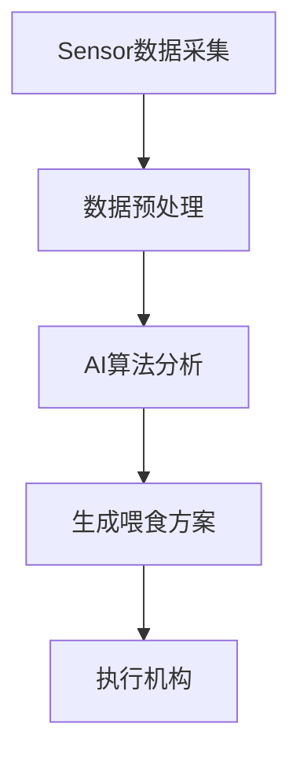
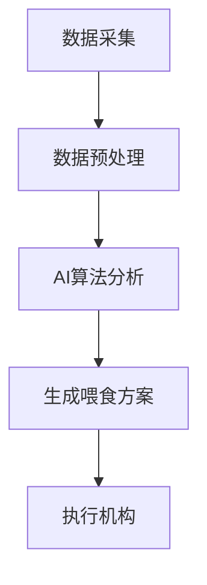
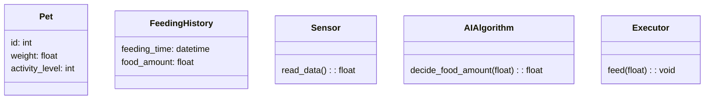
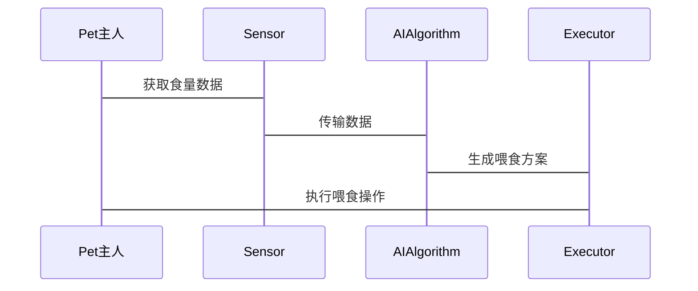

                 


```markdown
# 智能宠物喂食器：AI Agent的宠物饮食管理

> 关键词：智能宠物喂食器，AI Agent，宠物饮食管理，物联网，人工智能，自动化控制

> 摘要：本文将探讨如何利用AI Agent技术实现智能宠物喂食器的宠物饮食管理。通过分析传统喂食器的局限性，介绍AI Agent的核心原理与技术特征，详细讲解相关算法与数学模型，分析系统架构设计，并通过项目实战展示如何实现智能宠物喂食器，最后总结经验与展望未来发展方向。

---

## 第1章: 智能宠物喂食器的背景与问题背景

### 1.1 传统宠物喂食器的局限性
#### 1.1.1 传统喂食器的功能局限
传统宠物喂食器通常只能按照设定的时间自动投放固定量的食物，无法根据宠物的健康状况、活动量或饮食习惯进行调整。例如，对于超重或营养不良的宠物，传统喂食器无法提供个性化的喂食方案。

#### 1.1.2 宠物饮食管理的痛点分析
宠物主人可能无法实时监控宠物的饮食情况，尤其是当宠物主人不在家时。此外，宠物可能出现挑食、厌食或过度进食等问题，传统喂食器无法解决这些复杂的情况。

#### 1.1.3 智能化喂食器的需求驱动
随着物联网和人工智能技术的快速发展，宠物主人对智能化设备的需求不断增加。智能化喂食器能够通过传感器和AI算法，实时调整喂食量，确保宠物的健康饮食。

### 1.2 AI Agent在宠物喂食器中的应用前景
#### 1.2.1 AI Agent的基本概念
AI Agent（人工智能代理）是指能够感知环境、自主决策并执行任务的智能实体。它可以分为简单反射型、基于模型的反应型、目标驱动型和实用驱动型四种类型。

#### 1.2.2 AI Agent在宠物喂食器中的作用
AI Agent可以通过传感器获取宠物的饮食数据，分析宠物的健康状况和饮食习惯，并根据分析结果调整喂食量和喂食时间，从而实现智能化的饮食管理。

#### 1.2.3 智能宠物喂食器的市场现状
目前市场上已经有一些智能宠物喂食器，但大多功能简单，缺乏AI Agent的深度学习和自主决策能力。随着技术的进步，未来的智能宠物喂食器将更加智能化和个性化。

### 1.3 智能宠物喂食器的核心问题与边界
#### 1.3.1 问题背景与问题描述
智能宠物喂食器的核心问题是如何通过AI Agent实现智能化的饮食管理，解决传统喂食器功能单一、无法个性化调整的痛点。

#### 1.3.2 问题解决的思路与目标
通过集成传感器、AI算法和执行机构，设计一个能够实时监测宠物饮食情况，并根据数据分析结果自动调整喂食方案的智能系统。

#### 1.3.3 边界与外延
智能宠物喂食器的功能范围包括数据采集、分析、决策和执行，但不包括宠物健康监测以外的其他功能，如宠物医疗等。

#### 1.3.4 核心概念与组成要素
智能宠物喂食器的核心组成要素包括：
- **传感器**：用于采集宠物的饮食数据，如食量、进食时间等。
- **AI算法**：用于分析数据并生成决策。
- **执行机构**：根据决策结果执行喂食操作。

### 1.4 本章小结
本章介绍了传统宠物喂食器的局限性，分析了智能化喂食器的需求背景，并提出了AI Agent在智能宠物喂食器中的应用前景。明确了智能宠物喂食器的核心问题和边界，为后续章节的深入分析奠定了基础。

---

## 第2章: AI Agent的核心原理与技术特征

### 2.1 AI Agent的基本原理
#### 2.1.1 AI Agent的定义与分类
AI Agent是一种能够感知环境、自主决策并执行任务的智能实体。根据功能和应用场景的不同，AI Agent可以分为简单反射型、基于模型的反应型、目标驱动型和实用驱动型四种类型。

#### 2.1.2 AI Agent的核心技术特征
AI Agent的核心技术特征包括：
- **自主性**：能够在没有外部干预的情况下自主运行。
- **反应性**：能够实时感知环境并做出反应。
- **学习能力**：能够通过数据学习和优化决策模型。

#### 2.1.3 AI Agent与传统自动喂食器的对比
| 对比维度 | AI Agent喂食器 | 传统自动喂食器 |
|----------|----------------|-----------------|
| 数据采集 | 集成传感器，实时采集数据 | 仅定时器和固定食量 |
| 决策能力 | 基于AI算法，动态调整喂食方案 | 固定时间表，无法调整食量 |
| 学习能力 | 可通过数据学习优化喂食方案 | 无学习能力，无法优化 |

### 2.2 AI Agent在智能宠物喂食器中的系统架构
#### 2.2.1 系统组成与功能模块
- **传感器模块**：用于采集宠物的饮食数据，如食量、进食时间等。
- **数据处理模块**：对采集的数据进行预处理和分析。
- **AI决策模块**：基于分析结果生成喂食方案。
- **执行机构**：根据决策结果执行喂食操作。

#### 2.2.2 系统架构的ER实体关系图
```mermaid
erDiagram
    customer{
        +id: int
        +name: string
        +pet_info: Pet
    }
    Pet{
        +id: int
        +weight: float
        +activity_level: int
        +feeding_history: FeedingHistory
    }
    FeedingHistory{
        +feeding_time: datetime
        +food_amount: float
        +decision_rule: string
    }
```

#### 2.2.3 系统架构的Mermaid流程图


### 2.3 本章小结
本章详细介绍了AI Agent的基本原理和核心特征，分析了其在智能宠物喂食器中的系统架构，并通过ER图和流程图展示了系统的组成和数据流。

---

## 第3章: 智能宠物喂食器的算法与数学模型

### 3.1 数据采集与处理算法
#### 3.1.1 数据采集流程
- **传感器采集**：通过重量传感器实时采集宠物的食量数据。
- **数据预处理**：去除噪声，归一化处理。

#### 3.1.2 数据分析与特征提取
- **统计分析**：计算宠物的平均食量、进食频率等。
- **特征提取**：提取食量变化趋势、进食间隔等特征。

### 3.2 AI Agent的决策算法
#### 3.2.1 基于规则的决策算法
```python
def decide_food_amount(current_weight, target_weight):
    if current_weight < target_weight:
        return target_weight * 0.9
    else:
        return target_weight * 0.8
```

#### 3.2.2 基于机器学习的决策算法
```python
import tensorflow as tf
model = tf.keras.Sequential([
    tf.keras.layers.Dense(64, activation='relu'),
    tf.keras.layers.Dense(1, activation='linear')
])
model.compile(optimizer='adam', loss='mse')
```

#### 3.2.3 基于PID控制的喂食算法
$$u(t) = K_p e(t) + K_i \int_{0}^{t} e(t') dt' + K_d \frac{de(t)}{dt}$$

### 3.3 算法的数学模型与公式
#### 3.3.1 数据处理的数学模型
$$y = a x + b$$

#### 3.3.2 决策算法的数学公式
$$u(t) = K_p e(t) + K_i \int_{0}^{t} e(t') dt' + K_d \frac{de(t)}{dt}$$

#### 3.3.3 喂食控制的数学模型
$$food\_amount = target\_weight \times (1 - \frac{current\_weight}{target\_weight})$$

### 3.4 算法的Mermaid流程图


### 3.5 本章小结
本章详细讲解了智能宠物喂食器中使用的算法，包括数据采集与处理算法、决策算法以及喂食控制算法，并通过数学公式和流程图展示了算法的实现过程。

---

## 第4章: 智能宠物喂食器的系统分析与架构设计

### 4.1 问题场景介绍
#### 4.1.1 系统目标与功能需求
- 实时监测宠物的饮食情况。
- 根据数据分析结果智能调整喂食方案。
- 提供远程控制功能，方便宠物主人管理。

#### 4.1.2 项目介绍
本项目旨在开发一款基于AI Agent的智能宠物喂食器，通过传感器和AI算法实现智能化的宠物饮食管理。

### 4.2 系统功能设计
#### 4.2.1 领域模型Mermaid类图


### 4.3 系统架构设计
#### 4.3.1 系统架构的Mermaid架构图


### 4.4 系统接口设计
#### 4.4.1 接口描述
- **输入接口**：传感器数据、用户输入指令。
- **输出接口**：喂食量、喂食时间。

#### 4.4.2 接口交互流程


### 4.5 本章小结
本章详细分析了智能宠物喂食器的系统架构，包括功能设计、架构设计和接口设计，并通过Mermaid图展示了系统的组成和交互过程。

---

## 第5章: 智能宠物喂食器的项目实战

### 5.1 环境安装与配置
#### 5.1.1 开发环境的选择
- **硬件**：Raspberry Pi、重量传感器、电机等。
- **软件**：Python、TensorFlow、Flask等。

#### 5.1.2 传感器和硬件的安装
- 安装Raspberry Pi并连接重量传感器。
- 配置电机和喂食机构。

### 5.2 系统核心实现源代码
#### 5.2.1 数据采集模块
```python
import RPi.GPIO as GPIO

def read_weight():
    # 传感器数据读取逻辑
    return weight_value
```

#### 5.2.2 数据处理与决策模块
```python
def decide_food_amount(weight):
    if weight < target_weight:
        return target_weight * 0.9
    else:
        return target_weight * 0.8
```

#### 5.2.3 执行机构控制模块
```python
def feed(amount):
    # 电机控制逻辑
    pass
```

### 5.3 代码应用解读与分析
#### 5.3.1 代码结构分析
- **数据采集模块**：负责读取传感器数据。
- **数据处理模块**：对数据进行预处理和分析。
- **决策模块**：根据数据分析结果生成喂食方案。
- **执行机构控制模块**：根据决策结果控制喂食机构。

#### 5.3.2 核心算法实现
- **PID控制实现**：如上所述。

### 5.4 实际案例分析与详细讲解剖析
#### 5.4.1 典型案例
- **案例1**：宠物体重超标，AI Agent调整喂食量，帮助宠物减重。

#### 5.4.2 问题分析与解决
- 如何处理数据采集中的噪声问题？通过滤波和数据平滑处理。

### 5.5 项目小结
本章通过实际案例展示了如何实现智能宠物喂食器，详细解读了代码的各个部分，并总结了开发过程中需要注意的问题和解决方案。

---

## 第6章: 智能宠物喂食器的扩展与总结

### 6.1 最佳实践 tips
#### 6.1.1 系统设计中的注意事项
- 数据安全：确保宠物数据的安全存储和传输。
- 系统稳定性：确保系统在各种情况下都能稳定运行。

#### 6.1.2 开发过程中的技巧
- 选择合适的传感器和硬件，确保数据采集的准确性。
- 在代码中加入日志记录，便于调试和优化。

### 6.2 小结
本章总结了全书的主要内容，回顾了智能宠物喂食器的实现过程，并提出了未来的发展方向。

### 6.3 注意事项
- 在实际应用中，需考虑宠物的个体差异，调整喂食方案。
- 确保系统的可扩展性，方便后续功能的添加。

### 6.4 拓展阅读
- 推荐相关书籍：《机器学习实战》、《人工智能：一种现代方法》。
- 推荐论文：关于AI在宠物健康管理中的应用研究。

### 本章小结
本章总结了智能宠物喂食器的实现过程，并展望了未来的发展方向，为读者提供了进一步学习和研究的资源。

---

## 附录

### 附录A: 关键术语解释
- **AI Agent**：人工智能代理，能够感知环境、自主决策并执行任务的智能实体。
- **PID控制**：比例-积分-微分控制，一种常用的控制算法。

### 附录B: 相关数学公式汇总
$$u(t) = K_p e(t) + K_i \int_{0}^{t} e(t') dt' + K_d \frac{de(t)}{dt}$$

### 附录C: 代码示例汇总
- 数据采集模块：如上所述。
- 决策模块：如上所述。

---

## 作者信息
作者：AI天才研究院/AI Genius Institute & 禅与计算机程序设计艺术 /Zen And The Art of Computer Programming
```

