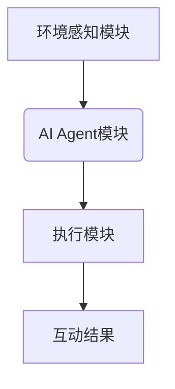

                 


# 智能宠物玩具：AI Agent的互动模式自适应

## 关键词：智能宠物玩具，AI Agent，自适应互动，人工智能，机器人技术

## 摘要：本文探讨了AI Agent在智能宠物玩具中的应用，重点分析了互动模式的自适应机制。通过结合人工智能、传感器技术和行为学原理，本文详细阐述了如何设计和实现一个能够根据宠物行为动态调整互动策略的智能玩具系统。

---

## 第一部分: 智能宠物玩具与AI Agent概述

### 第1章: 智能宠物玩具的背景与现状

#### 1.1 智能宠物玩具的定义与特点
- **1.1.1 智能宠物玩具的定义**  
智能宠物玩具是一种结合了传感器、执行器和AI技术的交互式玩具，能够通过感知宠物的行为和环境变化，动态调整互动方式。

- **1.1.2 智能宠物玩具的核心特点**  
  - **智能化**：通过AI算法实现自适应互动。  
  - **可感知性**：能够感知宠物的情绪和行为。  
  - **可执行性**：能够通过声音、灯光、动作等方式与宠物互动。

- **1.1.3 智能宠物玩具的发展现状**  
当前市场上已经出现了多种智能宠物玩具，例如智能猫玩具、智能狗玩具等，但大多数产品仍处于初级阶段，缺乏深度的自适应能力。

---

### 第2章: 智能宠物玩具的互动模式

#### 2.1 互动模式的分类与特点
- **2.1.1 基于规则的互动模式**  
通过预设规则（如时间、宠物行为）触发互动，简单但缺乏灵活性。  
- **2.1.2 基于机器学习的互动模式**  
通过学习宠物的行为数据，动态调整互动策略，具有更强的自适应性。  
- **2.1.3 混合型互动模式**  
结合规则和机器学习的优点，实现更复杂的互动模式。

#### 2.2 自适应互动模式的核心要素
- **2.2.1 用户行为分析**  
通过传感器采集宠物的行为数据，分析其情绪和偏好。  
- **2.2.2 环境感知与反馈**  
感知环境中的光线、声音、温度等信息，为互动提供依据。  
- **2.2.3 个性化互动策略**  
根据宠物的个性和行为模式，制定个性化的互动计划。

---

## 第二部分: AI Agent的自适应机制

### 第3章: AI Agent的核心算法

#### 3.1 基于规则的自适应算法
- **3.1.1 算法原理**  
通过预设规则（如时间、行为阈值）触发互动。  
- **3.1.2 算法实现**  
```python
def interact_with_pet():
    if time >= feeding_time and pet_behavior == 'hungry':
        play_sound('feeding_time')
    elif pet_behavior == 'bored':
        move_motor('slow')
```

#### 3.2 基于机器学习的自适应算法
- **3.2.1 算法原理**  
通过训练模型，识别宠物的行为模式，并动态调整互动策略。  
- **3.2.2 算法实现**  
```python
import numpy as np

# 假设X为宠物行为数据，y为互动策略
model = SVC()
model.fit(X, y)
prediction = model.predict(new_behavior)
```

#### 3.3 基于深度学习的自适应算法
- **3.3.1 算法原理**  
通过神经网络学习宠物行为的复杂模式，并实时调整互动策略。  
- **3.3.2 算法实现**  
```python
import torch

class PetBehaviorModel(torch.nn.Module):
    def __init__(self):
        super().__init__()
        self.fc1 = torch.nn.Linear(4, 8)
        self.fc2 = torch.nn.Linear(8, 4)
        self.fc3 = torch.nn.Linear(4, 2)
```

---

### 第4章: 自适应互动模式的实现

#### 4.1 基于反馈的自适应算法
- **4.1.1 算法原理**  
通过宠物的反馈（如情绪变化）调整互动策略。  
- **4.1.2 算法实现**  
```python
def adjust_interaction(feedback):
    if feedback == 'happy':
        increase_reward_frequency()
    elif feedback == 'frustrated':
        decrease_intensity()
```

#### 4.2 基于预测的自适应算法
- **4.2.1 算法原理**  
预测宠物的下一步行为，提前调整互动策略。  
- **4.2.2 算法实现**  
```python
def predict_next_behavior(current_behavior):
    # 使用训练好的模型进行预测
    predicted_behavior = model.predict(current_behavior)
    return predicted_behavior
```

#### 4.3 基于强化学习的自适应算法
- **4.3.1 算法原理**  
通过奖励机制优化互动策略。  
- **4.3.2 算法实现**  
```python
def reinforce_learning(reward):
    update_policy(reward)
    update_Q_value(reward)
```

---

## 第三部分: 系统架构与设计

### 第5章: 系统架构设计

#### 5.1 系统功能模块
- **环境感知模块**  
负责采集宠物的行为数据和环境信息。  
- **AI Agent模块**  
负责分析数据并制定互动策略。  
- **执行模块**  
负责通过声音、灯光、动作等方式与宠物互动。  

#### 5.2 系统架构图  


---

## 第四部分: 项目实战

### 第6章: 项目实战

#### 6.1 环境安装与配置
- 安装必要的传感器和执行器。  
- 安装AI框架（如TensorFlow、PyTorch）。  

#### 6.2 核心功能实现
- **数据采集**  
```python
import serial

ser = serial.Serial('COM3', 9600)
data = ser.readline()
```

- **AI算法实现**  
```python
def train_model(X, y):
    model = SVC()
    model.fit(X, y)
    return model
```

- **互动策略调整**  
```python
def adjust_strategy(feedback):
    if feedback == 'happy':
        increase_speed()
    elif feedback == 'frustrated':
        decrease_speed()
```

#### 6.3 项目总结与优化
- 总结项目实现的关键点。  
- 提出优化建议，如增加更多传感器类型或优化算法模型。  

---

## 第五部分: 最佳实践与总结

### 第7章: 最佳实践

#### 7.1 注意事项
- 确保传感器的准确性和稳定性。  
- 定期更新模型以提高自适应能力。  

#### 7.2 小结
AI Agent的自适应互动模式为智能宠物玩具带来了新的可能性。通过结合传感器技术和AI算法，可以实现更加智能化和个性化的宠物互动体验。

#### 7.3 拓展阅读
建议读者进一步学习强化学习和深度学习在机器人控制中的应用。

---

## 作者信息

作者：AI天才研究院/AI Genius Institute & 禅与计算机程序设计艺术 /Zen And The Art of Computer Programming

---

这篇文章详细探讨了AI Agent在智能宠物玩具中的互动模式自适应技术，结合理论分析和实际案例，为读者提供了全面的指导和深入的见解。

