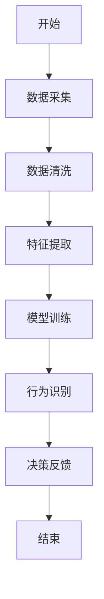
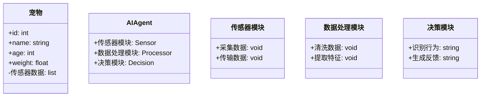
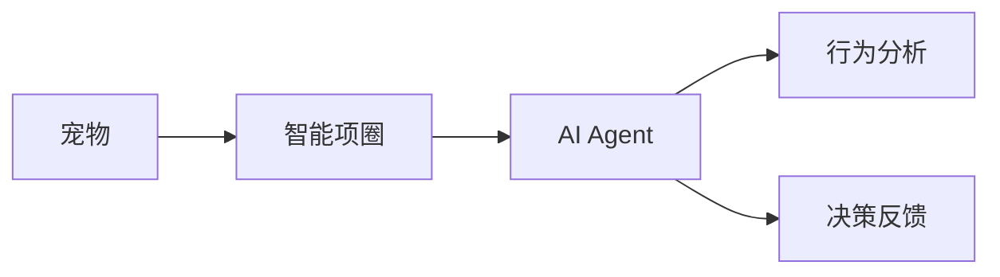
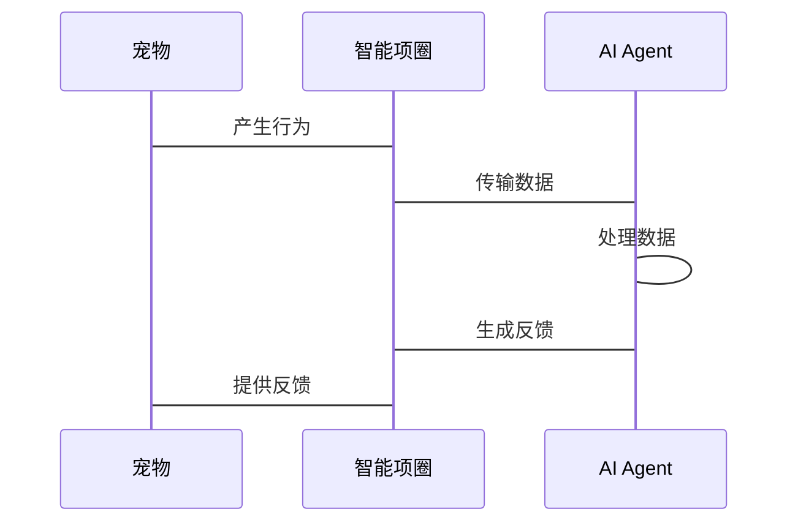

                 


# 智能宠物项圈：AI Agent的宠物行为分析

> 关键词：智能宠物项圈，AI Agent，宠物行为分析，物联网，机器学习，数据分析

> 摘要：本文深入探讨智能宠物项圈在宠物行为分析中的应用，结合AI Agent的技术原理，分析其在数据采集、行为识别、决策反馈等方面的优势，并详细阐述其算法原理、系统架构及实际应用场景。通过具体案例分析，展示智能宠物项圈如何利用AI技术实现对宠物行为的智能化管理。

---

# 第1章: 智能宠物项圈与AI Agent的背景介绍

## 1.1 问题背景与描述

### 1.1.1 宠物行为分析的难点与挑战
宠物行为分析是理解宠物健康、情绪和需求的关键。然而，传统的分析方法依赖于人工观察，存在以下难点：
- 数据采集困难：宠物行为多样且无规律，难以实时捕捉。
- 数据处理复杂：行为数据多为非结构化数据，分析难度大。
- 行为理解不足：不同宠物行为的差异性导致分析模型难以泛化。

### 1.1.2 智能宠物项圈的应用场景
智能宠物项圈是一种结合物联网和人工智能技术的 wearable device，能够实时采集宠物的行为数据，并通过AI Agent进行分析和决策。其主要应用场景包括：
- **健康监测**：监测宠物的活动量、心率等生理指标，及时发现异常。
- **行为识别**：识别宠物的常见行为（如进食、玩耍、休息），帮助主人了解宠物状态。
- **行为矫正**：通过AI Agent的反馈机制，帮助主人纠正宠物不良行为。

### 1.1.3 AI Agent在宠物行为分析中的作用
AI Agent（智能体）是一种能够感知环境、自主决策并执行任务的智能系统。在智能宠物项圈中，AI Agent主要负责：
- **数据处理**：对采集的行为数据进行清洗、特征提取和初步分析。
- **行为识别**：基于机器学习模型，识别宠物的具体行为。
- **决策反馈**：根据行为分析结果，向主人提供反馈或建议。

## 1.2 问题解决与边界

### 1.2.1 智能宠物项圈如何解决宠物行为分析问题
智能宠物项圈通过集成多种传感器（如加速度计、心率监测器）和AI算法，能够实时采集并分析宠物行为数据。其优势在于：
- **实时性**：数据采集和分析实时进行，能够快速响应。
- **准确性**：基于机器学习的算法能够提高行为识别的准确性。
- **便捷性**：主人无需手动记录，数据自动采集和分析。

### 1.2.2 AI Agent的功能边界与外延
AI Agent的功能边界包括：
- 数据采集与处理：仅处理宠物项圈采集的数据。
- 行为识别：仅识别预定义的宠物行为。
- 决策反馈：仅提供基于行为分析的反馈。

外延功能则可能包括：
- 数据存储与管理：将行为数据上传至云端，便于长期分析。
- 行为预测：基于历史数据，预测宠物未来的行为模式。

### 1.2.3 智能宠物项圈的技术实现边界
智能宠物项圈的技术实现边界包括：
- 硬件部分：仅包括项圈上的传感器和通信模块。
- 软件部分：仅包括本地运行的AI Agent和云端分析平台。

## 1.3 核心概念与结构

### 1.3.1 智能宠物项圈的核心组成要素
智能宠物项圈的核心组成要素包括：
- **传感器模块**：用于采集宠物的行为数据。
- **通信模块**：用于将数据传输至云端或本地。
- **AI Agent模块**：用于数据处理、行为识别和决策反馈。

### 1.3.2 AI Agent在系统中的角色与功能
AI Agent在智能宠物项圈中的角色是数据处理和行为分析的核心模块。其功能包括：
- **数据处理**：对传感器采集的数据进行清洗和特征提取。
- **行为识别**：基于机器学习模型，识别宠物的具体行为。
- **决策反馈**：根据行为分析结果，向主人提供反馈或建议。

### 1.3.3 系统的结构与核心要素关系图


---

# 第2章: 核心概念与联系

## 2.1 AI Agent的核心原理

### 2.1.1 AI Agent的基本概念
AI Agent是一种能够感知环境、自主决策并执行任务的智能系统。它通过感知环境信息，利用内部模型进行决策，并通过执行器与环境交互。

### 2.1.2 AI Agent的感知与决策机制
AI Agent的感知机制包括：
- 数据采集：通过传感器获取环境信息。
- 数据处理：对采集的数据进行清洗和特征提取。
- 信息融合：将多源数据融合，提高感知的准确性。

AI Agent的决策机制包括：
- 行为识别：基于机器学习模型，识别宠物的具体行为。
- 决策推理：根据行为识别结果，生成决策指令。

### 2.1.3 AI Agent的行为执行与反馈
AI Agent通过执行器（如震动模块、LED灯）与环境交互。行为执行后，AI Agent会根据反馈信息调整决策策略。

## 2.2 智能宠物项圈的功能模块

### 2.2.1 数据采集模块
数据采集模块负责采集宠物的行为数据，包括：
- 加速度数据：用于分析宠物的运动状态。
- 心率数据：用于监测宠物的生理指标。
- 位置数据：用于分析宠物的活动范围。

### 2.2.2 数据处理与分析模块
数据处理与分析模块负责对采集的数据进行清洗、特征提取和初步分析。例如，通过加速度数据计算宠物的运动量。

### 2.2.3 AI Agent决策模块
AI Agent决策模块负责对分析结果进行决策，并向主人提供反馈。例如，当检测到宠物长时间不动时，提醒主人关注宠物的健康状况。

## 2.3 核心概念的属性对比

| **概念**       | **AI Agent**          | **智能宠物项圈**           |
|----------------|----------------------|---------------------------|
| 功能           | 数据处理与行为分析   | 数据采集与行为反馈        |
| 输入           | 行为数据             | 传感器数据                |
| 输出           | 行为识别结果         | 决策反馈                  |
| 依赖           | 机器学习模型         | 传感器和通信模块          |
| 应用场景       | 宠物行为分析          | 宠物健康管理与行为矫正     |

### 2.4 实体关系图


---

# 第3章: 算法原理与数学模型

## 3.1 数据采集与预处理

### 3.1.1 数据采集方法
智能宠物项圈通过加速度计、心率传感器等采集宠物的行为数据。

### 3.1.2 数据清洗与特征提取
数据清洗包括去除噪声数据和填补缺失值。特征提取包括将原始数据转换为有意义的特征，如运动频率、心率变化等。

## 3.2 AI Agent的算法实现

### 3.2.1 基于强化学习的决策模型
强化学习是一种通过试错机制来优化决策的算法。在宠物行为分析中，可以用于训练AI Agent根据行为数据生成最优的反馈策略。

#### 强化学习的基本公式
$$ Q(s, a) = r + \gamma \max_{a'} Q(s', a') $$
其中：
- \( Q(s, a) \)：状态 \( s \) 下动作 \( a \) 的价值。
- \( r \)：立即奖励。
- \( \gamma \)：折扣因子，表示未来奖励的权重。
- \( s' \)：执行动作 \( a \) 后的新状态。

### 3.2.2 基于监督学习的行为分类算法
监督学习是一种基于标签数据进行分类的算法。在宠物行为分析中，可以用于训练模型识别宠物的具体行为。

#### 监督学习的损失函数
$$ L = -\sum_{i} y_i \log p(y_i) + (1 - y_i) \log (1 - p(y_i)) $$
其中：
- \( y_i \)：真实标签。
- \( p(y_i) \)：模型预测的概率。

## 3.3 算法流程图



---

# 第4章: 系统分析与架构设计

## 4.1 项目场景介绍
智能宠物项圈项目旨在通过AI技术实现对宠物行为的智能化管理，帮助主人更好地理解和照顾宠物。

## 4.2 系统功能设计

### 4.2.1 领域模型类图



### 4.2.2 系统架构图



### 4.2.3 系统接口设计
- **数据采集接口**：传感器模块提供的接口用于采集宠物的行为数据。
- **数据处理接口**：数据处理模块提供的接口用于清洗和提取特征。
- **行为识别接口**：AI Agent提供的接口用于识别宠物的具体行为。

### 4.2.4 系统交互流程



---

# 第5章: 项目实战

## 5.1 环境安装

### 5.1.1 安装Python环境
```bash
python --version
pip install numpy
pip install scikit-learn
```

### 5.1.2 安装其他依赖
```bash
pip install pandas
pip install matplotlib
pip install pymermaid
```

## 5.2 系统核心实现

### 5.2.1 数据采集代码
```python
import numpy as np
import pandas as pd

# 采集宠物行为数据
def collect_data():
    # 生成模拟数据
    np.random.seed(0)
    data = pd.DataFrame({
        'timestamp': range(100),
        'acceleration': np.random.normal(0, 1, 100),
        'heart_rate': np.random.randint(50, 200, 100)
    })
    return data
```

### 5.2.2 数据清洗代码
```python
def preprocess_data(data):
    # 去除缺失值
    data.dropna(inplace=True)
    # 填补异常值
    data['acceleration'].fillna(data['acceleration'].mean(), inplace=True)
    return data
```

### 5.2.3 行为识别代码
```python
from sklearn.ensemble import RandomForestClassifier

def train_model(data, labels):
    # 训练随机森林模型
    model = RandomForestClassifier()
    model.fit(data, labels)
    return model

def predict_behavior(model, new_data):
    # 预测行为
    prediction = model.predict(new_data)
    return prediction
```

## 5.3 案例分析

### 5.3.1 数据分析与可视化
```python
import matplotlib.pyplot as plt

data = collect_data()
plt.plot(data['timestamp'], data['acceleration'])
plt.xlabel('时间')
plt.ylabel('加速度')
plt.show()
```

### 5.3.2 行为识别与反馈
```python
model = train_model(X_train, y_train)
prediction = predict_behavior(model, X_test)
print("预测行为:", prediction)
```

---

# 第6章: 总结与扩展

## 6.1 最佳实践 tips
- 定期更新模型：随着宠物行为的变化，需要定期更新AI Agent的行为识别模型。
- 数据隐私保护：确保宠物行为数据的安全和隐私。

## 6.2 小结
智能宠物项圈通过结合物联网和AI技术，能够实时采集和分析宠物行为数据，帮助主人更好地理解和照顾宠物。本文详细介绍了智能宠物项圈的核心概念、算法原理和系统架构，并通过具体案例展示了其实现过程。

## 6.3 注意事项
- 硬件兼容性：确保智能宠物项圈与宠物的物理特性相匹配。
- 数据准确性：采集的数据需要经过严格的清洗和校准。

## 6.4 拓展阅读
- 《Machine Learning: A

