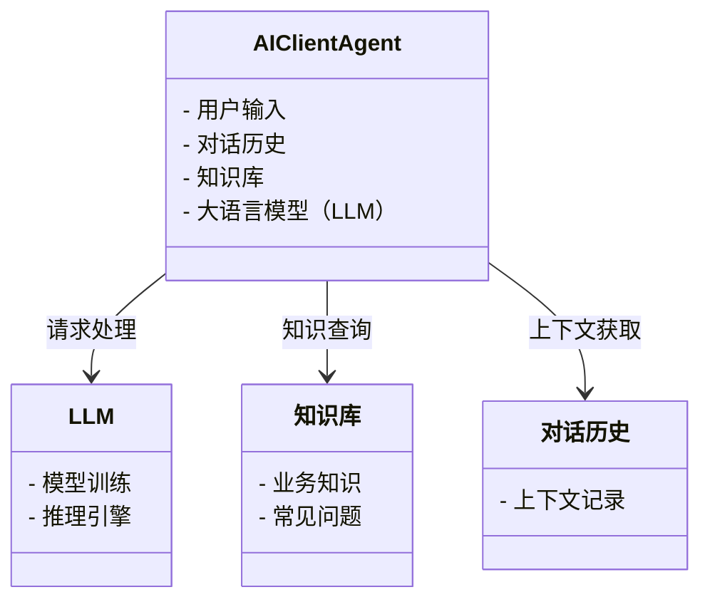
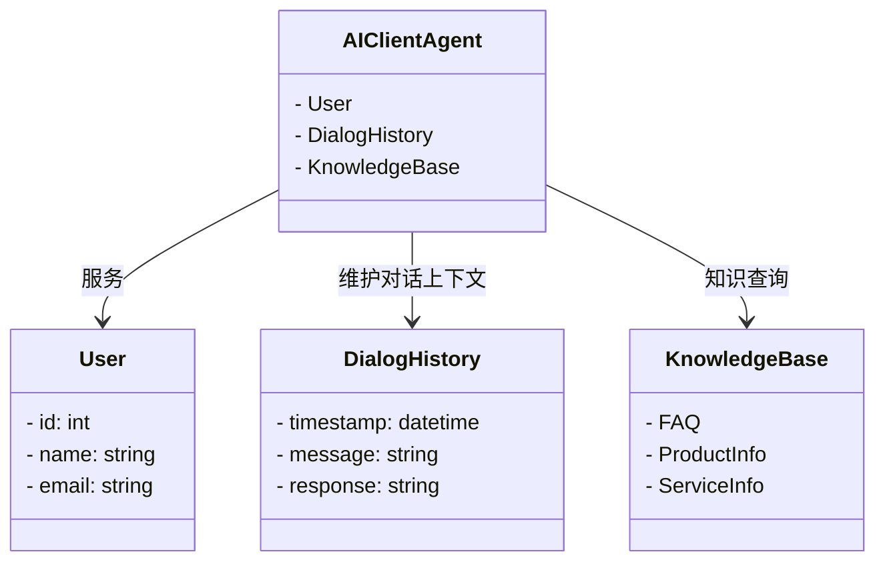
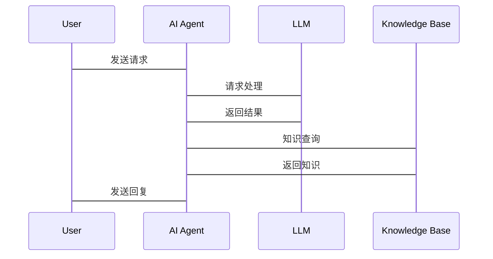

                 


# 智能客户服务AI Agent：LLM驱动的全天候支持系统

---

## 关键词：
人工智能、大语言模型、智能客服、全天候支持、LLM应用、系统设计、算法原理

---

## 摘要：
随着人工智能技术的飞速发展，大语言模型（LLM）在智能客服领域的应用越来越广泛。本文详细探讨了如何利用LLM构建一个全天候支持的智能客户服务系统，从系统背景、核心概念、算法原理到系统设计、项目实战，再到最佳实践，全面解析了该系统的构建过程和关键要点。通过本文的分析，读者可以深入了解LLM在智能客服中的应用价值，并掌握如何设计和实现一个高效、可靠的智能客户服务系统。

---

# 第1章: 智能客户服务AI Agent概述

## 1.1 智能客户服务的发展历程
### 1.1.1 从传统客服到智能客服的演变
传统客服依赖人工坐席执行标准化流程，存在响应速度慢、效率低、成本高等问题。随着人工智能技术的发展，智能客服逐渐成为主流，通过自然语言处理（NLP）技术实现自动化服务。大语言模型（LLM）的出现进一步提升了智能客服的能力，使其能够处理复杂、多样化的客户需求。

### 1.1.2 LLM在智能客服中的作用
LLM通过强大的自然语言理解（NLU）和生成（NLG）能力，能够准确理解客户需求并生成自然流畅的回复。这种能力使得智能客服能够覆盖更多场景，提高客户满意度，同时降低企业的运营成本。

### 1.1.3 全天候支持系统的核心概念
全天候支持系统是指无论时间、地点，客户都可以通过多种渠道（如网页、APP、社交媒体等）随时获得智能客服的帮助。LLM驱动的AI Agent是实现这一目标的核心技术，通过深度学习算法不断优化服务质量。

---

## 1.2 问题背景与挑战
### 1.2.1 客户服务行业面临的痛点
传统客服系统存在以下问题：
- 人工成本高：需要大量客服人员，导致运营成本居高不下。
- 响应速度慢：客户等待时间长，影响用户体验。
- 服务质量不稳定：依赖人工判断，容易出现错误或遗漏。
- 覆盖范围有限：无法实现24/7的全天候支持。

### 1.2.2 LLM如何解决这些问题
- **降低人工成本**：通过自动化处理客户需求，减少对人工客服的依赖。
- **提高响应速度**：智能客服系统可以在几秒钟内完成理解和回复，显著缩短客户等待时间。
- **提升服务质量**：LLM通过深度学习不断优化回答的准确性和自然度，提供一致的高质量服务。
- **实现全天候支持**：智能客服系统可以7×24小时运行，随时响应客户需求。

### 1.2.3 系统边界与外延
智能客户服务系统的边界包括：
- 输入：客户的文本或语音请求。
- 输出：系统生成的文本回复或操作建议。
- 边界条件：支持的语言、渠道、问题类型等。

外延包括与外部系统的集成，如CRM系统、知识库管理系统等。

---

## 1.3 核心概念与系统架构
### 1.3.1 LLM驱动的AI Agent定义
LLM驱动的AI Agent是一种基于大语言模型的智能客服系统，能够通过自然语言处理技术理解客户需求并生成合适的回复。

### 1.3.2 系统的核心要素组成
- **自然语言理解（NLU）**：识别客户请求的意图和实体。
- **自然语言生成（NLG）**：生成符合上下文的回复。
- **知识库管理**：存储和管理业务相关知识。
- **对话管理**：维护对话上下文，确保对话连贯性。

### 1.3.3 系统的总体架构图


---

# 第2章: 大语言模型（LLM）原理

## 2.1 LLM的基本原理
### 2.1.1 模型结构与训练方法
大语言模型通常采用基于Transformer的架构，包括编码器和解码器两部分。模型通过自注意力机制捕捉文本中的语义关系，训练时采用自监督学习方法。

### 2.1.2 LLM的核心特点与优势
- **强大的上下文理解能力**：能够处理长文本，理解复杂的语义关系。
- **多任务学习能力**：一个模型可以同时完成多种NLP任务，如文本分类、问答系统、机器翻译等。
- **可扩展性**：通过微调或提示工程技术，可以快速适应不同业务场景。

---

## 2.2 LLM与NLP技术的关系
### 2.2.1 自然语言理解（NLU）与生成（NLG）
- **NLU**：将客户输入的文本转换为结构化的信息，如意图和实体。
- **NLG**：根据结构化的信息生成自然流畅的文本回复。

### 2.2.2 LLM与其他NLP技术的对比
| 技术 | 优点 | 缺点 |
|------|------|------|
| 规则引擎 | 易部署、成本低 | 需手动编写规则，难以应对复杂场景 |
| 传统机器学习 | 可解释性高 | 需大量标注数据，难以实时更新 |
| LLM | 强大的语义理解能力 | 需高性能计算资源，成本高 |

---

## 2.3 LLM在智能客服中的应用
### 2.3.1 问题分类与意图识别
- **问题分类**：将客户请求分为常见问题（如产品咨询、售后服务）和非常见问题。
- **意图识别**：识别客户的主要诉求，如“投诉”、“咨询”、“建议”等。

### 2.3.2 文本生成与对话管理
- **文本生成**：根据对话历史生成合适的回复。
- **对话管理**：维护对话上下文，确保对话流畅。

### 2.3.3 知识库的构建与调用
- **知识库构建**：通过标注和整理业务知识，构建结构化的知识库。
- **知识调用**：在对话过程中，智能客服系统会根据客户请求从知识库中提取相关信息。

---

# 第3章: LLM的算法原理

## 3.1 转换器模型（如BERT）的原理
### 3.1.1 模型结构的详细解析
BERT模型采用双向Transformer结构，通过自注意力机制捕捉文本中的语义关系。

### 3.1.2 注意力机制的数学公式
$$ \text{Attention}(Q, K, V) = \text{softmax}\left(\frac{QK^T}{\sqrt{d_k}}\right)V $$

### 3.1.3 前向传播与损失函数
$$ \text{Loss} = -\sum_{i=1}^{n} \text{log}p(x_i|x_{<i}) $$

---

## 3.2 知识蒸馏与模型优化
### 3.2.1 知识蒸馏的基本原理
知识蒸馏通过将大模型的知识迁移到小模型，降低计算成本。

### 3.2.2 模型压缩与优化方法
- **剪枝**：去除模型中冗余的参数。
- **量化**：将模型参数从浮点数转换为整数，降低存储和计算成本。

---

# 第4章: 系统分析与架构设计

## 4.1 问题场景与需求分析
### 4.1.1 客户服务场景的典型问题
- 客户咨询产品信息。
- 投诉售后服务。
- 查询订单状态。

### 4.1.2 系统功能需求的详细描述
- **自然语言理解**：准确识别客户意图。
- **智能回复生成**：生成符合上下文的回复。
- **知识库管理**：实时更新和维护知识库。

---

## 4.2 系统功能设计
### 4.2.1 领域模型设计（Mermaid类图）


---

## 4.3 系统架构设计（Mermaid架构图）


---

## 4.4 系统接口与交互流程
### 4.4.1 系统接口设计
- **客户输入接口**：接收客户文本或语音请求。
- **知识库接口**：提供业务知识查询功能。
- **对话历史接口**：记录和维护对话上下文。

### 4.4.2 系统交互流程（Mermaid序列图）


---

# 第5章: 项目实战

## 5.1 环境安装与配置
### 5.1.1 安装Python和相关库
```bash
pip install python
pip install transformers
pip install torch
```

### 5.1.2 配置LLM模型
```python
from transformers import AutoTokenizer, AutoModelForCausalLM
tokenizer = AutoTokenizer.from_pretrained('gpt2')
model = AutoModelForCausalLM.from_pretrained('gpt2')
```

---

## 5.2 系统核心实现
### 5.2.1 对话管理实现
```python
class DialogManager:
    def __init__(self):
        self.history = []
    
    def add_message(self, message):
        self.history.append(message)
    
    def get_context(self):
        return ' '.join(self.history)
```

### 5.2.2 知识库实现
```python
class KnowledgeBase:
    def __init__(self):
        self.faq = {}
    
    def add_faq(self, question, answer):
        self.faq[question] = answer
    
    def get_answer(self, question):
        return self.faq.get(question, '无法回答')
```

---

## 5.3 代码实现与解读
### 5.3.1 整体代码结构
```python
# imports
from transformers import AutoTokenizer, AutoModelForCausalLM
import json

# 定义知识库
class KnowledgeBase:
    def __init__(self):
        self.data = {}

    def add(self, key, value):
        self.data[key] = value

    def get(self, key):
        return self.data.get(key, '')

# 定义对话管理器
class DialogManager:
    def __init__(self):
        self.history = []

    def add_message(self, message):
        self.history.append(message)

    def get_context(self):
        return ' '.join(self.history)

# 定义AI Agent
class AIClientAgent:
    def __init__(self, model_name):
        self.tokenizer = AutoTokenizer.from_pretrained(model_name)
        self.model = AutoModelForCausalLM.from_pretrained(model_name)
        self.dialog_manager = DialogManager()
        self.knowledge_base = KnowledgeBase()

    def process_request(self, input_text):
        # 获取上下文
        context = self.dialog_manager.get_context()
        # 组合输入
        full_input = f"{context} {input_text}"
        # 编码
        inputs = self.tokenizer.encode(full_input, return_tensors='pt')
        # 解码
        outputs = self.model.generate(inputs, max_length=100, num_beams=5)
        response = self.tokenizer.decode(outputs[0], skip_special_tokens=True)
        # 更新对话历史
        self.dialog_manager.add_message(input_text)
        self.dialog_manager.add_message(response)
        return response
```

### 5.3.2 代码功能解读
- **KnowledgeBase**：用于存储和管理业务知识，支持添加和查询知识。
- **DialogManager**：维护对话历史，记录每次对话的内容。
- **AIClientAgent**：整合LLM模型、对话管理器和知识库，处理客户的请求并生成回复。

---

## 5.4 实际案例分析
### 5.4.1 案例背景
某电商平台希望通过智能客服系统提升客户满意度，减少人工客服的工作量。

### 5.4.2 系统实现
- 集成GPT-2模型，训练模型识别客户的咨询和投诉。
- 通过知识库存储产品信息和常见问题，提高回答的准确率。

### 5.4.3 系统优化
- 定期更新知识库，确保信息的准确性。
- 监控系统性能，优化模型参数，提升回复速度。

---

## 5.5 项目小结
通过实战项目，我们可以看到LLM驱动的智能客服系统在实际应用中的潜力和优势。系统的实现需要结合算法原理、系统设计和业务需求，才能达到预期的效果。

---

# 第6章: 最佳实践与注意事项

## 6.1 最佳实践
### 6.1.1 模型选择与优化
- 根据具体需求选择合适的LLM模型。
- 通过微调或提示工程技术优化模型性能。

### 6.1.2 数据管理和安全
- 确保客户数据的安全性和隐私性。
- 定期更新知识库，保持内容的准确性。

### 6.1.3 系统监控与维护
- 监控系统的运行状态，及时发现和解决问题。
- 定期进行系统维护，确保系统的稳定性和可靠性。

---

## 6.2 小结
智能客户服务AI Agent的实现离不开大语言模型的强大能力，但同时也需要我们对系统进行全面的设计和优化。通过本文的分析和实战，我们可以看到，LLM驱动的智能客服系统不仅能够提高客户满意度，还能显著降低企业的运营成本。

---

# 第7章: 拓展阅读与未来展望

## 7.1 拓展阅读
- 《Deep Learning》—— Yoshua Bengio
- 《自然语言处理入门》—— 于跃等
- 《大语言模型的原理与应用》—— 各大技术博客

## 7.2 未来展望
随着LLM技术的不断进步，智能客服系统将更加智能化和个性化。未来，我们可以期待以下发展：
- 更加智能化的对话管理。
- 更加个性化的服务体验。
- 更加高效的系统优化。

---

# 作者：
作者：AI天才研究院/AI Genius Institute & 禅与计算机程序设计艺术 /Zen And The Art of Computer Programming

---

**以上是《智能客户服务AI Agent：LLM驱动的全天候支持系统》的完整目录和文章内容。希望对您有所帮助！**

