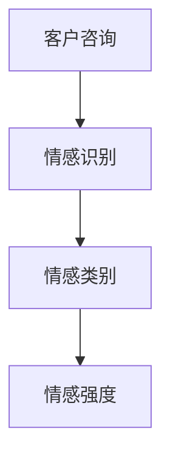
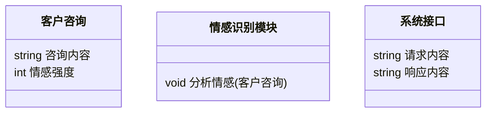
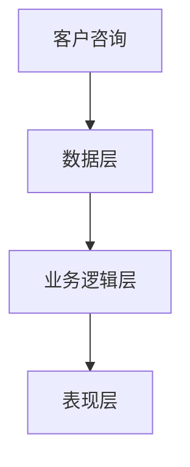
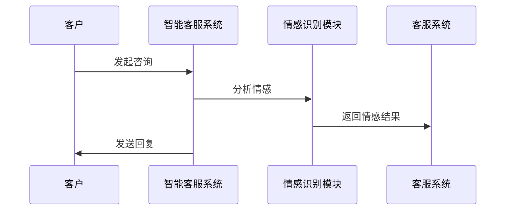

                 


# 智能客服AI Agent的情感识别能力

> 关键词：智能客服，AI Agent，情感识别，自然语言处理，机器学习，情感分类

> 摘要：本文深入探讨了智能客服AI Agent的情感识别能力，从背景介绍、核心概念、算法原理到系统设计和项目实战，全面分析了情感识别在智能客服中的应用及其技术实现。文章结合理论与实践，为读者提供了从基础到高级的详细讲解。

---

# 第1章: 智能客服与AI Agent的背景介绍

## 1.1 智能客服的发展历程

### 1.1.1 传统客服模式的局限性
传统客服模式主要依赖人工坐席执行标准流程，存在以下问题：
- **效率低下**：人工坐席执行标准化流程，效率难以提升。
- **情绪干扰**：客服人员情绪波动会影响服务质量。
- **知识依赖**：依赖客服人员的知识储备和经验。

### 1.1.2 AI技术在客服领域的应用
随着AI技术的发展，智能客服开始应用自然语言处理（NLP）、机器学习等技术，实现自动化服务。

### 1.1.3 情感识别在智能客服中的重要性
情感识别能够帮助智能客服理解客户情绪，提供更精准的服务，提升客户满意度。

## 1.2 AI Agent的基本概念

### 1.2.1 AI Agent的定义与特点
AI Agent是一种智能体，能够感知环境并采取行动以实现目标。其特点包括：
- **自主性**：无需外部干预，自主决策。
- **反应性**：能够实时感知并响应环境变化。
- **学习能力**：通过机器学习不断优化自身行为。

### 1.2.2 情感识别的核心概念
情感识别是通过分析文本、语音或图像，识别出其中的情感倾向。核心概念包括：
- **情感分类**：将文本分为积极、消极或中性。
- **情感强度**：量化情感的强度，例如“非常满意” vs. “满意”。

### 1.2.3 情感识别的边界与外延
情感识别的边界在于仅分析情感，不涉及具体语义理解。外延则包括情绪识别、意图识别等。

## 1.3 情感识别在智能客服中的应用场景

### 1.3.1 客户咨询的情感分析
通过分析客户咨询文本的情感，识别客户的情绪状态。

### 1.3.2 情感驱动的智能响应
根据客户情感状态，智能生成更贴切的回复。

### 1.3.3 情感数据的反馈机制
将情感数据用于优化客服流程和提升服务质量。

---

# 第2章: 情感识别的核心概念与联系

## 2.1 情感识别的原理

### 2.1.1 自然语言处理（NLP）的基础
NLP是情感识别的基础，包括分词、句法分析等步骤。

### 2.1.2 情感识别的特征提取
特征提取是关键步骤，包括关键词提取、情感词典构建等。

### 2.1.3 情感分类的算法选择
常用算法包括支持向量机（SVM）、随机森林（RF）和深度学习模型（如LSTM）。

## 2.2 情感识别的特征对比

### 2.2.1 基于词袋模型的特征提取
- **优点**：简单易实现。
- **缺点**：无法捕捉语义信息。

### 2.2.2 基于词嵌入的特征提取
- **优点**：能够捕捉语义信息。
- **缺点**：计算复杂度较高。

### 2.2.3 基于句法结构的特征提取
- **优点**：能够分析句子结构。
- **缺点**：实现复杂。

## 2.3 情感识别的ER实体关系图



---

# 第3章: 情感识别的算法原理

## 3.1 基于规则的情感识别算法

### 3.1.1 规则的定义与特点
基于预定义规则，例如“感谢”表示积极情感。

### 3.1.2 规则的实现步骤
1. 构建情感词典。
2. 匹配文本中的关键词。
3. 根据匹配结果分类。

### 3.1.3 规则的优缺点对比
- **优点**：实现简单，适合小规模数据。
- **缺点**：难以处理复杂情感。

## 3.2 基于机器学习的情感识别算法

### 3.2.1 机器学习算法选择
常用算法包括SVM、随机森林和朴素贝叶斯。

### 3.2.2 机器学习的实现步骤
1. 数据预处理：分词、去停用词。
2. 特征提取：构建特征向量。
3. 模型训练：使用训练数据训练模型。
4. 模型评估：使用测试数据评估性能。

### 3.2.3 机器学习的优缺点对比
- **优点**：能够处理复杂情感。
- **缺点**：需要大量标注数据。

---

# 第4章: 系统分析与架构设计方案

## 4.1 问题场景介绍
智能客服系统需要处理大量客户咨询，要求快速准确地识别客户情感。

## 4.2 系统功能设计

### 4.2.1 领域模型设计


### 4.2.2 系统架构设计


### 4.2.3 系统接口设计
系统接口包括客户咨询接口和情感识别接口。

### 4.2.4 系统交互流程


---

# 第5章: 项目实战

## 5.1 环境安装
安装Python和相关库，如numpy、scikit-learn、spaCy。

## 5.2 核心代码实现

### 5.2.1 情感识别模块实现
```python
from sklearn.feature_extraction.text import TfidfVectorizer
from sklearn.svm import SVC

# 数据预处理
X = [...]  # 文本数据
y = [...]  # 情感标签

# 特征提取
vectorizer = TfidfVectorizer()
X_vec = vectorizer.fit_transform(X)

# 模型训练
model = SVC()
model.fit(X_vec, y)

# 模型预测
def predict_emotion(text):
    text_vec = vectorizer.transform([text])
    return model.predict(text_vec)[0]
```

### 5.2.2 情感分类数学模型
$$f(x) = \text{sign}(w \cdot x + b)$$

## 5.3 项目总结
情感识别在智能客服中的应用能够显著提升客户体验和满意度。

---

# 第6章: 最佳实践与小结

## 6.1 最佳实践
- 定期更新情感词典。
- 优化特征提取方法。
- 提升模型泛化能力。

## 6.2 小结
本文详细讲解了智能客服AI Agent的情感识别能力，从理论到实践，为读者提供了全面的技术指导。

## 6.3 注意事项
- 数据标注需谨慎。
- 模型需定期更新。
- 注意隐私保护。

## 6.4 拓展阅读
推荐阅读《自然语言处理入门》和《机器学习实战》。

---

# 作者：AI天才研究院 & 禅与计算机程序设计艺术

