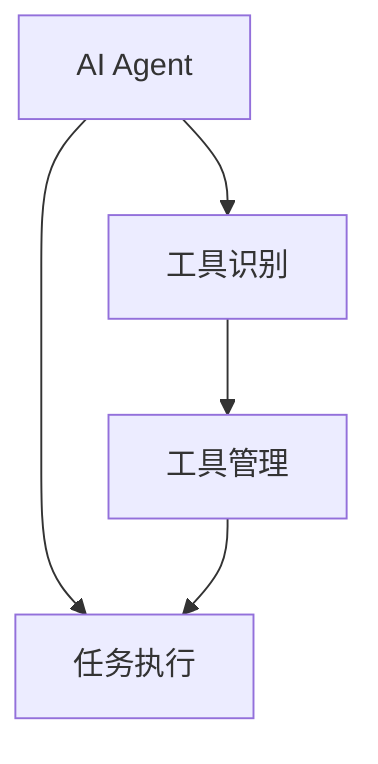

                 

# 智能工具箱：AI Agent的工具识别与管理

---

## 关键词

- AI Agent
- 工具识别
- 工具管理
- 机器学习
- 系统架构

---

## 摘要

AI Agent（人工智能代理）作为现代计算机科学中的重要概念，其核心能力之一是能够有效地识别和管理各种工具。工具识别与管理是AI Agent实现复杂任务的关键技术，涉及算法原理、系统架构、项目实现等多个方面。本文将从AI Agent的工具识别与管理的基本原理出发，深入分析其算法实现、系统架构设计、项目实战等内容，帮助读者全面理解并掌握这一技术。

---

## 第一部分: AI Agent与工具识别概述

### 第1章: AI Agent与工具识别概述

#### 1.1 问题背景

##### 1.1.1 AI Agent的基本概念

AI Agent（人工智能代理）是一种能够感知环境、自主决策并执行任务的智能体。它可以分为简单反射型、基于模型的反射型、目标驱动型和效用驱动型四种类型。AI Agent的核心能力包括感知、推理、规划和执行。

##### 1.1.2 工具识别的定义与范围

工具识别是指AI Agent通过传感器或算法，识别环境中可用工具的过程。工具可以是物理工具（如机械臂）或虚拟工具（如软件库）。工具识别的范围包括工具的类型、状态和位置。

##### 1.1.3 问题描述与目标

AI Agent需要能够识别和管理工具，以便高效完成任务。例如，在工业自动化中，AI Agent需要识别生产线上的工具并进行调度。工具识别的目标是提高AI Agent的自主性和效率。

---

#### 1.2 核心概念与联系

##### 1.2.1 AI Agent的核心要素

AI Agent的核心要素包括感知、推理、规划和执行。感知是通过传感器获取环境信息，推理是通过逻辑推理理解信息，规划是制定行动计划，执行是通过工具完成任务。

##### 1.2.2 工具识别的关键属性

工具识别的关键属性包括工具类型、工具状态和工具位置。工具类型决定了工具的功能，工具状态决定了工具的可用性，工具位置决定了工具的位置。

##### 1.2.3 核心概念关系图

---

## 第二部分: 工具识别与管理的核心原理

### 第2章: 工具识别的算法原理

#### 2.1 工具识别的基本原理

工具识别的基本原理是通过算法对工具的特征进行分类。特征提取是关键步骤，常用的特征包括颜色、形状和纹理。

##### 2.1.1 分类算法概述

分类算法是工具识别的核心。常用的分类算法包括K-近邻算法（KNN）、支持向量机（SVM）和神经网络模型。

##### 2.1.2 工具识别的特征提取

特征提取是工具识别的关键步骤。例如，使用颜色直方图提取工具的颜色特征。

##### 2.1.3 分类器的选择与优化

分类器的选择与优化需要考虑准确率、召回率和F1值。例如，使用交叉验证优化KNN算法的k值。

#### 2.2 工具识别的分类算法

##### 2.2.1 K-近邻算法（KNN）

KNN算法是一种简单的分类算法，适用于小规模数据集。其步骤包括数据预处理、计算距离和投票分类。

##### 2.2.2 支持向量机（SVM）

SVM算法适用于高维数据，通过构建超平面实现分类。其步骤包括数据映射、构建超平面和分类。

##### 2.2.3 神经网络模型

神经网络模型通过多层感知机实现非线性分类。其步骤包括数据预处理、网络训练和分类。

---

### 第3章: 工具管理的系统架构

#### 3.1 系统功能设计

##### 3.1.1 工具识别模块

工具识别模块负责识别工具的类型、状态和位置。

##### 3.1.2 工具管理模块

工具管理模块负责工具的调度和状态更新。

##### 3.1.3 用户交互模块

用户交互模块负责接收用户指令并反馈结果。

#### 3.2 系统架构设计

##### 3.2.1 分层架构设计

分层架构设计将系统划分为数据层、业务逻辑层和表示层。

##### 3.2.2 微服务架构设计

微服务架构设计将系统划分为多个独立的服务模块。

##### 3.2.3 组件交互流程

组件交互流程包括工具识别、工具管理和服务调用。

---

## 第三部分: 工具识别与管理的系统实现

### 第4章: 工具识别与管理的系统分析

#### 4.1 问题场景介绍

##### 4.1.1 工具识别的典型场景

例如，在工业自动化中，AI Agent需要识别生产线上的工具。

##### 4.1.2 工具管理的业务流程

包括工具调度、工具状态更新和工具位置管理。

##### 4.1.3 系统需求分析

系统需求包括高准确性、实时性和可扩展性。

### 第5章: 工具识别与管理的系统实现

#### 5.1 环境安装与配置

##### 5.1.1 开发环境搭建

安装Python、TensorFlow和OpenCV等依赖库。

##### 5.1.2 数据集准备

准备工具图像数据集并进行标注。

#### 5.2 系统核心实现

##### 5.2.1 工具识别模块实现

使用KNN算法实现工具识别。

##### 5.2.2 工具管理模块实现

使用数据库管理工具信息。

##### 5.2.3 交互模块实现

实现用户与AI Agent的交互界面。

#### 5.3 项目实战

##### 5.3.1 项目介绍

介绍项目背景、目标和实现方案。

##### 5.3.2 代码实现

提供工具识别和管理的Python代码示例。

##### 5.3.3 案例分析

分析实际案例并总结经验。

---

## 第四部分: 总结与展望

### 6章: 总结与展望

#### 6.1 最佳实践

##### 6.1.1 小结

总结工具识别与管理的核心技术和实现方法。

##### 6.1.2 注意事项

注意数据质量和算法优化。

##### 6.1.3 拓展阅读

建议阅读相关领域的书籍和论文。

---

## 作者

作者：AI天才研究院/AI Genius Institute & 禅与计算机程序设计艺术 /Zen And The Art of Computer Programming

---

希望这篇文章能够帮助读者全面理解AI Agent的工具识别与管理技术。

