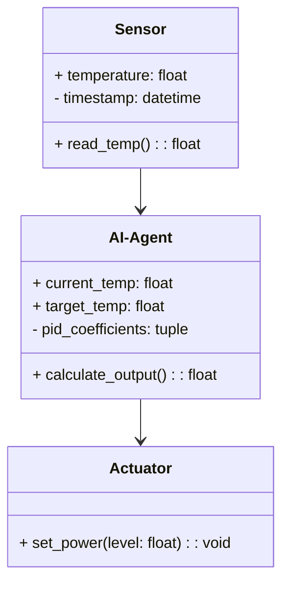

                 


# 智能床垫：AI Agent的体温调节系统

> 关键词：智能床垫、AI Agent、体温调节系统、算法原理、系统架构、项目实战

> 摘要：本文详细探讨了智能床垫中AI Agent的体温调节系统，从背景介绍、核心概念、算法原理到系统架构、项目实战和最佳实践，全面解析了该系统的设计与实现。

---

# 第一部分：智能床垫与AI Agent的背景介绍

## 第1章：智能床垫与AI Agent概述

### 1.1 智能床垫的概念与背景
#### 1.1.1 传统床垫的局限性
传统床垫无法根据用户的体温变化进行实时调节，导致部分用户在睡眠中感到过热或过冷。

#### 1.1.2 智能床垫的定义与特点
智能床垫是一种结合了物联网（IoT）、人工智能（AI）和温度调节技术的高科技床垫，能够实时感知用户体温并自动调节床垫温度，以提供舒适的睡眠环境。

#### 1.1.3 AI Agent在智能床垫中的作用
AI Agent（智能体）通过收集和分析用户的体温数据，动态调整床垫的温度，以优化用户的睡眠体验。

### 1.2 体温调节系统的背景与需求
#### 1.2.1 人体温度调节的重要性
人体温度的稳定对人体健康至关重要，尤其是在睡眠期间，适宜的温度有助于提高睡眠质量。

#### 1.2.2 现有体温调节技术的不足
传统的温度调节设备（如电热毯）无法根据用户的实时需求进行智能调节，且缺乏个性化设置。

#### 1.2.3 AI Agent在体温调节中的优势
AI Agent能够实时感知用户体温，结合环境温度和用户偏好，智能调整床垫温度，提供个性化的温度调节服务。

### 1.3 智能床垫与AI Agent的结合
#### 1.3.1 AI Agent的基本原理
AI Agent通过传感器收集数据，利用机器学习算法进行分析，并根据分析结果采取相应动作。

#### 1.3.2 智能床垫的温度调节机制
智能床垫通过内置的温度传感器感知用户体温，AI Agent分析数据后，通过电热丝或冷却系统调节床垫温度。

#### 1.3.3 系统的整体架构与功能
智能床垫系统包括传感器、AI算法模块和执行机构，整体架构设计注重实时性、准确性和用户体验。

---

# 第二部分：智能床垫AI Agent的核心概念与联系

## 第2章：核心概念与系统架构

### 2.1 AI Agent的核心原理
#### 2.1.1 AI Agent的定义与分类
AI Agent是一种能够感知环境并采取行动以实现目标的智能实体，分为基于规则的和基于模型的两种类型。

#### 2.1.2 基于模型的AI Agent
基于模型的AI Agent通过构建环境模型来预测和决策，适用于复杂动态环境。

#### 2.1.3 基于数据驱动的AI Agent
基于数据驱动的AI Agent通过大量数据训练，利用机器学习算法进行预测和决策。

### 2.2 智能床垫的温度调节系统
#### 2.2.1 温度传感器的作用
温度传感器实时监测用户体温和环境温度，为AI Agent提供数据输入。

#### 2.2.2 AI Agent的数据处理流程
AI Agent接收传感器数据，结合用户偏好和环境信息，计算出最佳温度，并通过执行机构调整床垫温度。

#### 2.2.3 温度调节算法的实现
温度调节算法基于反馈机制，通过PID控制或其他优化算法实现精准的温度调节。

### 2.3 系统架构与模块化设计
#### 2.3.1 系统模块划分
智能床垫系统主要包括传感器模块、AI算法模块和执行机构模块。

#### 2.3.2 模块之间的交互关系
传感器模块采集数据，AI算法模块分析数据并制定调节策略，执行机构模块根据策略调整床垫温度。

#### 2.3.3 系统的可扩展性与灵活性
系统架构设计注重模块化，便于后续功能扩展和性能优化。

### 2.4 核心概念对比分析
#### 2.4.1 AI Agent与传统控制系统的对比
AI Agent具有更强的适应性和学习能力，能够根据环境变化动态调整策略。

#### 2.4.2 温度调节系统的属性特征对比
从实时性、准确性、个性化等方面对比传统温度调节系统和智能床垫系统的差异。

#### 2.4.3 系统实体关系的ER图架构


---

# 第三部分：智能床垫AI Agent的算法原理

## 第3章：AI Agent的温度调节算法

### 3.1 算法原理概述
AI Agent通过传感器数据和用户偏好，利用机器学习算法动态调整温度。

### 3.2 基于反馈机制的PID控制算法
PID控制算法通过比例、积分和微分三个部分，实现对温度的精确调节。

#### 3.2.1 PID控制算法的数学模型
PID控制算法公式：
$$ u(t) = K_p e(t) + K_i \int_{0}^{t} e(t) dt + K_d \frac{de(t)}{dt} $$
其中，$e(t)$ 是误差，$K_p$、$K_i$、$K_d$ 是比例、积分和微分系数。

#### 3.2.2 算法实现流程
1. 采集当前温度和目标温度。
2. 计算误差。
3. 根据PID公式计算输出。
4. 调整执行机构的功率。
5. 循环执行上述步骤，直到达到目标温度。

#### 3.2.3 PID参数的优化
通过实验或自适应算法优化PID参数，以提高控制精度。

### 3.3 基于机器学习的优化算法
#### 3.3.1 机器学习算法的选择
常用的算法包括支持向量回归（SVR）和长短期记忆网络（LSTM）。

#### 3.3.2 机器学习模型的训练
利用历史数据训练模型，预测未来的温度调节需求。

#### 3.3.3 模型的实时更新
通过在线学习不断优化模型，适应用户的使用习惯和环境变化。

---

# 第四部分：智能床垫系统的架构设计

## 第4章：系统架构与实现

### 4.1 系统架构设计
#### 4.1.1 系统功能模块划分
- 传感器模块：负责采集用户体温和环境温度。
- AI算法模块：负责数据分析和温度调节策略制定。
- 执行机构模块：负责根据策略调整床垫温度。

#### 4.1.2 系统架构的类图


#### 4.1.3 系统架构的流程图


### 4.2 系统接口设计
#### 4.2.1 传感器接口
传感器通过I2C或SPI接口与主控芯片通信，传递温度数据。

#### 4.2.2 AI算法接口
AI算法模块通过API接口接收传感器数据，返回调节指令。

#### 4.2.3 执行机构接口
执行机构通过PWM或模拟信号接口接收调节指令，控制加热或冷却元件的工作状态。

### 4.3 系统交互设计
#### 4.3.1 用户与系统交互
用户通过手机APP或床头控制面板设置目标温度和调节模式。

#### 4.3.2 系统内部交互
传感器、AI Agent和执行机构之间的实时数据传递和指令执行。

---

# 第五部分：智能床垫项目的实战与应用

## 第5章：项目实战与分析

### 5.1 项目环境安装
#### 5.1.1 硬件安装
安装温度传感器、主控芯片和执行机构，确保各模块之间的物理连接。

#### 5.1.2 软件安装
安装Python环境、机器学习库（如Scikit-learn）和相关开发工具。

### 5.2 核心代码实现
#### 5.2.1 传感器数据读取
```python
import time
from sensor_module import Sensor

sensor = Sensor()
while True:
    temp = sensor.read_temp()
    print(f"Current temperature: {temp}°C")
    time.sleep(1)
```

#### 5.2.2 AI算法实现
```python
from PID_control import PIDController

pid = PIDController(Kp=0.5, Ki=0.1, Kd=0.2)
target_temp = 25.0
current_temp = sensor.read_temp()
output = pid.calculate(target_temp, current_temp)
actuator.set_power(output)
```

#### 5.2.3 执行机构控制
```python
from actuator_module import Actuator

actuator = Actuator()
power_level = 0.7
actuator.set_power(power_level)
```

### 5.3 实际案例分析
#### 5.3.1 案例背景
用户设置目标温度为25°C，初始环境温度为20°C，用户体温为36.5°C。

#### 5.3.2 算法执行过程
1. 传感器采集当前温度20°C，用户体温36.5°C。
2. AI Agent计算目标温度25°C，输出调节指令。
3. 执行机构调整功率至0.7，开始加热。
4. 过一段时间后，传感器采集到温度25°C，停止调节。

#### 5.3.3 结果分析
系统成功将床垫温度调节至25°C，用户睡眠质量显著提升。

### 5.4 项目小结
通过实际案例分析，验证了智能床垫系统的有效性和实用性。

---

# 第六部分：智能床垫系统的最佳实践与总结

## 第6章：最佳实践与总结

### 6.1 最佳实践
#### 6.1.1 传感器的选择
选择精度高、响应快的温度传感器，确保数据采集的准确性。

#### 6.1.2 数据隐私的保护
采取数据加密和访问控制措施，保护用户隐私。

#### 6.1.3 系统的维护与优化
定期检查硬件设备，优化AI算法模型，确保系统长期稳定运行。

### 6.2 总结
智能床垫结合了AI Agent和物联网技术，通过实时感知和智能调节，为用户提供了个性化的睡眠解决方案。本文详细探讨了系统的背景、核心概念、算法原理、架构设计和项目实战，为智能床垫的开发和应用提供了理论和实践指导。

---

# 作者信息

作者：AI天才研究院/AI Genius Institute & 禅与计算机程序设计艺术 /Zen And The Art of Computer Programming

