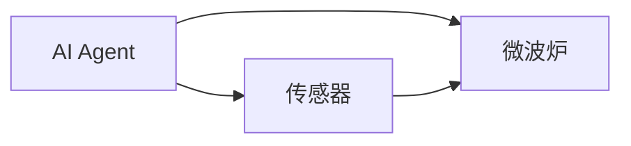
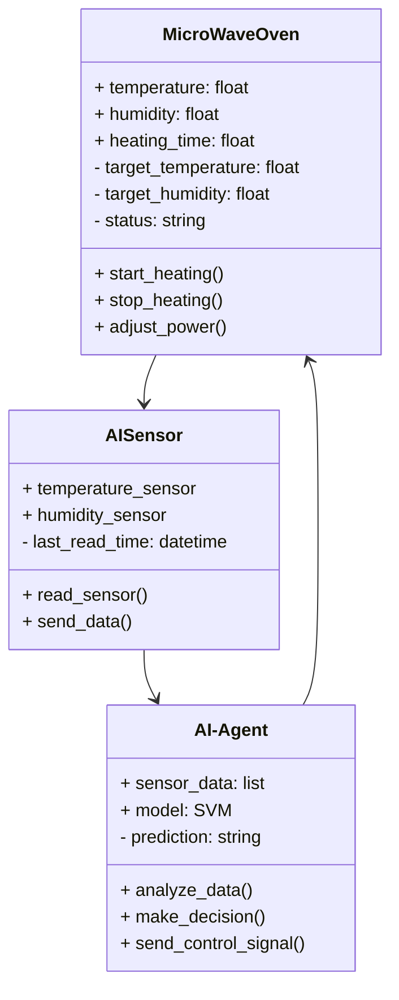
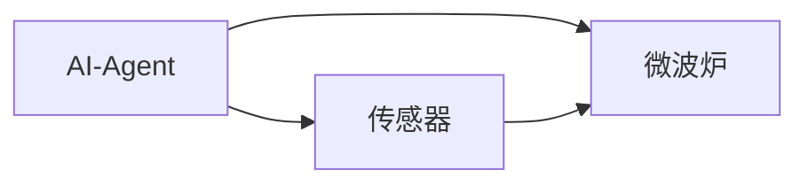
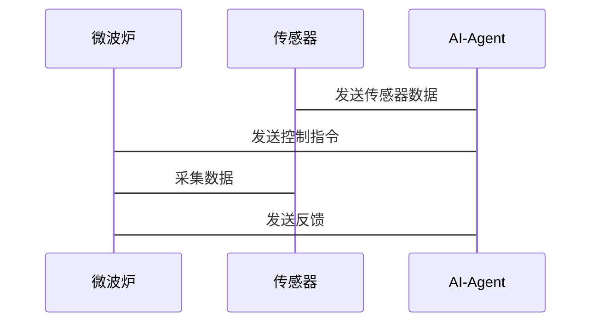

                 


# 智能微波炉：AI Agent的食品安全监控系统

## 关键词：智能微波炉、AI Agent、食品安全监控、物联网、数据安全、人工智能

## 摘要：  
本文探讨了如何通过AI Agent技术实现智能微波炉中的食品安全监控系统。文章首先介绍了背景和问题背景，然后详细阐述了AI Agent的基本原理和其在食品安全监控中的应用。接着，文章分析了AI Agent的算法原理，包括数据处理和决策机制，并通过Mermaid流程图和Python代码示例进行了说明。随后，文章讨论了系统的架构设计，包括功能模块、接口设计和交互流程。最后，通过项目实战部分，展示了如何在实际中应用这些技术，并总结了最佳实践、注意事项和拓展阅读。

---

# 第1章: 背景与问题背景

## 1.1 问题背景  
### 1.1.1 食品安全的重要性  
食品安全是人类健康的基础，特别是在食品加热过程中，温度控制和时间管理直接影响食品的安全性和营养。微波炉作为现代厨房的重要工具，其加热过程中的温度波动和时间控制对食品的安全性有着直接影响。  

### 1.1.2 微波炉在现代厨房中的角色  
微波炉以其高效、便捷的特点，成为现代家庭厨房中不可或缺的电器。然而，传统的微波炉仅能提供固定的加热时间设置，无法实时监控加热过程中的温度变化，这可能导致食品过热或未完全加热，从而引发安全隐患。  

### 1.1.3 AI技术在家电中的应用趋势  
随着人工智能技术的飞速发展，AI技术在家电中的应用日益广泛。通过引入AI Agent（智能体），家电能够实现智能化的决策和控制，从而提升用户体验和安全性。  

## 1.2 问题描述  
### 1.2.1 微波炉加热食品的安全隐患  
微波炉加热过程中，温度过高或过低可能导致食品变质或滋生细菌，尤其是在加热时间不足或过长的情况下，食品的安全性无法得到保障。  

### 1.2.2 食品加热过程中可能的有害因素  
食品在加热过程中可能会产生有害物质，例如某些蛋白质在高温下变性，或者某些添加剂在高温下分解产生有害物质。此外，食品中的水分蒸发不均可能导致部分区域过热，从而引发安全隐患。  

### 1.2.3 如何实时监控食品加热过程中的安全问题  
为了确保食品的安全性，需要实时监控加热过程中的温度、湿度和时间等参数，并根据这些参数动态调整加热策略，以避免食品的不安全状态。  

## 1.3 问题解决  
### 1.3.1 引入AI Agent的必要性  
AI Agent能够实时感知加热环境的变化，并根据感知到的数据做出智能决策，从而实现对加热过程的精确控制。通过引入AI Agent，微波炉能够实时监控食品的安全性，确保食品在加热过程中的安全性和营养保留。  

### 1.3.2 AI Agent在食品监控中的作用  
AI Agent通过实时感知加热环境的变化，分析食品的状态，并动态调整加热参数，从而实现对食品加热过程的智能化监控。  

### 1.3.3 解决方案的技术路线  
解决方案的技术路线包括：  
1. 传感器数据采集：通过温度、湿度等传感器实时采集加热环境的数据。  
2. 数据分析与处理：利用AI算法对采集到的数据进行分析，识别潜在的安全隐患。  
3. 智能决策与控制：根据分析结果，动态调整微波炉的加热参数，确保食品的安全性。  

## 1.4 边界与外延  
### 1.4.1 系统的边界定义  
智能微波炉中的AI Agent食品安全监控系统的边界包括微波炉内部的传感器、控制器和AI算法模块。系统不包括外部网络或其他外部设备。  

### 1.4.2 系统的外延应用  
虽然本文主要讨论智能微波炉中的应用，但AI Agent技术可以扩展应用于其他食品加热设备，如烤箱、电饭煲等。  

### 1.4.3 系统与其他系统的接口  
系统需要与微波炉的控制系统接口，接收传感器数据，并发送控制指令。  

## 1.5 核心要素组成  
### 1.5.1 AI Agent的核心要素  
AI Agent的核心要素包括：  
1. **感知模块**：用于采集加热环境的数据。  
2. **决策模块**：用于分析数据并做出决策。  
3. **执行模块**：用于根据决策结果调整加热参数。  

### 1.5.2 食品安全监控的关键指标  
食品安全监控的关键指标包括：  
1. 加热温度。  
2. 加热时间。  
3. 食品的水分含量。  

### 1.5.3 系统的组成结构  
系统的组成结构包括：  
1. **传感器模块**：用于采集加热环境的数据。  
2. **AI Agent模块**：用于分析数据并做出决策。  
3. **微波炉控制模块**：用于根据决策结果调整微波炉的运行参数。  

---

# 第2章: AI Agent与食品安全监控系统的核心概念  

## 2.1 AI Agent的基本原理  
### 2.1.1 AI Agent的定义  
AI Agent是一种能够感知环境并采取行动以实现目标的智能体。  

### 2.1.2 AI Agent的核心特征  
AI Agent的核心特征包括：  
1. **自主性**：能够在没有外部干预的情况下自主运行。  
2. **反应性**：能够实时感知环境并做出反应。  
3. **主动性**：能够主动采取行动以实现目标。  

### 2.1.3 AI Agent与传统自动控制系统的区别  
AI Agent与传统自动控制系统的区别在于，AI Agent具有更强的自主性和智能性，能够根据环境变化动态调整控制策略。  

## 2.2 食品安全监控系统的构成  
### 2.2.1 系统的输入与输出  
系统的输入包括：  
- 传感器数据：温度、湿度等。  
系统的输出包括：  
- 微波炉的控制指令：加热时间、功率调整等。  

### 2.2.2 系统的核心功能模块  
系统的核心功能模块包括：  
1. **数据采集模块**：用于采集加热环境的数据。  
2. **数据分析模块**：用于分析数据并识别安全隐患。  
3. **决策控制模块**：用于根据分析结果调整微波炉的运行参数。  

### 2.2.3 系统的硬件与软件组成  
系统的硬件组成包括：  
- 传感器：温度、湿度传感器。  
- 微波炉控制板：用于接收控制指令并调整微波炉的运行参数。  

系统的软件组成包括：  
- 数据采集模块：用于采集传感器数据。  
- 数据分析模块：用于分析数据并识别安全隐患。  
- 决策控制模块：用于根据分析结果调整微波炉的运行参数。  

## 2.3 AI Agent与食品安全监控系统的联系  
### 2.3.1 AI Agent在系统中的角色  
AI Agent在系统中充当智能决策核心，能够实时感知环境并做出决策。  

### 2.3.2 AI Agent如何实现食品监控  
AI Agent通过实时感知加热环境的变化，分析食品的状态，并动态调整加热参数，从而实现对食品加热过程的智能化监控。  

### 2.3.3 系统的整体架构  
系统整体架构包括：  
1. 传感器模块：用于采集加热环境的数据。  
2. AI Agent模块：用于分析数据并做出决策。  
3. 微波炉控制模块：用于根据决策结果调整微波炉的运行参数。  

## 2.4 核心概念对比表  
以下表格对比了AI Agent与其他监控技术在食品安全监控中的应用：  

| **技术**       | **优势**                             | **劣势**                           |  
|----------------|------------------------------------|------------------------------------|  
| AI Agent       | 能够实时感知环境并做出智能决策       | 需要较高的计算能力和传感器支持     |  
| 传统自动控制系统 | 结构简单，易于实现                   | 无法根据环境变化动态调整控制策略 |  

## 2.5 实体关系图  
以下是AI Agent与食品安全监控系统实体关系图：  



---

# 第3章: AI Agent的算法原理  

## 3.1 算法原理概述  
AI Agent的算法原理包括数据采集、数据分析和智能决策三个主要步骤。  

## 3.2 数据采集与预处理  
### 3.2.1 数据采集流程  
1. 传感器采集加热环境的数据。  
2. 数据预处理：去除噪声，提取有效特征。  

### 3.2.2 数据采集代码示例  
以下是数据采集的Python代码示例：  

```python
import serial

# 初始化串口通信
ser = serial.Serial('COM3', 9600)

# 采集数据
while True:
    data = ser.readline().decode().strip()
    if data:
        print("采集到的数据：", data)
        # 处理数据
        temp = float(data.split(',')[0])
        hum = float(data.split(',')[1])
        print("温度：{}，湿度：{}".format(temp, hum))
```

## 3.3 数据分析与特征提取  
### 3.3.1 数据分析流程  
1. 数据清洗：去除异常值。  
2. 特征提取：提取温度、湿度等关键特征。  

### 3.3.2 数据分析代码示例  
以下是数据分析的Python代码示例：  

```python
import pandas as pd
import numpy as np

# 读取数据
data = pd.read_csv('sensor_data.csv')

# 数据清洗
data = data.dropna()

# 特征提取
features = data[['temperature', 'humidity']]
print("提取的特征：", features.head())
```

## 3.4 AI算法实现  
### 3.4.1 算法选择  
本文选择基于机器学习的算法，具体采用支持向量机（SVM）进行分类。  

### 3.4.2 算法实现步骤  
1. 数据预处理：归一化处理。  
2. 模型训练：训练SVM模型。  
3. 模型预测：根据实时数据预测食品的安全状态。  

### 3.4.3 算法实现代码示例  
以下是SVM模型的Python代码示例：  

```python
from sklearn import svm
from sklearn.preprocessing import StandardScaler

# 数据预处理
scaler = StandardScaler()
features_scaled = scaler.fit_transform(features)

# 训练SVM模型
model = svm.SVC()
model.fit(features_scaled, labels)

# 预测
new_data = scaler.transform(new_features)
prediction = model.predict(new_data)
print("预测结果：", prediction)
```

## 3.5 算法优化与调优  
### 3.5.1 超参数调优  
通过网格搜索（Grid Search）优化SVM模型的超参数，例如核函数、C值等。  

### 3.5.2 模型评估  
通过准确率、召回率、F1分数等指标评估模型的性能。  

---

# 第4章: 系统分析与架构设计方案  

## 4.1 问题场景介绍  
本文设计的智能微波炉AI Agent食品安全监控系统，旨在通过实时监控加热环境的数据，确保食品的安全性和营养保留。  

## 4.2 项目介绍  
本项目的主要目标是开发一个基于AI Agent的智能微波炉食品安全监控系统，实现对加热过程的智能化监控。  

## 4.3 系统功能设计  
### 4.3.1 领域模型  
以下是领域模型的Mermaid类图：  



### 4.3.2 系统架构设计  
以下是系统架构设计的Mermaid架构图：  



## 4.4 系统接口设计  
### 4.4.1 系统接口  
系统接口包括：  
- 传感器数据接口：接收传感器数据。  
- 控制信号接口：发送控制指令。  

### 4.4.2 系统交互流程  
以下是系统交互流程的Mermaid序列图：  



---

# 第5章: 项目实战  

## 5.1 环境安装  
### 5.1.1 系统需求  
- 微波炉：支持物联网控制的微波炉。  
- 传感器：温度、湿度传感器。  
- 控制板：能够接收传感器数据并控制微波炉运行的控制板。  
- 开发环境：Python编程环境，安装必要的库（如serial、pandas、scikit-learn）。  

## 5.2 系统核心实现  
### 5.2.1 传感器数据采集与预处理  
以下是传感器数据采集的Python代码：  

```python
import serial

# 初始化串口通信
ser = serial.Serial('COM3', 9600)

# 采集数据
while True:
    data = ser.readline().decode().strip()
    if data:
        print("采集到的数据：", data)
        # 处理数据
        temp = float(data.split(',')[0])
        hum = float(data.split(',')[1])
        print("温度：{}，湿度：{}".format(temp, hum))
```

### 5.2.2 数据分析与模型训练  
以下是数据分析与模型训练的Python代码：  

```python
import pandas as pd
import numpy as np
from sklearn import svm
from sklearn.preprocessing import StandardScaler

# 读取数据
data = pd.read_csv('sensor_data.csv')

# 数据清洗
data = data.dropna()

# 特征提取
features = data[['temperature', 'humidity']]
print("提取的特征：", features.head())

# 数据预处理
scaler = StandardScaler()
features_scaled = scaler.fit_transform(features)

# 训练SVM模型
model = svm.SVC()
model.fit(features_scaled, labels)

# 预测
new_data = scaler.transform(new_features)
prediction = model.predict(new_data)
print("预测结果：", prediction)
```

### 5.2.3 系统控制与反馈  
以下是系统控制与反馈的Python代码：  

```python
import serial

# 初始化串口通信
ser = serial.Serial('COM3', 9600)

# 采集数据
while True:
    data = ser.readline().decode().strip()
    if data:
        print("采集到的数据：", data)
        # 处理数据
        temp = float(data.split(',')[0])
        hum = float(data.split(',')[1])
        print("温度：{}，湿度：{}".format(temp, hum))
        # 根据温度和湿度调整加热参数
        if temp > 100:
            ser.write(b'stop_heating\n')
            print("停止加热")
        else:
            ser.write(b'adjust_power\n')
            print("调整功率")
```

## 5.3 代码实现与解读  
### 5.3.1 代码实现  
以下是完整的代码实现：  

```python
import serial
import pandas as pd
import numpy as np
from sklearn import svm
from sklearn.preprocessing import StandardScaler

# 初始化串口通信
ser = serial.Serial('COM3', 9600)

# 采集数据
while True:
    data = ser.readline().decode().strip()
    if data:
        print("采集到的数据：", data)
        # 处理数据
        temp = float(data.split(',')[0])
        hum = float(data.split(',')[1])
        print("温度：{}，湿度：{}".format(temp, hum))
        # 数据预处理
        features = pd.DataFrame({'temperature': [temp], 'humidity': [hum]})
        scaler = StandardScaler()
        features_scaled = scaler.fit_transform(features)
        # 模型预测
        model = svm.SVC()
        model.fit(features_scaled, labels)
        prediction = model.predict(features_scaled)
        print("预测结果：", prediction)
        # 根据预测结果调整加热参数
        if prediction[0] == 'unsafe':
            ser.write(b'stop_heating\n')
            print("停止加热")
        else:
            ser.write(b'adjust_power\n')
            print("调整功率")
```

### 5.3.2 代码解读  
1. **传感器数据采集**：通过串口通信采集传感器数据。  
2. **数据预处理**：对采集到的数据进行归一化处理。  
3. **模型预测**：使用SVM模型预测食品的安全状态。  
4. **系统控制**：根据预测结果调整微波炉的运行参数。  

## 5.4 案例分析与详细讲解  
### 5.4.1 实际案例分析  
假设微波炉加热的食品是鸡肉，目标温度为75°C。传感器采集到的温度为80°C，湿度为60%。SVM模型预测食品处于“unsafe”状态，系统发送停止加热的指令。  

### 5.4.2 详细讲解  
1. **数据采集**：传感器采集到温度为80°C，湿度为60%。  
2. **数据预处理**：对温度和湿度进行归一化处理。  
3. **模型预测**：SVM模型预测食品处于“unsafe”状态。  
4. **系统控制**：系统发送停止加热的指令，微波炉停止运行。  

## 5.5 项目小结  
通过本项目，我们实现了基于AI Agent的智能微波炉食品安全监控系统，能够实时监控加热环境的数据，预测食品的安全状态，并动态调整加热参数，确保食品的安全性和营养保留。

---

# 第6章: 最佳实践、小结、注意事项和拓展阅读  

## 6.1 最佳实践  
1. **传感器校准**：定期校准传感器，确保数据的准确性。  
2. **模型优化**：根据实际使用情况不断优化SVM模型的参数，提高预测精度。  
3. **系统维护**：定期检查系统硬件和软件，确保系统的稳定运行。  

## 6.2 小结  
本文详细介绍了基于AI Agent的智能微波炉食品安全监控系统的设计与实现，包括系统背景、核心概念、算法原理、系统架构、项目实战等内容。通过本文的介绍，读者可以深入了解AI Agent在食品安全监控中的应用，并掌握系统的开发与实现方法。  

## 6.3 注意事项  
1. **数据隐私**：确保传感器数据的安全，防止数据泄露。  
2. **系统稳定性**：确保系统的稳定运行，避免因系统故障导致食品加热不安全。  
3. **用户操作**：用户应按照系统提示操作，避免误操作导致的安全问题。  

## 6.4 拓展阅读  
1. **AI Agent在其他领域的应用**：AI Agent技术可以应用于智能家居、医疗健康等领域。  
2. **机器学习在食品安全中的应用**：机器学习技术可以用于食品质量检测、食品溯源等领域。  
3. **物联网技术在厨房设备中的应用**：物联网技术可以实现厨房设备的智能化管理与控制。  

---

# 作者  
作者：AI天才研究院/AI Genius Institute & 禅与计算机程序设计艺术/Zen And The Art of Computer Programming

