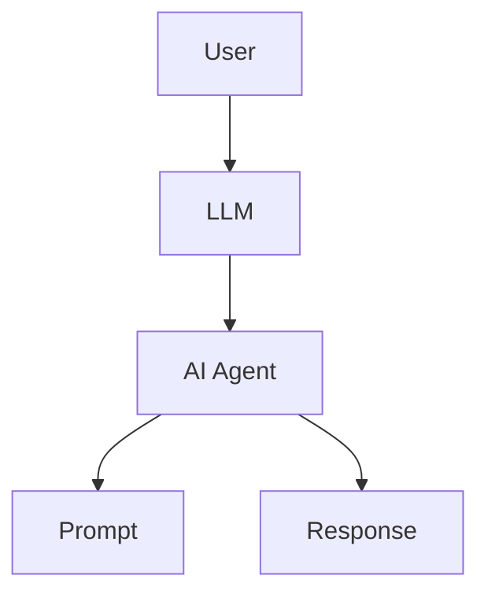
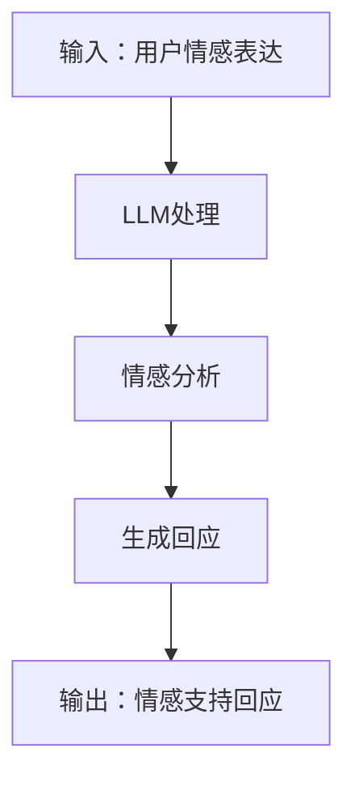

                 


# 智能情感陪伴 AI Agent：LLM 在心理健康领域的深度应用

> 关键词：智能情感陪伴，AI Agent，大语言模型（LLM），心理健康，人机交互

> 摘要：本文详细探讨了智能情感陪伴 AI Agent 在心理健康领域的应用，结合大语言模型（LLM）的技术原理，分析了其在情感支持中的潜力和挑战，提供了系统设计和实际项目的实现方案。

---

## 目录

### 第一部分: 智能情感陪伴 AI Agent 的背景与核心概念

#### 第1章: 智能情感陪伴 AI Agent 的背景介绍

##### 1.1 问题背景
- 1.1.1 心理健康问题的现状与挑战
  - 当前心理健康问题的普遍性和严重性
  - 传统心理咨询的局限性
- 1.1.2 传统心理健康支持的局限性
  - 资源不足、覆盖范围有限
  - 专业人员数量有限
- 1.1.3 AI 技术在心理健康领域的潜力
  - AI技术的高效性、可扩展性和实时性

##### 1.2 问题描述
- 1.2.1 智能情感陪伴的需求分析
  - 用户的情感支持需求层次
  - 不同用户群体的需求差异
- 1.2.2 用户的情感支持需求层次
  - 基础需求：情绪倾听、情感支持
  - 高级需求：情感建议、行为指导
- 1.2.3 情感陪伴 AI Agent 的目标与边界
  - 目标：提供情感支持，缓解心理压力
  - 边界：不能替代专业心理咨询

##### 1.3 问题解决与应用前景
- 1.3.1 情感陪伴 AI Agent 的核心功能
  - 情感倾听、情绪识别、情感反馈
- 1.3.2 LLM 在情感陪伴中的作用
  - 自然语言处理能力
  - 生成式对话能力
- 1.3.3 智能情感陪伴的未来发展方向
  - 技术进步：更准确的情感识别和理解
  - 应用拓展：结合可穿戴设备，实时监测和干预

##### 小结
- 总结本章内容，强调AI Agent在心理健康中的潜力和应用场景

---

#### 第2章: 智能情感陪伴 AI Agent 的核心概念与联系

##### 2.1 核心概念原理
- 2.1.1 大语言模型（LLM）的基本原理
  - 基于Transformer的架构
  - 预训练和微调的过程
- 2.1.2 AI Agent 的定义与功能
  - 定义：具备自主决策能力的智能体
  - 功能：信息处理、决策制定、交互反馈
- 2.1.3 情感陪伴的核心要素
  - 共情能力、情绪识别、对话生成

##### 2.2 核心概念属性特征对比
- 2.2.1 LLM 与传统机器学习模型的对比
  - LLM的优势：上下文理解、生成能力
  - 传统模型的局限性：缺乏生成能力、依赖特征工程
- 2.2.2 AI Agent 与传统对话系统的区别
  - AI Agent：具备目标导向，能自主决策
  - 对话系统：被动响应
- 2.2.3 情感陪伴与任务型对话的差异
  - 情感陪伴：关注情绪支持
  - 任务型对话：解决问题为导向

##### 2.3 实体关系图（ER 图）架构


---

### 第二部分: 算法原理

#### 第3章: 大语言模型（LLM）的算法原理

##### 3.1 LLM 的训练过程
- 3.1.1 监督微调（Fine-tuning）
  - 微调步骤：选择任务、数据预处理、模型训练
  - 示例：使用特定领域数据微调GPT模型
- 3.1.2 强化学习（Reinforcement Learning）
  - 引导策略：奖励机制设计
  - 实现：基于策略梯度的优化方法

##### 3.2 情感分析算法
- 3.2.1 基于词嵌入的情感分析
  - 使用Word2Vec提取情感特征
  - 示例：情感分类任务的准确率对比
- 3.2.2 基于LLM的情感分析
  - 利用生成式模型理解情感语境
  - 示例：复杂句子的情感判断

##### 3.3 对话生成算法
- 3.3.1 基于规则的对话生成
  - 优点：简单易实现
  - 缺点：缺乏灵活性和深度
- 3.3.2 基于LLM的对话生成
  - 使用GPT模型生成自然对话
  - 示例：情感支持对话的生成流程

##### 3.4 算法流程图


---

### 第三部分: 系统分析与架构设计

#### 第4章: 系统分析与架构设计

##### 4.1 问题场景介绍
- 目标：设计一个支持情感陪伴的AI Agent系统
- 适用场景：日常情感支持、压力缓解

##### 4.2 项目介绍
- 项目名称：智能情感陪伴AI Agent系统
- 开发目标：提供24/7的情感支持服务

##### 4.3 系统功能设计
- 领域模型：用户、情感状态、对话历史
- 功能模块：情感分析、对话生成、反馈收集

##### 4.4 系统架构设计
- 微服务架构：前端、后端、数据库
- 组件交互：用户请求、模型处理、反馈生成

##### 4.5 系统接口设计
- API接口：RESTful API设计
- 数据格式：JSON格式交互

##### 4.6 系统交互流程图
```mermaid
sequenceDiagram
    user ->+> agent: 提交情感表达
    activate agent
    agent ->+> llm: 请求情感分析
    activate llm
    llm --> agent: 返回情感标签
    deactivate llm
    agent ->+> dialog_gen: 生成回应
    activate dialog_gen
    dialog_gen --> agent: 返回对话内容
    deactivate dialog_gen
    agent ->+> user: 发送回应
    deactivate agent
```

---

### 第四部分: 项目实战

#### 第5章: 项目实战

##### 5.1 环境安装
- 安装Python和相关库（如TensorFlow、Hugging Face库）
- 安装步骤：pip install命令

##### 5.2 系统核心实现
- 核心代码：情感分析模块和对话生成模块
- 情感分析代码示例：
  ```python
  from transformers import pipeline
  sentiment_analyzer = pipeline("sentiment-analysis")
  print(sentiment_analyzer("I feel so stressed today."))
  ```
- 对话生成代码示例：
  ```python
  from transformers import AutoModelForCausalLM, AutoTokenizer
  model = AutoModelForCausalLM.from_pretrained("gpt2")
  tokenizer = AutoTokenizer.from_pretrained("gpt2")
  inputs = tokenizer("I'm feeling down because...", return_tensors="pt")
  outputs = model.generate(inputs.input_ids, max_length=50)
  print(tokenizer.decode(outputs[0], skip_special_tokens=True))
  ```

##### 5.3 代码应用解读
- 情感分析模块解读：如何处理用户输入并返回情感标签
- 对话生成模块解读：基于LLM生成自然对话

##### 5.4 实际案例分析
- 案例1：用户表达焦虑，系统生成安慰话语
- 案例2：用户寻求建议，系统提供初步解决方案

##### 5.5 项目小结
- 成功实现情感陪伴AI Agent的基本功能
- 需要进一步优化的地方：情感理解的准确性、对话的连贯性

---

### 第五部分: 最佳实践与总结

#### 第6章: 最佳实践与总结

##### 6.1 项目总结
- 成功实现了智能情感陪伴AI Agent系统
- 系统具备情感分析和对话生成功能

##### 6.2 最佳实践 tips
- 数据隐私保护：确保用户数据的安全性
- 模型迭代：定期更新模型以提高准确率
- 伦理问题：明确AI的使用边界，避免误导用户

##### 6.3 注意事项
- 避免过度依赖AI，建议用户在必要时寻求专业帮助
- 定期测试和优化系统性能

##### 6.4 拓展阅读
- 推荐书籍：《人本主义人工智能》
- 推荐论文：《利用大语言模型进行情感支持的研究》

---

### 第六部分: 扩展阅读与参考资料

#### 第7章: 扩展阅读与参考资料

##### 7.1 相关书籍
- 《人工智能：一种现代的方法》
- 《深度学习：方法与应用》

##### 7.2 相关论文
- “利用生成式模型进行情感支持对话”（ACL论文）
- “基于Transformer的情感分析研究”（IEEE论文）

##### 7.3 其他资源
- 开源项目：Hugging Face的Transformers库
- 在线课程：Coursera上的“AI for Healthcare”课程

---

## 作者信息

作者：AI天才研究院（AI Genius Institute） & 禅与计算机程序设计艺术（Zen And The Art of Computer Programming）

---

# 文章结束

