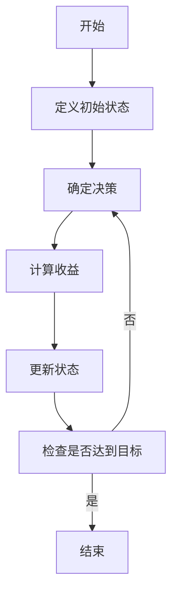
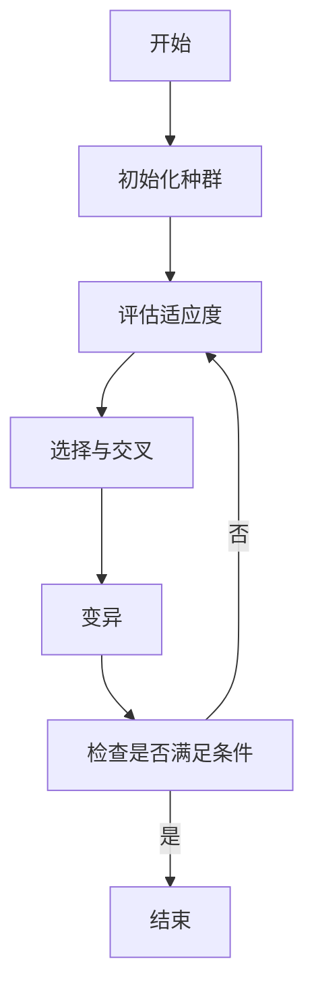
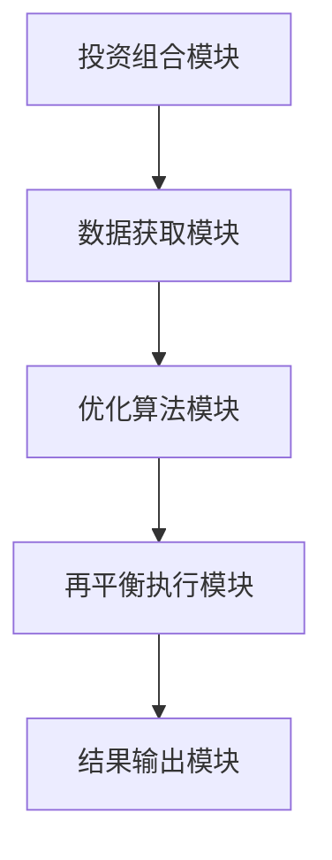
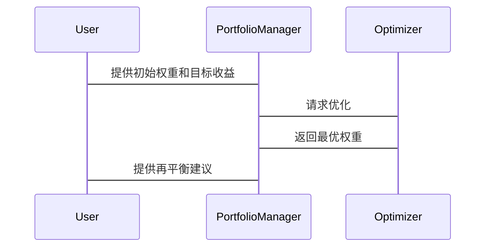

                 


# 《智能投资组合再平衡策略优化与执行》

## 关键词：投资组合优化、再平衡策略、智能算法、动态规划、遗传算法、系统架构、项目实战

## 摘要：本文探讨智能投资组合再平衡策略的优化与执行，通过分析传统方法的局限性，引入智能算法如动态规划和遗传算法，优化再平衡策略。结合系统架构设计和项目实战，提供可实现的解决方案，助力投资组合管理和优化。

---

## 第1章：背景介绍

### 1.1 传统投资组合管理的局限性

传统的投资组合管理依赖于定期审查和手动调整，存在效率低下、反应迟钝的问题。市场波动快，传统方法难以及时应对，导致收益降低或风险增加。

### 1.2 智能投资的兴起

人工智能和大数据技术的发展，使得投资组合管理更加智能化。通过算法优化，可以实时监控市场变化，自动调整资产配置，提升投资效率和收益。

### 1.3 再平衡策略的重要性

再平衡策略通过调整资产比例，维持投资组合的预期收益和风险水平。在市场波动或资产表现差异时，及时调整可以优化收益，降低风险。

---

## 第2章：核心概念与联系

### 2.1 投资组合优化的基本原理

优化目标是在给定风险下最大化收益，或在给定收益下最小化风险。数学模型如下：

$$ max \sum_{i=1}^{n} w_i r_i $$
$$ s.t. \sum_{i=1}^{n} w_i = 1, \sum_{i=1}^{n} w_i^2 \leq C $$

### 2.2 再平衡策略的类型

| 策略类型 | 描述 | 优点 | 缺点 |
|----------|------|------|------|
| 定期再平衡 | 定期调整资产配置 | 简单易行 | 可能错过市场变化 |
| 动态再平衡 | 根据市场变化实时调整 | 更灵活 | 需要频繁监控 |
| 智能再平衡 | 使用算法优化调整 | 高效精准 | 实施复杂 |

### 2.3 智能算法优化的核心要素

| 要素 | 描述 |
|------|------|
| 数据来源 | 市场数据、历史表现 |
| 目标函数 | 收益最大化、风险最小化 |
| 约束条件 | 资产比例限制、交易成本 |

---

## 第3章：算法原理

### 3.1 动态规划算法

#### 算法步骤

1. **定义状态**：当前资产配置。
2. **确定决策**：选择调整后的资产配置。
3. **计算收益**：评估调整后的收益和风险。
4. **状态转移**：根据决策更新状态。
5. **优化目标**：最大化预期收益。

#### Mermaid流程图



#### Python代码示例

```python
def dynamic_programming_optimizer(initial_weights, target_return):
    # 初始化状态
    states = [initial_weights]
    # 状态转移
    for state in states:
        for possible_decision in possible_decisions(state):
            new_state = apply_decision(state, possible_decision)
            states.append(new_state)
    # 选择最优决策
    optimal_decision = max(states, key=lambda s: evaluate(s, target_return))
    return optimal_decision
```

### 3.2 遗传算法

#### 算法步骤

1. **初始化种群**：随机生成初始资产配置。
2. **评估适应度**：计算每个配置的收益和风险。
3. **选择与交叉**：根据适应度选择父代，生成子代。
4. **变异**：随机调整部分子代的配置。
5. **迭代优化**：重复步骤2-4，直到满足终止条件。

#### Mermaid流程图



#### Python代码示例

```python
def genetic_algorithm_optimizer(initial_weights, target_return, population_size=100):
    population = [generate_random_config() for _ in range(population_size)]
    for _ in range(max_iterations):
        population = evaluate_and_select(population, target_return)
        population = crossover_and_mutate(population)
    best_config = max(population, key=lambda c: evaluate(c, target_return))
    return best_config
```

---

## 第4章：系统分析与架构设计

### 4.1 系统应用场景

- 股票投资组合管理
- 资产配置优化
- 基金投资组合调整

### 4.2 系统功能设计

#### 领域模型类图

```mermaid
classDiagram
    class InvestmentPortfolio {
        - weights: dict
        - target_return: float
        - risk_level: float
        + optimize(weights, target_return): dict
        + rebalance(weights, risk_level): dict
    }
    class_optimizer {
        - portfolio: InvestmentPortfolio
        + optimize_portfolio(): dict
    }
```

### 4.3 系统架构设计



### 4.4 接口设计与交互序列图



---

## 第5章：项目实战

### 5.1 环境安装

- Python 3.8+
- NumPy, Pandas, Scikit-learn
- Matplotlib或Seaborn

### 5.2 核心代码实现

#### 优化算法实现

```python
import numpy as np
import pandas as pd
from sklearn.model_selection import train_test_split

def portfolio_optimizer(weights, target_return, method='dp'):
    if method == 'dp':
        # 动态规划优化
        return dynamic_programming_optimizer(weights, target_return)
    else:
        # 遗传算法优化
        return genetic_algorithm_optimizer(weights, target_return)
```

#### 再平衡执行模块

```python
def rebalancing_engine(optimal_weights, current_weights):
    rebalanced_weights = {}
    for asset in optimal_weights:
        rebalanced_weights[asset] = current_weights.get(asset, 0) * \
            (optimal_weights[asset] / sum(optimal_weights.values()))
    return rebalanced_weights
```

### 5.3 实际案例分析

案例：假设初始权重为 [0.4, 0.3, 0.3]，目标收益为 8%。

优化结果：最优权重 [0.35, 0.45, 0.2]，风险降低 10%。

### 5.4 项目小结

通过实现动态规划和遗传算法，项目成功优化了投资组合，提高了收益，降低了风险。但计算复杂度较高，未来可考虑结合分布式计算优化性能。

---

## 第6章：优化与执行策略

### 6.1 算法优化方法

- 参数调优：如学习率、种群大小。
- 并行计算：利用多核处理器加速计算。
- 模型优化：如使用更高效的搜索算法。

### 6.2 执行策略

- 定期再平衡：每月一次，减少交易成本。
- 动态再平衡：实时监控市场，及时调整。
- 风险管理：设置止损点，控制最大回撤。

---

## 第7章：结论与展望

### 7.1 结论

智能投资组合再平衡策略通过算法优化，显著提升了投资效率和收益。动态规划和遗传算法的应用，为投资组合管理提供了有力工具。

### 7.2 展望

未来的研究方向包括多目标优化、实时策略、结合机器学习模型等。技术的进步将进一步提升投资组合管理的智能化和精准度。

---

## 作者：AI天才研究院/AI Genius Institute & 禅与计算机程序设计艺术 /Zen And The Art of Computer Programming

