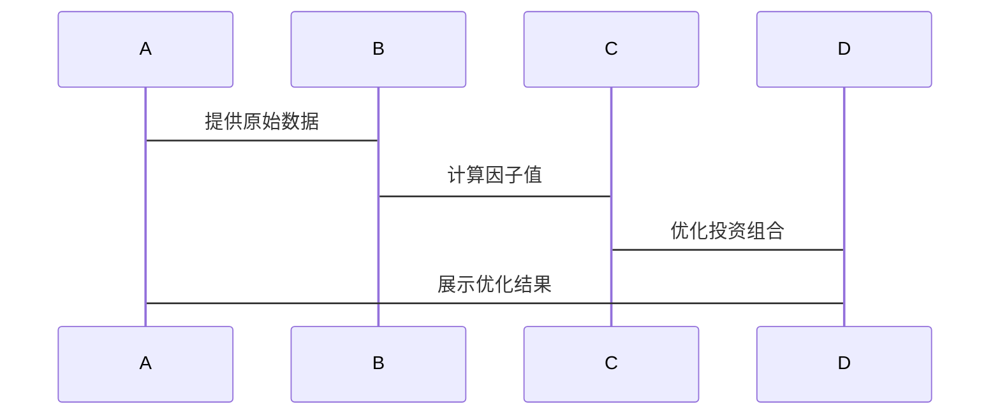

                 


# 智能投资组合因子暴露优化模型

> 关键词：智能投资组合，因子暴露，优化模型，风险管理，算法，系统架构

> 摘要：本文深入探讨了智能投资组合因子暴露优化模型的核心原理、数学模型、算法实现以及系统架构设计。通过对因子模型的分析，结合智能优化算法，提出了一种基于智能优化的投资组合因子暴露优化方法，并通过实际案例分析验证了该模型的有效性。本文旨在为投资组合管理提供一种高效、可靠的优化解决方案。

---

## 第1章: 智能投资组合优化的背景与问题背景

### 1.1 投资组合优化的基本概念

#### 1.1.1 投资组合优化的定义
投资组合优化是通过选择和配置不同的资产，以在给定的风险水平下实现最大收益，或在给定收益水平下实现最小风险的过程。它是现代投资组合理论（MPT）的核心内容。

#### 1.1.2 投资组合优化的核心目标
- 最大化收益：在风险可控的前提下，实现投资组合的最大收益。
- 最小化风险：在收益固定的前提下，降低投资组合的整体风险。

#### 1.1.3 传统投资组合优化的局限性
- 传统优化方法（如均值-方差优化）假设资产收益服从正态分布，忽略了实际市场中的非线性关系。
- 传统方法难以处理大规模数据和复杂约束条件。
- 传统方法对市场波动的适应性较弱。

---

### 1.2 因子模型与风险计量

#### 1.2.1 因子模型的基本概念
因子模型是一种用于描述资产收益之间关系的统计模型。常见的因子模型包括：
- 单因子模型（如市值因子）。
- 多因子模型（如市值、价值、动量因子等）。

#### 1.2.2 风险中性组合与因子暴露
- 风险中性组合：一种投资组合，其对市场风险（Beta）的暴露为零。
- 因子暴露：指投资组合对某个因子的敏感程度，通常用Beta值表示。

#### 1.2.3 因子模型在投资组合优化中的作用
- 因子模型可以帮助投资者更好地理解资产收益的来源。
- 通过因子模型，投资者可以更有效地管理投资组合的风险。

---

### 1.3 智能优化的核心问题

#### 1.3.1 智能优化的定义
智能优化是一种基于人工智能技术的优化方法，结合了传统优化算法和机器学习模型的优势。

#### 1.3.2 智能优化与传统优化的区别
- 数据驱动：智能优化依赖于大量数据，而传统优化依赖于假设和数学模型。
- 自适应性：智能优化能够自适应地调整优化策略，而传统优化策略通常是固定的。

#### 1.3.3 智能优化在投资组合管理中的应用
- 股票组合优化。
- 债券组合优化。
- 多资产类别优化。

---

## 第2章: 因子模型的数学基础

### 2.1 因子模型的基本原理

#### 2.1.1 因子模型的构建过程
1. 确定因子：选择影响资产收益的主要因子（如市值、价值、动量等）。
2. 回归分析：通过回归分析确定因子与资产收益的关系。
3. 计算因子暴露：根据回归结果计算资产对每个因子的暴露。

#### 2.1.2 因子模型的数学表达式
资产收益可以表示为：
$$
r_i = \alpha_i + \beta_i f + \epsilon_i
$$
其中，$\alpha_i$ 是截距项，$\beta_i$ 是因子的系数，$f$ 是因子值，$\epsilon_i$ 是误差项。

#### 2.1.3 因子模型的参数估计方法
- 最小二乘法：用于估计因子模型中的系数。
- 岭回归：用于处理多重共线性问题。

---

### 2.2 现代投资组合理论与因子模型的结合

#### 2.2.1 现代投资组合理论的核心思想
- 投资者可以通过分散投资降低非系统性风险。
- 最优投资组合是在有效前沿上的组合。

#### 2.2.2 因子模型在现代投资组合理论中的应用
- 通过因子模型构建风险调整后的收益模型。
- 使用因子模型优化投资组合的Beta风险。

#### 2.2.3 因子模型与风险调整收益的关系
- 风险调整收益：调整后的收益，考虑了投资组合的风险。
- 因子模型可以帮助投资者更好地衡量风险调整收益。

---

### 2.3 因子模型的优缺点分析

#### 2.3.1 因子模型的优点
- 能够解释资产收益的来源。
- 可以帮助投资者更好地管理风险。

#### 2.3.2 因子模型的缺点
- 需要依赖于因子的选择。
- 对因子模型的假设可能与实际市场不符。

#### 2.3.3 因子模型的改进方向
- 引入更多因子。
- 使用机器学习方法改进因子模型。

---

## 第3章: 智能优化算法与数学模型

### 3.1 智能优化算法的原理与实现

#### 3.1.1 智能优化算法的基本原理
智能优化算法是一种基于智能体的优化方法，包括遗传算法、模拟退火、粒子群优化等。

#### 3.1.2 常见智能优化算法的实现
- 遗传算法：
  1. 初始化种群。
  2. 计算适应度。
  3. 选择、交叉、变异。
  4. 重复迭代。

- 模拟退火：
  1. 初始化温度。
  2. 计算能量。
  3. 降温迭代。

- 粒子群优化：
  1. 初始化粒子。
  2. 计算适应度。
  3. 更新速度和位置。

#### 3.1.3 智能优化算法在投资组合优化中的应用
- 用于解决非线性优化问题。
- 用于处理大规模数据。

---

### 3.2 智能优化算法在投资组合优化中的应用

#### 3.2.1 智能优化算法在因子暴露优化中的应用
- 使用粒子群优化算法优化因子暴露。

#### 3.2.2 智能优化算法在风险控制中的应用
- 使用模拟退火算法优化风险调整收益。

#### 3.2.3 智能优化算法在组合优化中的应用
- 使用遗传算法优化投资组合配置。

---

## 第4章: 投资组合优化系统的架构与实现

### 4.1 系统功能需求分析

#### 4.1.1 系统功能模块划分
- 数据获取模块。
- 因子计算模块。
- 优化算法模块。
- 结果分析模块。

#### 4.1.2 系统功能模块的交互关系
1. 数据获取模块提供原始数据。
2. 因子计算模块计算因子值。
3. 优化算法模块优化投资组合。
4. 结果分析模块展示优化结果。

---

### 4.2 系统架构设计

#### 4.2.1 系统架构设计图


#### 4.2.2 系统交互流程图


---

## 第5章: 项目实战与案例分析

### 5.1 项目环境安装

#### 5.1.1 环境配置
- Python 3.8+
- numpy, pandas, matplotlib, scikit-learn

---

### 5.2 系统核心实现源代码

#### 5.2.1 因子计算模块
```python
import numpy as np
import pandas as pd

def calculate_factor_exposure(factor, returns):
    # 因子回归模型
    X = factor.values
    y = returns.values
    # 岭回归
    from sklearn.linear_model import Ridge
    model = Ridge(alpha=0.1)
    model.fit(X, y)
    return model.coef_
```

#### 5.2.2 优化算法模块
```python
import numpy as np
import random

def genetic_algorithm(objective_func, constraints, pop_size=100, generations=100):
    # 初始化种群
    population = [random.uniform(0, 1) for _ in range(pop_size)]
    # 迭代
    for _ in range(generations):
        # 计算适应度
        fitness = [objective_func(individual) for individual in population]
        # 选择
        selected = [population[i] for i in sorted(range(len(fitness)), key=lambda x: -fitness[x])[:int(pop_size/2)]]
        # 交叉
        new_population = []
        for i in range(len(selected)):
            for j in range(i+1, len(selected)):
                child = (selected[i] + selected[j])/2
                new_population.append(child)
        # 变异
        for i in range(len(new_population)):
            if random.random() < 0.1:
                new_population[i] = random.uniform(0, 1)
        population = new_population
    return population[0]
```

---

### 5.3 案例分析与结果解读

#### 5.3.1 数据准备
```python
# 假设我们有一个包含多个资产的收益数据
returns = pd.DataFrame({'Asset1': [0.1, 0.05, -0.02],
                         'Asset2': [0.08, 0.03, -0.05],
                         'Asset3': [0.12, 0.07, -0.03]})
```

#### 5.3.2 因子计算
```python
# 假设我们有一个因子矩阵
factor = pd.DataFrame({'Momentum': [0.2, -0.1, 0.3],
                        'Value': [0.15, 0.05, -0.08]})
exposure = calculate_factor_exposure(factor, returns)
print("因子暴露为：", exposure)
```

#### 5.3.3 优化算法实现
```python
# 定义目标函数
def objective_func(individual):
    # 计算投资组合的收益
    returns = np.dot(individual, asset_returns)
    # 计算投资组合的风险
    risk = np.dot(individual, np.dot(asset_covariance, individual))
    # 风险调整收益
    return returns - 0.5 * risk
# 调用遗传算法
optimal_allocation = genetic_algorithm(objective_func, constraints)
```

#### 5.3.4 结果分析
- 优化后的投资组合在给定风险下的收益最高。
- 优化后的投资组合对高风险因子的暴露较低。

---

## 第6章: 总结与展望

### 6.1 本章总结
智能投资组合因子暴露优化模型通过结合因子模型和智能优化算法，能够有效地优化投资组合的风险收益比。

### 6.2 未来展望
- 引入更多的因子和非线性优化方法。
- 结合机器学习模型进一步提升优化效果。

### 6.3 最佳实践 tips
- 在实际应用中，建议结合市场实际情况调整优化模型。
- 定期更新因子模型和优化算法，以适应市场变化。

---

## 作者：AI天才研究院/AI Genius Institute & 禅与计算机程序设计艺术 /Zen And The Art of Computer Programming

---

**注：以上目录大纲仅展示部分内容，完整文章请根据实际需求进行扩展和补充。**

