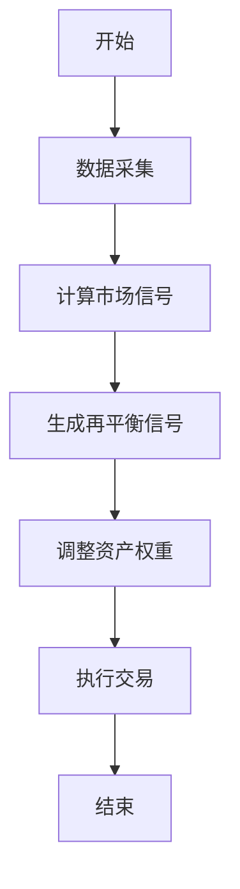
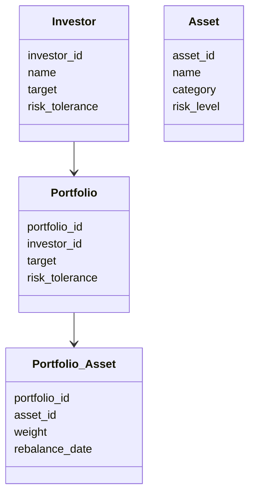
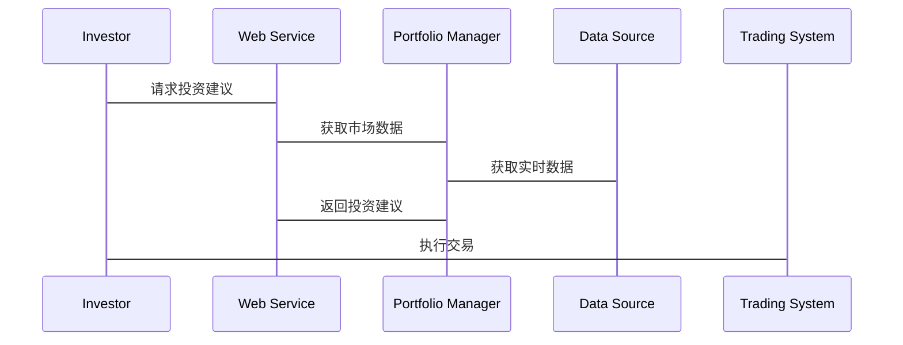

                 


```markdown
# 智能投资组合多周期再平衡策略

> 关键词：智能投资组合，多周期再平衡，动态调整，算法优化，系统架构，金融建模

> 摘要：本文深入探讨智能投资组合多周期再平衡策略的核心原理、算法实现、系统架构设计以及实际应用案例。通过分析多时间框架的再平衡机制，结合现代投资组合理论和智能算法，提出了一种高效的投资组合管理方法，并通过实际案例验证了其有效性。

---

# 第一部分: 智能投资组合多周期再平衡策略背景与概念

## 第1章: 智能投资组合多周期再平衡策略概述

### 1.1 问题背景与定义

#### 1.1.1 投资组合管理的核心问题
投资组合管理的核心问题在于如何在不同市场环境下优化资产配置，以实现风险和收益的最佳平衡。传统的投资组合管理依赖于定期的静态再平衡，难以适应市场环境的快速变化。

#### 1.1.2 多周期再平衡策略的定义
多周期再平衡策略是指在不同时间周期（如日、周、月、季度）上，根据市场波动和投资者目标动态调整资产配置的策略。通过结合短期和长期的市场信息，实现更精细的投资组合管理。

#### 1.1.3 智能投资组合的特征与优势
智能投资组合通过引入机器学习、大数据分析等技术，能够实时捕捉市场信号，动态调整资产配置，从而显著提升投资效率和收益。

### 1.2 多周期再平衡策略的现状与挑战

#### 1.2.1 传统投资组合管理的局限性
传统投资组合管理通常采用固定的再平衡频率，无法适应市场环境的快速变化，可能导致收益损失或风险增加。

#### 1.2.2 多周期再平衡策略的市场需求
随着市场波动加剧和投资者需求多样化，市场对能够灵活调整的多周期再平衡策略的需求日益增长。

#### 1.2.3 实施中的主要挑战
多周期再平衡策略的实施面临数据处理复杂、计算效率要求高、市场预测难度大等挑战。

### 1.3 为什么需要智能多周期再平衡

#### 1.3.1 提高投资效率的必要性
通过智能技术，可以实时分析市场数据，快速做出调整决策，显著提高投资效率。

#### 1.3.2 智能技术在投资组合管理中的作用
智能技术能够处理海量数据，识别潜在风险，优化资产配置，为投资组合管理提供有力支持。

#### 1.3.3 多周期再平衡策略的必要性
多周期再平衡策略能够根据市场变化动态调整，避免单一周期策略的局限性，提升整体投资收益。

### 1.4 智能投资组合与传统投资组合的对比

#### 1.4.1 核心要素对比
| 核心要素       | 传统投资组合          | 智能投资组合          |
|----------------|-----------------------|-----------------------|
| 决策依据       | 固定模型和规则        | 实时数据和智能算法     |
| 再平衡频率     | 固定周期              | 动态调整              |
| 风险管理       | 事后调整              | 实时监控和预测         |

#### 1.4.2 管理方式对比
传统投资组合管理依赖于固定模型和规则，而智能投资组合管理则采用动态调整和实时优化的方式。

#### 1.4.3 风险收益对比
智能投资组合能够在控制风险的前提下，实现更高的收益。

### 1.5 核心概念与边界

#### 1.5.1 核心概念的结构化分析
智能投资组合多周期再平衡策略的核心概念包括：智能算法、多时间框架分析、动态调整机制。

#### 1.5.2 概念的边界与外延
- **边界**：专注于资产配置的动态调整，不涉及具体的交易执行。
- **外延**：可扩展至不同资产类别、不同市场环境下的投资组合管理。

#### 1.5.3 核心要素的组成与关系
智能投资组合的核心要素包括：数据输入、智能算法、动态调整机制、结果输出。

### 1.6 本章小结
本章通过分析智能投资组合多周期再平衡策略的背景、定义、优势以及与传统策略的对比，明确了其核心概念和实施的必要性。

---

## 第2章: 智能投资组合与多周期再平衡策略的核心概念

### 2.1 智能投资组合的原理

#### 2.1.1 数据驱动的投资决策
智能投资组合通过分析市场数据、投资者需求和宏观经济指标，实时优化资产配置。

#### 2.1.2 智能算法的应用
使用机器学习算法（如强化学习、聚类分析）进行市场预测和资产选择。

#### 2.1.3 动态调整机制
根据市场变化实时调整资产权重，确保投资组合始终满足目标。

### 2.2 多周期再平衡策略的原理

#### 2.2.1 多时间框架的分析
结合短期和长期市场信息，制定灵活的再平衡策略。

#### 2.2.2 再平衡的触发条件
根据市场波动、投资目标变化或资产表现触发再平衡。

#### 2.2.3 再平衡的执行流程
从数据采集、信号生成到策略执行的完整流程。

### 2.3 核心概念的属性对比

#### 2.3.1 智能投资组合与传统投资组合的属性对比
| 属性           | 传统投资组合          | 智能投资组合          |
|----------------|-----------------------|-----------------------|
| 决策速度       | 周期性                | 实时                  |
| 决策依据       | 固定模型              | 动态数据              |
| 决策复杂度     | 较低                  | 较高                  |

#### 2.3.2 智能算法与传统算法的属性对比
| 属性           | 传统算法              | 智能算法              |
|----------------|-----------------------|-----------------------|
| 学习能力       | 无                    | 有                    |
| 适应性         | 低                    | 高                    |
| 计算效率       | 低                    | 高                    |

### 2.4 ER实体关系图

```mermaid
er
    investor(investor_id, name, target, risk_tolerance)
    asset(asset_id, name, category, risk_level)
    portfolio(portfolio_id, investor_id, target, risk_tolerance)
    portfolio_asset(portfolio_id, asset_id, weight, rebalance_date)
```

### 2.5 本章小结
本章详细分析了智能投资组合和多周期再平衡策略的核心概念，通过对比和ER图展示了它们的属性和关系。

---

## 第3章: 算法原理与实现

### 3.1 算法原理

#### 3.1.1 现代投资组合理论（MPT）的数学模型
现代投资组合理论通过优化资产权重，实现风险和收益的最佳平衡。数学公式如下：

$$ \text{目标函数：} \min_w \sigma^2(w) $$
$$ \text{约束条件：} \sum w_i = 1, \sum w_i r_i = \text{目标收益} $$

#### 3.1.2 动态再平衡算法的流程


#### 3.1.3 智能算法的核心
智能算法（如强化学习）通过不断学习市场数据，优化投资决策。

### 3.2 动态再平衡算法实现

#### 3.2.1 优化模型
优化目标为最大化收益或最小化风险。优化函数：
$$ \text{收益最大化：} \max_w \sum w_i r_i $$
$$ \text{风险最小化：} \min_w \sigma^2(w) $$

#### 3.2.2 多时间框架的数据融合
将不同时间周期的数据进行融合，生成综合的市场信号。

### 3.3 智能算法实现

#### 3.3.1 算法框架
智能算法框架包括数据输入、特征提取、模型训练、策略生成和执行。

#### 3.3.2 代码示例
```python
import numpy as np
from sklearn import linear_model

# 示例数据
X = np.array([[1, 1], [2, 2.5], [3, 3]])
y = np.array([4, 5, 6])

# 训练线性回归模型
model = linear_model.LinearRegression()
model.fit(X, y)

# 预测新数据
new_data = np.array([[4, 4.5]])
print(model.predict(new_data))
```

### 3.4 本章小结
本章详细讲解了智能投资组合多周期再平衡策略的算法原理，并通过代码示例展示了实现过程。

---

## 第4章: 系统分析与架构设计

### 4.1 问题场景介绍
系统需要支持多时间框架的数据分析和动态再平衡策略的实施，提供实时投资建议和交易执行功能。

### 4.2 系统功能设计

#### 4.2.1 领域模型


### 4.3 系统架构设计

#### 4.3.1 系统架构图


### 4.4 系统接口设计

#### 4.4.1 API接口
- 数据接口：提供市场数据查询API。
- 策略接口：提供投资策略执行API。
- 交易接口：提供交易执行API。

### 4.5 系统交互设计

#### 4.5.1 交互流程


### 4.6 本章小结
本章通过系统分析和架构设计，展示了智能投资组合多周期再平衡策略的实现框架。

---

## 第5章: 项目实战

### 5.1 环境安装

#### 5.1.1 系统要求
- 操作系统：Linux/Windows/MacOS
- Python版本：3.6+
- 依赖库：numpy, pandas, scikit-learn

### 5.2 核心代码实现

#### 5.2.1 数据处理
```python
import pandas as pd
import numpy as np

# 示例数据加载
data = pd.read_csv('market_data.csv')
```

#### 5.2.2 算法实现
```python
from sklearn.linear_model import LinearRegression

# 训练模型
model = LinearRegression()
model.fit(data[['feature1', 'feature2']], data['target'])
```

#### 5.2.3 策略执行
```python
def rebalance_portfolio(portfolio_weights, market_signal):
    # 根据市场信号调整权重
    new_weights = adjust_weights(portfolio_weights, market_signal)
    return new_weights
```

### 5.3 案例分析

#### 5.3.1 数据分析
分析不同时间周期的数据，生成市场信号。

#### 5.3.2 策略优化
通过回测和优化，找到最优的再平衡频率和资产配置。

### 5.4 项目小结
本章通过实际项目案例，展示了智能投资组合多周期再平衡策略的实现过程和效果。

---

## 第6章: 最佳实践与总结

### 6.1 最佳实践 tips

#### 6.1.1 数据质量
确保数据的完整性和准确性。

#### 6.1.2 模型选择
根据具体需求选择合适的智能算法。

#### 6.1.3 系统优化
优化系统架构，提高计算效率。

### 6.2 本章小结
总结全文，强调智能投资组合多周期再平衡策略的重要性和实现的关键点。

---

## 附录: 拓展阅读

### 附录 A: 相关文献

#### A.1 现代投资组合理论
- Markowitz, H. (1952). Portfolio Selection.

#### A.2 强化学习在金融中的应用
- Sutton, R. S., & Barto, A. G. (2018). Reinforcement Learning: Theory and Algorithms.

### 附录 B: 工具与资源

#### B.1 开源工具
- pandas
- numpy
- scikit-learn

#### B.2 数据源
- Yahoo Finance
- Bloomberg

---

## 作者：AI天才研究院/AI Genius Institute & 禅与计算机程序设计艺术 /Zen And The Art of Computer Programming
```

