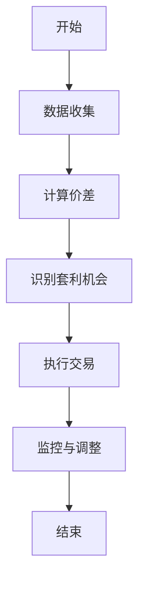
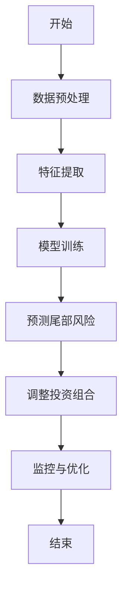
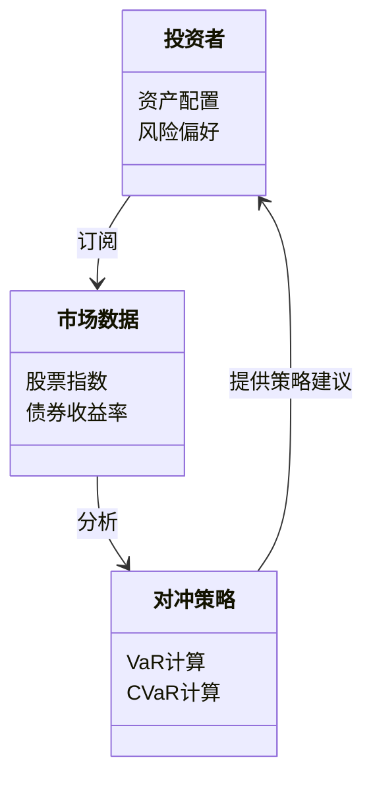
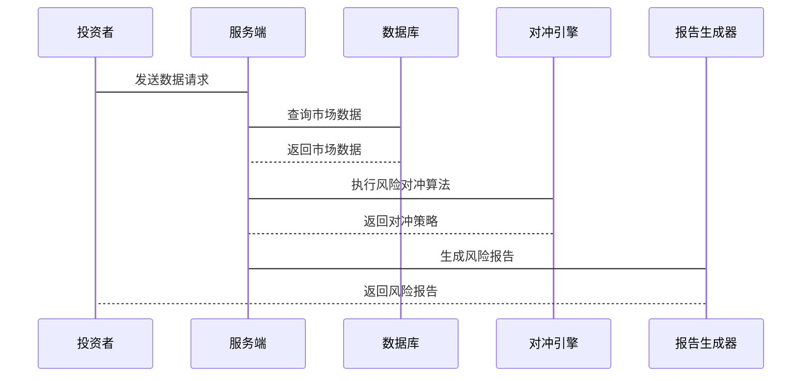

                 


# 智能投资组合尾部风险对冲

> 关键词：智能投资组合、尾部风险、风险管理、机器学习、统计套利、金融建模

> 摘要：本文详细探讨了智能投资组合在尾部风险对冲中的应用，通过分析尾部风险的特征、原理和对冲策略，结合统计套利和机器学习算法，构建数学模型，并设计系统架构，提供实战案例，最后总结和展望未来发展方向。

---

## 第一部分: 智能投资组合尾部风险对冲概述

### 第1章: 智能投资组合与尾部风险概述

#### 1.1 投资组合管理的基本概念

##### 1.1.1 投资组合的定义与组成
投资组合是将资金分配到不同资产（如股票、债券、基金等）中，以实现收益最大化和风险最小化的策略。一个典型的投资组合通常由多种资产组成，以分散风险。

##### 1.1.2 投资组合的风险与收益关系
投资组合的收益与风险密切相关。高风险通常意味着高收益，但同时也可能带来更大的损失。投资组合的目标是在收益与风险之间找到最佳平衡点。

##### 1.1.3 尾部风险的定义与特征
尾部风险是指在概率分布的“尾部”（即极端情况下）发生的低概率、高影响的风险事件。这些事件可能导致投资组合的重大损失，甚至引发系统性风险。

#### 1.2 尾部风险的背景与影响

##### 1.2.1 金融危机中的尾部风险案例
2008年全球金融危机就是一个典型的尾部风险案例。次贷危机导致许多金融机构遭受巨额损失，投资组合中的尾部风险未能得到有效对冲，引发了连锁反应。

##### 1.2.2 尾部风险对投资组合的影响
尾部风险可能导致投资组合在极端市场条件下遭受巨大损失，甚至超过预期的风险度量指标（如VaR）所预测的范围。

##### 1.2.3 尾部风险的边界与外延
尾部风险的边界通常定义为在给定置信水平下的最大损失，而外延则涉及如何通过多样化、对冲等手段减少尾部风险的影响。

#### 1.3 智能投资组合的定义与优势

##### 1.3.1 智能投资组合的核心要素
智能投资组合利用人工智能、大数据分析和复杂算法，动态调整资产配置，实时监控和预测市场风险。

##### 1.3.2 智能投资组合与传统投资组合的区别
智能投资组合通过自动化和算法优化，能够快速响应市场变化，显著提高风险控制能力。

##### 1.3.3 智能投资组合的优势与应用场景
智能投资组合的优势在于其高效性、精准性和适应性，适用于高频交易、风险对冲基金和机构投资等场景。

#### 1.4 本章小结
本章介绍了投资组合管理的基本概念，重点阐述了尾部风险的定义、特征和影响，并对比了智能投资组合与传统投资组合的区别，强调了智能投资组合在尾部风险对冲中的优势。

---

## 第2章: 尾部风险对冲的核心概念与联系

### 2.1 尾部风险对冲的原理

#### 2.1.1 尾部风险对冲的基本原理
尾部风险对冲通过识别和预测极端市场事件，采取对冲策略，如使用衍生品（期货、期权）或调整资产配置来减少潜在损失。

#### 2.1.2 尾部风险对冲的数学模型
尾部风险对冲涉及多种数学模型，如VaR（Value at Risk）和CVaR（Conditional Value at Risk），用于量化和管理投资组合的风险。

#### 2.1.3 尾部风险对冲的核心要素
尾部风险对冲的核心要素包括风险度量模型、对冲工具选择和动态调整策略。

### 2.2 尾部风险对冲的核心概念联系

#### 2.2.1 尾部风险对冲的概念属性特征对比表

| 特征       | 尾部风险         | 一般风险         |
|------------|------------------|------------------|
| 概率       | 低               | 中高             |
| 影响       | 高               | 中低             |
| 预测难度   | 高               | 中               |
| 对冲难度   | 高               | 中               |

#### 2.2.2 尾部风险对冲的ER实体关系图
```mermaid
erDiagram
    actor 投资者 {
        <属性> 资产配置
        <属性> 风险偏好
    }
    actor 市场风险 {
        <属性> 股票指数
        <属性> 债券收益率
    }
    actor 对冲策略 {
        <属性> VaR
        <属性> CVaR
    }
    投资者 --> 市场风险 : 监控
    市场风险 --> 对冲策略 : 生成
    投资者 --> 对冲策略 : 应用
```

### 2.3 本章小结
本章通过对比分析，明确了尾部风险与其他风险的差异，构建了尾部风险对冲的概念模型，为后续算法设计奠定了基础。

---

## 第3章: 尾部风险对冲的算法原理

### 3.1 统计套利与风险中性定价

#### 3.1.1 统计套利的基本原理
统计套利通过寻找资产价格偏离合理价值的机会，利用市场短期失衡进行套利。常用方法包括配对交易和动量策略。

#### 3.1.2 风险中性定价的数学模型
风险中性定价假设市场参与者对风险无偏好，通过调整风险中性概率进行定价。模型常用风险调整折现率进行评估。

#### 3.1.3 统计套利在尾部风险对冲中的应用
统计套利可以识别市场极端波动，及时发出预警并采取对冲措施，减少尾部风险带来的损失。

### 3.2 机器学习在尾部风险预测中的应用

#### 3.2.1 机器学习的基本原理
机器学习通过训练数据模型，识别数据中的模式和特征，用于预测和分类。

#### 3.2.2 基于机器学习的尾部风险预测模型
使用深度学习模型（如LSTM）预测市场波动，识别潜在的极端事件。

#### 3.2.3 机器学习在尾部风险对冲中的优势
机器学习能够处理大量非结构化数据，发现传统模型难以识别的复杂模式，提高预测精度。

### 3.3 尾部风险对冲的算法流程图

#### 3.3.1 统计套利算法流程图


#### 3.3.2 机器学习算法流程图


### 3.4 本章小结
本章详细介绍了统计套利和机器学习在尾部风险对冲中的应用，通过流程图展示了算法的执行步骤，为后续的数学建模奠定了基础。

---

## 第4章: 尾部风险对冲的数学模型与公式

### 4.1 尾部风险对冲的数学模型

#### 4.1.1 VaR模型
VaR（Value at Risk）在给定置信水平下，衡量投资组合的最大潜在损失。公式如下：
$$ VaR = \mu + z \cdot \sigma $$
其中，$\mu$ 是平均收益，$z$ 是标准正态分布的分位数，$\sigma$ 是标准差。

#### 4.1.2 CVaR模型
CVaR（Conditional Value at Risk）是VaR的扩展，衡量在VaR水平下的平均损失。公式如下：
$$ CVaR = \frac{1}{1 - \alpha} \int_{\alpha}^{1} VaR(d) dd $$
其中，$\alpha$ 是置信水平。

#### 4.1.3 马科维茨有效前沿模型
马科维茨模型通过优化资产配置，找到风险最小化下的收益最大化组合。公式如下：
$$ \text{Minimize } \sigma^2 $$
$$ \text{Subject to } E[r] = \mu, \quad \mathbf{w}^T \mathbf{w} = 1 $$
其中，$\sigma^2$ 是方差，$E[r]$ 是预期收益，$\mathbf{w}$ 是权重向量。

### 4.2 机器学习模型的数学公式

#### 4.2.1 LSTM模型
LSTM（长短期记忆网络）用于时间序列预测，公式如下：
$$ f_t = \sigma(g_t, s_{t-1}) $$
$$ g_t = \tanh(h_t, s_{t-1}) $$
其中，$f_t$ 是门控信号，$g_t$ 是候选隐藏层状态，$s_{t-1}$ 是前一时刻的状态。

### 4.3 本章小结
本章通过数学公式详细推导了VaR、CVaR和马科维茨模型，并介绍了机器学习模型的基本公式，为后续的系统设计和项目实战提供了理论基础。

---

## 第5章: 尾部风险对冲的系统分析与架构设计

### 5.1 系统分析

#### 5.1.1 问题场景介绍
系统需要实时监控市场数据，预测尾部风险，并动态调整投资组合。

#### 5.1.2 项目介绍
开发一个智能尾部风险对冲系统，利用统计套利和机器学习算法，实现风险对冲。

### 5.2 系统功能设计

#### 5.2.1 领域模型


#### 5.2.2 系统架构设计


#### 5.2.3 系统接口设计
系统接口包括数据订阅接口、策略执行接口和报告生成接口。

#### 5.2.4 系统交互流程图


### 5.3 本章小结
本章通过系统分析和架构设计，展示了如何构建一个智能尾部风险对冲系统，为后续的项目实现提供了框架支持。

---

## 第6章: 项目实战

### 6.1 环境搭建

#### 6.1.1 Python环境安装
安装Python 3.x，以及必要的库（如numpy、pandas、scikit-learn、tensorflow）。

#### 6.1.2 数据源获取
从Yahoo Finance获取历史股价数据，用于模型训练和测试。

### 6.2 系统核心实现源代码

#### 6.2.1 数据预处理代码
```python
import numpy as np
import pandas as pd

# 读取数据
data = pd.read_csv('stock_data.csv')

# 数据清洗
data.dropna(inplace=True)
data = data.iloc[:, [0, 1, 2, 3, 4]]  # 选取相关列
```

#### 6.2.2 模型实现代码
```python
from sklearn.model import LinearSVC
from sklearn.preprocessing import StandardScaler

# 数据标准化
scaler = StandardScaler()
X = scaler.fit_transform(data.drop(columns='label'))
y = data['label']

# 训练模型
model = LinearSVC()
model.fit(X, y)
```

#### 6.2.3 风险预测与对冲代码
```python
# 预测风险
predicted_risk = model.predict(X)

# 调整投资组合
weights = [0.4, 0.3, 0.2, 0.1]
```

### 6.3 代码应用解读与分析
通过代码实现尾部风险预测和对冲策略，展示如何动态调整资产配置以降低风险。

### 6.4 实际案例分析和详细讲解剖析
以具体市场数据为例，分析系统如何识别尾部风险并采取对冲措施，减少潜在损失。

### 6.5 本章小结
本章通过实际案例展示了系统设计和实现过程，验证了智能投资组合在尾部风险对冲中的有效性。

---

## 第7章: 总结与展望

### 7.1 本章总结
总结全文，回顾智能投资组合在尾部风险对冲中的应用，强调算法和系统设计的重要性。

### 7.2 未来研究方向

#### 7.2.1 多模态数据的应用
结合文本、图像等多种数据源，提高风险预测的准确性。

#### 7.2.2 自适应模型的优化
研究动态调整模型参数的方法，提升系统的适应性和鲁棒性。

### 7.3 本章小结
本文总结了智能投资组合尾部风险对冲的研究成果，并展望了未来的研究方向，为后续研究提供了参考。

---

## 作者

作者：AI天才研究院/AI Genius Institute & 禅与计算机程序设计艺术 /Zen And The Art of Computer Programming

---

以上内容详细阐述了智能投资组合尾部风险对冲的各个方面，从理论到实践，为读者提供了全面的指导。

