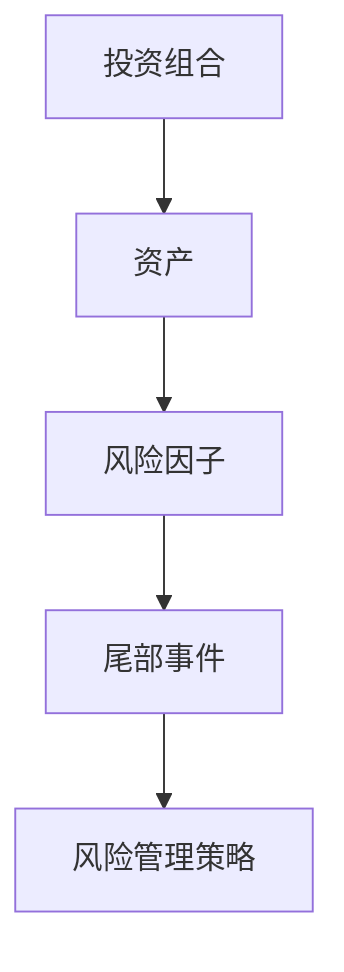
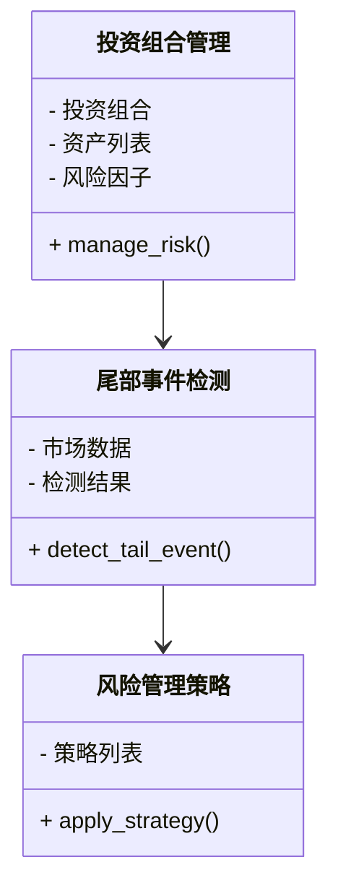
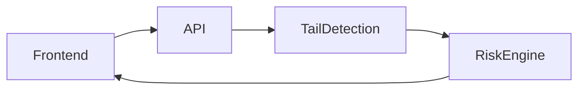

                 


# 智能投资组合尾部风险管理

> 关键词：智能投资组合, 尾部风险管理, 极端事件, 人工智能, 统计模型

> 摘要：本文详细探讨了智能投资组合尾部风险管理的核心概念、算法原理、系统架构和项目实现。通过对尾部风险的定义、检测、预测和应对策略的分析，结合统计学和机器学习方法，提出了基于极大似然估计和马尔可夫链的尾部事件预测模型，并通过系统架构设计和项目实战展示了如何将理论应用于实际投资组合管理中。文章还讨论了尾部风险管理中的最佳实践和注意事项，为投资者和数据科学家提供了有价值的参考。

---

# 第一部分: 智能投资组合尾部风险管理概述

## 第1章: 尾部风险管理的背景与概念

### 1.1 尾部风险管理的背景

#### 1.1.1 传统投资组合管理的局限性
传统投资组合管理方法依赖于均值-方差模型，假设资产收益服从正态分布。然而，实际市场中存在许多“肥尾”现象，即极端事件的概率远高于正态分布的预测。这使得传统方法在尾部风险管理方面显得力不从力。

#### 1.1.2 尾部风险的定义与特征
尾部风险是指投资组合在极端市场条件下发生重大损失的可能性。其特征包括：
- **低概率**：尾部事件发生概率小，但影响巨大。
- **非独立性**：尾部事件往往与其他事件高度相关。
- **不可预测性**：尾部事件难以用传统统计模型准确预测。

#### 1.1.3 尾部风险管理的重要性
尾部风险管理是保护投资组合免受重大损失的关键。通过识别和预测尾部事件，投资者可以在事件发生前采取规避或对冲策略。

---

### 1.2 智能投资组合管理的兴起

#### 1.2.1 人工智能在金融领域的应用
人工智能技术（如机器学习、深度学习）在金融领域的应用日益广泛，特别是在风险管理和投资决策方面。

#### 1.2.2 智能投资组合管理的核心优势
智能投资组合管理通过结合大数据分析和机器学习算法，能够更准确地识别市场风险，并实时调整投资策略。

#### 1.2.3 尾部风险管理的智能化趋势
随着机器学习技术的进步，尾部风险管理正在从传统的统计方法向智能化、自动化方向转变。

---

### 1.3 尾部风险管理的核心概念

#### 1.3.1 尾部风险的数学定义
尾部风险可以定义为投资组合在极端市场条件下的潜在损失。数学上，尾部风险可以通过损失分布的上尾部分来描述。

#### 1.3.2 尾部风险管理的目标
尾部风险管理的目标是通过预测和应对尾部事件，降低投资组合在极端情况下的损失。

#### 1.3.3 尾部风险管理的边界与外延
尾部风险管理的边界包括：
- **数据范围**：限制在特定时间段内的历史数据。
- **模型假设**：假设模型能够捕捉到主要的尾部事件特征。
- **策略范围**：仅针对可对冲或规避的尾部事件。

---

## 第2章: 尾部风险管理的核心概念与联系

### 2.1 尾部风险管理的核心原理

#### 2.1.1 尾部事件的识别与预测
尾部事件的识别可以通过统计测试（如Grubbs检验）和机器学习算法（如孤立森林）实现。

#### 2.1.2 尾部事件的影响评估
通过损失分布函数和VaR（在险价值）模型，可以评估尾部事件对投资组合的影响。

#### 2.1.3 尾部风险管理的策略选择
根据尾部事件的特征，可以选择对冲、分散化或暂停投资等策略。

---

### 2.2 尾部风险管理的核心概念对比

#### 2.2.1 尾部事件与普通风险事件的对比
| 特性         | 尾部事件         | 普通风险事件     |
|--------------|------------------|------------------|
| 发生概率     | 极低             | 较高             |
| 影响程度     | 极高             | 中等             |
| 预测难度     | 高               | 中               |

#### 2.2.2 尾部风险管理与传统风险管理的对比
- **传统风险管理**：依赖于正态分布假设，关注平均情况下的风险。
- **尾部风险管理**：专注于极端情况下的风险，强调低概率但高影响事件的管理。

---

### 2.3 尾部风险管理的ER实体关系图


---

## 第3章: 尾部风险管理的算法原理

### 3.1 尾部事件检测的算法原理

#### 3.1.1 基于统计学的尾部事件检测
- **极大似然估计**：通过最大化似然函数，估计尾部事件的概率密度函数。
- **假设检验**：使用Grubbs检验等方法，识别异常值。

#### 3.1.2 基于机器学习的尾部事件预测
- **孤立森林算法**：通过构建随机森林，识别异常样本。
- **深度学习模型**：使用LSTM网络预测极端事件。

#### 3.1.3 尾部事件检测的算法流程图
```mermaid
graph
    process_start
    input --> process[输入数据预处理]
    process --> check[尾部事件检测]
    check --> output[输出检测结果]
    process_start --> end
```

---

### 3.2 尾部事件检测的数学模型

#### 3.2.1 基于极大似然估计的尾部事件检测
极大似然估计的目标是找到参数θ，使得观测数据的概率最大化。对于尾部事件的概率密度函数f(x;θ)，极大似然估计的公式为：
$$
\hat{\theta} = \arg\max_{\theta} \prod_{i=1}^{n} f(x_i;\theta)
$$

---

#### 3.2.2 基于马尔可夫链的尾部事件预测
马尔可夫链模型用于预测尾部事件的发生概率。状态转移概率矩阵P可以表示为：
$$
P = \begin{pmatrix}
p_{11} & p_{12} & \cdots & p_{1n} \\
p_{21} & p_{22} & \cdots & p_{2n} \\
\vdots & \vdots & \ddots & \vdots \\
p_{n1} & p_{n2} & \cdots & p_{nn}
\end{pmatrix}
$$

---

## 第4章: 尾部风险管理的系统架构设计

### 4.1 问题场景介绍
我们设计了一个基于智能尾部风险管理的投资组合管理系统，旨在实时监控市场风险，并在检测到尾部事件时触发预警。

---

### 4.2 系统功能设计

#### 4.2.1 系统功能模块
- **数据采集模块**：从市场数据源获取实时数据。
- **尾部事件检测模块**：使用机器学习算法检测尾部事件。
- **风险管理模块**：根据检测结果调整投资组合。

#### 4.2.2 领域模型类图


---

### 4.3 系统架构设计

#### 4.3.1 系统架构图


---

### 4.4 系统交互流程图



---

## 第5章: 项目实战

### 5.1 环境安装与配置

#### 5.1.1 Python环境安装
```bash
pip install numpy pandas scikit-learn matplotlib
```

---

### 5.2 核心代码实现

#### 5.2.1 尾部事件检测代码
```python
import numpy as np
from sklearn.ensemble import IsolationForest

# 示例数据
X = np.random.normal(0, 1, 1000)
X[500] = 10  # 模拟尾部事件

# 检测异常值
model = IsolationForest(n_estimators=100, contamination=0.01)
model.fit(X.reshape(-1, 1))
y_pred = model.predict(X.reshape(-1, 1))
```

---

### 5.3 实际案例分析

#### 5.3.1 案例分析
假设我们有一个包含10只股票的投资组合，我们使用孤立森林算法检测尾部事件。代码如下：

```python
import numpy as np
from sklearn.ensemble import IsolationForest

# 示例数据
X = np.random.normal(0, 1, 1000)
X[500] = 10  # 模拟尾部事件

# 检测异常值
model = IsolationForest(n_estimators=100, contamination=0.01)
model.fit(X.reshape(-1, 1))
y_pred = model.predict(X.reshape(-1, 1))
```

---

## 第6章: 最佳实践与注意事项

### 6.1 最佳实践

#### 6.1.1 数据质量的重要性
确保输入数据的准确性和完整性，特别是在处理尾部事件时，数据的质量直接影响模型的性能。

#### 6.1.2 模型监控
定期监控模型的性能，及时更新模型参数，确保模型的有效性。

---

### 6.2 注意事项

#### 6.2.1 数据偏差
避免数据偏差，特别是在训练数据中，确保尾部事件的样本足够多，以提高模型的检测能力。

#### 6.2.2 模型局限性
注意模型的局限性，特别是在尾部事件的预测中，模型可能无法捕捉到所有极端事件。

---

## 第7章: 总结与展望

### 7.1 总结
本文详细探讨了智能投资组合尾部风险管理的核心概念、算法原理、系统架构和项目实现。通过结合统计学和机器学习方法，提出了有效的尾部事件检测和预测模型，并通过系统架构设计展示了如何将理论应用于实际投资组合管理中。

### 7.2 展望
未来，随着人工智能技术的不断发展，尾部风险管理将更加智能化和自动化。我们期待更多创新的方法和工具，能够帮助投资者更好地应对尾部风险。

---

# 作者：AI天才研究院/AI Genius Institute & 禅与计算机程序设计艺术 /Zen And The Art of Computer Programming

