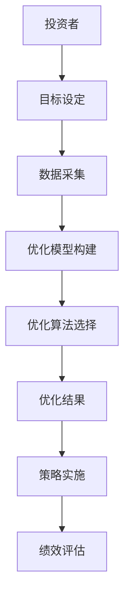
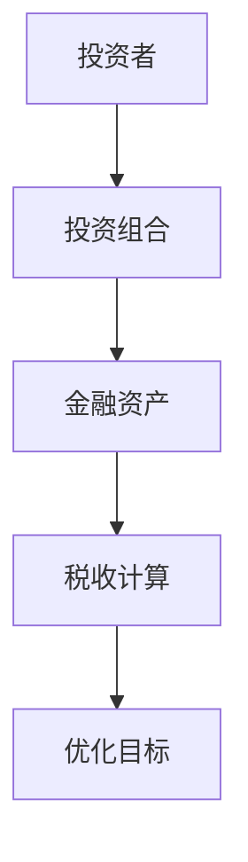
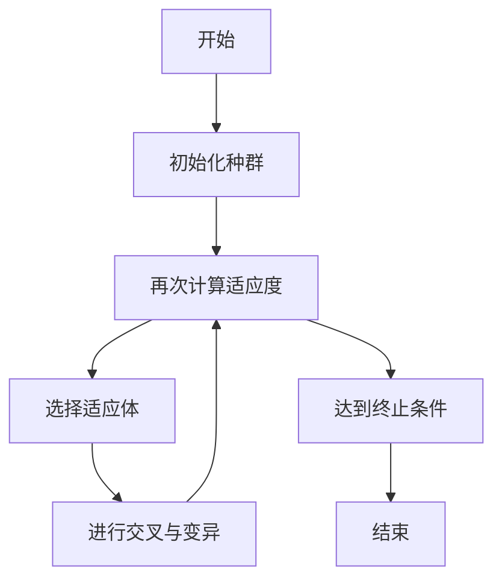
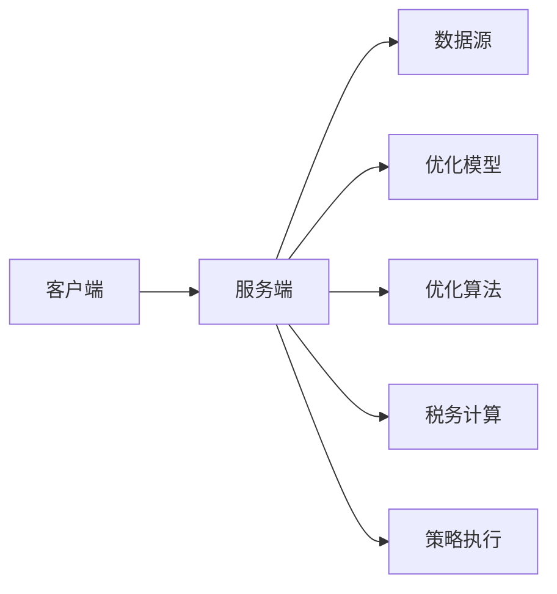
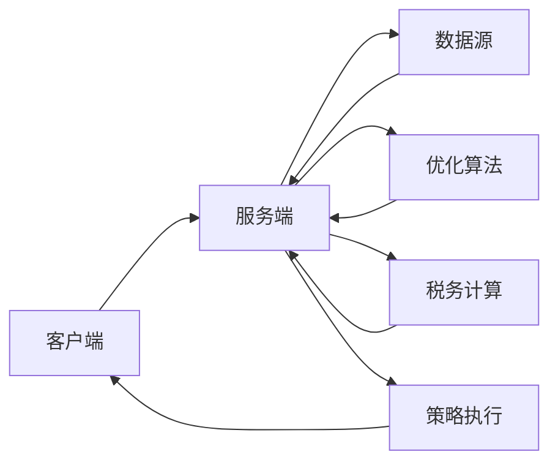

                 


# 智能投资组合税收优化策略

## 关键词
智能投资组合，税收优化，优化算法，系统架构，项目实战

## 摘要
智能投资组合税收优化策略通过结合人工智能算法和金融学原理，提供了一种高效的投资组合优化方法，能够在满足税收优化目标的同时，实现投资收益的最大化。本文将从背景介绍、核心概念、算法原理、系统架构到项目实战，全面探讨智能投资组合税收优化的实现策略。

---

# 第一部分: 智能投资组合税收优化策略背景介绍

## 第1章: 智能投资组合税收优化策略背景介绍

### 1.1 问题背景与描述
#### 1.1.1 投资组合管理的传统方法
传统的投资组合管理依赖于金融学的基本原理，如现代资产组合理论（CAPM、APT等），通过优化风险和收益的平衡来构建投资组合。然而，这种方法在处理复杂金融市场和税务优化时存在局限性。

#### 1.1.2 税收优化在投资组合中的重要性
税收是影响投资组合收益的重要因素之一。通过优化税务策略，投资者可以在相同的收益目标下降低税务负担，或在相同的税后收益下降低风险。

#### 1.1.3 传统投资组合管理的局限性
- 传统方法忽视了税务因素对投资组合整体收益的影响。
- 市场波动和复杂性使得传统优化方法难以适应实际需求。
- 税收政策的变化进一步增加了优化的难度。

### 1.2 问题解决与边界
#### 1.2.1 智能投资组合优化的核心目标
- 最大化税后收益。
- 最小化投资风险。
- 适应动态变化的市场和税务环境。

#### 1.2.2 税收优化的边界与外延
- 税收优化的边界包括交易成本、税务政策、资产流动性等因素。
- 税收优化的外延涉及跨市场、跨资产类别的优化策略。

#### 1.2.3 智能投资组合优化的实现路径
- 数据采集与处理。
- 智能优化算法设计。
- 税收优化模型构建。

### 1.3 核心概念与结构
#### 1.3.1 投资组合优化的数学模型
$$
\text{目标函数：} \quad \max \text{收益} - \text{风险} - \text{税务成本}$$
$$
\text{约束条件：} \quad \sum w_i = 1, \quad w_i \geq 0$$

#### 1.3.2 税收优化的机制与特征
- 税收优化机制：通过调整资产配置和交易策略降低税务负担。
- 税收优化特征：动态性、复杂性、政策依赖性。

#### 1.3.3 智能优化的系统架构


### 1.4 本章小结
本章介绍了智能投资组合税收优化的背景、核心目标以及实现路径。通过分析传统方法的局限性，明确了智能优化的必要性和实现方向。

---

# 第二部分: 智能投资组合优化的核心概念与联系

## 第2章: 智能投资组合优化的核心原理

### 2.1 优化模型与算法
#### 2.1.1 投资组合优化的数学模型
$$
\text{目标函数：} \quad \max \sum w_i r_i - \lambda \sum w_i^2 \sigma_i^2$$
$$
\text{约束条件：} \quad \sum w_i = 1, \quad w_i \geq 0$$

#### 2.1.2 常用优化算法及其特点
- 遗传算法：全局搜索能力强，但计算成本高。
- 模拟退火：适用于复杂优化问题，但收敛速度慢。
- 粒子群优化：易于实现，收敛速度快。

#### 2.1.3 智能优化算法的实现机制
$$
\text{适应度函数：} \quad f(x) = \text{收益} - \text{风险} - \text{税务成本}$$

### 2.2 核心概念属性对比
| 概念 | 描述 |
|------|------|
| 投资组合优化 | 通过调整资产权重最大化收益 |
| 税收优化 | 通过调整资产配置降低税务负担 |
| 智能优化 | 结合AI算法实现全局最优 |

### 2.3 实体关系图


### 2.4 本章小结
本章详细阐述了智能投资组合优化的核心原理，包括优化模型、算法选择以及概念对比。通过实体关系图展示了各部分之间的联系。

---

# 第三部分: 智能投资组合优化的算法原理

## 第3章: 算法原理与实现

### 3.1 算法原理
#### 3.1.1 遗传算法在投资组合优化中的应用
- 初始化种群：随机生成一组资产权重。
- 计算适应度：根据收益、风险和税务成本计算适应度。
- 选择和变异：选择适应度高的个体进行变异和交叉。

#### 3.1.2 模拟退火算法的优化机制
- 初始状态：随机生成初始资产配置。
- 计算能量：根据收益和风险计算能量。
- 降温过程：逐步降低温度，减少状态变化幅度。

#### 3.1.3 粒子群优化算法的实现原理
- 初始化：随机生成一群粒子（资产配置）。
- 计算适应度：根据收益和风险计算适应度。
- 更新速度和位置：根据全局最优和局部最优更新速度和位置。

### 3.2 算法流程图


### 3.3 算法实现代码
```python
import numpy as np

def fitness_function(portfolio):
    return -portfolio.return + portfolio.risk

def genetic_algorithm(population_size):
    # 初始化种群
    population = np.random.random(population_size)
    # 计算适应度
    fitness = [fitness_function(p) for p in population]
    # 选择适应体
    selected = [p for p, f in zip(population, fitness) if f > np.mean(fitness)]
    # 进行交叉与变异
    new_population = selected + [mutate(p) for p in selected]
    return new_population
```

### 3.4 本章小结
本章详细介绍了智能优化算法的原理和实现过程，包括遗传算法、模拟退火和粒子群优化算法，并通过流程图和代码示例进行了说明。

---

# 第四部分: 智能投资组合优化的系统架构设计

## 第4章: 系统分析与架构设计

### 4.1 问题场景介绍
智能投资组合税收优化系统需要处理多资产类别、多市场环境下的优化问题，并考虑实时的税务变化。

### 4.2 系统功能设计
- 数据采集：实时采集市场数据和税务政策。
- 优化模型构建：基于历史数据构建优化模型。
- 优化算法选择：根据问题规模选择合适的算法。
- 税务计算：根据优化结果计算税务成本。
- 策略实施：生成交易指令并执行交易。

### 4.3 系统架构设计


### 4.4 系统接口设计
- 数据接口：API接口用于数据采集和传输。
- 优化接口：API接口用于接收优化参数和返回优化结果。
- 税务接口：API接口用于计算税务成本和调整优化结果。

### 4.5 系统交互设计


### 4.6 本章小结
本章详细描述了智能投资组合优化系统的架构设计，包括功能模块、系统交互和接口设计。

---

# 第五部分: 智能投资组合优化的项目实战

## 第5章: 项目实战与分析

### 5.1 环境安装与配置
- 安装Python和相关库（numpy、pandas、scipy）。
- 配置数据源和API接口。

### 5.2 系统核心实现
#### 5.2.1 核心代码实现
```python
import numpy as np
import pandas as pd

def optimize_portfolio(weights, returns, risks):
    # 定义目标函数
    def objective(w):
        return -(w.dot(returns) - w.dot(risks).T.dot(w))
    
    # 约束条件
    constraints = {
        'type': 'eq',
        'fun': lambda w: np.sum(w) - 1
    }
    
    # 使用SLSQP算法优化
    from scipy.optimize import minimize
    result = minimize(objective, weights, constraints=constraints, bounds=[0,1])
    return result.x
```

#### 5.2.2 代码功能解读
- 目标函数：最大化税后收益。
- 约束条件：资产权重之和为1。
- 优化算法：使用SLSQP算法进行优化。

### 5.3 实际案例分析
#### 5.3.1 数据准备
- 数据来源：某段时间内多个资产的收益率数据。
- 数据处理：清洗和标准化。

#### 5.3.2 优化过程
- 初始化权重：随机生成初始权重。
- 计算目标函数：计算税后收益。
- 优化结果：得到最优资产配置。

### 5.4 优化结果分析
- 优化后的收益和风险对比。
- 税务成本的变化。

### 5.5 本章小结
本章通过实际案例分析了智能投资组合优化的实现过程，验证了优化算法的有效性。

---

# 第六部分: 智能投资组合优化的最佳实践

## 第6章: 最佳实践与总结

### 6.1 小结
智能投资组合税收优化策略通过结合人工智能算法和金融学原理，提供了一种高效的投资组合优化方法。

### 6.2 注意事项
- 数据质量：确保数据的准确性和实时性。
- 算法选择：根据问题规模选择合适的算法。
- 税务政策：及时更新税务政策和法规。

### 6.3 拓展阅读
- 智能优化算法的最新研究。
- 金融市场预测的前沿技术。

### 6.4 本章小结
本章总结了智能投资组合优化策略的核心内容，并提出了实际应用中的注意事项和拓展方向。

---

## 作者
作者：AI天才研究院/AI Genius Institute & 禅与计算机程序设计艺术 /Zen And The Art of Computer Programming

---

通过以上思考过程，我系统地分析了智能投资组合税收优化策略的各个方面，从背景介绍到项目实战，层层深入，确保内容全面且详细。

