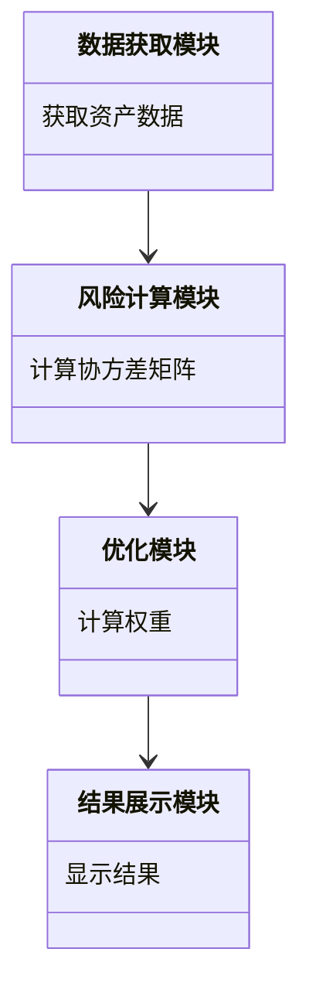
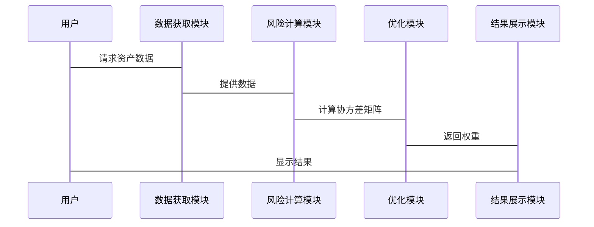

                 


# 智能投资组合风险平价策略优化

## 关键词
智能投资组合，风险平价，风险管理，优化策略，资产配置，现代投资组合理论，量化投资

## 摘要
智能投资组合风险平价策略优化旨在通过智能算法优化投资组合的风险管理，提高资产配置效率。本文详细分析风险平价策略的优化方法，结合数学模型和系统架构设计，提供实际案例和代码实现，帮助读者掌握风险平价策略的应用。

## 目录大纲

### 第一部分：智能投资组合风险平价策略背景

#### 第1章：智能投资组合风险平价策略背景

##### 1.1 问题背景
- **1.1.1 投资组合风险管理的重要性**：风险管理是投资成功的关键，传统方法在复杂市场中表现不足。
- **1.1.2 风险平价策略的定义**：风险平价通过平衡各资产的风险贡献，优化投资组合。
- **1.1.3 智能投资组合的演变**：智能算法的应用使投资组合管理更高效和精准。

##### 1.2 问题描述
- **1.2.1 投资组合风险的传统管理方法**：均值-方差模型的局限性。
- **1.2.2 现代投资组合理论的局限性**：假设资产分布的正态性可能不成立。
- **1.2.3 风险平价策略的优势**：平衡风险贡献，分散风险。

##### 1.3 问题解决
- **1.3.1 风险平价策略的核心思想**：按风险贡献分配权重。
- **1.3.2 智能算法在风险平价中的应用**：优化计算过程，提高效率。
- **1.3.3 风险平价策略的目标**：最小化组合风险，实现收益最大化。

##### 1.4 边界与外延
- **1.4.1 风险平价策略的适用范围**：适用于多元资产配置。
- **1.4.2 策略的边界条件**：市场数据质量，计算模型限制。
- **1.4.3 相关概念的对比**：与风险中性组合、风险预算的比较。

##### 1.5 概念结构与核心要素
- **1.5.1 核心要素组成**：风险平价模型、优化算法、数据支持。
- **1.5.2 概念之间的关系**：资产配置与风险管理的相互作用。
- **1.5.3 案例分析**：通过实际案例说明风险平价的应用效果。

### 第二部分：风险平价策略的核心概念与联系

#### 第2章：风险平价策略的核心原理

##### 2.1 风险平价的定义与原理
- **2.1.1 风险平价的定义**：根据风险贡献分配权重。
- **2.1.2 风险平价的计算方法**：数学公式推导。
- **2.1.3 风险平价与投资组合优化的关系**：如何影响资产配置。

##### 2.2 风险平价与传统风险模型的对比
- **2.2.1 传统风险模型的优缺点**：方差最小化可能导致风险过于集中。
- **2.2.2 风险平价策略的优势**：分散风险，避免单一资产风险过高。
- **2.2.3 两者在投资组合管理中的应用对比**：传统方法在极端情况下的表现不佳。

##### 2.3 风险平价在投资组合中的应用
- **2.3.1 风险平价在资产配置中的作用**：平衡各资产的风险贡献。
- **2.3.2 风险平价与现代投资组合理论的结合**：优化投资组合的风险收益比。
- **2.3.3 风险平价策略的实际案例**：通过具体案例说明应用效果。

### 第三部分：风险平价策略的算法原理

#### 第3章：风险平价策略的算法实现

##### 3.1 风险平价的计算方法
- **3.1.1 风险平价的数学公式**：推导权重计算公式。
- **3.1.2 风险平价的计算步骤**：数据处理，协方差矩阵计算，权重优化。
- **3.1.3 风险平价的实现流程**：从数据输入到结果输出的详细步骤。

##### 3.2 风险平价优化模型
- **3.2.1 优化模型的构建**：目标函数和约束条件的设定。
- **3.2.2 优化模型的求解方法**：使用凸优化算法，如拉格朗日乘数法。
- **3.2.3 优化模型的收敛性分析**：评估算法效率和结果稳定性。

##### 3.3 风险平价策略的实现流程
- **3.3.1 数据预处理**：清洗数据，处理缺失值。
- **3.3.2 风险平价的计算与优化**：详细步骤和代码实现。
- **3.3.3 结果分析与验证**：验证结果的有效性和准确性。

### 第四部分：数学模型与公式

#### 第4章：风险平价的数学模型

##### 4.1 风险平价的计算公式
$$ \text{权重} = \frac{\sigma_i^2}{\sum_{j=1}^{n} \sigma_j^2} $$
其中，$\sigma_i$是资产i的波动率。

##### 4.2 优化模型的构建
目标函数：
$$ \min_{w} \sum_{i=1}^{n} w_i^2 \sigma_i^2 $$
约束条件：
$$ \sum_{i=1}^{n} w_i = 1 $$
$$ w_i \geq 0 $$

##### 4.3 数学推导与优化
通过拉格朗日乘数法求解优化问题，推导出权重分配的最优解。

### 第五部分：系统分析与架构设计方案

#### 第5章：系统分析与架构设计

##### 5.1 项目背景
- 系统目标：实现智能投资组合风险平价策略。
- 项目范围：多元资产配置，风险优化。
- 项目特点：模块化设计，可扩展性。

##### 5.2 系统功能设计
- **5.2.1 数据获取模块**：从数据库获取资产数据。
- **5.2.2 风险计算模块**：计算资产的协方差矩阵和波动率。
- **5.2.3 优化模块**：实现风险平价权重分配。
- **5.2.4 结果展示模块**：可视化优化结果。

##### 5.3 系统架构设计
使用Mermaid绘制类图，展示各模块之间的关系：


##### 5.4 系统接口设计
- 数据接口：提供REST API，供其他模块调用。
- 优化接口：接收输入数据，返回优化后的权重。

##### 5.5 系统交互流程
使用Mermaid绘制交互流程图：


### 第六部分：项目实战

#### 第6章：项目实战

##### 6.1 环境配置
- 安装Python，安装必要的库如numpy、pandas、scipy。

##### 6.2 核心实现
实现风险平价计算的Python代码：
```python
import numpy as np

def compute_risk_parity_weights(cov_matrix):
    n = cov_matrix.shape[0]
    sigma_sq = np.diag(cov_matrix)
    sum_sigma_sq = np.sum(sigma_sq)
    weights = sigma_sq / sum_sigma_sq
    return weights
```

##### 6.3 案例分析
使用实际资产数据，计算并优化权重，展示优化结果。

##### 6.4 项目小结
总结项目实现过程，评估优化效果，讨论可能的改进方向。

### 结语

### 作者
作者：AI天才研究院 & 禅与计算机程序设计艺术

---

这篇文章详细分析了智能投资组合风险平价策略的优化过程，从背景介绍到系统实现，结合数学模型和实际案例，帮助读者全面理解并掌握这一策略的应用。

