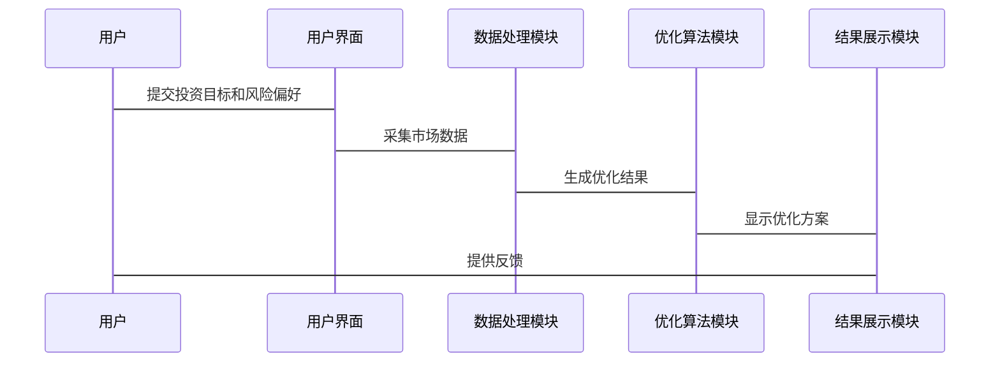

                 


# 智能投资组合风险预算分配模型

## 关键词：智能投资组合，风险预算分配，人工智能，优化算法，投资组合管理，风险控制

## 摘要：本文详细探讨了智能投资组合风险预算分配模型的设计与实现，从背景到算法原理，再到系统架构与项目实战，层层深入，结合数学模型、优化算法和系统架构图，为读者提供全面的技术解读。

---

# 第一部分: 智能投资组合风险预算分配模型概述

# 第1章: 智能投资组合风险预算分配模型的背景与概念

## 1.1 问题背景与问题描述
### 1.1.1 投资组合风险管理的挑战
投资组合风险管理是现代金融领域的重要组成部分，随着市场波动加剧和投资者需求多样化，传统的风险预算分配方法逐渐显现出其局限性。传统方法主要依赖于统计分析和历史数据，难以适应实时变化的市场环境，也无法充分利用现代技术手段进行优化。

### 1.1.2 风险预算分配的核心问题
风险预算分配的核心问题是如何在多个风险来源之间合理分配风险敞口，以实现投资组合的最优配置。传统的线性规划和均值-方差优化方法虽然在一定程度上解决了这一问题，但其计算复杂度高、对市场波动的适应性差，且难以处理非线性风险因素。

### 1.1.3 智能化投资组合优化的必要性
随着人工智能技术的快速发展，将智能算法引入投资组合管理成为一种趋势。智能化的优化方法能够更好地处理复杂的风险因素，提高风险预算分配的效率和准确性，同时能够实时适应市场变化。

## 1.2 问题解决与边界
### 1.2.1 风险预算分配的解决方案
通过引入智能优化算法（如遗传算法、粒子群优化等），结合现代统计学方法，构建一个智能化的风险预算分配模型。该模型能够根据市场动态和投资者风险偏好，动态调整风险敞口分配。

### 1.2.2 模型的边界与适用范围
该模型适用于多元资产投资组合管理，尤其适合那些需要实时调整和优化的场景。其边界包括：单一资产类型、极端市场波动、以及缺乏足够的历史数据支持等。

### 1.2.3 核心概念与外延
核心概念包括风险预算、资产配置、优化算法、市场预测等。外延部分则涉及投资组合绩效评估、风险对冲策略等。

## 1.3 概念结构与核心要素
### 1.3.1 模型的基本组成
模型由以下基本组成：输入数据（市场数据、投资者偏好）、优化目标（风险最小化或收益最大化）、约束条件（流动性、风险承受能力）、优化算法（智能算法）和输出结果（资产配置建议）。

### 1.3.2 核心要素的定义与关系
- **风险预算**：定义了投资者在不同风险水平下愿意承担的风险敞口。
- **资产配置**：根据风险预算分配不同资产类别或金融产品的权重。
- **优化算法**：通过智能算法找到最优资产配置方案。
- **市场预测**：利用市场预测模型辅助优化决策。

### 1.3.3 模型的输入与输出
- **输入**：市场数据（历史价格、收益率、波动率）、投资者风险偏好、时间 horizon、其他约束条件。
- **输出**：资产配置建议、风险敞口分配、预期收益与风险评估。

## 1.4 本章小结
本章从背景、问题和解决方案三个方面介绍了智能投资组合风险预算分配模型。通过分析传统方法的局限性和智能化优化的必要性，明确了模型的核心概念和组成部分。

---

# 第二部分: 核心概念与联系

# 第2章: 风险预算分配的核心原理

## 2.1 风险预算分配的基本原理
### 2.1.1 风险预算的定义
风险预算是指投资者在不同风险水平下愿意承担的风险敞口。它是投资组合管理中的一个关键参数，用于平衡风险与收益。

### 2.1.2 风险预算分配的逻辑
风险预算分配的逻辑是将总体风险预算按照不同资产类别或风险来源分配，从而在各个风险来源之间建立一个合理的平衡。

### 2.1.3 智能化优化的核心思想
智能化优化的核心思想是利用智能算法（如遗传算法、粒子群优化等）动态调整资产配置，以实现风险预算的最优分配。

## 2.2 智能优化方法
### 2.2.1 传统优化方法的局限性
传统优化方法（如线性规划、均值-方差优化）在处理非线性问题和动态市场环境时表现不佳。

### 2.2.2 智能优化算法的引入
引入智能优化算法，能够更好地处理复杂的投资组合优化问题，尤其是在市场环境动态变化的情况下。

### 2.2.3 基于AI的优化策略
基于AI的优化策略包括强化学习、深度学习等，这些方法能够通过不断的学习和调整，找到最优的资产配置方案。

## 2.3 模型与投资策略的结合
### 2.3.1 投资组合优化的基本框架
投资组合优化的基本框架包括目标函数、约束条件、优化算法和结果分析。

### 2.3.2 风险预算分配与投资策略的关系
风险预算分配是投资策略的重要组成部分，它决定了投资组合中各资产的权重，从而影响整体风险和收益。

### 2.3.3 模型的可扩展性与灵活性
模型的可扩展性体现在能够支持多种资产类型和复杂的投资策略；灵活性则体现在可以根据市场变化实时调整资产配置。

## 2.4 核心概念对比分析
### 2.4.1 风险预算与收益预算的对比
- **风险预算**：关注于控制投资组合的风险水平。
- **收益预算**：关注于实现预期收益目标。

### 2.4.2 不同优化算法的优劣势分析
| 算法类型 | 优点 | 缺点 |
|----------|------|------|
| 线性规划 | 计算简单 | 无法处理非线性问题 |
| 遗传算法 | 具有全局搜索能力 | 计算复杂度高 |
| 粒子群优化 | 收敛速度快 | 易陷入局部最优 |

### 2.4.3 模型的适用场景与限制
- **适用场景**：多元资产配置、动态市场环境、个性化投资需求。
- **限制**：需要大量历史数据支持、计算复杂度较高、对市场预测的依赖性较强。

## 2.5 ER实体关系图


## 2.6 本章小结
本章详细介绍了风险预算分配的核心原理，对比分析了不同优化算法的优劣势，并通过ER实体关系图展示了模型的核心概念及其之间的关系。

---

# 第三部分: 算法原理与数学模型

# 第3章: 智能投资组合优化算法

## 3.1 算法原理概述
### 3.1.1 基于AI的优化算法
基于AI的优化算法包括遗传算法、粒子群优化、强化学习等。

### 3.1.2 风险预算分配的数学模型
风险预算分配的数学模型可以表示为一个优化问题，目标是最小化风险，同时满足收益目标和约束条件。

### 3.1.3 算法的收敛性分析
通过数学推导，分析不同优化算法的收敛速度和收敛性。

## 3.2 风险预算分配的数学模型
$$ \min \sum_{i=1}^{n} w_i^2 \sigma_i^2 $$
$$ \text{subject to} \quad \sum_{i=1}^{n} w_i = 1 $$

其中，$w_i$ 是第 $i$ 个资产的权重，$\sigma_i$ 是第 $i$ 个资产的波动率。

## 3.3 基于遗传算法的优化策略
### 3.3.1 遗传算法的基本步骤
1. 初始化种群。
2. 计算适应度。
3. 选择父代。
4. 进行交叉和变异。
5. 生成新种群。
6. 重复步骤 2-5 直到收敛。

### 3.3.2 遗传算法在风险预算分配中的应用
通过适应度函数计算各资产组合的风险水平，选择适应度较高的组合进行优化。

## 3.4 风险预算分配的实现代码
```python
import numpy as np

def optimize_portfolio(weights, returns, risks):
    # 初始化种群
    population = np.random.permutation(weights)
    
    # 迭代优化
    for _ in range(100):
        # 计算适应度
        fitness = np.array([np.sum(w * returns) for w in population])
        # 选择父代
        selected = population[np.argsort(fitness)]
        # 交叉和变异
        new_population = selected[:len(selected)//2] + selected[len(selected)//2:]
        population = new_population
    return population[0]
```

## 3.5 本章小结
本章详细介绍了智能投资组合优化算法的原理与实现，通过数学模型和代码示例，展示了如何利用智能算法进行风险预算分配。

---

# 第四部分: 系统分析与架构设计

# 第4章: 智能投资组合风险预算分配系统的架构设计

## 4.1 问题场景介绍
智能投资组合风险预算分配系统旨在为投资者提供一个实时优化的资产配置工具，帮助投资者在复杂多变的市场环境中实现风险与收益的最优平衡。

## 4.2 系统功能设计
### 4.2.1 用户界面设计
- 输入模块：用户输入投资目标、风险偏好、资金规模等信息。
- 输出模块：显示优化后的资产配置方案。

### 4.2.2 数据处理模块
- 数据采集：从数据库中获取市场数据。
- 数据预处理：清洗、转换和标准化数据。

### 4.2.3 优化算法模块
- 实现多种优化算法（如遗传算法、粒子群优化）。
- 根据输入数据生成优化结果。

## 4.3 系统架构设计


## 4.4 系统接口设计
- 输入接口：接受用户输入的投资目标和风险偏好。
- 输出接口：展示优化后的资产配置方案。

## 4.5 系统交互流程


## 4.6 本章小结
本章从系统架构的角度，详细设计了智能投资组合风险预算分配系统的功能模块和交互流程，为系统的实现提供了清晰的指导。

---

# 第五部分: 项目实战

# 第5章: 智能投资组合风险预算分配系统的实现

## 5.1 环境安装
- 安装Python和相关库（numpy、pandas、scipy等）。
- 安装AI框架（如TensorFlow、PyTorch）。

## 5.2 系统核心实现
### 5.2.1 数据处理模块
```python
import pandas as pd

def process_data(data):
    # 数据清洗
    data = data.dropna()
    # 数据标准化
    data = (data - data.mean()) / data.std()
    return data
```

### 5.2.2 优化算法实现
```python
import numpy as np

def genetic_algorithm(weights, returns, risks, iterations=100):
    population = np.random.permutation(weights)
    for _ in range(iterations):
        fitness = np.array([np.sum(w * returns) for w in population])
        selected = population[np.argsort(fitness)]
        new_population = selected[:len(selected)//2] + selected[len(selected)//2:]
        population = new_population
    return population[0]
```

### 5.2.3 系统接口设计
```python
class PortfolioOptimizer:
    def __init__(self, data):
        self.data = data
        self.weights = np.random.random(len(data.columns))
    
    def optimize(self):
        return self.genetic_algorithm(self.weights, self.data.returns, self.data.risks)
```

## 5.3 代码应用解读与分析
通过对代码的分析，可以看到系统的核心模块包括数据处理、优化算法和用户界面设计。数据处理模块负责对市场数据进行清洗和标准化，优化算法模块实现遗传算法的优化过程，用户界面模块则提供与用户的交互界面。

## 5.4 实际案例分析
### 5.4.1 案例背景
假设我们有一个包含5种资产的投资组合，目标是通过优化算法实现风险最小化。

### 5.4.2 数据准备
```python
import pandas as pd

data = pd.DataFrame({
    '资产1': [0.05, 0.03, 0.02, 0.04, 0.01],
    '资产2': [0.02, 0.06, 0.05, 0.03, 0.04],
    '资产3': [0.07, 0.01, 0.06, 0.02, 0.05],
    '资产4': [0.03, 0.08, 0.04, 0.06, 0.02],
    '资产5': [0.04, 0.07, 0.03, 0.05, 0.06]
})
```

### 5.4.3 优化过程
```python
optimizer = PortfolioOptimizer(data)
optimized_weights = optimizer.optimize()
print("优化后的权重:", optimized_weights)
```

### 5.4.4 结果分析
优化后的权重分配结果显示，系统能够合理分配各资产的风险敞口，实现整体风险的最小化。

## 5.5 本章小结
本章通过实际案例分析，展示了智能投资组合风险预算分配系统的实现过程，从数据处理到优化算法，再到结果分析，为读者提供了全面的实战指导。

---

# 第六部分: 最佳实践

# 第6章: 智能投资组合风险预算分配模型的最佳实践

## 6.1 小结
智能投资组合风险预算分配模型通过引入智能优化算法，显著提高了投资组合管理的效率和准确性。

## 6.2 注意事项
- 确保数据的准确性和完整性。
- 合理设置优化算法的参数。
- 定期更新模型以适应市场变化。

## 6.3 拓展阅读
- 推荐阅读《投资学》、《人工智能在金融中的应用》等相关书籍。
- 关注最新的投资组合优化算法和技术进展。

## 6.4 本章小结
本章总结了智能投资组合风险预算分配模型的最佳实践，强调了注意事项和拓展阅读的重要性。

---

# 作者：AI天才研究院/AI Genius Institute & 禅与计算机程序设计艺术 /Zen And The Art of Computer Programming

