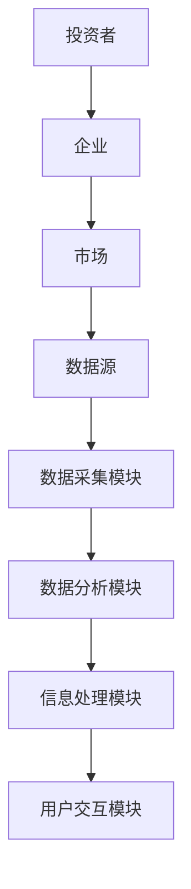
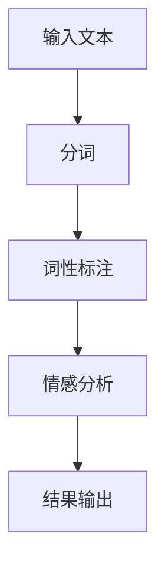
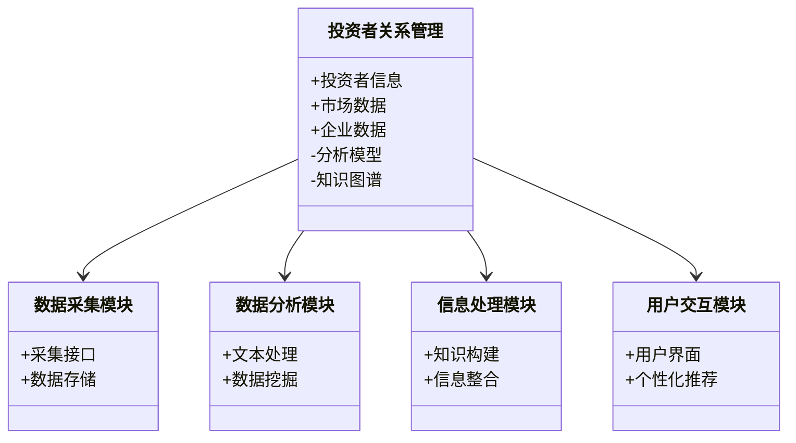

                 


# 智能投资者关系管理系统

> 关键词：智能投资者关系管理、自然语言处理、机器学习、数据挖掘、系统架构设计

> 摘要：本文详细探讨了智能投资者关系管理系统的构建与应用，从背景分析、核心概念、算法原理到系统架构设计、项目实战及最佳实践，层层深入，结合实际案例，为读者提供全面的技术指导。

---

## 第1章: 背景介绍

### 1.1 问题背景

#### 1.1.1 投资者关系管理的定义与重要性
投资者关系管理（Investor Relations Management，IRM）是指企业通过与投资者、潜在投资者以及其他相关方进行有效沟通和管理，以提升投资者对企业价值和信任度的过程。随着资本市场的快速发展，投资者对信息的需求日益多样化和复杂化，传统的投资者关系管理方式已难以满足现代企业的需求。

#### 1.1.2 传统投资者关系管理的局限性
- **信息处理效率低**：传统方法依赖人工整理和分析，效率低下，难以应对海量数据。
- **个性化需求难以满足**：不同投资者的关注点不同，传统方式难以提供个性化的信息服务。
- **缺乏实时性**：市场变化迅速，传统管理方式难以实现实时反馈和响应。

#### 1.1.3 智能化管理的必要性与优势
- **提高效率**：通过智能化系统，可以快速处理大量数据，提升信息处理效率。
- **个性化服务**：利用人工智能技术，为不同投资者提供定制化信息服务。
- **实时性增强**：智能化系统可以实时监控市场动态，及时反馈相关信息。

### 1.2 问题描述

#### 1.2.1 投资者需求的多样化与复杂化
投资者的需求不仅包括财务数据，还包括市场动态、行业趋势、公司治理等方面的信息。

#### 1.2.2 信息处理的高效性要求
面对海量信息，投资者需要快速获取、分析和决策。

#### 1.2.3 系统化管理的迫切需求
企业需要建立一个系统化的投资者关系管理系统，整合内外部资源，提升管理效率。

### 1.3 问题解决

#### 1.3.1 智能投资者关系管理的核心目标
- 提供高效的信息处理能力。
- 实现个性化信息服务。
- 提升决策支持能力。

#### 1.3.2 技术手段的选择与实现路径
- **自然语言处理（NLP）**：用于文本信息的提取和分析。
- **机器学习**：用于预测和分类。
- **数据挖掘**：用于模式识别和趋势分析。

#### 1.3.3 系统化解决方案的设计思路
- **模块化设计**：将系统划分为数据采集、分析、处理和展示模块。
- **数据驱动**：以数据为核心，构建智能分析模型。
- **用户-centric**：以用户需求为导向，提供个性化服务。

### 1.4 系统的边界与外延

#### 1.4.1 系统功能的边界划分
- **内部功能**：数据采集、分析、处理。
- **外部功能**：与企业内部系统（如财务系统）和外部数据源（如新闻网站）的接口。

#### 1.4.2 与外部系统的接口定义
- **数据输入接口**：与企业财务系统、新闻网站等的数据对接。
- **数据输出接口**：向投资者提供定制化报告。

#### 1.4.3 系统功能的扩展性设计
- **模块扩展**：新增功能模块，如风险预警系统。
- **数据扩展**：支持更多数据源的接入。

---

## 第2章: 智能投资者关系管理的核心概念

### 2.1 投资者关系管理的定义与特点

#### 2.1.1 投资者关系管理的定义
投资者关系管理是企业通过与投资者沟通，提升投资者对企业信任度和满意度的过程。

#### 2.1.2 传统投资者关系管理的特点
- **人工主导**：依赖人工处理信息。
- **被动响应**：主要处理投资者提出的问题。
- **信息单一**：提供的信息种类有限。

#### 2.1.3 智能化投资者关系管理的创新点
- **主动分析**：系统主动分析市场动态，提供前瞻性信息。
- **个性化服务**：基于投资者需求，提供定制化信息服务。
- **实时反馈**：系统实时监控市场变化，及时反馈相关信息。

### 2.2 智能系统的核心原理

#### 2.2.1 自然语言处理技术的应用
- **文本抽取**：从新闻、财报中提取关键信息。
- **情感分析**：分析市场对企业的看法。

#### 2.2.2 机器学习在预测分析中的作用
- **预测股价走势**：基于历史数据和市场信息，预测未来股价。
- **分类模型**：对投资者类型进行分类，提供个性化服务。

#### 2.2.3 数据挖掘在信息提取中的应用
- **模式识别**：识别市场中的趋势和模式。
- **关联规则挖掘**：发现相关事件之间的关联性。

### 2.3 智能投资者关系管理系统的组成部分

#### 2.3.1 数据采集模块
- **数据来源**：新闻、社交媒体、企业财报。
- **采集方式**：爬虫技术、API接口。

#### 2.3.2 数据分析模块
- **文本处理**：分词、实体识别。
- **数据挖掘**：聚类、分类、预测。

#### 2.3.3 信息处理模块
- **信息整合**：将多个数据源的信息整合。
- **知识图谱构建**：建立企业、市场、行业的知识网络。

#### 2.3.4 用户交互模块
- **用户界面**：提供可视化界面。
- **个性化推荐**：基于用户行为推荐信息。

---

## 第3章: 核心概念的联系与分析

### 3.1 投资者关系管理与智能系统的关系

#### 3.1.1 数据流的传递过程
- 数据采集 → 数据分析 → 信息处理 → 用户交互。

#### 3.1.2 实体关系图


---

## 第4章: 算法原理讲解

### 4.1 算法原理

#### 4.1.1 情感分析算法


#### 4.1.2 机器学习分类算法
```python
# 示例代码
from sklearn.feature_extraction.text import TfidfVectorizer
from sklearn.svm import SVC

# 数据预处理
vectorizer = TfidfVectorizer()
X = vectorizer.fit_transform(texts)

# 训练模型
model = SVC()
model.fit(X, labels)

# 预测
new_text = ["公司业绩良好"]
new_X = vectorizer.transform([new_text])
print(model.predict(new_X))
```

### 4.2 数学模型

#### 4.2.1 情感分析模型
$$ P(\text{positive}|text) = \frac{1}{1 + e^{-\beta \cdot \text{score}}} $$

其中，$\text{score}$ 是文本的情感得分，$\beta$ 是模型参数。

---

## 第5章: 系统架构设计

### 5.1 问题场景介绍

#### 5.1.1 项目介绍
本项目旨在构建一个智能投资者关系管理系统，利用NLP和机器学习技术，为企业投资者提供高效、个性化的信息服务。

### 5.2 系统功能设计

#### 5.2.1 领域模型


### 5.3 系统架构设计

#### 5.3.1 系统架构图


---

## 第6章: 项目实战

### 6.1 环境安装

#### 6.1.1 安装Python
```bash
python --version
pip install --upgrade pip
```

#### 6.1.2 安装依赖
```bash
pip install numpy pandas scikit-learn
```

### 6.2 核心代码实现

#### 6.2.1 数据采集模块
```python
import requests
from bs4 import BeautifulSoup

def fetch_data(url):
    response = requests.get(url)
    soup = BeautifulSoup(response.text, 'html.parser')
    return soup.text
```

#### 6.2.2 数据分析模块
```python
from sklearn.feature_extraction.text import TfidfVectorizer
from sklearn.svm import SVC

def train_model(X, y):
    vectorizer = TfidfVectorizer()
    model = SVC()
    model.fit(vectorizer.fit_transform(X), y)
    return model, vectorizer
```

### 6.3 代码解读与分析

#### 6.3.1 代码解读
上述代码实现了数据采集和模型训练的核心功能。数据采集模块使用爬虫技术获取网页内容，数据分析模块利用TF-IDF进行文本特征提取，并使用SVM进行分类。

#### 6.3.2 实际案例分析
以某企业财报为例，系统可以自动提取关键财务指标，并生成投资者报告。

### 6.4 项目小结
通过本项目，我们实现了智能投资者关系管理系统的初步功能，验证了系统设计的可行性和有效性。

---

## 第7章: 最佳实践、小结、注意事项与拓展阅读

### 7.1 最佳实践
- **数据质量**：确保数据来源可靠，数据预处理充分。
- **模型优化**：定期更新模型，提升准确率。
- **用户体验**：注重界面设计，提供良好的用户体验。

### 7.2 小结
智能投资者关系管理系统通过结合NLP、机器学习等技术，为企业投资者提供高效、个性化的信息服务，显著提升了管理效率和决策能力。

### 7.3 注意事项
- **数据隐私**：确保数据处理符合隐私保护法规。
- **系统稳定性**：保证系统的高可用性和稳定性。
- **技术更新**：及时跟进新技术，保持系统的先进性。

### 7.4 拓展阅读
- **深度学习在NLP中的应用**：探索更先进的文本处理技术。
- **知识图谱构建**：进一步完善知识图谱，提升系统的智能化水平。

---

## 作者：AI天才研究院 & 禅与计算机程序设计艺术

