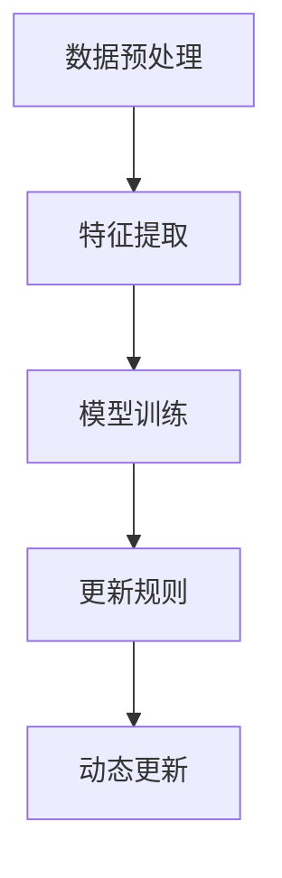
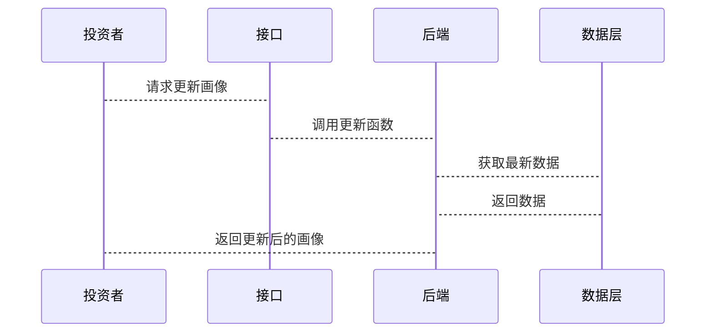

                 


# 智能投资者画像动态更新平台

## 关键词：智能投资者画像，动态更新，机器学习，数据驱动，实时分析

## 摘要：  
本文探讨了智能投资者画像动态更新平台的构建与实现。通过分析投资者行为数据，利用机器学习和大数据技术，实时更新投资者画像，提供精准的投资者分析和决策支持。文章详细阐述了平台的背景、核心概念、算法原理、系统架构及其实现，旨在为投资者画像的动态更新提供技术支持和实践指导。

---

## 第一部分：背景介绍

### 第1章：智能投资者画像动态更新平台概述

#### 1.1 问题背景
投资者画像传统上依赖于静态数据分析，难以捕捉市场变化和投资者行为的实时动态。这种静态分析方法在市场波动加剧的情况下，无法提供及时准确的投资者画像，导致投资决策的滞后和不准确。

#### 1.2 问题描述
投资者画像的核心要素包括投资风格、风险偏好、资产配置等。然而，这些要素在实际操作中会随市场环境和投资者行为的变化而动态调整。传统的投资者画像构建方法仅基于历史数据，无法实时反映投资者的最新行为和市场变化。

#### 1.3 问题解决
智能投资者画像动态更新平台通过实时采集和分析投资者行为数据，结合机器学习算法，动态更新投资者画像。这种动态更新方法能够捕捉投资者行为的细微变化，提供更精准的投资决策支持。

#### 1.4 边界与外延
平台的边界包括投资者行为数据的采集、分析和动态更新。外延功能则包括与投资决策系统、风险管理系统等其他系统的接口集成。平台的核心功能不包括投资决策的具体执行，但可为决策系统提供实时数据支持。

---

## 第二部分：核心概念与联系

### 第2章：智能投资者画像的核心原理

#### 2.1 核心概念原理
投资者画像的构建基于多维度数据，包括交易数据、市场数据、投资者行为数据等。动态更新机制通过实时数据流处理和机器学习模型的迭代优化，不断更新投资者画像的各个维度。

#### 2.2 概念属性特征对比
以下是传统投资者画像与动态更新平台在核心属性上的对比：

| 属性 | 传统投资者画像 | 动态更新平台 |
|------|----------------|--------------|
| 数据来源 | 历史数据 | 实时数据流 |
| 更新频率 | 定期更新 | 实时更新 |
| 数据维度 | 单一维度 | 多维度 |
| 数据粒度 | 粗粒度 | 细粒度 |

#### 2.3 ER实体关系图
```mermaid
er
    投资者
    画像数据
    更新规则
    时间戳
    投资者-画像数据: 关联关系
    画像数据-更新规则: 关联关系
```

---

## 第三部分：算法原理讲解

### 第3章：算法原理与实现

#### 3.1 算法原理
智能投资者画像的动态更新采用基于时间序列的预测模型。通过分析投资者行为数据的时间序列特征，利用机器学习算法预测未来的行为模式，从而动态调整投资者画像。

#### 3.2 算法流程图


#### 3.3 算法实现
以下是基于时间序列预测的Python代码实现：
```python
import pandas as pd
import numpy as np
from sklearn.preprocessing import MinMaxScaler
from keras.models import Sequential
from keras.layers import LSTM, Dense

# 数据加载与预处理
data = pd.read_csv('investor_behavior.csv')
data = data['value'].values
data = data.reshape(-1, 1)
scaler = MinMaxScaler(feature_range=(0, 1))
scaled_data = scaler.fit_transform(data)

# 划分训练集和测试集
train_size = int(len(scaled_data) * 0.8)
train_data = scaled_data[:train_size]
test_data = scaled_data[train_size:]

# 构建数据集
X_train = []
y_train = []
for i in range(60, len(train_data)):
    X_train.append(train_data[i-60:i])
    y_train.append(train_data[i])

X_train = np.array(X_train)
y_train = np.array(y_train)

# 模型训练
model = Sequential()
model.add(LSTM(128, return_sequences=True, input_shape=(60, 1)))
model.add(LSTM(64, return_sequences=False))
model.add(Dense(1))
model.compile(optimizer='adam', loss='mean_squared_error')

model.fit(X_train, y_train, epochs=50, batch_size=32)

# 动态更新实现
def update_investor_profile(new_data):
    scaled_new_data = scaler.transform(new_data)
    X_new = []
    for i in range(len(scaled_new_data)):
        X_new.append(scaled_new_data[i-60:i])
    X_new = np.array(X_new)
    predictions = model.predict(X_new)
    updated_profile = scaler.inverse_transform(predictions)
    return updated_profile
```

#### 3.4 数学模型
时间序列预测模型采用长短时记忆网络（LSTM）：
$$
f(t) = LSTM(x_t, h_{t-1}, c_{t-1})
$$
其中，$x_t$ 是输入数据，$h_{t-1}$ 和 $c_{t-1}$ 是前一时刻的隐藏状态和记忆单元。

---

## 第四部分：系统分析与架构设计

### 第4章：系统架构设计

#### 4.1 系统功能模块
- 数据采集模块：实时采集投资者行为数据
- 画像构建模块：基于机器学习算法构建初始投资者画像
- 动态更新模块：实时更新投资者画像

#### 4.2 领域模型类图


#### 4.3 系统架构图


#### 4.4 接口设计与交互流程


---

## 第五部分：项目实战

### 第5章：项目实战

#### 5.1 环境安装
- 安装Python和相关库：
  ```bash
  pip install numpy pandas keras tensorflow scikit-learn
  ```

#### 5.2 核心代码实现
以下是动态更新模块的核心代码：
```python
def update_investor_profile(new_data):
    scaled_new_data = scaler.transform(new_data)
    X_new = []
    for i in range(len(scaled_new_data)):
        X_new.append(scaled_new_data[i-60:i])
    X_new = np.array(X_new)
    predictions = model.predict(X_new)
    updated_profile = scaler.inverse_transform(predictions)
    return updated_profile
```

#### 5.3 案例分析
以某投资者的历史交易数据为例，展示动态更新过程：
1. 数据预处理：清洗和归一化数据。
2. 模型训练：利用历史数据训练LSTM模型。
3. 动态更新：实时更新投资者画像，捕捉市场变化和投资者行为的微小变化。

---

## 第六部分：最佳实践

### 第6章：总结与展望

#### 6.1 最佳实践
- 数据质量：确保实时数据的准确性和完整性。
- 模型调优：定期更新模型参数，提升预测精度。
- 系统监控：实时监控平台运行状态，及时处理异常。

#### 6.2 小结
智能投资者画像动态更新平台通过实时分析投资者行为数据，提供精准的投资者画像，为投资决策提供有力支持。

#### 6.3 注意事项
- 数据隐私：严格遵守数据隐私保护法规。
- 系统稳定性：确保平台的高可用性和稳定性。
- 安全性：加强平台的安全防护，防止数据泄露。

#### 6.4 拓展阅读
推荐书籍：
- 《机器学习实战》
- 《深度学习》
- 《时间序列分析》

---

## 作者：AI天才研究院 & 禅与计算机程序设计艺术

