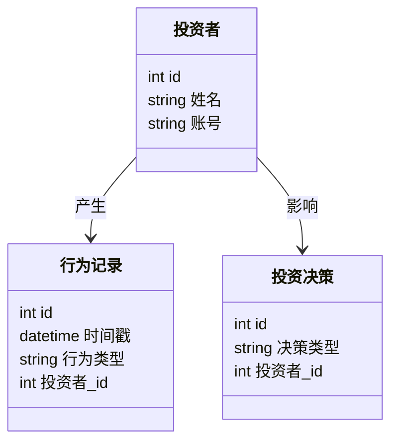

                 


# 智能投资者行为分析与预测平台

> 关键词：投资者行为分析，预测模型，机器学习，系统架构，实时监控

> 摘要：本文详细探讨了智能投资者行为分析与预测平台的设计与实现。通过分析投资者行为的核心概念、算法原理、系统架构、项目实战以及最佳实践，展示了如何利用大数据和人工智能技术，构建一个高效、准确的投资者行为分析与预测系统。文章内容涵盖了从理论到实践的各个方面，为读者提供了全面的技术指导。

---

## 第一部分：背景介绍与问题背景

### 第1章：背景介绍与问题背景

#### 1.1 投资者行为分析的背景与意义

##### 1.1.1 投资者行为分析的定义
投资者行为分析是通过对投资者在金融市场中的决策和操作进行观察、记录和分析，揭示其行为模式和心理特征的过程。这种分析有助于理解投资者的决策机制，并为投资机构提供科学的决策支持。

##### 1.1.2 投资者行为分析的重要性
- **优化投资策略**：通过分析投资者行为，可以帮助机构识别潜在风险，优化投资组合。
- **提升交易效率**：投资者行为分析可以帮助机构快速做出反应，抓住市场机会。
- **个性化服务**：通过了解投资者的行为特征，可以为其提供个性化的投资建议。

##### 1.1.3 智能化投资者行为分析的必要性
随着金融市场的复杂化，传统的投资者行为分析方法已难以满足需求。通过引入人工智能和大数据技术，可以实现智能化、自动化的投资者行为分析与预测。

#### 1.2 问题背景与目标

##### 1.2.1 当前投资者行为分析的痛点
- 数据量大：投资者行为数据来源多样，数据量庞大。
- 数据复杂：投资者行为受多种因素影响，分析难度大。
- 实时性要求高：金融市场变化快，需要实时分析。

##### 1.2.2 智能投资者行为分析的目标
- 实现实时监测：对投资者行为进行实时监控和分析。
- 提高准确性：利用机器学习等技术，提高预测的准确性。
- 个性化分析：针对不同投资者，提供个性化的行为分析和预测。

##### 1.2.3 平台的边界与外延
平台主要关注投资者的行为数据采集、分析和预测，不涉及具体的交易操作和投资决策。

#### 1.3 核心概念与组成

##### 1.3.1 核心概念的结构
- 行为数据：包括投资者的交易记录、市场反应、情绪变化等。
- 行为模式：通过分析行为数据，识别出投资者的行为特征和模式。
- 预测模型：基于行为数据和模式，构建预测模型，预测未来投资者行为。

##### 1.3.2 核心要素的组成与关系
- 数据采集：从多种渠道采集投资者行为数据。
- 数据处理：对采集到的数据进行清洗、转换和预处理。
- 行为分析：通过算法对数据进行分析，识别行为特征。
- 行为预测：基于分析结果，预测未来投资者行为。

##### 1.3.3 智能投资者行为分析的框架
1. 数据采集与处理
2. 行为特征提取
3. 预测模型构建
4. 行为预测与应用

---

## 第二部分：核心概念与联系

### 第2章：智能投资者行为分析的核心概念与联系

#### 2.1 投资者行为分析的核心原理

##### 2.1.1 行为数据的采集与处理
- 数据来源：交易记录、市场数据、社交媒体、投资者问卷等。
- 数据清洗：去除噪声数据，处理缺失值。
- 数据转换：将原始数据转换为适合分析的形式。

##### 2.1.2 行为模式的识别与分类
- 行为特征：包括交易频率、交易时间、交易金额等。
- 行为分类：将投资者分为不同类型，如保守型、激进型等。

##### 2.1.3 行为预测的数学模型
- 线性回归：用于预测连续型变量。
- 分类算法：如决策树、随机森林等，用于分类预测。

#### 2.2 核心概念的属性特征对比

##### 2.2.1 不同投资者行为特征的对比
| 行为特征 | 保守型投资者 | 激进型投资者 |
|----------|---------------|--------------|
| 风险偏好 | 低             | 高            |
| 交易频率 | 低             | 高            |
| 交易金额 | 小             | 大            |

##### 2.2.2 行为特征与投资决策的关系
- 风险偏好高的投资者倾向于高风险高回报的投资。
- 交易频率高的投资者可能更关注市场短期波动。

##### 2.2.3 行为特征的量化方法
- 风险偏好：通过波动率和收益进行量化。
- 交易频率：通过交易次数和时间间隔进行量化。

#### 2.3 ER实体关系图

```mermaid
erDiagram
    actor 投资者 {
        <外键> int id
        string 姓名
        string 账号
        <外键> int 行为记录_id
    }
    entity 行为记录 {
        int id
        datetime 时间戳
        string 行为类型
        int 投资者_id
    }
    entity 投资决策 {
        int id
        string 决策类型
        int 投资者_id
    }
    investor --> 行为记录 : 产生
    investor --> 投资决策 : 影响
```

---

## 第三部分：算法原理与数学模型

### 第3章：算法原理与数学模型

#### 3.1 算法原理

##### 3.1.1 基于机器学习的行为分析算法
- 线性回归：用于预测连续型变量。
- 支持向量机：用于分类和回归。
- 随机森林：用于分类和回归。

##### 3.1.2 深度学习模型的应用
- 神经网络：用于复杂模式识别。
- 长短期记忆网络（LSTM）：用于时间序列预测。

##### 3.1.3 时间序列分析方法
- ARIMA：用于时间序列预测。
- GARCH：用于波动率预测。

#### 3.2 数学模型与公式

##### 3.2.1 行为预测的线性回归模型
$$ y = \beta_0 + \beta_1x + \epsilon $$

##### 3.2.2 支持向量机模型
$$ \text{目标函数：} \min \frac{1}{2}||\beta||^2 + C \sum_{i=1}^n \xi_i $$
$$ \text{约束条件：} y_i (\beta \cdot x_i + \beta_0) \geq 1 - \xi_i $$
$$ \xi_i \geq 0 $$

##### 3.2.3 长短期记忆网络（LSTM）
$$ f(t) = \text{LSTM}(x_t, f(t-1)) $$

---

## 第四部分：系统分析与架构设计

### 第4章：系统分析与架构设计

#### 4.1 系统功能设计

##### 4.1.1 领域模型


##### 4.1.2 系统架构设计
```mermaid
rectangu
``` 

---

## 第五部分：项目实战

### 第5章：项目实战

#### 5.1 环境搭建

##### 5.1.1 技术选型
- 语言：Python
- 框架：Django
- 数据库：MySQL
- 机器学习库：scikit-learn、TensorFlow

#### 5.2 核心功能实现

##### 5.2.1 数据采集与处理
```python
import pandas as pd
import numpy as np

# 数据采集
data = pd.read_csv('investor_behavior.csv')

# 数据清洗
data.dropna(inplace=True)
data.drop_duplicates(inplace=True)

# 数据转换
data['时间戳'] = pd.to_datetime(data['时间戳'])
```

##### 5.2.2 行为特征提取
```python
from sklearn.feature_extraction import DictVectorizer

vectorizer = DictVectorizer()
features = vectorizer.fit_transform(data[['交易金额', '交易时间']].to_dict('records'))
```

##### 5.2.3 行为预测模型训练
```python
from sklearn.ensemble import RandomForestClassifier

model = RandomForestClassifier(n_estimators=100, max_depth=5)
model.fit(features, data['行为类型'])
```

#### 5.3 项目小结

---

## 第六部分：最佳实践与注意事项

### 第6章：最佳实践与注意事项

#### 6.1 最佳实践
- 数据清洗：确保数据质量，避免噪声干扰。
- 特征选择：选择具有高影响力的特征，提高模型准确性。
- 模型调优：通过交叉验证和网格搜索优化模型参数。

#### 6.2 小结
智能投资者行为分析与预测平台的构建，需要结合大数据和人工智能技术，通过科学的方法和工具，实现投资者行为的智能化分析与预测。

#### 6.3 注意事项
- 数据隐私：确保投资者数据的安全性，遵守相关法律法规。
- 模型解释性：选择具有较高解释性的模型，便于分析结果的解读。
- 模型更新：定期更新模型，适应市场变化。

#### 6.4 拓展阅读
- 《机器学习实战》
- 《深度学习》
- 《金融数据分析与建模》

---

## 作者：AI天才研究院/AI Genius Institute & 禅与计算机程序设计艺术 /Zen And The Art of Computer Programming

