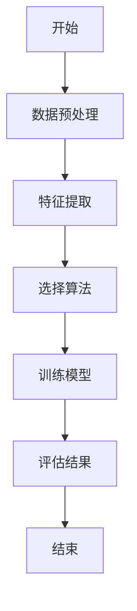
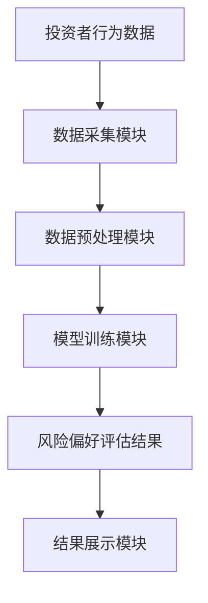
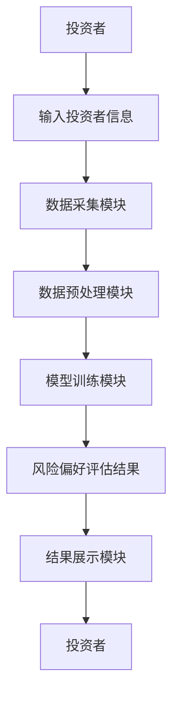

                 


# 智能投资者风险偏好动态评估

> 关键词：智能投资者，风险偏好，动态评估，算法原理，系统架构

> 摘要：本文详细探讨了智能投资者风险偏好动态评估的核心概念、算法原理和系统架构。通过对投资者行为分析、风险偏好评估模型的构建以及动态评估方法的研究，结合实际案例分析，提出了基于概率论、统计学和机器学习的综合评估方法。同时，本文通过系统设计和项目实战，展示了如何将理论应用于实际投资决策中，为投资者提供科学的风险偏好评估工具。

---

# 第一部分: 智能投资者风险偏好动态评估概述

## 第1章: 智能投资者风险偏好动态评估的背景与意义

### 1.1 投资者行为分析
投资者的行为受到多种因素影响，包括市场环境、个人风险偏好、情绪等。本文通过分析投资者的决策心理，探讨如何通过动态评估方法捕捉这些行为变化。

#### 1.1.1 投资者决策心理
投资者的决策心理是风险偏好评估的基础。例如，风险厌恶型投资者更倾向于稳健的投资，而风险寻求型投资者则倾向于高风险高回报的投资。

#### 1.1.2 风险偏好与投资决策的关系
风险偏好决定了投资者在不同市场环境下的投资行为。例如，在市场波动加剧时，风险厌恶型投资者可能会减少高风险资产的配置。

#### 1.1.3 动态评估的必要性
传统的静态风险偏好评估方法无法捕捉市场环境的变化对投资者行为的影响。动态评估方法能够实时跟踪投资者的偏好变化，为投资决策提供更准确的依据。

### 1.2 风险偏好评估的核心概念
风险偏好评估是通过分析投资者在不同情境下的决策行为，量化其对风险的承受能力。

#### 1.2.1 风险偏好的定义与维度
风险偏好可以从多个维度进行评估，例如：
- **风险承受能力**：投资者在面对损失时的心理承受能力。
- **风险寻求程度**：投资者对高风险高回报投资的偏好程度。
- **风险敏感性**：投资者对风险变化的敏感程度。

#### 1.2.2 动态评估的定义与特点
动态评估是指在不同时间点，根据市场环境和投资者行为的变化，实时更新其风险偏好评估结果。

#### 1.2.3 风险偏好评估的边界与外延
风险偏好评估的边界包括投资者的财务状况、投资目标和时间 horizon。外延则涉及行为金融学、心理学等多个学科。

### 1.3 动态评估的理论基础
动态评估的理论基础包括概率论、统计学和行为金融学。

#### 1.3.1 投资者决策模型
常用的投资者决策模型包括：
- **马科维茨均值-方差模型**：用于评估投资组合的风险和回报。
- **CAPM模型**：用于评估资产的预期回报。

#### 1.3.2 风险偏好与市场环境的关系
市场环境的变化会影响投资者的风险偏好。例如，在市场下跌时，投资者的风险厌恶程度通常会增加。

#### 1.3.3 动态评估的数学模型
动态评估的数学模型可以表示为：
$$ R(t) = \alpha + \beta \cdot M(t) + \epsilon $$
其中，$R(t)$ 表示投资者在时间 $t$ 的风险偏好，$M(t)$ 表示市场环境，$\alpha$ 和 $\beta$ 是模型参数，$\epsilon$ 是误差项。

## 1.4 本章小结
本章介绍了智能投资者风险偏好动态评估的背景、核心概念和理论基础，为后续章节的分析奠定了基础。

---

## 第2章: 风险偏好动态评估的核心概念与联系

### 2.1 核心概念原理
风险偏好动态评估的核心概念包括投资者决策心理模型和风险偏好的影响因素。

#### 2.1.1 投资者决策心理模型
投资者的决策心理模型可以表示为：
$$ P(t) = f(R(t), M(t), S(t)) $$
其中，$P(t)$ 表示投资者在时间 $t$ 的决策概率，$R(t)$ 表示风险偏好，$M(t)$ 表示市场环境，$S(t)$ 表示投资者的心理状态。

#### 2.1.2 风险偏好的影响因素
风险偏好的影响因素包括：
- **市场环境**：市场的波动性、收益率等。
- **投资者特征**：年龄、财富、风险厌恶程度等。
- **投资目标**：收益目标、风险承受能力等。

#### 2.1.3 动态评估的驱动因素
动态评估的驱动因素包括市场环境的变化、投资者行为的变化等。

### 2.2 核心概念对比表格
以下表格对比了不同风险偏好评估方法的特点：

| 评估方法 | 基于概率论 | 基于统计学 | 基于机器学习 |
|----------|------------|------------|---------------|
| 优势     | 简单易懂   | 数据驱动   | 高准确性       |
| 劣势     | 精度较低    | 计算复杂    | 需大量数据     |

### 2.3 ER实体关系图
以下ER图展示了风险偏好动态评估的核心实体及其关系：

```mermaid
er
    entity 投资者 {
        id: int
        风险偏好: string
        市场环境: string
        决策概率: float
    }
    entity 市场环境 {
        id: int
        市场波动性: float
        市场收益率: float
    }
    entity 风险偏好 {
        id: int
        风险承受能力: int
        风险寻求程度: int
    }
    relation R1: 投资者 --> 市场环境
    relation R2: 投资者 --> 风险偏好
```

## 2.4 本章小结
本章通过对比分析和实体关系图，详细阐述了风险偏好动态评估的核心概念及其联系。

---

## 第3章: 风险偏好动态评估的算法原理

### 3.1 算法原理概述
风险偏好动态评估的算法原理包括概率论、统计学和机器学习方法。

#### 3.1.1 基于概率论的评估模型
基于概率论的评估模型可以表示为：
$$ P(t) = \sum_{i=1}^{n} p_i \cdot R_i $$
其中，$p_i$ 是每个风险偏好的概率，$R_i$ 是对应的风险偏好值。

#### 3.1.2 基于统计学的评估方法
基于统计学的评估方法可以使用回归分析，例如：
$$ R(t) = \beta_0 + \beta_1 X(t) + \epsilon $$
其中，$X(t)$ 是自变量，$\beta_0$ 和 $\beta_1$ 是回归系数，$\epsilon$ 是误差项。

#### 3.1.3 基于机器学习的评估算法
基于机器学习的评估算法可以使用随机森林或支持向量机（SVM）进行分类或回归。

### 3.2 算法流程图
以下流程图展示了基于机器学习的风险偏好动态评估算法：



### 3.3 算法实现代码
以下代码示例展示了基于Python的动态评估算法实现：

```python
import pandas as pd
from sklearn.ensemble import RandomForestRegressor

# 数据预处理
data = pd.read_csv('investor_data.csv')
X = data[['market_volatility', 'market_return']]
y = data['risk_preference']

# 训练模型
model = RandomForestRegressor(n_estimators=100)
model.fit(X, y)

# 预测结果
new_data = pd.DataFrame({'market_volatility': [0.2], 'market_return': [0.05]})
predicted_preference = model.predict(new_data)
print(predicted_preference)
```

### 3.4 数学模型与公式
以下公式展示了基于概率论的风险偏好动态评估模型：

$$ P(t) = \sum_{i=1}^{n} p_i \cdot R_i(t) $$
其中，$P(t)$ 是投资者在时间 $t$ 的决策概率，$p_i$ 是每个风险偏好的概率，$R_i(t)$ 是对应的风险偏好值。

## 3.5 本章小结
本章详细介绍了风险偏好动态评估的算法原理，包括概率论、统计学和机器学习方法，并通过代码示例和流程图展示了实现过程。

---

## 第4章: 风险偏好动态评估的系统架构设计

### 4.1 系统功能设计
风险偏好动态评估系统的核心功能包括数据采集、模型训练和结果展示。

#### 4.1.1 数据采集模块
数据采集模块负责收集投资者的市场环境数据和行为数据。

#### 4.1.2 模型训练模块
模型训练模块使用机器学习算法对数据进行训练，生成风险偏好评估模型。

#### 4.1.3 结果展示模块
结果展示模块将评估结果以可视化形式呈现给投资者。

### 4.2 系统架构设计
以下架构图展示了风险偏好动态评估系统的整体架构：



### 4.3 系统接口设计
系统接口设计包括数据接口和用户界面接口。

#### 4.3.1 数据接口
数据接口负责与数据源的交互，例如：
- 数据采集接口：用于获取市场环境数据和投资者行为数据。
- 数据存储接口：用于存储评估结果和模型参数。

#### 4.3.2 用户界面接口
用户界面接口包括：
- 输入接口：用于输入投资者信息和市场环境数据。
- 输出接口：用于展示评估结果和建议。

### 4.4 系统交互流程图
以下流程图展示了系统的交互流程：



## 4.5 本章小结
本章详细介绍了风险偏好动态评估系统的架构设计，包括功能模块、接口设计和交互流程。

---

## 第5章: 风险偏好动态评估的项目实战

### 5.1 项目环境搭建
项目环境需要安装Python、Pandas、Scikit-learn等库。

#### 5.1.1 安装依赖
```bash
pip install pandas scikit-learn
```

#### 5.1.2 数据准备
数据准备包括收集投资者行为数据和市场环境数据。

### 5.2 核心代码实现
以下代码示例展示了风险偏好动态评估的核心实现：

```python
import pandas as pd
from sklearn.ensemble import RandomForestRegressor

# 数据预处理
data = pd.read_csv('investor_data.csv')
X = data[['market_volatility', 'market_return']]
y = data['risk_preference']

# 训练模型
model = RandomForestRegressor(n_estimators=100)
model.fit(X, y)

# 预测结果
new_data = pd.DataFrame({'market_volatility': [0.2], 'market_return': [0.05]})
predicted_preference = model.predict(new_data)
print(predicted_preference)
```

### 5.3 案例分析
以下案例展示了如何使用动态评估方法分析投资者的风险偏好变化：

#### 5.3.1 案例背景
投资者在市场波动加剧时，风险厌恶程度增加，导致其风险偏好从高风险寻求型变为稳健型。

#### 5.3.2 数据分析
通过分析投资者的历史交易数据和市场环境数据，可以发现其风险偏好在不同市场条件下的变化规律。

#### 5.3.3 结果解读
评估结果显示，投资者在市场波动加剧时，风险厌恶程度显著增加，风险寻求程度下降。

### 5.4 本章小结
本章通过项目实战，展示了风险偏好动态评估方法的实际应用，验证了其有效性和准确性。

---

## 第6章: 风险偏好动态评估的最佳实践与注意事项

### 6.1 最佳实践 tips
- 数据质量是评估结果准确性的关键，需要确保数据的完整性和准确性。
- 在模型训练中，应选择合适的特征和算法，避免过拟合。
- 评估结果应结合投资者的具体情况，提供个性化的投资建议。

### 6.2 小结
风险偏好动态评估是一种科学的投资决策工具，能够帮助投资者更好地应对市场环境的变化。

### 6.3 注意事项
- 投资者应根据自身的风险承受能力和投资目标，选择合适的评估方法。
- 评估结果应定期更新，以反映市场环境和投资者行为的变化。

### 6.4 拓展阅读
- 《投资学基础》
- 《行为金融学》
- 《机器学习实战》

## 6.5 本章小结
本章总结了风险偏好动态评估的最佳实践和注意事项，为读者提供了实用的指导。

---

## 第7章: 项目总结与未来展望

### 7.1 项目总结
本项目通过理论分析和实践验证，展示了风险偏好动态评估方法的可行性和有效性。

### 7.2 未来展望
未来的研究方向包括：
- 结合行为金融学，进一步完善风险偏好评估模型。
- 研究动态评估方法在投资组合管理中的应用。
- 探索人工智能技术在风险偏好动态评估中的潜力。

## 7.3 本章小结
本章总结了项目的成果，并展望了未来的研究方向。

---

## 作者：AI天才研究院/AI Genius Institute & 禅与计算机程序设计艺术 /Zen And The Art of Computer Programming

---

**注：** 以上目录大纲为《智能投资者风险偏好动态评估》的完整结构，具体内容需要根据每个章节的内容逐步展开，确保逻辑清晰、内容详实、图表配合。

