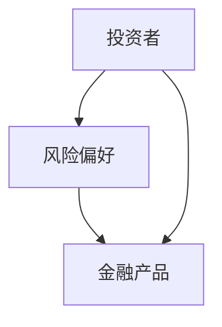
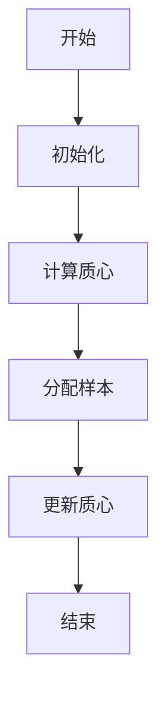
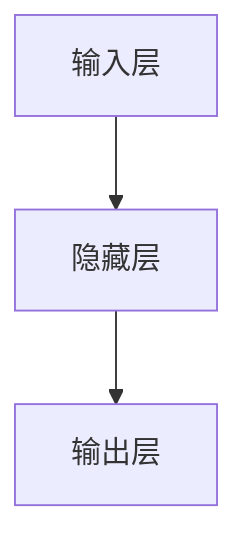
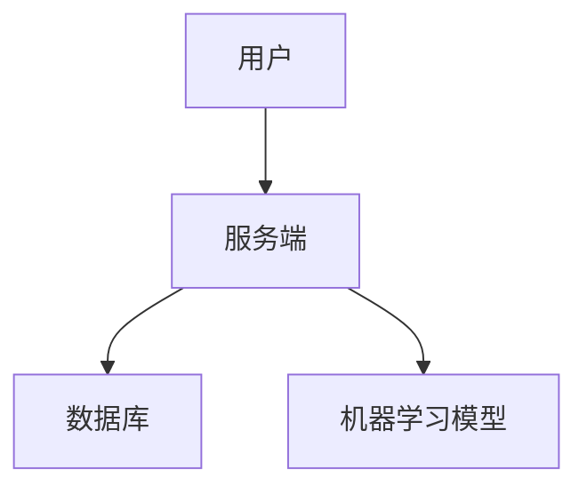

                 

# 智能投资者风险偏好动态评估与产品匹配

---

## 关键词：智能投资者，风险偏好，动态评估，产品匹配，人工智能，大数据分析

---

## 摘要

智能投资者风险偏好动态评估与产品匹配是金融领域的一项重要研究，旨在通过人工智能和大数据分析技术，实时动态地评估投资者的风险偏好，并基于此为其匹配合适的投资产品。本文从背景与基础、核心概念、算法原理、系统架构、项目实战等多个方面展开，详细探讨了智能投资者风险偏好动态评估与产品匹配的实现方法与应用场景。通过理论与实践相结合的方式，本文为读者提供了一套完整的解决方案，并提出了未来研究的方向。

---

# 第一部分: 智能投资者风险偏好动态评估与产品匹配的背景与基础

## 第1章: 投资者风险偏好概述

### 1.1 投资者风险偏好的定义与分类

#### 1.1.1 风险偏好的基本定义

投资者风险偏好是指投资者在面对不确定性和潜在损失时，对风险的接受程度和反应方式的综合表现。它是投资者决策的核心因素之一。风险偏好可以分为三类：**风险中性**、**风险厌恶**和**风险寻求**。

- **风险中性**：投资者对风险和收益的预期是线性的，只关心预期收益，不特别偏好或厌恶风险。
- **风险厌恶**：投资者倾向于选择风险较低、收益稳定的资产，厌恶不确定性和潜在损失。
- **风险寻求**：投资者愿意承担较高的风险以追求更高的收益。

#### 1.1.2 风险偏好的分类与特征

投资者的风险偏好可以通过以下特征进行分类：

- **风险承受能力**：投资者在面对潜在损失时的心理承受能力。
- **风险认知能力**：投资者对风险的理解和认知能力。
- **风险态度**：投资者对风险的主观态度。

#### 1.1.3 风险偏好与投资行为的关系

投资者的风险偏好直接影响其投资行为。例如：

- 风险厌恶的投资者倾向于选择债券、储蓄等低风险产品。
- 风险寻求的投资者倾向于选择股票、期权等高风险产品。

### 1.2 智能评估的必要性与优势

#### 1.2.1 传统风险评估方法的局限性

传统风险评估方法主要依赖于投资者的问卷调查和历史交易数据，存在以下问题：

- **问卷调查的主观性**：投资者的回答可能受到情绪、认知偏差的影响。
- **静态评估的局限性**：传统评估方法通常只进行一次性评估，无法捕捉投资者风险偏好的动态变化。

#### 1.2.2 智能评估的核心优势

智能评估的核心优势在于其动态性和准确性：

- **动态性**：通过实时采集和分析投资者的行为数据、市场数据等，智能评估能够动态调整投资者的风险偏好画像。
- **准确性**：利用机器学习算法，智能评估能够更精准地识别投资者的真实风险偏好。

#### 1.2.3 动态评估的意义与应用场景

动态评估的意义在于：

- **提升投资决策的科学性**：通过动态评估，投资者能够获得更精准的投资建议。
- **优化投资体验**：动态评估能够根据市场变化和投资者需求，实时调整投资策略。

### 1.3 动态评估的背景与技术基础

#### 1.3.1 数据驱动的金融分析

数据驱动的金融分析是智能投资者风险偏好动态评估的基础。通过分析海量的金融市场数据和投资者行为数据，可以提取出有价值的信息。

#### 1.3.2 人工智能在金融领域的应用

人工智能技术（如机器学习、自然语言处理等）在金融领域的应用越来越广泛。例如：

- **机器学习**：用于预测市场走势、识别投资机会。
- **自然语言处理**：用于分析新闻、社交媒体等非结构化数据。

#### 1.3.3 动态评估的技术基础

动态评估的技术基础包括：

- **大数据处理技术**：用于处理海量的金融市场数据和投资者行为数据。
- **机器学习算法**：用于构建动态评估模型。
- **实时计算技术**：用于实现实时动态评估。

---

## 第2章: 风险偏好评估的核心概念与模型

### 2.1 风险偏好评估的理论基础

#### 2.1.1 风险中性的投资者

风险中性的投资者只关注投资的期望收益，而不考虑风险因素。其风险偏好可以用以下公式表示：

$$ E(r_p) = w^T \mu $$

其中：
- \( E(r_p) \) 是投资组合的期望收益。
- \( w \) 是投资组合的权重向量。
- \( \mu \) 是资产的期望收益向量。

#### 2.1.2 风险厌恶的投资者

风险厌恶的投资者倾向于选择风险较低的投资组合。其风险偏好可以用马科维茨均值-方差模型表示：

$$ \sigma_p^2 = w^T \Sigma w $$

其中：
- \( \sigma_p^2 \) 是投资组合的方差（风险）。
- \( \Sigma \) 是资产之间的协方差矩阵。

#### 2.1.3 风险寻求的投资者

风险寻求的投资者倾向于选择风险较高的投资组合，其风险偏好可以用以下公式表示：

$$ \text{风险寻求度} = \frac{\text{实际收益} - \text{预期收益}}{\text{风险}} $$

---

### 2.2 风险偏好评估的数学模型

#### 2.2.1 马科维茨均值-方差模型

马科维茨均值-方差模型是风险厌恶投资者的典型模型。其目标是最小化投资组合的风险（方差），在给定的收益约束下。

$$ \min_{w} w^T \Sigma w $$
$$ \text{subject to} \quad w^T \mu = \text{target return} $$ $$ \sum_{i=1}^n w_i = 1 $$ $$ w_i \geq 0, \forall i $$

#### 2.2.2 希腊字母法

希腊字母法用于衡量投资组合对市场风险的敏感性。其中，**β系数**是最重要的希腊字母之一，表示投资组合的系统性风险。

$$ \beta = \frac{\text{协方差}(r_p, r_m)}{\text{方差}(r_m)} $$

其中：
- \( r_p \) 是投资组合的收益。
- \( r_m \) 是市场指数的收益。

---

### 2.3 风险偏好评估的属性特征对比

#### 2.3.1 风险承受能力

| 特征 | 风险承受能力 |
|------|---------------|
| 定义 | 投资者在面对潜在损失时的心理承受能力 |
| 影响因素 | 投资者的财富状况、风险认知能力等 |

#### 2.3.2 风险认知能力

| 特征 | 风险认知能力 |
|------|---------------|
| 定义 | 投资者对风险的理解和认知能力 |
| 影响因素 | 投资者的教育背景、经验等 |

#### 2.3.3 风险态度

| 特征 | 风险态度 |
|------|-----------|
| 定义 | 投资者对风险的主观态度 |
| 分类 | 风险厌恶、风险中性、风险寻求 |

---

### 2.4 实体关系图（ER图）

---

## 第3章: 风险偏好动态评估的算法原理

### 3.1 聚类分析

#### 3.1.1 K-means算法

K-means算法是一种经典的聚类算法，适用于将投资者分为不同的风险偏好类别。

#### 3.1.2 算法实现步骤

1. 初始化：随机选择K个质心。
2. 计算质心：根据当前聚类结果，重新计算质心。
3. 分配样本：将每个样本分配到最近的质心所在的聚类。
4. 更新质心：根据新分配的样本，重新计算质心。
5. 重复步骤2-4，直到质心不再变化。

#### 3.1.3 应用场景

K-means算法适用于将投资者分为不同的风险偏好类别，例如：

- 风险厌恶型投资者
- 风险中性型投资者
- 风险寻求型投资者

---

### 3.2 神经网络

#### 3.2.1 神经网络的基本结构

神经网络是一种强大的机器学习模型，适用于非线性风险偏好评估。

#### 3.2.2 神经网络的训练过程

1. 初始化：随机初始化网络参数。
2. 前向传播：输入样本，计算输出。
3. 计算损失：比较输出与真实值，计算损失。
4. 反向传播：通过反向传播算法更新网络参数。
5. 重复步骤2-4，直到损失函数收敛。

---

### 3.3 强化学习

#### 3.3.1 强化学习的基本概念

强化学习是一种通过与环境交互来学习策略的机器学习方法。

#### 3.3.2 算法实现步骤

1. 初始化：设置初始状态和参数。
2. 状态感知：感知当前市场状态。
3. 动作选择：根据当前状态选择一个动作（投资决策）。
4. 状态转移：执行动作，观察新的状态。
5. 奖励计算：根据新状态计算奖励。
6. 策略更新：根据奖励更新策略。
7. 重复步骤2-6，直到达到终止条件。

---

## 第4章: 系统架构与实现

### 4.1 系统架构设计

---

## 第5章: 项目实战与案例分析

### 5.1 项目背景与目标

#### 5.1.1 项目背景

本项目旨在通过智能投资者风险偏好动态评估与产品匹配技术，为投资者提供个性化的投资建议。

#### 5.1.2 项目目标

- 实现投资者风险偏好动态评估系统。
- 建立金融产品匹配模型。
- 开发用户友好的投资建议平台。

---

### 5.2 系统实现步骤

#### 5.2.1 数据采集

1. 采集投资者行为数据。
2. 采集金融市场数据。
3. 数据预处理。

#### 5.2.2 模型训练

1. 使用机器学习算法训练风险偏好评估模型。
2. 使用强化学习算法训练产品匹配模型。

#### 5.2.3 系统部署

1. 部署前端界面。
2. 部署后端服务。
3. 部署数据库。

---

### 5.3 实际案例分析

#### 5.3.1 案例背景

假设我们有一个投资者，其历史交易数据和市场行为数据如下：

- 投资者A：历史交易数据、市场行为数据。

#### 5.3.2 模型评估

1. 使用聚类分析将投资者分为不同的风险偏好类别。
2. 使用神经网络模型进行风险偏好预测。
3. 使用强化学习模型进行产品匹配。

---

## 第6章: 最佳实践与总结

### 6.1 最佳实践

#### 6.1.1 小结

智能投资者风险偏好动态评估与产品匹配是一项具有重要意义的技术，能够为投资者提供个性化的投资建议。

#### 6.1.2 注意事项

- 数据质量是关键。
- 模型需要不断更新和优化。
- 需要遵守金融监管规定。

#### 6.1.3 拓展阅读

建议读者进一步阅读以下书籍和论文：

- 《机器学习实战》
- 《金融时间序列分析》
- 《强化学习导论》

---

## 作者信息

作者：AI天才研究院/AI Genius Institute & 禅与计算机程序设计艺术/Zen And The Art of Computer Programming

---

**注意**：以上内容为示例目录大纲，实际文章需要根据每个章节的内容，逐步展开详细讲解，确保每个小节的内容都丰富具体详细讲解，并包含必要的数学公式、mermaid图表、python代码示例、系统架构图等技术细节。

