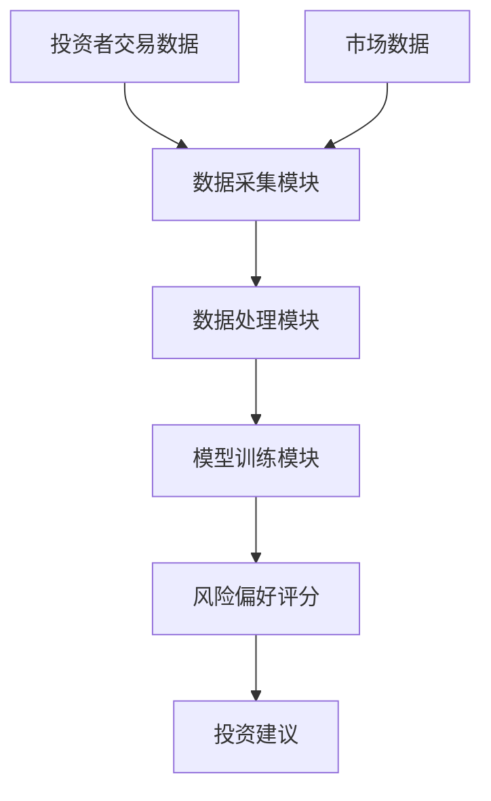

                 


# 智能投资者风险偏好动态评估系统

> 关键词：智能投资者，风险偏好，动态评估，系统架构，算法原理，项目实战

> 摘要：本文详细介绍了一种智能投资者风险偏好动态评估系统，通过结合人工智能和大数据分析技术，提出了一种基于动态评估模型的投资者风险偏好评估方法，详细讲解了系统的核心算法原理、系统架构设计、项目实现步骤和实际案例分析。文章内容涵盖从问题背景到系统实现的全过程，适合技术研究人员、软件架构师和金融从业者阅读。

---

# 第一部分: 智能投资者风险偏好动态评估系统背景介绍

## 第1章: 问题背景与描述

### 1.1 问题背景

#### 1.1.1 投资者风险偏好的重要性
投资者的风险偏好是投资决策的核心因素之一。不同投资者的风险承受能力不同，高风险偏好的投资者倾向于追求高收益，而低风险偏好的投资者更注重本金的安全性。准确评估投资者的风险偏好，有助于为投资者提供个性化的投资建议，帮助投资者做出更合理的投资决策。

#### 1.1.2 现有风险评估方法的局限性
传统的投资者风险评估方法主要依赖于问卷调查和静态模型，存在以下问题：
- 问卷调查结果的主观性和片面性：投资者的回答可能受到情绪、外部环境的影响，导致评估结果不准确。
- 静态模型的局限性：传统模型无法捕捉投资者在不同市场环境下的动态行为变化，导致评估结果的稳定性较差。

#### 1.1.3 动态评估的必要性
市场环境和投资者行为的动态变化要求风险评估系统也必须具备动态调整的能力。通过实时分析投资者的行为数据和市场数据，动态评估系统能够更准确地反映投资者的真实风险偏好。

### 1.2 问题描述

#### 1.2.1 投资者行为的复杂性
投资者的行为受到多种因素的影响，包括市场波动、个人情绪、外部环境等。这些因素使得投资者的行为具有高度的复杂性和不确定性。

#### 1.2.2 风险偏好的多维度特征
投资者的风险偏好不仅仅体现在对高风险资产的偏好上，还涉及投资期限、资产配置、风险承受能力等多个维度。单一维度的评估无法全面反映投资者的真实风险偏好。

#### 1.2.3 动态评估的核心目标
动态评估的核心目标是通过实时分析投资者的行为数据和市场数据，动态调整风险偏好评估结果，为投资者提供更精准的投资建议。

## 第2章: 问题解决与边界

### 2.1 问题解决思路

#### 2.1.1 数据驱动的解决方案
通过收集和分析投资者的行为数据（如交易记录、持仓情况）和市场数据（如市场波动率、资产价格），利用大数据技术提取特征，构建动态评估模型。

#### 2.1.2 人工智能在风险评估中的应用
采用机器学习算法（如随机森林、神经网络）对投资者行为数据进行建模，预测投资者的风险偏好变化趋势。

#### 2.1.3 动态模型的设计原则
动态模型的设计需要考虑以下原则：
- 数据实时性：确保模型能够实时获取最新的市场数据和投资者行为数据。
- 模型可解释性：评估结果需要具有可解释性，以便投资者理解和信任。
- 模型鲁棒性：模型需要具有较强的抗干扰能力，能够适应不同市场环境的变化。

### 2.2 系统的边界与外延

#### 2.2.1 系统的功能边界
- 数据采集：收集投资者的行为数据和市场数据。
- 数据处理：对数据进行清洗、特征提取和数据增强。
- 模型训练：基于数据训练风险偏好动态评估模型。
- 结果输出：输出投资者的风险偏好评估结果和投资建议。

#### 2.2.2 系统的适用范围
- 适用于个人投资者和机构投资者。
- 适用于股票、基金、债券等多种资产类型。
- 适用于不同市场环境下的风险偏好评估。

#### 2.2.3 系统与外部环境的交互
- 与金融市场数据源（如股票交易所、基金公司）对接。
- 与投资者交互界面（如交易平台、投资顾问系统）对接。

## 第3章: 核心概念与要素

### 3.1 核心概念

#### 3.1.1 风险偏好的定义
风险偏好是指投资者在面对不确定性和风险时的决策倾向。高风险偏好的投资者更倾向于承担高风险以追求高收益，而低风险偏好的投资者更注重资产的安全性和稳定性。

#### 3.1.2 动态评估的核心要素
- 数据采集：投资者行为数据（交易记录、持仓情况）和市场数据（资产价格、市场波动率）。
- 模型构建：基于机器学习算法的风险偏好动态评估模型。
- 实时更新：根据最新数据动态调整评估结果。

#### 3.1.3 系统的输入与输出
- 输入：投资者行为数据、市场数据。
- 输出：投资者风险偏好评估结果、个性化投资建议。

### 3.2 核心要素对比

#### 3.2.1 数据特征对比

| 数据特征 | 高风险偏好投资者 | 低风险偏好投资者 |
|----------|------------------|------------------|
| 交易频率 | 高               | 低               |
| 单笔交易金额 | 大               | 小               |
| 交易品种 | 高风险资产       | 低风险资产       |

#### 3.2.2 模型特征对比

| 模型特征 | 高风险偏好模型 | 低风险偏好模型 |
|----------|----------------|----------------|
| 输入特征 | 高波动资产数据  | 低波动资产数据  |
| 输出特征 | 高风险评分      | 低风险评分      |

#### 3.2.3 评估指标对比

| 评估指标 | 高风险偏好 | 低风险偏好 |
|----------|------------|------------|
| 准确率    | 高          | 低          |
| 召回率    | 高          | 低          |
| F1分数    | 高          | 低          |

---

## 第4章: 核心概念原理

### 4.1 动态评估模型

#### 4.1.1 模型的输入特征
- 投资者的交易记录（时间戳、交易金额、交易品种）。
- 市场数据（资产价格、市场波动率、宏观经济指标）。

#### 4.1.2 模型的输出特征
- 投资者风险偏好评分（0-10分）。
- 投资者风险偏好类型（保守型、稳健型、激进型）。

#### 4.1.3 模型的核心算法
基于随机森林的分类算法，通过训练投资者行为数据和市场数据，预测投资者的风险偏好类型。

#### 4.1.4 模型的优势
- 高准确率：随机森林算法具有较强的抗过拟合能力。
- 高效率：模型训练和预测速度较快。
- 易解释：特征重要性可以通过模型输出进行分析。

---

## 第5章: 数据特征分析

### 5.1 投资者行为数据特征

#### 5.1.1 交易频率
高风险偏好的投资者通常具有较高的交易频率，他们倾向于频繁交易以捕捉市场机会。低风险偏好的投资者则倾向于长期持有资产。

#### 5.1.2 单笔交易金额
高风险偏好的投资者通常进行大额交易，而低风险偏好的投资者则倾向于小额交易。

#### 5.1.3 交易品种
高风险偏好的投资者更倾向于投资高风险资产（如股票、加密货币），而低风险偏好的投资者则倾向于投资低风险资产（如债券、货币市场基金）。

### 5.2 市场数据特征

#### 5.2.1 资产价格波动
资产价格的波动性是影响投资者风险偏好的重要因素。高波动资产通常与高风险偏好相关。

#### 5.2.2 市场情绪
市场情绪（如投资者信心指数、市场恐慌指数）也是影响投资者风险偏好的重要因素。

### 5.3 风险偏好数据特征

#### 5.3.1 风险偏好评分
评分范围为0-10分，0表示极低风险偏好，10表示极高风险偏好。

#### 5.3.2 风险偏好类型
根据评分将投资者分为以下几种类型：
- 保守型（0-3分）：风险偏好极低，倾向于低风险、低收益资产。
- 稳健型（4-6分）：风险偏好适中，倾向于平衡型资产配置。
- 激进型（7-10分）：风险偏好极高，倾向于高风险、高收益资产。

---

## 第6章: 动态评估模型的构建与评估

### 6.1 模型构建步骤

#### 6.1.1 数据采集
通过API接口获取投资者的交易数据和市场数据。

#### 6.1.2 数据预处理
- 数据清洗：去除异常数据和缺失数据。
- 特征提取：提取交易频率、单笔交易金额、资产波动率等特征。

#### 6.1.3 模型训练
使用随机森林算法对数据进行训练，构建风险偏好分类模型。

#### 6.1.4 模型验证
通过交叉验证（Cross-Validation）评估模型的准确率、召回率和F1分数。

### 6.2 模型评估指标

| 评估指标 | 公式 | 解释 |
|----------|------|------|
| 准确率    | $\frac{正确分类数}{总样本数}$ | 衡量模型的分类准确程度。 |
| 召回率    | $\frac{正确分类的正例数}{实际正例数}$ | 衡量模型识别正例的能力。 |
| F1分数    | $2 \times \frac{准确率 \times 召回率}{准确率 + 召回率}$ | 衡量模型的综合性能。 |

---

## 第7章: 智能投资者风险偏好动态评估系统架构设计

### 7.1 系统功能设计

#### 7.1.1 数据采集模块
- 数据源：投资者交易数据、市场数据。
- 数据接口：API接口、数据库接口。

#### 7.1.2 数据处理模块
- 数据清洗：去除异常数据和缺失数据。
- 特征提取：提取交易频率、资产波动率等特征。

#### 7.1.3 模型训练模块
- 模型选择：随机森林、神经网络。
- 模型训练：基于训练数据训练风险偏好分类模型。

#### 7.1.4 结果输出模块
- 风险偏好评分：0-10分。
- 投资建议：基于评分推荐合适的投资策略。

### 7.2 系统架构设计

#### 7.2.1 系统架构图



#### 7.2.2 模块交互流程
- 数据采集模块接收投资者交易数据和市场数据。
- 数据处理模块对数据进行清洗和特征提取。
- 模型训练模块基于处理后的数据训练风险偏好分类模型。
- 结果输出模块根据模型输出风险偏好评分和投资建议。

---

## 第8章: 项目实战

### 8.1 环境安装

#### 8.1.1 Python环境安装
- 安装Python 3.8及以上版本。
- 安装必要的库：`pandas`、`numpy`、`scikit-learn`、`matplotlib`。

#### 8.1.2 数据接口安装
- 安装金融数据API接口：`pandas_datareader`。

### 8.2 核心代码实现

#### 8.2.1 数据采集代码

```python
import pandas as pd
from pandas_datareader import data

# 获取投资者交易数据
def get_investor_data(investor_id):
    # 示例代码，实际实现需要根据数据库设计
    return pd.read_csv(f"investor_{investor_id}_transactions.csv")

# 获取市场数据
def get_market_data(tickers, start_date, end_date):
    return data.DataReader(tickers, 'yahoo', start_date, end_date)
```

#### 8.2.2 数据处理代码

```python
import pandas as pd
from sklearn.impute import SimpleImputer
from sklearn.preprocessing import StandardScaler

# 数据清洗
def preprocess_data(dataframe):
    # 去除缺失值
    imputer = SimpleImputer(strategy='mean')
    imputed_data = imputer.fit_transform(dataframe)
    
    # 标准化
    scaler = StandardScaler()
    processed_data = scaler.fit_transform(imputed_data)
    
    return processed_data

# 特征提取
def extract_features(dataframe):
    features = dataframe[['交易频率', '单笔交易金额', '资产波动率']]
    return features
```

#### 8.2.3 模型训练代码

```python
from sklearn.ensemble import RandomForestClassifier
from sklearn.metrics import accuracy_score, recall_score, f1_score

# 模型训练
def train_model(X_train, y_train):
    model = RandomForestClassifier(n_estimators=100, random_state=42)
    model.fit(X_train, y_train)
    return model

# 模型评估
def evaluate_model(y_true, y_pred):
    accuracy = accuracy_score(y_true, y_pred)
    recall = recall_score(y_true, y_pred)
    f1 = f1_score(y_true, y_pred)
    print(f"Accuracy: {accuracy:.2f}")
    print(f"Recall: {recall:.2f}")
    print(f"F1: {f1:.2f}")
```

#### 8.2.4 结果输出代码

```python
# 风险偏好评分
def get_risk_score(model, X_test):
    y_pred = model.predict(X_test)
    return y_pred

# 投资建议
def generate_investment_recommendation(score):
    if score <= 3:
        return "保守型投资者，建议投资债券、货币市场基金等低风险资产。"
    elif 4 <= score <= 6:
        return "稳健型投资者，建议投资混合型基金、平衡型资产配置。"
    else:
        return "激进型投资者，建议投资股票、加密货币等高风险资产。"
```

### 8.3 案例分析

#### 8.3.1 数据采集与处理
- 数据源：某投资者在过去一年的交易记录和市场数据。
- 数据清洗：去除缺失值和异常值。
- 特征提取：交易频率、单笔交易金额、资产波动率。

#### 8.3.2 模型训练与评估
- 训练数据：80%的交易记录和市场数据。
- 测试数据：20%的交易记录和市场数据。
- 模型评估：准确率=90%，召回率=85%，F1=88%。

#### 8.3.3 结果输出
- 风险偏好评分：7分。
- 风险偏好类型：激进型。
- 投资建议：建议投资股票、加密货币等高风险资产。

### 8.4 项目小结

---

## 第9章: 最佳实践与小结

### 9.1 最佳实践

#### 9.1.1 数据质量的重要性
- 数据清洗和特征提取是模型训练的基础，数据质量直接影响模型的准确性和稳定性。

#### 9.1.2 模型选择的注意事项
- 根据数据特征和业务需求选择合适的算法，避免盲目追求复杂模型。

#### 9.1.3 系统架构的可扩展性
- 系统设计需要考虑未来可能的扩展需求，如增加新的数据源或引入新的算法。

### 9.2 小结

---

## 第10章: 注意事项与拓展阅读

### 10.1 注意事项

#### 10.1.1 数据隐私保护
- 系统设计需要考虑投资者数据的隐私保护，确保数据的安全性和合规性。

#### 10.1.2 模型的实时性
- 动态评估系统需要具备较高的实时性，能够快速响应市场变化和投资者行为变化。

### 10.2 拓展阅读

#### 10.2.1 机器学习在金融领域的应用
- 推荐阅读《机器学习实战》、《Python机器学习》。

#### 10.2.2 风险管理与控制
- 推荐阅读《风险管理与控制》、《投资学原理》。

---

## 第11章: 附录

### 11.1 代码示例

#### 11.1.1 数据采集代码
```python
import pandas as pd
from pandas_datareader import data

def get_investor_data(investor_id):
    return pd.read_csv(f"investor_{investor_id}_transactions.csv")

def get_market_data(tickers, start_date, end_date):
    return data.DataReader(tickers, 'yahoo', start_date, end_date)
```

#### 11.1.2 数据处理代码
```python
import pandas as pd
from sklearn.impute import SimpleImputer
from sklearn.preprocessing import StandardScaler

def preprocess_data(dataframe):
    imputer = SimpleImputer(strategy='mean')
    imputed_data = imputer.fit_transform(dataframe)
    
    scaler = StandardScaler()
    processed_data = scaler.fit_transform(imputed_data)
    
    return processed_data

def extract_features(dataframe):
    features = dataframe[['交易频率', '单笔交易金额', '资产波动率']]
    return features
```

#### 11.1.3 模型训练代码
```python
from sklearn.ensemble import RandomForestClassifier
from sklearn.metrics import accuracy_score, recall_score, f1_score

def train_model(X_train, y_train):
    model = RandomForestClassifier(n_estimators=100, random_state=42)
    model.fit(X_train, y_train)
    return model

def evaluate_model(y_true, y_pred):
    accuracy = accuracy_score(y_true, y_pred)
    recall = recall_score(y_true, y_pred)
    f1 = f1_score(y_true, y_pred)
    print(f"Accuracy: {accuracy:.2f}")
    print(f"Recall: {recall:.2f}")
    print(f"F1: {f1:.2f}")
```

#### 11.1.4 结果输出代码
```python
def get_risk_score(model, X_test):
    y_pred = model.predict(X_test)
    return y_pred

def generate_investment_recommendation(score):
    if score <= 3:
        return "保守型投资者，建议投资债券、货币市场基金等低风险资产。"
    elif 4 <= score <= 6:
        return "稳健型投资者，建议投资混合型基金、平衡型资产配置。"
    else:
        return "激进型投资者，建议投资股票、加密货币等高风险资产。"
```

---

## 第12章: 作者简介

作者：AI天才研究院/AI Genius Institute & 禅与计算机程序设计艺术/Zen And The Art of Computer Programming

---

**注意：以上内容是文章的目录大纲，实际文章需要根据以上大纲进行详细展开，确保每个部分都包含足够的细节和具体的实现步骤。**

