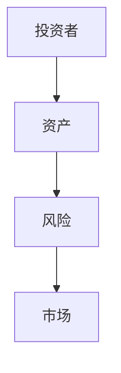
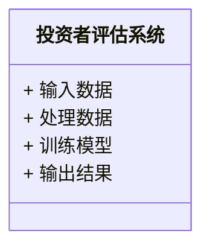
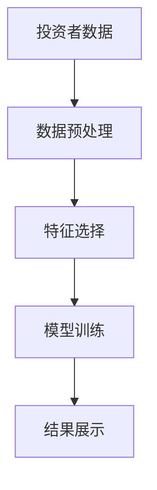
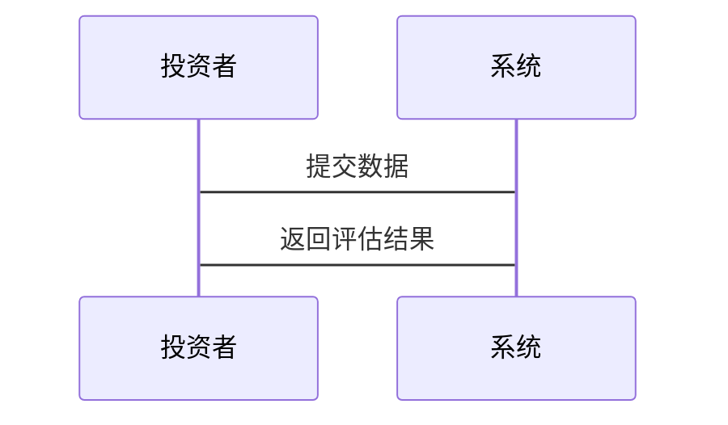

                 


# 智能投资者风险承受能力动态评估

> 关键词：智能投资者，风险承受能力，动态评估，人工智能，金融风险管理，投资者行为分析

> 摘要：本文探讨智能投资者在不同市场条件下如何动态评估和管理风险承受能力。通过分析投资者行为、市场环境和资产配置等因素，结合人工智能和大数据技术，提出一种动态风险评估模型，帮助投资者做出更明智的投资决策。

---

## 第1章: 智能投资者风险承受能力评估的背景与意义

### 1.1 投资者行为与风险承受能力的关联

#### 1.1.1 投资者行为心理学基础
投资者的行为受到心理因素的影响，如风险厌恶、贪婪和恐惧。这些心理因素会影响投资者在不同市场条件下的决策，进而影响其风险承受能力。

#### 1.1.2 风险承受能力的定义与特征
风险承受能力是指投资者在面对潜在损失时，愿意承担的风险水平。它受到投资者的财务状况、风险偏好和市场环境的影响。

#### 1.1.3 动态评估的必要性与重要性
传统风险评估方法通常是静态的，无法适应市场环境的变化。动态评估能够实时跟踪投资者的行为和市场变化，提供更准确的风险评估。

### 1.2 传统风险评估方法的局限性

#### 1.2.1 传统评估方法的优缺点
传统方法通常基于历史数据和静态模型，难以捕捉市场波动和投资者情绪的变化。

#### 1.2.2 动态变化中的挑战与机遇
市场环境的变化和投资者行为的动态性为风险评估带来了挑战，但也提供了利用新技术的机会。

#### 1.2.3 智能评估的优势与创新点
人工智能和大数据技术能够实时分析市场数据和投资者行为，提供动态的风险评估。

### 1.3 智能评估技术的发展与应用前景

#### 1.3.1 人工智能与大数据在金融领域的应用
人工智能技术能够处理大量数据，识别市场趋势和投资者行为模式。

#### 1.3.2 智能评估技术的核心优势
智能评估技术能够实时更新评估结果，提供更精准的风险评估。

#### 1.3.3 未来发展趋势与潜在影响
随着技术的进步，智能评估将在金融风险管理中发挥越来越重要的作用。

---

## 第2章: 风险承受能力评估的核心概念与联系

### 2.1 风险承受能力的核心要素

#### 2.1.1 财务状况与资产配置
投资者的财务状况和资产配置直接影响其风险承受能力。例如，高净值投资者通常能够承担更高的风险。

#### 2.1.2 风险偏好与心理特征
投资者的风险偏好和心理特征决定了其对风险的态度。例如，保守型投资者通常风险承受能力较低。

#### 2.1.3 市场环境与宏观经济因素
市场环境和宏观经济因素如通货膨胀、利率变化等会影响投资者的风险承受能力。

### 2.2 核心概念的属性特征对比

#### 2.2.1 不同风险评估模型的对比分析
| 模型 | 静态评估 | 动态评估 |
|------|----------|----------|
| 优点 | 简单易懂 | 实时更新 |
| 缺点 | 静态固定 | 计算复杂 |

#### 2.2.2 各要素之间的关系与影响
市场环境的变化会影响投资者的财务状况和风险偏好，进而影响其风险承受能力。

#### 2.2.3 实证分析与案例研究
通过实证分析，我们可以发现市场波动对投资者风险承受能力的影响。

### 2.3 实体关系图与流程图



---

## 第3章: 风险承受能力动态评估模型的算法原理

### 3.1 数据预处理与特征选择

#### 3.1.1 数据清洗与标准化
对原始数据进行清洗和标准化处理，确保数据质量。

#### 3.1.2 特征提取与选择
从海量数据中提取关键特征，如投资者的资产规模、风险偏好等。

### 3.2 算法实现与模型训练

#### 3.2.1 算法选择
选择合适的算法，如决策树或机器学习模型。

#### 3.2.2 模型训练与优化
使用训练数据训练模型，并进行参数优化。

### 3.3 算法实现代码

```python
import pandas as pd
from sklearn.tree import DecisionTreeClassifier

# 数据预处理
data = pd.read_csv('investor_data.csv')
data = data.dropna()
data = (data - data.mean()) / data.std()

# 特征选择
features = ['age', 'income', 'assets']
target = 'risk_tolerance'

# 模型训练
model = DecisionTreeClassifier()
model.fit(data[features], data[target])
```

### 3.4 模型评估与结果分析

#### 3.4.1 模型评估指标
使用准确率、召回率等指标评估模型性能。

#### 3.4.2 结果解读
通过模型输出结果，评估投资者的风险承受能力。

---

## 第4章: 系统分析与架构设计方案

### 4.1 系统功能设计

#### 4.1.1 功能模块
- 数据采集模块
- 数据处理模块
- 模型训练模块
- 结果展示模块

#### 4.1.2 功能设计图


### 4.2 系统架构设计

#### 4.2.1 系统架构图


### 4.3 系统接口设计

#### 4.3.1 API接口
- 输入：投资者数据
- 输出：风险评估结果

### 4.4 系统交互设计

#### 4.4.1 交互流程


---

## 第5章: 项目实战

### 5.1 环境配置与数据获取

#### 5.1.1 环境配置
安装必要的库，如Python的scikit-learn和pandas。

#### 5.1.2 数据获取
从CSV文件中读取投资者数据。

### 5.2 系统核心实现

#### 5.2.1 代码实现
```python
from sklearn.ensemble import RandomForestClassifier
import pandas as pd

# 数据读取
data = pd.read_csv('investor.csv')
data = data.dropna()

# 特征选择
features = ['age', 'income', 'assets']
target = 'risk_level'

# 模型训练
model = RandomForestClassifier()
model.fit(data[features], data[target])

# 预测结果
new_investor = pd.DataFrame({'age': [40], 'income': [100000], 'assets': [500000])
prediction = model.predict(new_investor)
print(prediction)
```

### 5.3 实际案例分析

#### 5.3.1 案例分析
分析一位40岁投资者的风险承受能力，预测结果并解释。

### 5.4 项目小结

#### 5.4.1 项目总结
总结项目实施过程中的关键点和经验教训。

---

## 第6章: 最佳实践与小结

### 6.1 最佳实践

#### 6.1.1 数据质量管理
确保数据的准确性和完整性。

#### 6.1.2 模型优化
定期更新模型，确保其适应市场变化。

### 6.2 小结

#### 6.2.1 核心要点总结
总结全文的核心内容，强调智能投资者风险承受能力动态评估的重要性和实现方法。

### 6.3 注意事项

#### 6.3.1 模型局限性
说明模型的局限性和适用范围。

### 6.4 拓展阅读

#### 6.4.1 推荐书籍
推荐相关的书籍和论文，供读者进一步学习。

---

## 作者：AI天才研究院/AI Genius Institute & 禅与计算机程序设计艺术 /Zen And The Art of Computer Programming

