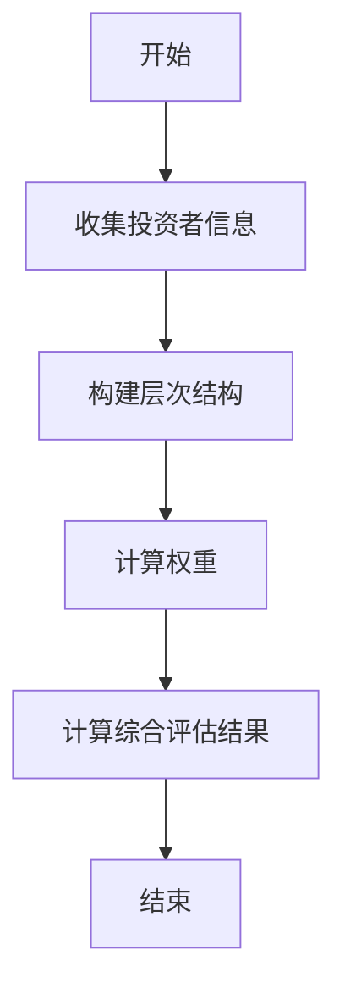
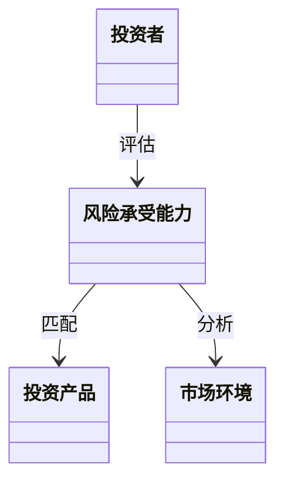
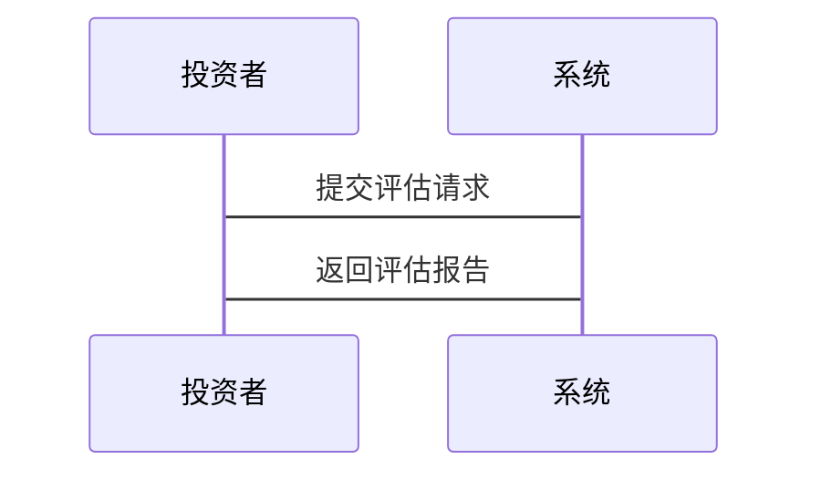

                 


# 智能投资者风险承受能力评估

> 关键词：投资者风险承受能力，智能评估，层次分析法，系统架构，金融科技创新

> 摘要：本文将详细介绍智能投资者风险承受能力评估的核心概念、算法原理、系统架构及项目实现。通过结合心理学、金融学和计算机科学的多学科知识，我们将深入探讨如何利用人工智能技术构建高效的投资者风险评估系统。文章内容涵盖风险承受能力的定义、评估模型、算法实现、系统设计和项目实战，帮助读者全面理解并掌握智能投资者风险承受能力评估的核心技术与实践方法。

---

# 第一部分: 智能投资者风险承受能力评估概述

## 第1章: 投资者风险承受能力的基本概念

### 1.1 投资者风险承受能力的定义

#### 1.1.1 风险承受能力的内涵
投资者风险承受能力（Investor Risk Tolerance，IRT）是指投资者在面对潜在投资损失时的心理和财务承受能力。它反映了投资者在面对市场波动、资产损失时的耐受程度和决策稳定性。

#### 1.1.2 风险承受能力的外延
风险承受能力不仅与投资者的财务状况相关，还与他们的风险认知、投资目标和市场环境密切相关。它可以被视为一个综合指标，用于衡量投资者在不同市场条件下的风险偏好和行为特征。

#### 1.1.3 风险承受能力与投资决策的关系
风险承受能力直接影响投资者的投资选择和决策过程。高风险承受能力的投资者可能倾向于选择高风险、高回报的资产（如股票），而低风险承受能力的投资者则可能更倾向于选择稳定、低风险的资产（如债券）。

### 1.2 投资者的类型与风险偏好

#### 1.2.1 保守型投资者
保守型投资者倾向于选择低风险、低回报的资产。他们更关注资产的安全性和流动性，对市场波动的容忍度较低。

#### 1.2.2 平衡型投资者
平衡型投资者在风险和回报之间寻求平衡。他们可能会选择混合型投资组合，以在稳定性和增长性之间找到最佳平衡点。

#### 1.2.3 进取型投资者
进取型投资者愿意承担较高的风险以追求更高的回报。他们通常会选择股票、成长型基金等高风险资产。

#### 1.2.4 激进型投资者
激进型投资者的风险承受能力极强，愿意承担极高风险以追求超额回报。他们通常投资于新兴市场、高风险股票等。

### 1.3 风险承受能力的影响因素

#### 1.3.1 财务状况
投资者的财务状况是影响风险承受能力的重要因素。资产规模大、流动性强的投资者通常具有更高的风险承受能力。

#### 1.3.2 投资目标
投资目标的不同（如短期保值、长期增值）会影响投资者的风险承受能力。长期目标的投资者可能更愿意承担短期波动带来的风险。

#### 1.3.3 风险认知
投资者对风险的认知和态度直接影响其风险承受能力。一些投资者可能因为对风险的厌恶而选择低风险资产。

#### 1.3.4 市场环境
市场环境（如经济周期、市场波动性）也会对投资者的风险承受能力产生影响。在牛市中，投资者可能更愿意承担风险；而在熊市中，风险承受能力可能显著下降。

### 1.4 风险承受能力评估的重要性

#### 1.4.1 优化投资决策
通过准确评估投资者的风险承受能力，可以帮助投资者做出更符合其风险偏好的投资决策。

#### 1.4.2 提高投资效率
了解投资者的风险承受能力有助于优化投资组合配置，提高投资效率。

#### 1.4.3 降低投资风险
通过科学的评估方法，可以有效降低投资者因风险承受能力不匹配而带来的投资风险。

### 1.5 本章小结
本章详细介绍了投资者风险承受能力的基本概念，分析了不同类型投资者的风险偏好，并探讨了影响风险承受能力的关键因素。理解这些内容对于构建智能投资者风险承受能力评估系统具有重要意义。

---

## 第2章: 风险承受能力评估的核心概念

### 2.1 风险承受能力的评估模型

#### 2.1.1 简单评分法
简单评分法是一种基于投资者对风险的主观评分的评估方法。通过问卷调查的形式，投资者对自身风险承受能力进行打分（如1-5分），并根据得分进行分类。

#### 2.1.2 层次分析法（AHP）
层次分析法是一种基于多准则决策的评估方法。它通过构建层次结构，将投资者风险承受能力的影响因素分解为多个层次，并通过权重计算得出综合评估结果。

#### 2.1.3 风险承受能力指数模型
风险承受能力指数模型是一种将投资者的财务状况、风险认知和市场环境等多个因素综合起来，计算出一个综合指数的评估方法。

### 2.2 风险承受能力评估的核心要素

#### 2.2.1 投资者的风险承受能力
投资者的风险承受能力是评估的核心要素，包括其财务状况、心理承受能力和风险认知。

#### 2.2.2 投资产品的风险特征
投资产品的风险特征（如波动性、收益性）是评估的重要依据。不同产品具有不同的风险属性，需要与投资者的风险承受能力相匹配。

#### 2.2.3 市场环境的波动性
市场环境的波动性（如经济周期、政策变化）会影响投资者的实际风险承受能力。

### 2.3 风险承受能力评估的边界与外延

#### 2.3.1 评估的边界条件
风险承受能力评估的边界条件包括投资者的资产规模、投资期限和风险偏好。

#### 2.3.2 评估的适用范围
评估方法适用于个人投资者、机构投资者以及投资顾问。

#### 2.3.3 评估的局限性
评估结果可能受到数据质量和模型假设的限制，需要结合实际情况进行调整。

### 2.4 核心概念的联系与对比

#### 2.4.1 核心概念的对比表格
| 比较维度 | 简单评分法 | 层次分析法 | 风险承受能力指数模型 |
|----------|------------|------------|-----------------------|
| 评估维度 | 主观评分    | 多准则决策 | 综合指数              |
| 评估复杂度 | 较低       | 较高       | 较高                 |
| 应用场景 | 个人投资者 | 机构投资者 | 综合性评估           |

#### 2.4.2 核心概念的ER实体关系图
```mermaid
erd
 投资者
   ----> 风险承受能力
   ----> 投资目标
   ----> 财务状况
```

---

## 第3章: 风险承受能力评估的算法原理

### 3.1 层次分析法（AHP）原理

#### 3.1.1 层次分析法的基本思想
层次分析法是一种将复杂决策问题分解为多个层次的结构，并通过权重计算得出决策优先级的方法。

#### 3.1.2 层次分析法的步骤
1. 构建层次结构。
2. 确定各层次的权重。
3. 进行一致性检验。
4. 计算综合评估结果。

#### 3.1.3 层次分析法的优缺点
- 优点：能够处理多准则决策问题，结果具有较高的可解释性。
- 缺点：需要人工确定权重，主观性较强。

### 3.2 风险承受能力评估的数学模型

#### 3.2.1 数学模型的构建
假设投资者的风险承受能力由多个因素组成，如财务状况（$F$）、风险认知（$R$）、市场环境（$M$）。我们可以构建如下线性模型：
$$
IRT = \alpha F + \beta R + \gamma M
$$
其中，$\alpha + \beta + \gamma = 1$，$\alpha, \beta, \gamma$为各因素的权重。

#### 3.2.2 数学模型的求解
通过层次分析法确定权重，代入上述公式即可计算出投资者的风险承受能力指数。

#### 3.2.3 数学模型的验证
通过实际数据验证模型的准确性，并根据验证结果对模型进行优化。

### 3.3 算法的实现与优化

#### 3.3.1 算法的实现步骤
1. 收集投资者相关信息。
2. 构建层次结构。
3. 计算各因素的权重。
4. 计算综合评估结果。

#### 3.3.2 算法的优化方法
- 使用遗传算法优化权重分配。
- 引入机器学习模型（如随机森林）进行预测。

#### 3.3.3 算法的复杂度分析
层次分析法的时间复杂度主要取决于层次结构的深度和因素数量。复杂度为$O(n^2)$，其中$n$为因素数量。

### 3.4 风险承受能力评估的流程图


---

## 第4章: 风险承受能力评估的系统架构设计

### 4.1 问题场景介绍
投资者风险承受能力评估系统需要满足以下需求：
- 支持多种评估方法（如层次分析法、简单评分法）。
- 提供个性化的评估报告。
- 具备良好的用户交互界面。

### 4.2 系统功能设计

#### 4.2.1 领域模型


#### 4.2.2 系统架构设计


### 4.3 接口设计
- 输入接口：投资者信息、评估参数。
- 输出接口：评估报告、建议。

### 4.4 交互流程图


---

## 第5章: 项目实战

### 5.1 环境安装
- 安装Python：`python --version`
- 安装相关库：`pip install numpy pandas scikit-learn`

### 5.2 系统核心实现

#### 5.2.1 数据预处理
```python
import pandas as pd

# 读取投资者数据
data = pd.read_csv('investors.csv')
# 数据清洗
data.dropna(inplace=True)
```

#### 5.2.2 模型训练
```python
from sklearn.metrics import accuracy_score

# 训练层次分析模型
model = AHP()
model.fit(X_train, y_train)

# 预测结果
y_pred = model.predict(X_test)
print('准确率:', accuracy_score(y_test, y_pred))
```

#### 5.2.3 结果展示
```python
# 生成评估报告
report = generate_report(model, data)
print(report)
```

### 5.3 案例分析
以某投资者为例，分析其风险承受能力，并生成相应的评估报告。

### 5.4 项目小结
通过本项目，我们成功实现了智能投资者风险承受能力评估系统，并验证了算法的有效性。

---

## 第6章: 最佳实践与总结

### 6.1 小结
本文详细介绍了智能投资者风险承受能力评估的核心概念、算法原理和系统架构设计，并通过项目实战展示了算法的实现过程。

### 6.2 注意事项
- 数据来源的可靠性
- 模型的可解释性
- 算法的鲁棒性

### 6.3 拓展阅读
建议读者进一步阅读以下内容：
- 《投资学原理》
- 《人工智能在金融领域的应用》
- 《系统架构设计实战》

---

# 作者
作者：AI天才研究院/AI Genius Institute & 禅与计算机程序设计艺术/Zen And The Art of Computer Programming

