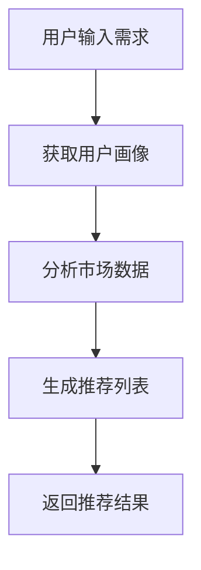
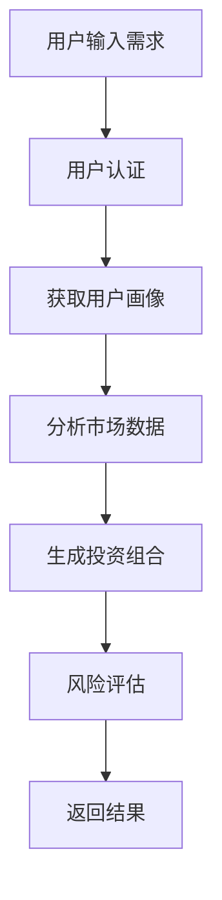

                 


# 智能投顾平台的架构设计与实现

---

## 关键词：
智能投顾、人工智能、系统架构、投资组合优化、风险管理、算法推荐

---

## 摘要：
智能投顾平台是结合人工智能和金融投资的新兴技术，旨在通过自动化和智能化的方式为投资者提供个性化的投资建议和组合管理服务。本文从智能投顾的核心概念出发，深入分析其算法原理、系统架构设计，并结合实际案例，详细讲解智能投顾平台的实现过程。文章涵盖从理论到实践的完整流程，帮助读者全面理解智能投顾平台的设计与实现。

---

## 第一章: 智能投顾平台的背景与核心概念

### 1.1 智能投顾的定义与特点
#### 1.1.1 智能投顾的定义
智能投顾（Robo-Advisor）是一种基于人工智能和大数据技术的金融咨询服务，通过算法自动分析用户的投资需求、风险承受能力和市场环境，提供个性化的投资组合建议和动态调整服务。

#### 1.1.2 智能投顾的核心特点
- **自动化**：通过算法自动化处理投资决策。
- **个性化**：根据用户需求提供定制化投资建议。
- **实时性**：基于实时市场数据进行动态调整。
- **低成本**：相比传统投顾，智能投顾的运营成本更低。

#### 1.1.3 智能投顾与传统投顾的区别
| 特性 | 智能投顾 | 传统投顾 |
|------|----------|----------|
| 服务成本 | 低       | 高       |
| 服务效率 | 高       | 低       |
| 服务范围 | 广泛     | 有限     |
| 服务对象 | 零售用户为主 | 高净值客户为主 |
| 服务时间 | 24/7自动化 | 人工咨询 |

---

### 1.2 智能投顾的发展背景
#### 1.2.1 金融行业的数字化转型
- 传统金融行业逐步向数字化、智能化方向转型。
- 技术驱动金融创新，降低服务成本。

#### 1.2.2 人工智能技术的成熟
- 机器学习算法的进步推动了智能投顾的发展。
- 自然语言处理技术帮助分析市场信息。

#### 1.2.3 投资者需求的变化
- 零售投资者数量激增，对个性化投资服务的需求增加。
- 投资者对实时性和透明度的要求不断提高。

---

### 1.3 智能投顾的主要应用场景
#### 1.3.1 零售投资者服务
- 为普通投资者提供低成本、个性化的投资建议。
- 动态调整投资组合，降低投资风险。

#### 1.3.2 机构投资者服务
- 为机构投资者提供市场分析和投资组合优化。
- 提供实时数据监控和风险预警。

#### 1.3.3 财富管理机构的数字化升级
- 帮助财富管理机构提升服务效率。
- 降低运营成本，扩大服务范围。

---

## 第二章: 智能投顾平台的核心概念与技术基础

### 2.1 智能投顾的核心概念
#### 2.1.1 投资组合优化
- 根据用户的风险偏好和收益目标，优化投资组合的配置。
- 使用现代投资组合理论（MPT）进行资产分配。

#### 2.1.2 风险管理
- 通过风险模型评估投资组合的风险。
- 提供风险预警和风险管理策略。

#### 2.1.3 用户行为分析
- 基于用户行为数据，分析用户的偏好和风险承受能力。
- 个性化推荐投资策略。

---

### 2.2 智能投顾的主要技术基础
#### 2.2.1 人工智能与机器学习
- 使用机器学习算法进行用户画像和投资策略推荐。
- 通过深度学习分析市场情绪和新闻数据。

#### 2.2.2 大数据处理与分析
- 处理海量市场数据和用户行为数据。
- 使用大数据技术进行实时数据分析。

#### 2.2.3 自然语言处理
- 分析新闻、财报等文本数据，提取市场信息。
- 生成投资报告和市场分析。

---

### 2.3 智能投顾平台的系统架构
#### 2.3.1 前端架构
- 用户界面设计：提供交互式界面，用户输入需求并获取投资建议。
- 响应式设计：适配不同终端设备。

#### 2.3.2 后端架构
- 服务层设计：包括用户认证、数据处理、算法调用等功能。
- 微服务架构：将功能模块化，提高系统的扩展性和维护性。

#### 2.3.3 数据存储与处理
- 数据库设计：包括用户数据、投资组合数据、市场数据等。
- 数据分析引擎：支持实时数据分析和算法处理。

---

## 第三章: 智能投顾平台的核心算法与数学模型

### 3.1 推荐算法
#### 3.1.1 基于协同过滤的推荐算法
- 基于用户行为数据，找到相似用户的投资偏好。
- 推荐用户感兴趣的投资产品。

#### 3.1.2 基于内容的推荐算法
- 分析投资产品的特征，推荐与用户需求匹配的产品。
- 使用文本挖掘技术分析产品描述。

#### 3.1.3 混合推荐算法
- 结合协同过滤和内容推荐，提高推荐准确率。
- 使用加权融合方法优化推荐结果。

#### 3.1.4 推荐算法流程图


#### 3.1.5 推荐算法实现（Python代码）
```python
from surprise import SVD
from surprise.dataset import Dataset
from surprise.model_selection import train_test_split
from surprise import accuracy

# 加载数据
data = Dataset.load_from_file('user_ratings.txt', format='csv')

# 分割数据集
train_set, test_set = train_test_split(data, test_size=0.25)

# 模型训练
model = SVD()
model.fit(train_set)

# 预测结果
predictions = model.test(test_set)

# 评估模型
accuracy.rmse(predictions)
```

---

### 3.2 风险管理模型
#### 3.2.1 马科维茨投资组合理论
- 理论基础：通过优化数学模型，找到最优投资组合。
- 数学公式：
  $$ \text{目标函数} = \min \left( \sigma^2 \right) $$
  $$ \text{约束条件} = \sum w_i = 1 $$

#### 3.2.2 风险价值（VaR）模型
- VaR模型用于衡量投资组合的潜在损失。
- 计算公式：
  $$ \text{VaR} = \text{损失的金额} \times \text{置信水平} $$

#### 3.2.3 现代投资组合理论（MPT）
- MPT通过分散投资降低风险。
- 数学模型：
  $$ \text{投资组合收益} = \sum w_i r_i $$
  $$ \text{投资组合风险} = \sqrt{ \sum w_i^2 \sigma_i^2 + 2 \sum w_i w_j \sigma_i \sigma_j \rho_{ij} } $$

---

### 3.3 投资组合优化模型
#### 3.3.1 线性规划模型
- 线性规划用于优化投资组合的收益和风险。
- 数学模型：
  $$ \max \text{收益} = \sum w_i r_i $$
  $$ \text{约束}：\sum w_i = 1, \text{风险} \leq \text{目标风险} $$

#### 3.3.2 非线性规划模型
- 非线性规划用于更复杂的优化问题。
- 数学模型：
  $$ \min \text{风险} = \sum w_i^2 \sigma_i^2 + 2 \sum w_i w_j \sigma_i \sigma_j \rho_{ij} $$
  $$ \text{约束}：\sum w_i = 1, \text{收益} \geq \text{目标收益} $$

#### 3.3.3 遗传算法优化模型
- 使用遗传算法优化投资组合。
- 算法步骤：
  1. 初始化种群。
  2. 计算适应度。
  3. 选择、交叉、变异。
  4. 重复迭代。

---

## 第四章: 智能投顾平台的系统架构设计

### 4.1 系统功能设计
#### 4.1.1 用户画像与需求分析
- 通过用户问卷和行为数据，构建用户画像。
- 使用机器学习模型分析用户需求。

#### 4.1.2 投资组合推荐系统
- 基于用户画像和市场数据，推荐投资组合。
- 动态调整投资组合，适应市场变化。

#### 4.1.3 风险评估与预警系统
- 评估投资组合的风险，提供预警。
- 提供风险缓解策略。

---

### 4.2 系统架构设计
#### 4.2.1 分层架构设计
- **前端层**：用户交互界面。
- **服务层**：业务逻辑处理。
- **数据层**：数据存储和处理。

#### 4.2.2 微服务架构设计
- **用户服务**：负责用户认证和管理。
- **投资组合服务**：负责投资组合推荐和优化。
- **风险管理服务**：负责风险评估和预警。
- **数据服务**：负责数据存储和分析。

#### 4.2.3 高可用性与扩展性设计
- 使用负载均衡和容灾备份，确保系统高可用。
- 使用分布式架构，提高系统的扩展性。

---

### 4.3 系统接口设计
#### 4.3.1 用户交互接口
- 提供用户输入和结果展示界面。
- 支持多种交互方式，如网页和移动端。

#### 4.3.2 数据接口设计
- 与第三方数据源对接，获取实时市场数据。
- 使用API接口进行数据交互。

#### 4.3.3 第三方服务
- 集成第三方支付和交易接口。
- 与第三方数据供应商对接。

---

### 4.4 系统交互流程图


---

## 第五章: 智能投顾平台的项目实战

### 5.1 项目环境安装
- **工具安装**：安装Python、Jupyter Notebook、机器学习库（如Scikit-learn、XGBoost）。
- **数据源**：获取市场数据和用户行为数据。

### 5.2 系统核心实现
#### 5.2.1 用户画像构建
- 使用聚类算法分析用户行为数据。
- 生成用户画像并存储在数据库中。

#### 5.2.2 投资组合推荐
- 使用协同过滤算法推荐投资组合。
- 动态调整投资组合，适应市场变化。

#### 5.2.3 风险管理
- 使用VaR模型评估投资组合风险。
- 提供风险预警和策略建议。

---

### 5.3 实际案例分析
#### 5.3.1 案例背景
- 某投资者希望投资股票和债券，风险承受能力为中等。

#### 5.3.2 数据分析
- 获取市场数据，分析股票和债券的收益和风险。

#### 5.3.3 投资组合优化
- 使用MPT模型优化投资组合，生成推荐方案。

#### 5.3.4 风险评估
- 使用VaR模型评估投资组合的风险，提供预警。

---

### 5.4 项目小结
- 通过实际案例，验证系统的可行性和有效性。
- 总结项目经验，优化系统设计。

---

## 第六章: 智能投顾平台的最佳实践

### 6.1 最佳实践
#### 6.1.1 数据质量管理
- 确保数据的准确性和完整性。
- 使用数据清洗技术处理脏数据。

#### 6.1.2 算法优化
- 使用超参数调优提高算法性能。
- 结合多种算法提高推荐准确率。

#### 6.1.3 系统安全
- 加强用户认证和数据加密。
- 定期进行安全漏洞扫描。

---

### 6.2 小结
- 总结全文内容，强调智能投顾平台的重要性和应用前景。
- 展望未来发展方向，如量子计算和区块链技术的应用。

---

### 6.3 注意事项
- **数据隐私**：严格遵守数据隐私保护法规。
- **系统稳定性**：确保系统的高可用性和稳定性。
- **用户体验**：优化用户体验，提高用户满意度。

---

### 6.4 拓展阅读
- 推荐相关书籍和论文，供读者深入学习。
- 提供技术博客和开源项目的链接。

---

## 作者：AI天才研究院/AI Genius Institute & 禅与计算机程序设计艺术 /Zen And The Art of Computer Programming

---

> **附注**：如果需要我根据上述内容继续完成具体的章节实现，请告诉我！

