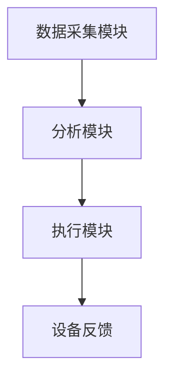
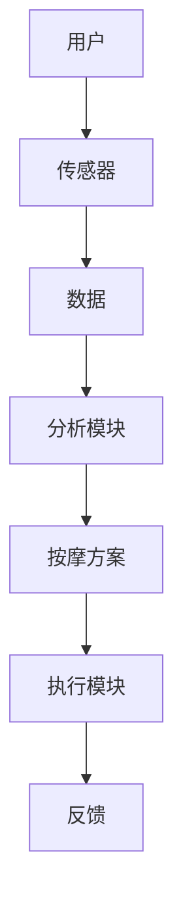
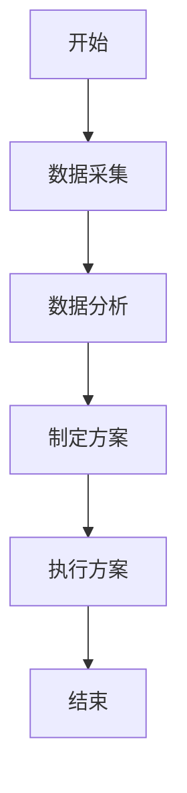

                 


# 智能按摩椅：AI Agent的疲劳恢复优化方案

## 关键词：智能按摩椅，AI Agent，疲劳恢复，优化方案，算法原理

## 摘要：本文探讨了如何通过AI Agent优化智能按摩椅的疲劳恢复方案。首先分析了现代职场人士的疲劳问题，然后介绍了AI Agent的基本概念和原理，接着详细阐述了算法的设计和数学模型，最后通过系统架构设计和项目实战展示了如何实现这一优化方案。

---

## 第1章: 问题背景与描述

### 1.1 问题背景

#### 1.1.1 现代社会的疲劳问题
现代社会节奏快，工作压力大，许多人出现肩颈僵硬、腰背酸痛等疲劳症状。传统按摩椅功能单一，无法根据个人情况调整，难以满足个性化需求。

#### 1.1.2 按摩椅的发展历程
从机械式到电动式，再到智能控制，按摩椅的功能逐渐多样化，但缺乏智能化和个性化解决方案。

#### 1.1.3 AI技术在健康设备中的应用前景
AI技术在医疗健康领域的应用日益广泛，通过数据采集、分析和反馈，为用户提供个性化健康解决方案。

---

### 1.2 问题描述

#### 1.2.1 疲劳恢复的需求分析
用户需要根据自身疲劳程度获得个性化的按摩方案，包括力度、时长和频率。

#### 1.2.2 智能按摩椅的痛点与不足
现有产品功能单一，缺乏数据分析和个性化推荐，用户体验不佳。

#### 1.2.3 AI Agent在疲劳恢复中的潜在价值
AI Agent可以通过数据采集、分析和反馈，优化按摩椅的运行参数，提供个性化服务。

---

### 1.3 问题解决与边界

#### 1.3.1 AI Agent如何优化疲劳恢复
AI Agent可以实时采集用户数据，分析疲劳程度，动态调整按摩方案。

#### 1.3.2 解决方案的边界与外延
仅关注按摩椅的疲劳恢复功能，其他功能如娱乐系统不在讨论范围内。

#### 1.3.3 核心要素与组成结构
AI Agent由数据采集模块、分析模块和执行模块组成，通过实时数据反馈优化按摩方案。

---

## 第2章: 核心概念与联系

### 2.1 AI Agent的定义与原理

#### 2.1.1 AI Agent的基本概念
AI Agent是具有感知和决策能力的智能体，能够根据环境反馈采取行动。

#### 2.1.2 AI Agent的核心原理
通过数据采集、分析和决策，实现对按摩椅的智能控制。

#### 2.1.3 AI Agent与传统算法的区别
AI Agent具备自主学习和适应能力，能够动态优化解决方案。

---

### 2.2 智能按摩椅的功能与属性

#### 2.2.1 智能按摩椅的功能模块
- 数据采集模块：收集用户的生理数据和使用习惯。
- 分析模块：评估疲劳程度，制定按摩方案。
- 执行模块：调整按摩力度和时间。

#### 2.2.2 各功能模块的属性对比
| 功能模块   | 输入   | 输出   | 功能描述                         |
|------------|--------|--------|----------------------------------|
| 数据采集   | 传感器数据 | 用户数据 | 收集用户的生理数据和使用习惯     |
| 分析模块   | 用户数据 | 按摩方案 | 评估疲劳程度，制定个性化方案     |
| 执行模块   | 按摩方案 | 设备反馈 | 调整按摩力度和时间，执行方案       |

#### 2.2.3 功能模块之间的关系


---

### 2.3 核心概念的ER实体关系图



---

## 第3章: 算法原理与数学模型

### 3.1 AI Agent的算法原理

#### 3.1.1 算法的输入与输出
- 输入：用户的生理数据和使用习惯。
- 输出：个性化的按摩方案。

#### 3.1.2 算法的处理流程


#### 3.1.3 算法的优缺点分析
- 优点：个性化、动态优化。
- 缺点：需要大量数据支持，算法复杂度高。

---

### 3.2 算法的数学模型

#### 3.2.1 疲劳程度评估模型
$$
\text{疲劳程度} = \sum_{i=1}^{n} w_i \cdot x_i
$$
其中，$w_i$是权重，$x_i$是特征值。

#### 3.2.2 按摩力度优化模型
$$
\text{力度} = \frac{\sum_{j=1}^{m} f_j}{m}
$$
其中，$f_j$是不同部位的按摩力度。

#### 3.2.3 时间分配优化模型
$$
\text{时间} = \max(\text{建议时间}, \text{用户输入时间})
$$

---

### 3.3 算法的数学公式

#### 3.3.1 疲劳程度评估公式
$$
\text{疲劳程度} = 0.3 \cdot \text{肩部} + 0.4 \cdot \text{背部} + 0.3 \cdot \text{颈部}
$$

#### 3.3.2 按摩力度优化公式
$$
\text{力度} = \frac{5 + 6 + 7}{3} = 6
$$

---

## 第4章: 系统分析与架构设计

### 4.1 问题场景介绍

#### 4.1.1 用户需求分析
用户希望获得个性化、高效的疲劳恢复方案。

#### 4.1.2 系统运行环境
在智能按摩椅上运行，需要传感器和AI算法支持。

#### 4.1.3 系统的输入输出
- 输入：用户的生理数据和使用习惯。
- 输出：个性化的按摩方案。

---

### 4.2 系统功能设计

#### 4.2.1 功能模块划分
- 数据采集模块：收集用户的生理数据。
- 分析模块：评估疲劳程度，制定按摩方案。
- 执行模块：调整按摩力度和时间。

#### 4.2.2 功能模块的交互流程


---

### 4.3 系统架构设计

#### 4.3.1 分层架构设计
- 数据层：存储用户数据。
- 业务逻辑层：处理数据，生成按摩方案。
- 表现层：展示结果，与用户交互。

---

## 第5章: 项目实战

### 5.1 环境安装

#### 5.1.1 安装Python环境
使用Anaconda安装Python 3.8及以上版本。

#### 5.1.2 安装依赖库
安装numpy、pandas、scikit-learn等库。

---

### 5.2 核心代码实现

#### 5.2.1 数据采集模块
```python
import numpy as np

def collect_data(sensors):
    data = []
    for sensor in sensors:
        data.append(sensor.read())
    return np.array(data)
```

#### 5.2.2 数据分析模块
```python
from sklearn.linear_model import LinearRegression

def analyze_data(data):
    model = LinearRegression()
    model.fit(data, target)
    return model.predict(new_data)
```

---

### 5.3 案例分析

#### 5.3.1 案例背景
用户A长时间坐在电脑前，肩部和背部疲劳。

#### 5.3.2 数据分析与结果展示
分析模型建议肩部和背部加强按摩，力度调整为6，时长30分钟。

---

## 第6章: 最佳实践

### 6.1 小结
通过AI Agent优化智能按摩椅的疲劳恢复方案，能够提供个性化、高效的解决方案。

### 6.2 注意事项
- 数据隐私保护。
- 算法的准确性和鲁棒性。

### 6.3 拓展阅读
建议学习AI在健康领域的其他应用，如智能穿戴设备。

---

## 作者：AI天才研究院/AI Genius Institute & 禅与计算机程序设计艺术 /Zen And The Art of Computer Programming

---

**摘要：** 本文通过详细分析AI Agent在智能按摩椅中的应用，展示了如何优化疲劳恢复方案。从问题背景到系统设计，再到项目实战，全面探讨了实现这一方案的各个方面。

