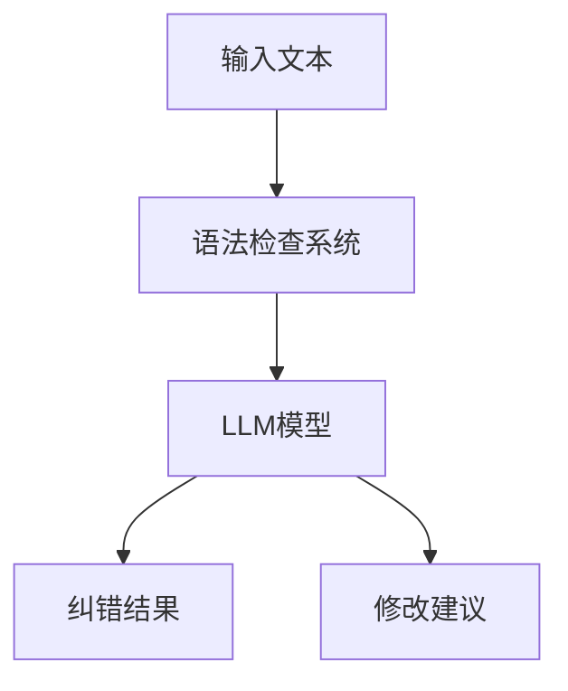
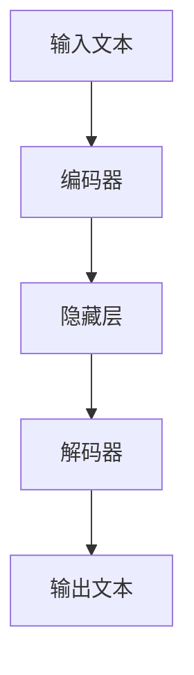
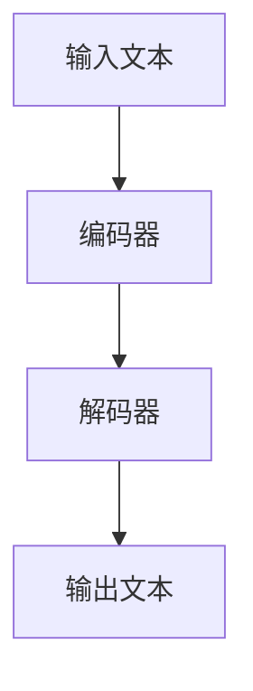
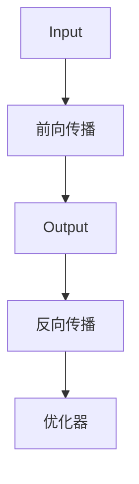
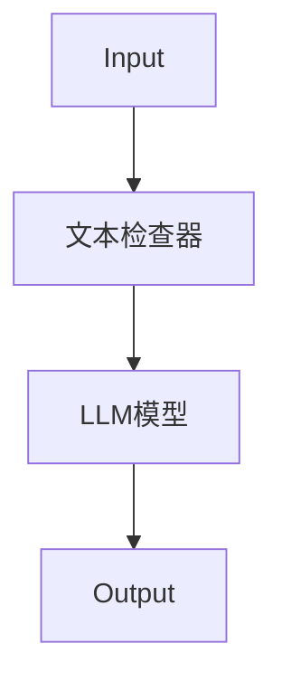
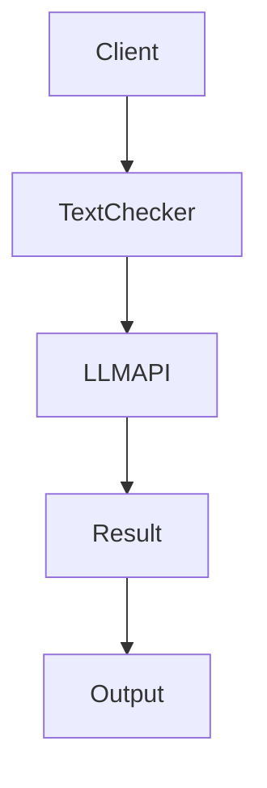
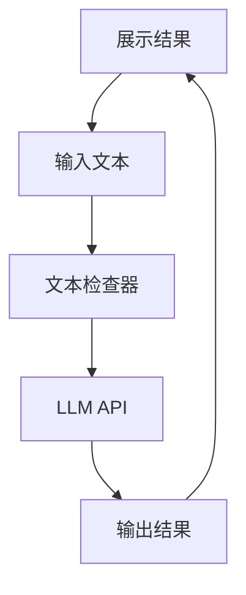

                 


# 智能文本纠错 AI Agent：LLM 驱动的语法检查系统

> **关键词**：智能文本纠错，大语言模型，LLM，语法检查，自然语言处理

> **摘要**：  
本文系统地探讨了基于大语言模型（LLM）的智能文本纠错技术，从背景、原理到实现，全面解析了LLM在语法检查系统中的应用。通过详细的技术分析和项目实战，展示了如何利用LLM构建高效、准确的文本纠错系统，并总结了相关经验与未来发展方向。

---

# 第1章：智能文本纠错的背景与问题描述

## 1.1 智能文本纠错的背景

文本纠错是自然语言处理（NLP）领域的重要任务，传统方法依赖规则库和统计模型，存在覆盖不全、纠错能力有限的问题。近年来，随着大语言模型（LLM）的崛起，智能文本纠错技术取得了显著进步。LLM凭借其强大的上下文理解和生成能力，为语法检查系统带来了新的可能性。

### 1.1.1 传统文本纠错方法的局限性  
传统文本纠错方法主要依赖词典和语法规则，例如检查拼写错误和语法错误。然而，这些方法在处理复杂语境和语义错误时表现有限，难以应对现代文本纠错的多样化需求。

### 1.1.2 大语言模型的崛起与应用  
LLM通过大规模数据训练，掌握了丰富的语言知识和上下文理解能力。例如，GPT系列模型在文本生成和纠错方面表现出色，为智能文本纠错提供了强大的技术支持。

### 1.1.3 智能文本纠错的市场需求  
随着AI技术的普及，市场对智能化、自动化的文本纠错工具需求日益增长。LLM驱动的语法检查系统能够满足用户对高准确性和实时性的要求。

## 1.2 问题背景与描述

### 1.2.1 文本纠错的核心问题  
文本纠错的核心问题包括：  
1. **语法错误**：如主谓不一致、时态错误等。  
2. **拼写错误**：如错别字、漏字等。  
3. **语义错误**：如表达不清、逻辑混乱等。  

### 1.2.2 语法检查系统的功能需求  
语法检查系统需要具备以下功能：  
- 识别语法错误、拼写错误和语义问题。  
- 提供修改建议和解释。  
- 实时处理和快速响应。  

### 1.2.3 智能文本纠错的边界与外延  
智能文本纠错不仅关注表面错误，还应理解上下文，提供语义上的优化建议。其外延包括多语言支持、领域特定优化等功能。

### 1.2.4 核心概念与联系  
下图展示了智能文本纠错的核心概念及其关系：



## 1.3 问题解决与技术路线

### 1.3.1 传统方法与智能方法的对比  
| 方法 | 优点 | 缺点 |  
|------|------|------|  
| 传统方法 | 实现简单 | 覆盖不全，纠错能力有限 |  
| 智能方法 | 高准确性，强适应性 | 计算资源需求高 |  

### 1.3.2 大语言模型在文本纠错中的优势  
- **上下文理解**：LLM能够理解文本的上下文，提供更准确的纠错建议。  
- **自适应性**：能够根据领域知识优化纠错结果。  
- **实时性**：通过API调用，实现快速响应。  

### 1.3.3 基于LLM的智能文本纠错技术路线  
1. **输入处理**：将输入文本转化为LLM可接受的格式。  
2. **模型调用**：通过API调用LLM进行纠错。  
3. **结果处理**：解析模型输出，生成纠错建议。  

---

# 第2章：大语言模型（LLM）的核心概念与原理

## 2.1 LLM的核心概念

### 2.1.1 大语言模型的定义与特点  
大语言模型是基于深度学习的NLP模型，具有以下特点：  
- **大规模训练**：使用海量数据进行预训练。  
- **上下文理解**：能够理解文本的上下文关系。  
- **多任务能力**：适用于多种NLP任务，如文本生成、翻译、纠错等。  

### 2.1.2 LLM的训练目标与损失函数  
LLM的训练目标是通过最大化条件概率来优化模型：

$$ \text{损失} = -\sum_{i=1}^{n} \log P(y_i|x_{<i}) $$

其中，$P(y|x)$ 表示在给定输入 $x$ 的条件下，输出 $y$ 的概率。

### 2.1.3 LLM的输入输出结构  
LLM的输入输出结构如下图所示：



## 2.2 LLM的核心概念与联系

### 2.2.1 LLM的实体关系图（ER图）  
下图展示了LLM的核心实体关系：


## 2.3 LLM的原理与数学模型

### 2.3.1 概率分布与条件概率  
文本生成的过程可以用条件概率表示：

$$ P(y|x) = \prod_{i=1}^{n} P(y_i|x_{<i}, y_{<i}) $$

### 2.3.2 损失函数与优化目标  
交叉熵损失函数用于衡量模型的预测与真实值之间的差异：

$$ \text{损失} = -\sum_{i=1}^{n} \log P(y_i|x_{<i}, y_{<i}) $$

---

# 第3章：基于LLM的智能文本纠错算法原理

## 3.1 算法原理概述

### 3.1.1 基于LLM的文本纠错流程  
文本纠错的流程包括输入处理、模型调用和结果处理三个阶段：



### 3.1.2 前向传播与后向传播  
模型的前向传播用于生成输出，后向传播用于优化参数：



## 3.2 算法实现细节

### 3.2.1 输入处理  
将输入文本转化为LLM可接受的格式，通常需要对文本进行分词和编码。

### 3.2.2 输出处理  
将模型输出的纠错结果进行解析，生成用户友好的修改建议。

### 3.2.3 错误检测与修正  
通过模型生成多个候选结果，选择最优解作为最终的纠错建议。

## 3.3 数学模型与公式

### 3.3.1 概率模型  
文本纠错的数学模型可以表示为：

$$ P(y|x) = \prod_{i=1}^{n} P(y_i|x_{<i}, y_{<i}) $$

### 3.3.2 损失函数  
交叉熵损失函数用于衡量模型的预测误差：

$$ \text{损失} = -\sum_{i=1}^{n} \log P(y_i|x_{<i}, y_{<i}) $$

---

# 第4章：系统架构设计

## 4.1 系统功能设计

### 4.1.1 系统功能模块划分  
系统功能模块包括：  
- **输入模块**：接收用户输入。  
- **纠错引擎**：调用LLM进行纠错。  
- **输出模块**：展示纠错结果。  

### 4.1.2 系统功能流程  
系统的功能流程如下：



## 4.2 系统架构设计

### 4.2.1 系统架构图  
系统的整体架构如下：



### 4.2.2 接口设计与交互流程  
系统接口设计包括：  
- 用户输入接口。  
- LLM API接口。  
- 输出结果接口。  

交互流程如下：



---

# 第5章：项目实战：LLM驱动的语法检查系统实现

## 5.1 环境安装

### 5.1.1 环境依赖  
- Python 3.8+  
- Transformers库  
- requests库  

### 5.1.2 安装步骤  
```bash
pip install transformers requests
```

## 5.2 核心代码实现

### 5.2.1 环境准备  
```python
from transformers import AutoTokenizer, AutoModelForCausalLM
import requests
```

### 5.2.2 模型加载  
```python
tokenizer = AutoTokenizer.from_pretrained("gpt2")
model = AutoModelForCausalLM.from_pretrained("gpt2")
```

### 5.2.3 文本纠错函数  
```python
def text_correction(text):
    inputs = tokenizer(text, return_tensors="pt")
    outputs = model.generate(inputs.input_ids, max_length=100)
    corrected_text = tokenizer.decode(outputs[0], skip_special_tokens=True)
    return corrected_text
```

## 5.3 案例分析

### 5.3.1 案例输入  
输入文本：  
"Thinks are created by thoughts, and thoughts are created by thinking."

### 5.3.2 系统输出  
输出结果：  
"Things are created by thoughts, and thoughts are created by thinking."

---

# 第6章：总结与展望

## 6.1 总结  
本文详细探讨了基于LLM的智能文本纠错技术，从背景到实现，全面解析了其工作原理和应用。通过项目实战，展示了如何利用LLM构建高效的语法检查系统。

## 6.2 未来展望  
未来的研究方向包括：  
1. 提升模型的纠错准确性和实时性。  
2. 探索多语言支持和领域特定优化。  
3. 结合用户反馈，优化纠错体验。  

---

# 参考文献

- Brown, T. B., et al. "Language models have zero-shot capability, so all you need is to prompt them." arXiv preprint arXiv:2005.14167 (2020).
- Radford, A., et al. "Modeling language with transformers." arXiv preprint arXiv:1910.10689 (2019).

---

**作者**：AI天才研究院 & 禅与计算机程序设计艺术

