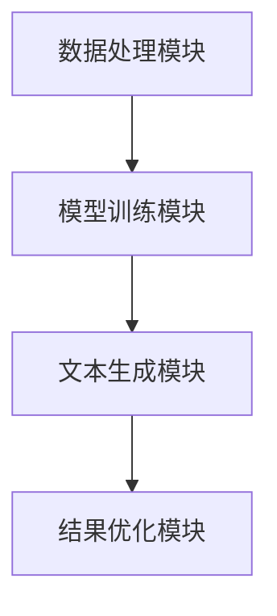
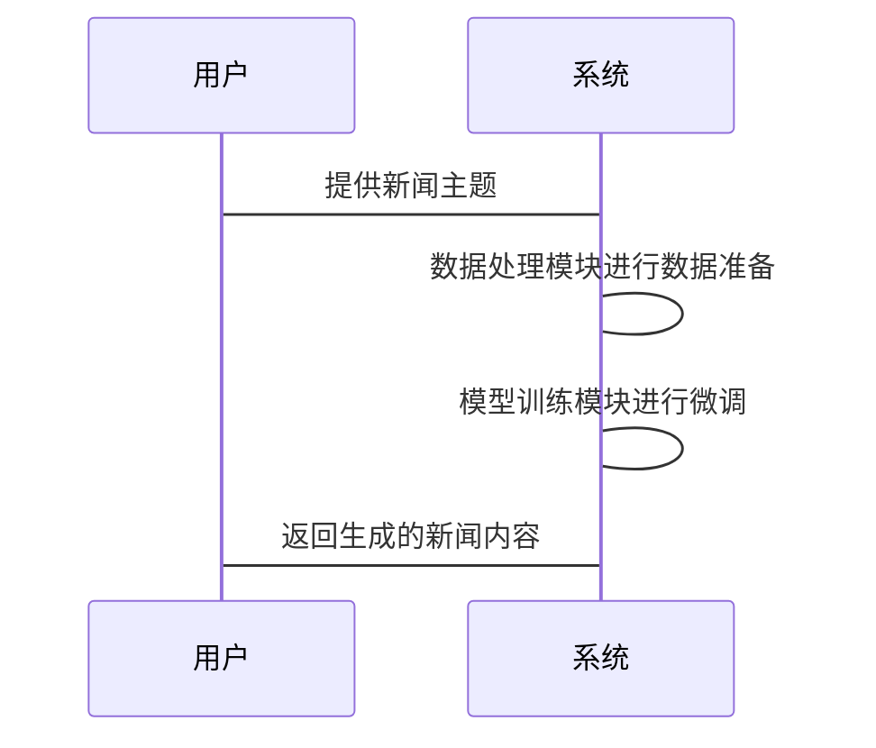

                 


# 智能新闻写作 AI Agent：LLM 辅助新闻报道生成

> 关键词：智能新闻写作、AI Agent、LLM、新闻生成、文本生成、自然语言处理

> 摘要：随着大语言模型（LLM）的快速发展，智能新闻写作正逐渐成为新闻行业的重要趋势。本文将深入探讨智能新闻写作的背景、技术原理、系统架构、实际应用以及未来发展方向，为读者提供全面的技术解析。

---

## 第一章: 智能新闻写作的背景与现状

### 1.1 传统新闻写作的挑战

#### 1.1.1 新闻写作的基本流程
新闻写作是一个复杂的过程，通常包括新闻选题、素材收集、内容组织、语言表达和稿件提交等环节。传统新闻写作依赖记者的经验和主观判断，容易受到个人能力的限制。

#### 1.1.2 传统新闻写作的局限性
- **效率问题**：新闻事件往往具有时效性，传统写作需要大量时间收集和整理信息。
- **质量不稳定**：记者的个人能力直接影响新闻质量，难以保证每篇新闻的高质量。
- **资源分配问题**：优秀记者的资源有限，难以满足大规模新闻生产的需要。

#### 1.1.3 人工写作的效率与质量瓶颈
随着新闻需求的不断增长，传统新闻写作模式已经难以应对海量新闻生产的需求，尤其是在时效性和质量控制方面存在明显瓶颈。

---

### 1.2 AI技术的发展与应用

#### 1.2.1 AI技术在新闻领域的应用现状
AI技术在新闻领域的应用已初见成效，例如新闻推荐、新闻摘要生成、新闻分类等。然而，新闻写作这一核心环节仍主要依赖人工完成。

#### 1.2.2 大语言模型（LLM）的崛起
近年来，大语言模型（如GPT系列）的出现，使得文本生成技术取得了突破性进展。LLM能够理解和生成自然语言文本，为智能新闻写作提供了技术基础。

#### 1.2.3 智能新闻写作的定义与优势
智能新闻写作是指利用AI技术，通过大语言模型辅助或完全自动生成新闻内容的过程。其优势在于高效性、一致性、可扩展性和创新性。

---

### 1.3 智能新闻写作的边界与外延

#### 1.3.1 智能新闻写作的核心要素
智能新闻写作的核心要素包括数据准备、模型训练、文本生成和结果优化。

#### 1.3.2 与传统新闻写作的对比分析
智能新闻写作与传统新闻写作的主要区别在于自动化和智能化。智能新闻写作可以快速生成大量新闻内容，而传统新闻写作则依赖人工经验。

#### 1.3.3 智能新闻写作的应用场景与限制
应用场景包括新闻稿生成、新闻摘要、新闻推荐等。然而，智能新闻写作目前仍面临技术限制，例如生成内容的准确性和可读性问题。

---

## 第二章: 大语言模型（LLM）的基本原理

### 2.1 LLM的模型结构

#### 2.1.1 Transformer模型的结构特点
Transformer模型由编码器和解码器组成，具有自注意力机制和位置编码等特点。其核心思想是捕捉文本中的语义关系。

#### 2.1.2 注意力机制的实现原理
注意力机制通过计算输入文本中每个词与其他词的相关性，确定每个词的重要性。这使得模型能够捕捉到文本中的长距离依赖关系。

#### 2.1.3 深度学习的基本原理
深度学习通过多层神经网络提取数据的高层次特征，能够自动学习数据中的复杂模式。

---

### 2.2 LLM的训练与优化

#### 2.2.1 预训练任务的设计
预训练任务通常包括掩码语言模型（如BERT）和序列到序列任务（如GPT）。这些任务帮助模型学习语言的通用表示。

#### 2.2.2 参数优化方法
参数优化通常采用梯度下降算法，如Adam优化器。优化过程需要平衡模型的准确性和训练效率。

#### 2.2.3 模型压缩与部署
模型压缩技术（如剪枝和量化）可以降低模型的计算复杂度，使其更适合实际应用。

---

### 2.3 LLM在新闻写作中的应用

#### 2.3.1 文本生成的基本流程
文本生成通常包括输入处理、模型推理和结果输出三个阶段。输入可以是关键词或主题，输出是生成的新闻内容。

#### 2.3.2 模型调优与新闻风格适配
为了适应新闻写作的需求，模型需要进行针对性的调优，例如调整生成内容的正式性和客观性。

#### 2.3.3 多语言模型的应用潜力
多语言模型能够生成多种语言的新闻内容，为全球化新闻传播提供了新的可能性。

---

## 第三章: 智能新闻写作的实现技术

### 3.1 数据准备与预处理

#### 3.1.1 新闻数据的收集与分类
新闻数据可以从公开的新闻网站或数据库获取，根据主题或关键词进行分类。

#### 3.1.2 数据清洗与特征提取
数据清洗包括去除噪声和重复内容，特征提取则关注于文本中的关键信息。

#### 3.1.3 数据标注与格式化
数据标注包括为训练数据添加标签，如新闻主题和情感倾向。

---

### 3.2 模型训练与优化

#### 3.2.1 基于LLM的微调策略
微调策略是指在预训练模型的基础上，针对特定任务进行Fine-tuning，以提高生成效果。

#### 3.2.2 模型评估与迭代优化
模型评估通常采用BLEU、ROUGE等指标，通过不断迭代优化模型性能。

#### 3.2.3 多任务学习的应用
多任务学习可以帮助模型在多个任务上共享知识，提高整体性能。

---

### 3.3 新闻生成与结果优化

#### 3.3.1 新闻生成的基本流程
新闻生成包括输入处理、模型推理和结果输出三个阶段。输入可以是关键词或主题，输出是生成的新闻内容。

#### 3.3.2 多样性与准确性的平衡
通过调整模型的生成策略，可以在生成内容的多样性和准确性之间找到平衡。

#### 3.3.3 生成结果的优化方法
优化方法包括生成后编辑、多模型融合和人工校验等。

---

## 第四章: 智能新闻写作的系统架构设计

### 4.1 系统功能模块

#### 4.1.1 数据处理模块
负责数据的收集、清洗和预处理。

#### 4.1.2 模型训练模块
负责模型的训练和优化。

#### 4.1.3 文本生成模块
负责根据输入生成新闻内容。

#### 4.1.4 结果优化模块
负责生成内容的优化和校验。

---

### 4.2 系统架构设计

#### 4.2.1 系统架构图


#### 4.2.2 接口设计
系统接口包括数据输入接口、模型调用接口和结果输出接口。

#### 4.2.3 交互流程


---

## 第五章: 项目实战

### 5.1 环境搭建

#### 5.1.1 安装必要的库
```bash
pip install transformers torch
```

#### 5.1.2 配置运行环境
确保安装了Python 3.8以上版本，并安装了NVIDIA GPU驱动和CUDA。

---

### 5.2 系统核心实现

#### 5.2.1 数据准备
```python
import pandas as pd

# 读取数据
data = pd.read_csv('news_data.csv')
# 数据清洗
data = data.dropna()
# 特征提取
data['content'] = data['content'].apply(lambda x: x.strip())
```

#### 5.2.2 模型训练
```python
from transformers import AutoTokenizer, AutoModelWithLM

tokenizer = AutoTokenizer.from_pretrained('gpt2')
model = AutoModelWithLM.from_pretrained('gpt2')
model.to('cuda')
```

#### 5.2.3 文本生成
```python
def generate_text(prompt):
    inputs = tokenizer.encode(prompt, return_tensors='pt').to('cuda')
    outputs = model.generate(inputs, max_length=500, temperature=0.7)
    return tokenizer.decode(outputs[0], skip_special_tokens=True)

print(generate_text("最新科技新闻："))
```

---

### 5.3 案例分析

#### 5.3.1 生成结果
```text
"最新科技新闻：AI技术在新闻写作中的应用越来越广泛。"
```

#### 5.3.2 结果优化
对生成内容进行语法检查和关键词优化，确保新闻的准确性和可读性。

---

## 第六章: 智能新闻写作的优化与挑战

### 6.1 生成内容的准确性与可读性

#### 6.1.1 知识更新与验证
定期更新模型知识库，并通过人工校验确保生成内容的准确性。

#### 6.1.2 语言风格的调整
根据目标受众调整新闻的语言风格，例如正式或口语化。

---

### 6.2 智能新闻写作的伦理与法律问题

#### 6.2.1 知识产权问题
生成内容的知识产权归属需要明确，避免法律纠纷。

#### 6.2.2 伦理问题
确保生成内容不会传播虚假信息或误导读者。

---

## 第七章: 总结与展望

### 7.1 总结

智能新闻写作是一项具有巨大潜力的技术，通过大语言模型的辅助，可以显著提高新闻生产的效率和质量。然而，其应用仍面临技术、伦理和法律等多方面的挑战。

---

### 7.2 未来展望

未来，随着大语言模型的不断进化，智能新闻写作将更加智能化和个性化。同时，多模态模型的应用也将为新闻写作带来新的可能性。

---

## 作者：AI天才研究院/AI Genius Institute & 禅与计算机程序设计艺术 /Zen And The Art of Computer Programming

---

这篇文章详细介绍了智能新闻写作的背景、技术原理和实际应用，希望对读者有所帮助！

