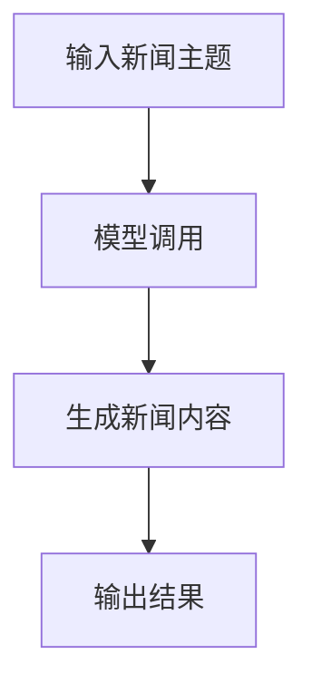
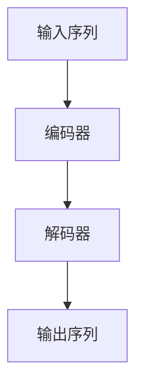
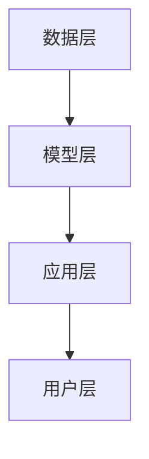

                 


# 智能新闻生成AI Agent：LLM驱动的自动化新闻写作

> 关键词：智能新闻生成，AI Agent，LLM，自动化新闻写作，大语言模型，生成式AI

> 摘要：本文深入探讨了基于大语言模型（LLM）的智能新闻生成AI Agent的实现与应用。通过分析LLM的工作原理、生成式AI的核心算法，以及结合实际项目案例，详细阐述了如何利用这些技术实现自动化新闻写作。文章从背景介绍、核心概念、算法原理、系统架构到项目实战，全面解析了智能新闻生成的技术细节和实现方案。

---

## 第一部分: 智能新闻生成的背景与技术基础

### 第1章: 智能新闻生成的背景与现状

#### 1.1 智能新闻生成的背景

智能新闻生成是人工智能（AI）和自然语言处理（NLP）技术结合的产物，旨在通过AI技术自动完成新闻内容的创作。随着大语言模型（LLM）的快速发展，新闻生成技术逐渐从简单的模板化写作迈向更加智能化和个性化的方向。

- **问题背景**：传统新闻写作依赖人工创作，效率低下且成本高昂。特别是在新闻事件频发的情况下，人工写作难以满足快速响应的需求。
- **问题描述**：新闻写作需要结合事实、语境和目标读者的特点，对信息进行加工和组织。传统方法依赖记者的主观判断，难以实现自动化和规模化。
- **解决方法**：通过AI技术，特别是基于LLM的生成式AI，可以实现新闻内容的自动化生成。这不仅提高了效率，还能在一定程度上保证内容的质量。

#### 1.2 智能新闻生成的必要性

- **提高效率**：AI可以快速生成新闻稿，满足新闻事件快速响应的需求。
- **降低成本**：自动化写作减少了对大量人工劳动力的依赖。
- **个性化定制**：AI可以根据目标读者的特点生成个性化的内容。

#### 1.3 当前新闻生成技术的发展现状

当前，新闻生成技术已经从简单的关键词匹配发展到基于LLM的复杂生成式模型。主流的技术包括：

- **模板化生成**：通过预定义的模板和关键词生成新闻稿。
- **基于规则的生成**：利用NLP技术对新闻内容进行分词、句法分析和语义理解，然后根据规则生成新闻。
- **基于LLM的生成式AI**：利用大语言模型的强大生成能力，实现高质量的新闻内容生成。

---

### 第2章: 智能新闻生成的核心概念

#### 2.1 AI Agent的基本概念

AI Agent（智能体）是指能够感知环境并采取行动以实现目标的智能系统。在新闻生成领域，AI Agent可以理解为一个自动化写作工具，通过接收输入的新闻主题或关键词，生成相应的新闻内容。

- **核心特征**：
  - 感知能力：能够理解输入的新闻主题或数据。
  - 行为能力：根据理解生成新闻内容。
  - 学习能力：通过反馈优化生成效果。

#### 2.2 LLM的基本原理

LLM（Large Language Model，大语言模型）是一种基于Transformer架构的深度学习模型，通过大量的文本数据进行训练，能够生成与训练数据分布一致的文本。

- **LLM的训练目标**：
  - 学习输入文本的概率分布。
  - 通过最大化条件概率来生成合理的文本序列。

- **LLM的生成机制**：
  - 基于贪心算法或蒙特卡洛采样生成文本。
  - 支持多种生成模式（如创意型、正式型）。

#### 2.3 自动化新闻写作的定义与特点

- **定义**：自动化新闻写作是指通过AI技术，自动完成新闻内容的创作过程。
- **特点**：
  - **自动化**：无需人工干预，系统自动完成写作任务。
  - **高效性**：快速生成新闻稿，满足实时需求。
  - **可定制化**：可以根据不同的需求生成不同风格的新闻稿。

---

## 第二部分: 智能新闻生成的算法与数学模型

### 第3章: 大语言模型的数学模型与公式

#### 3.1 LLM的训练目标

LLM的训练目标是通过优化损失函数，使得生成的文本概率最大化。常用的损失函数是交叉熵损失。

- **交叉熵损失函数**：
  $$ \text{损失函数} = -\sum_{i=1}^{n} \log p(x_i) $$

其中，\( p(x_i) \) 是给定前序文本 \( x_{<i} \) 的条件下，生成 \( x_i \) 的概率。

#### 3.2 LLM的生成机制

LLM的生成过程是基于条件概率的文本生成。

- **解码过程**：
  $$ p(\text{序列}) = \prod_{i=1}^{n} p(x_i | x_{<i}) $$

其中，\( p(x_i | x_{<i}) \) 是在给定前序文本 \( x_{<i} \) 的条件下生成 \( x_i \) 的概率。

#### 3.3 模型的训练与优化

- **梯度下降算法**：
  $$ \theta = \theta - \eta \nabla L $$
  
其中，\( \theta \) 是模型参数，\( \eta \) 是学习率，\( L \) 是损失函数。

### 第4章: 生成式AI的算法原理

#### 4.1 基于LLM的生成式AI流程

生成式AI的流程包括以下几个步骤：

1. **输入新闻主题**。
2. **模型调用**：将输入主题传递给LLM模型。
3. **生成新闻内容**：模型根据输入主题生成新闻内容。
4. **输出结果**。



#### 4.2 基于Transformer的文本生成

Transformer模型通过编码器和解码器结构实现文本生成。



#### 4.3 模型的训练与调优

- **训练数据**：高质量的新闻文本数据。
- **训练过程**：通过反向传播算法优化模型参数。
- **调优策略**：
  - 调整学习率。
  - 改变批量大小。
  - 修改模型超参数。

---

## 第三部分: 智能新闻生成的系统架构与实现

### 第5章: 智能新闻生成系统的设计与实现

#### 5.1 项目介绍

- **项目名称**：智能新闻生成AI Agent。
- **项目目标**：实现基于LLM的新闻内容自动化生成。
- **项目范围**：支持多种新闻类型，包括新闻报道、评论等。

#### 5.2 系统功能设计

- **功能模块**：
  - 数据采集模块：采集新闻主题和相关数据。
  - 模型调用模块：调用LLM生成新闻内容。
  - 内容输出模块：输出生成的新闻内容。

#### 5.3 系统架构设计

- **分层架构**：
  - 数据层：接收输入的新闻主题。
  - 模型层：LLM模型进行文本生成。
  - 应用层：处理输入输出，调用模型生成内容。
  - 用户层：展示生成的新闻内容。



---

## 第四部分: 智能新闻生成的项目实战

### 第6章: 项目实战

#### 6.1 环境配置

- **安装Python**：确保Python 3.8及以上版本。
- **安装依赖库**：安装必要的库，如`transformers`、`torch`等。

#### 6.2 核心代码实现

```python
from transformers import pipeline

# 初始化生成式AI pipeline
generator = pipeline('text-generation', model='facebook/blenderbot-9b')

# 生成新闻内容
def generate_news(title):
    # 调用生成式AI生成新闻内容
    result = generator(title, max_length=500, num_return_sequences=1)
    return result[0]['generated_text']

# 示例
title = "全球气候变化会议达成新协议"
news = generate_news(title)
print(news)
```

#### 6.3 代码解读与分析

- **生成式AI pipeline**：使用Hugging Face的`transformers`库中的生成式AI pipeline，调用预训练好的模型生成新闻内容。
- **生成函数**：`generate_news`函数接收新闻标题，调用生成式AI生成新闻内容，并返回结果。

#### 6.4 实际案例分析

- **输入标题**：全球气候变化会议达成新协议。
- **生成内容**：生成的新闻稿可能包括会议的主要成果、各方的反应以及未来的影响。

---

## 第五部分: 智能新闻生成的最佳实践

### 第7章: 最佳实践

#### 7.1 小结

- 智能新闻生成技术基于LLM和生成式AI，能够实现新闻内容的自动化生成。
- 通过合理的系统架构设计和算法优化，可以显著提高生成内容的质量和效率。

#### 7.2 注意事项

- **数据质量**：输入的数据质量直接影响生成内容的质量。
- **模型选择**：选择合适的模型和参数设置，可以提升生成效果。
- **内容审核**：生成的内容需要经过人工审核，确保准确性和合规性。

#### 7.3 未来展望

- **多模态生成**：结合图像、视频等多模态信息，生成更加丰富的新闻内容。
- **个性化定制**：根据目标读者的特点，生成个性化的新闻内容。
- **实时更新**：实现新闻内容的实时更新和动态生成。

---

## 作者

作者：AI天才研究院/AI Genius Institute & 禅与计算机程序设计艺术 /Zen And The Art of Computer Programming

---

通过本文的详细解析，我们可以看到，基于LLM的智能新闻生成技术已经逐渐成熟，并在新闻行业展现出巨大的潜力。随着技术的不断进步，智能新闻生成将为新闻行业带来更多的创新和变革。

