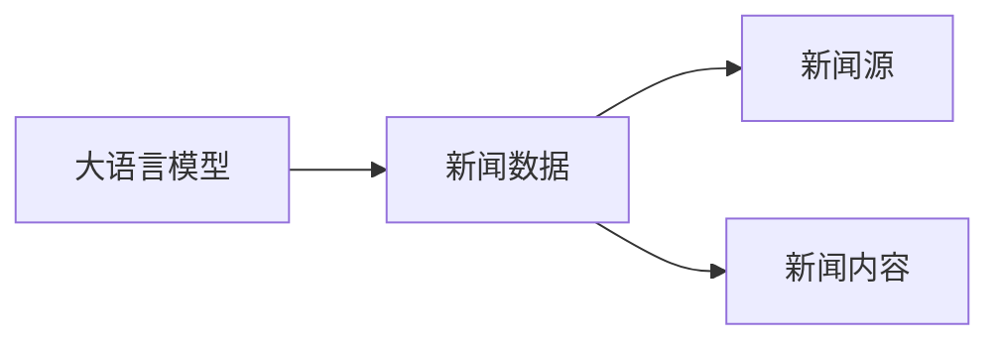
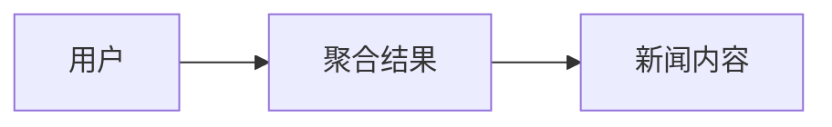
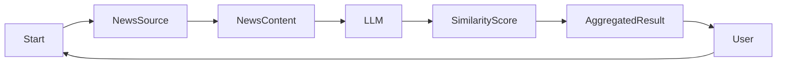
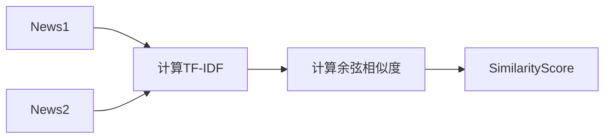
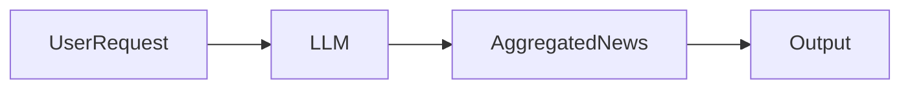
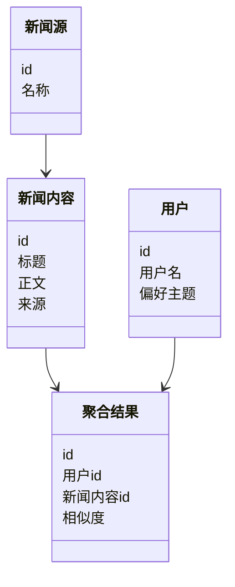
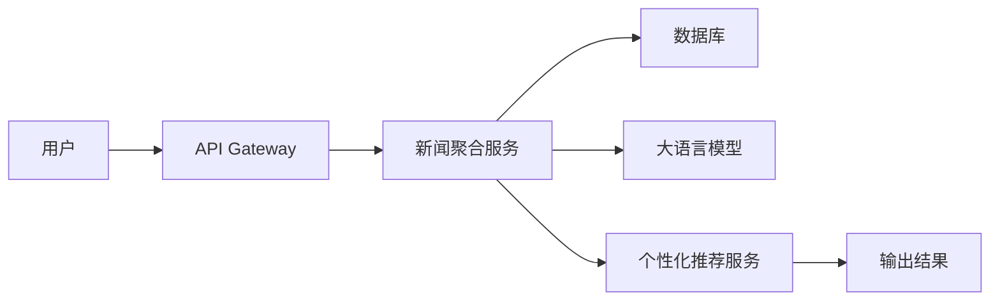
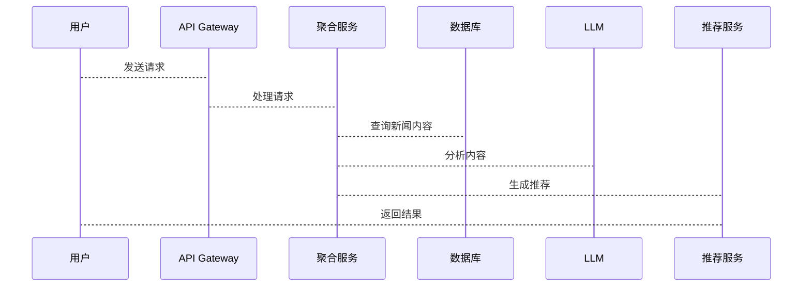

                 


# 智能新闻聚合AI Agent：LLM驱动的信息整合与分析

> **关键词**：智能新闻聚合，LLM，大语言模型，信息整合，新闻分析

> **摘要**：随着人工智能技术的快速发展，智能新闻聚合AI Agent通过利用大语言模型（LLM）进行信息整合与分析，成为新闻行业的重要工具。本文详细探讨了智能新闻聚合的核心概念、算法原理、系统架构以及项目实战，旨在为读者提供全面的技术解读。

---

# 第一部分: 智能新闻聚合AI Agent概述

## 第1章: 背景介绍

### 1.1 智能新闻聚合的定义与背景

#### 1.1.1 传统新闻聚合的局限性
传统新闻聚合主要依赖人工筛选和分类，存在效率低、覆盖面有限、信息重复等问题。随着新闻来源的爆炸式增长，传统方法难以满足用户对实时、精准新闻的需求。

#### 1.1.2 智能新闻聚合的定义
智能新闻聚合是指利用人工智能技术，特别是大语言模型（LLM），自动从多个新闻源中提取、分析和整合信息，为用户提供个性化、精准的新闻内容。

#### 1.1.3 智能新闻聚合的核心问题
- **信息冗余**：如何从海量新闻中去重。
- **内容相似性**：如何识别和整合相似内容。
- **用户需求匹配**：如何根据用户偏好推荐新闻。

#### 1.1.4 智能新闻聚合的边界与外延
智能新闻聚合专注于新闻内容的整合与分析，边界包括新闻源的获取、内容处理和用户反馈。外延则可能延伸至个性化推荐和新闻事件预测。

### 1.2 LLM驱动的新闻聚合技术

#### 1.2.1 大语言模型（LLM）的定义与特点
LLM是一种基于深度学习的自然语言处理模型，具有强大的文本理解和生成能力。其特点包括：
- **上下文理解**：能够捕捉文本中的语义信息。
- **自适应性**：可以不断优化模型参数。
- **多任务处理**：支持多种语言处理任务。

#### 1.2.2 LLM在新闻聚合中的应用
- **内容提取**：从新闻文章中提取关键信息。
- **语义分析**：理解新闻内容的主题和情感倾向。
- **内容生成**：根据分析结果生成摘要或推荐。

#### 1.2.3 LLM驱动的智能新闻聚合的优势
- **高效性**：快速处理大量新闻数据。
- **准确性**：通过模型优化减少错误。
- **个性化**：根据用户偏好提供定制化内容。

---

## 第2章: 智能新闻聚合的核心概念与联系

### 2.1 核心概念原理

#### 2.1.1 LLM的新闻理解与生成机制
LLM通过训练数据学习新闻文本的模式，能够理解新闻的结构和内容，并生成相关的文本输出。

#### 2.1.2 智能新闻聚合的算法流程
1. 数据采集：从多个新闻源获取新闻内容。
2. 预处理：清洗数据，提取关键词和主题。
3. 语义分析：利用LLM分析新闻内容的语义。
4. 聚合：根据相似性或用户需求整合新闻内容。
5. 输出：生成个性化推荐或聚合结果。

#### 2.1.3 核心概念属性对比表
| 概念       | 描述                                                                 |
|------------|----------------------------------------------------------------------|
| 新闻源      | 提供新闻内容的来源，如新闻网站、社交媒体等。                     |
| 新闻主题    | 新闻的核心内容，如政治、经济、科技等。                         |
| 内容相似度  | 新闻内容之间的相似程度，用于去重和整合。                       |
| 用户需求    | 用户的偏好和兴趣，用于个性化推荐。                               |

### 2.2 实体关系图

#### 2.2.1 智能新闻聚合的ER图
```mermaid
er
  entity 新闻源 (NewsSource) {
    id
    名称 (Name)
  }
  
  entity 新闻内容 (NewsContent) {
    id
    标题 (Title)
    正文 (Content)
    来源 (Source)
    时间戳 (Timestamp)
  }
  
  entity 用户 (User) {
    id
    用户名 (Username)
    偏好主题 (PreferredThemes)
  }
  
  entity 聚合结果 (AggregatedResult) {
    id
    用户id (UserID)
    新闻内容id (NewsContentID)
    相似度 (SimilarityScore)
  }
  
  新闻内容 <-- 关联关系 --> 新闻源
  新闻内容 <-- 关联关系 --> 聚合结果
  聚合结果 <-- 关联关系 --> 用户
```

#### 2.2.2 LLM与新闻数据的关系


#### 2.2.3 聚合结果与用户需求的关系


---

## 第3章: 算法原理讲解

### 3.1 LLM驱动的新闻聚合算法

#### 3.1.1 模型训练流程
1. 数据预处理：清洗新闻数据，提取关键词。
2. 模型训练：使用监督学习方法训练LLM。
3. 参数调优：优化模型参数以提高准确率。

#### 3.1.2 新闻特征提取
利用文本挖掘技术提取新闻的关键词和主题标签。

#### 3.1.3 内容相似度计算
使用余弦相似度或BM25算法计算新闻内容的相似性。

#### 3.1.4 聚合结果生成
根据用户需求和相似度评分，生成个性化聚合结果。

### 3.2 算法流程图

#### 3.2.1 LLM驱动的新闻聚合流程


#### 3.2.2 内容相似度计算流程


#### 3.2.3 聚合结果生成流程


### 3.3 数学模型与公式

#### 3.3.1 余弦相似度计算公式
$$ \text{余弦相似度} = \frac{\vec{A} \cdot \vec{B}}{|\vec{A}| \times |\vec{B}|} $$

#### 3.3.2 BM25算法公式
$$ \text{BM25} = \log(\frac{d}{d_i}) + 1 + \log(1 + \frac{f_i}{k_1}) $$

其中：
- \( d \) 是文档总数
- \( d_i \) 是包含关键词的文档数
- \( f_i \) 是关键词在文档中的出现次数
- \( k_1 \) 是参数

---

## 第4章: 系统分析与架构设计方案

### 4.1 问题场景介绍

#### 4.1.1 新闻聚合的需求分析
用户需要一个实时、精准的新闻聚合工具，能够根据个人兴趣推荐新闻。

#### 4.1.2 系统目标与功能
目标：
- 实现智能新闻聚合。
- 提供个性化推荐。
功能：
- 数据采集模块：从多个新闻源获取数据。
- 数据处理模块：清洗和提取特征。
- 聚合算法模块：计算相似度并生成聚合结果。
- 用户交互模块：接收用户需求并输出结果。

### 4.2 系统功能设计

#### 4.2.1 领域模型


#### 4.2.2 系统架构图


#### 4.2.3 系统接口设计
- **API接口**：
  - `GET /news聚合`
  - `POST /user偏好`
- **数据接口**：
  - 数据库连接：`jdbc:mysql://localhost:3306/newsdb`

#### 4.2.4 系统交互流程


---

## 第5章: 项目实战

### 5.1 环境安装

#### 5.1.1 安装Python和必要的库
```bash
pip install python
pip install requests
pip install numpy
pip install scikit-learn
```

#### 5.1.2 安装LLM模型
使用预训练的LLM模型，如GPT-3或PaLM。

### 5.2 系统核心实现源代码

#### 5.2.1 数据采集模块
```python
import requests

def fetch_news(url):
    response = requests.get(url)
    return response.json()
```

#### 5.2.2 数据处理模块
```python
from sklearn.feature_extraction.text import TfidfVectorizer

vectorizer = TfidfVectorizer()
tfidf_matrix = vectorizer.fit_transform(documents)
```

#### 5.2.3 聚合算法模块
```python
from sklearn.metrics.pairwise import cosine_similarity

similarity_scores = cosine_similarity(tfidf_matrix)
```

#### 5.2.4 用户交互模块
```python
def get_user_preference(user):
    return user['preferredThemes']
```

### 5.3 代码应用解读与分析
通过上述代码，我们可以实现从新闻源获取数据，使用TF-IDF和余弦相似度进行内容相似性计算，并根据用户偏好生成聚合结果。

### 5.4 实际案例分析
以科技类新闻为例，用户偏好科技和AI相关的新闻。系统会从多个新闻源中提取相关内容，并生成相似度高的聚合结果。

### 5.5 项目小结
通过实战项目，我们验证了智能新闻聚合的可行性，并掌握了实现的关键技术。

---

## 第6章: 总结

### 6.1 核心总结
智能新闻聚合利用LLM技术实现了高效、精准的新闻整合与分析，为用户提供了个性化的新闻体验。

### 6.2 项目经验总结
- **技术优势**：LLM的强大能力显著提升了聚合效率和准确性。
- **实践经验**：代码实现和模型调优是项目成功的关键。

### 6.3 展望与未来
未来，智能新闻聚合可能会与更多AI技术结合，如图像识别和语音识别，进一步提升新闻聚合的能力。

---

## 作者

作者：AI天才研究院/AI Genius Institute & 禅与计算机程序设计艺术/Zen And The Art of Computer Programming

---

通过以上详细的内容组织和结构安排，希望本文能够为读者提供一个全面且深入的智能新闻聚合技术解读，帮助读者理解和掌握这一领域的核心技术与应用。

